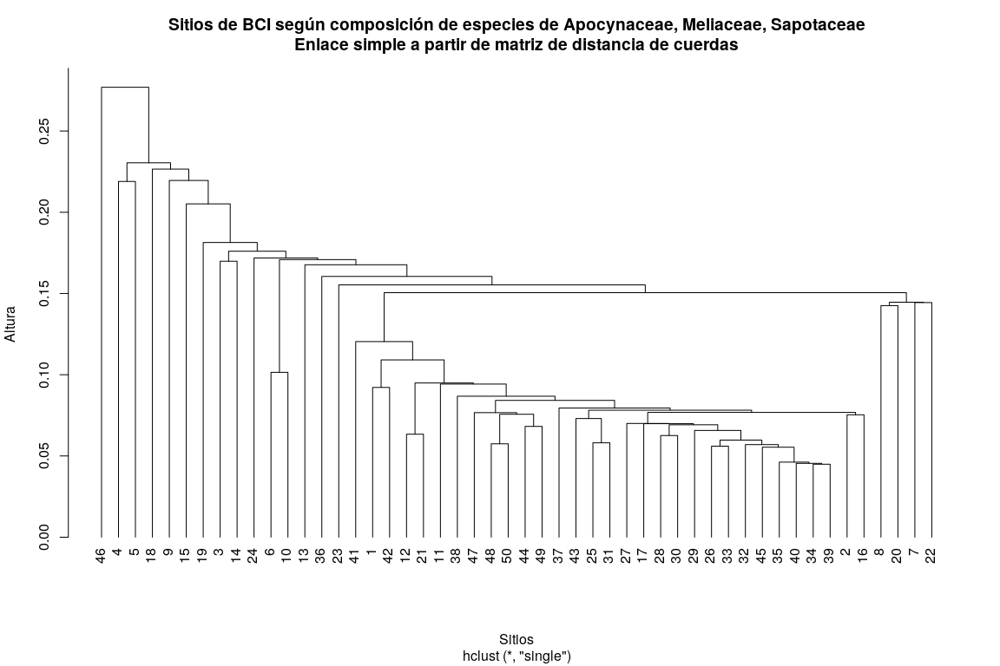
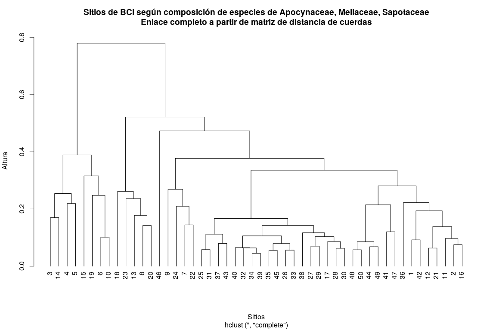
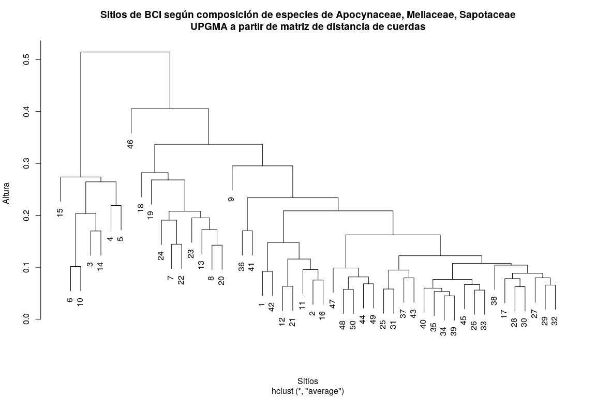

Análisis de agrupamiento (cluster analysis). <br> Parte 1: agrupamiento
jerárquico
================
JR
11 de noviembre, 2020

``` r
knitr::opts_chunk$set(fig.width=12, fig.height=8)
```

## Preámbulo

### Cargar paquetes

``` r
library(vegan)
```

    ## Loading required package: permute

    ## Loading required package: lattice

    ## This is vegan 2.5-6

``` r
library(adespatial)
```

    ## Registered S3 methods overwritten by 'adegraphics':
    ##   method         from
    ##   biplot.dudi    ade4
    ##   kplot.foucart  ade4
    ##   kplot.mcoa     ade4
    ##   kplot.mfa      ade4
    ##   kplot.pta      ade4
    ##   kplot.sepan    ade4
    ##   kplot.statis   ade4
    ##   scatter.coa    ade4
    ##   scatter.dudi   ade4
    ##   scatter.nipals ade4
    ##   scatter.pco    ade4
    ##   score.acm      ade4
    ##   score.mix      ade4
    ##   score.pca      ade4
    ##   screeplot.dudi ade4

    ## Registered S3 method overwritten by 'spdep':
    ##   method   from
    ##   plot.mst ape

    ## Registered S3 methods overwritten by 'adespatial':
    ##   method             from       
    ##   plot.multispati    adegraphics
    ##   print.multispati   ade4       
    ##   summary.multispati ade4

``` r
library(tidyverse)
```

    ## ── Attaching packages ────────────────────────────────────── tidyverse 1.2.1 ──

    ## ✓ ggplot2 3.3.2     ✓ purrr   0.3.4
    ## ✓ tibble  3.0.3     ✓ dplyr   0.8.3
    ## ✓ tidyr   1.0.0     ✓ stringr 1.4.0
    ## ✓ readr   1.3.1     ✓ forcats 0.4.0

    ## ── Conflicts ───────────────────────────────────────── tidyverse_conflicts() ──
    ## x dplyr::filter() masks stats::filter()
    ## x dplyr::lag()    masks stats::lag()

``` r
library(broom)
library(cluster)
source('biodata/funciones.R')
```

### Cargar datos

``` r
load('biodata/Apocynaceae-Meliaceae-Sapotaceae.Rdata')
```

## Características de las técnicas de agrupamiento

Las técnicas de agrupamiento se clasifican según los algoritmos que
emplean y el orden de ejecución, así como según el tipo de enfoque
inferencial. Los algoritmos de agrupamiento pueden ser:

  - Secuenciales o simultáneos.
  - Por aglomeración o por división. En referencias en español
    encontrarás “aglomerativos” y “divisivos”, pero ten presente que la
    primera grafía no está en el Diccionario.
  - Monotéticos o politéticos.
  - Jerárquicos o no jerárquicos.
  - Probabilísticos o no probabilísticos.
  - Restringidos o no restringidos.

## Agrupamiento jerárquico

El agrupamiento jerárquico (AJ) es una técnica de agrupamiento
secuencial que consiste en la repetición de un procedimiento dado para
agrupar objetos hasta que todos encuentran un lugar. **Los resultados
del AJ comúnmente se muestran en dendrogramas**.

Dentro del AJ es frecuente usar un enfoque aglomerativo, lo cual implica
aplicar algoritmos secuenciales desde abajo hacia arriba. Bajo este
enfoque, se comienza con una colección discontinua de objetos que son
subsecuentemente agrupados en grupos (clusters) cada vez más grandes,
hasta alcanzar un único grupo que engloba a todos los subgrupos.

El AJ aglomerativo dispone de varios algoritmos de resolución del
agrupamiento por pares, que son los denominados **“criterios de
enlace”**. Los más usados son: “de enlace simple”, “de enlace
completo” y “de enlace promedio”.

### Agrupamiento “aglomerativo” por enlace simple

Este método utiliza, como criterio de enlace para agrupar sucesivamente
pares de objetos, la mayor similaridad (“mínima distancia” o “vecino más
próximo”). Comúnmente, los dendrogramas muestran un encadenamiento de
objetos, a modo de escaleras.

Para aplicar este método, debes transformar la matriz de comunidad
utilizando alguno de los métodos explicados en medición de la
asociación. En este caso, utilizaré el método de normalización y luego
obtendré la distancia euclidea (distancia de cuerdas o *chord*).

``` r
mi_fam_norm <- decostand(mc_apcyn_melic_saptc, "normalize")
mi_fam_norm_d <- vegdist(mi_fam_norm, "euc")
mi_fam_norm_d %>% tidy
```

    ## # A tibble: 1,225 x 3
    ##    item1 item2 distance
    ##    <int> <int>    <dbl>
    ##  1     2     1    0.109
    ##  2     3     1    0.468
    ##  3     4     1    0.448
    ##  4     5     1    0.538
    ##  5     6     1    0.324
    ##  6     7     1    0.230
    ##  7     8     1    0.189
    ##  8     9     1    0.247
    ##  9    10     1    0.295
    ## 10    11     1    0.150
    ## # … with 1,215 more rows

Es importante, para garantizar consistencia a lo largo del agrupamiento,
asignar los nombres de sitios al atributo `labels` del objeto de
distancias.

``` r
attr(mi_fam_norm_d, "labels") <- rownames(mc_apcyn_melic_saptc)
```

Posteriormente, el agrupamiento jerárquico lo realizaré con la función
`hclust` del paquete `stats` (se carga por defecto al abrir R),
especificando el argumento `method = 'single'`:

``` r
(cl_single <- hclust(mi_fam_norm_d, method = 'single'))
```

    ## 
    ## Call:
    ## hclust(d = mi_fam_norm_d, method = "single")
    ## 
    ## Cluster method   : single 
    ## Distance         : euclidean 
    ## Number of objects: 50

Finalmente, el dendrograma a continuación:

``` r
plot(cl_single, labels = rownames(mc_apcyn_melic_saptc),
     main = "Sitios de BCI de según composición de Apocynaceae, Meliaceae, Sapotaceae\nEnlace sencillo a partir de matriz de distancia de cuerdas",
     xlab = 'Sitios', ylab = 'Altura')
```

<!-- -->

### Agrupamiento “aglomerativo” por enlace completo

En este caso, el criterio de enlace para agrupar sucesivamente pares de
objetos es la menor similaridad (“máxima distancia” o “vecino más
lejano”). Crearé el dendrograma a partir de la misma matriz de
distancia de cuerdas empleada en el dendrograma anterior.

``` r
(cl_complete <- hclust(mi_fam_norm_d, method = 'complete'))
```

    ## 
    ## Call:
    ## hclust(d = mi_fam_norm_d, method = "complete")
    ## 
    ## Cluster method   : complete 
    ## Distance         : euclidean 
    ## Number of objects: 50

``` r
plot(cl_complete, labels = rownames(mc_apcyn_melic_saptc),
     main = "Sitios de BCI de según composición de Apocynaceae, Meliaceae, Sapotaceae\nEnlace completo a partir de matriz de distancia de cuerdas",
     xlab = 'Sitios', ylab = 'Altura')
```

<!-- -->

### Agrupamiento “aglomerativo” por enlace promedio

En este caso, el criterio de enlace para agrupar sucesivamente pares de
objetos es el promedio entre grupos, el cual a su vez puede ser de dos
tipos: media o centroide. Este método es más bien una familia de
submétodos, clasificados en función del tipo de promedio empleado y el
peso asignado a las distancias originales (número de elementos de los
clusters que se agrupan progresivamente).

Así, en función de si se usa media o centroide, o si se ponderan o no
las distancias originales, se producen cuatro combinaciones de
submétodos: grupos de pares no ponderados con media aritmética
(unweighted pair-group method using arithmetic averages, UPGMA), grupos
de pares ponderados con media aritmética (WPGMA), grupos de pares no
ponderados con centroide (UPGMC) y grupos de pares ponderados con
centroide (WPGMC). El más usado es UPGMA, porque máximiza la correlación
entre la distancia cofenética (ver más adelante) y la matriz de
distancia original.

Sólo crearé el dendrograma del método UPGMA.

``` r
(cl_upgma <- hclust(mi_fam_norm_d, method = 'average'))
```

    ## 
    ## Call:
    ## hclust(d = mi_fam_norm_d, method = "average")
    ## 
    ## Cluster method   : average 
    ## Distance         : euclidean 
    ## Number of objects: 50

``` r
plot(cl_upgma, labels = rownames(mc_apcyn_melic_saptc),
     main = "Sitios de BCI de según composición de Apocynaceae, Meliaceae, Sapotaceae\nUPGMA a partir de matriz de distancia de cuerdas",
     xlab = 'Sitios', ylab = 'Altura')
```

<!-- -->
