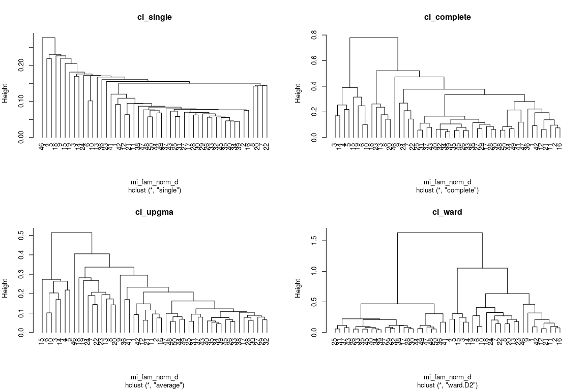
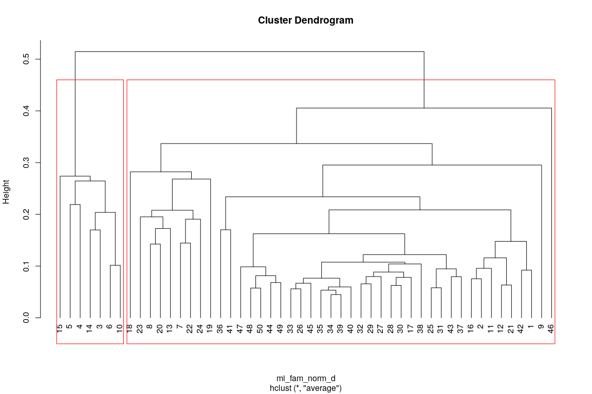
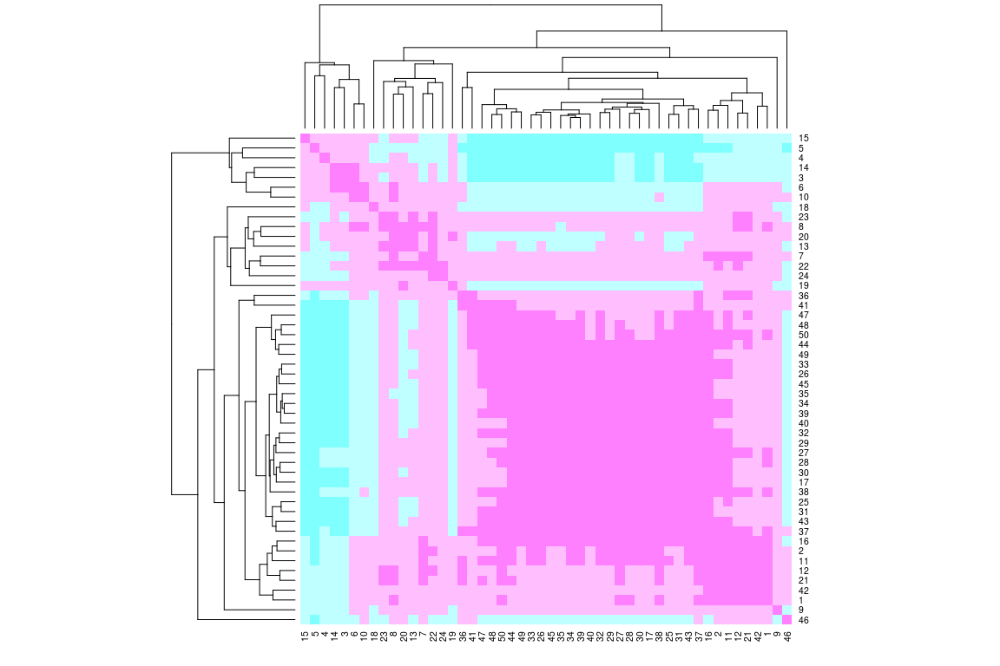
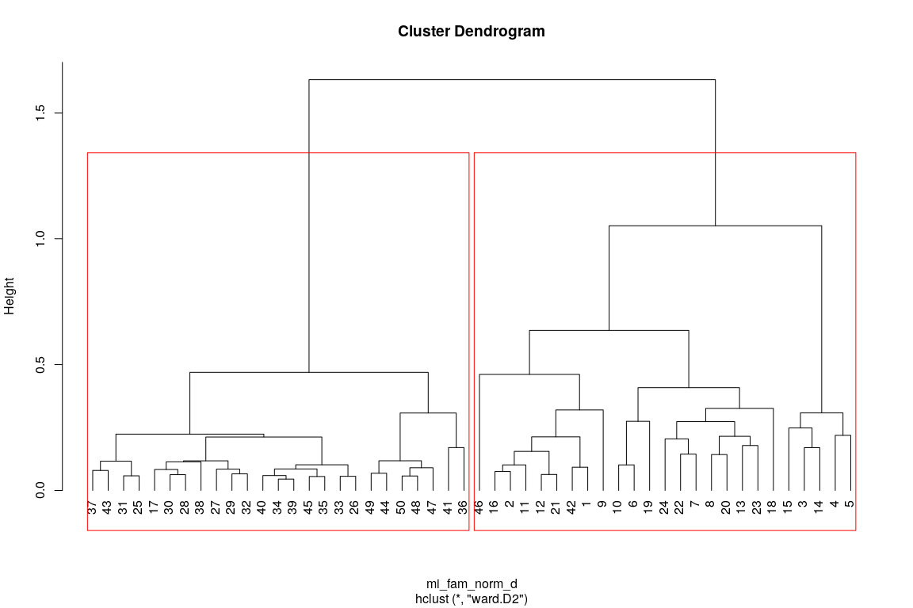
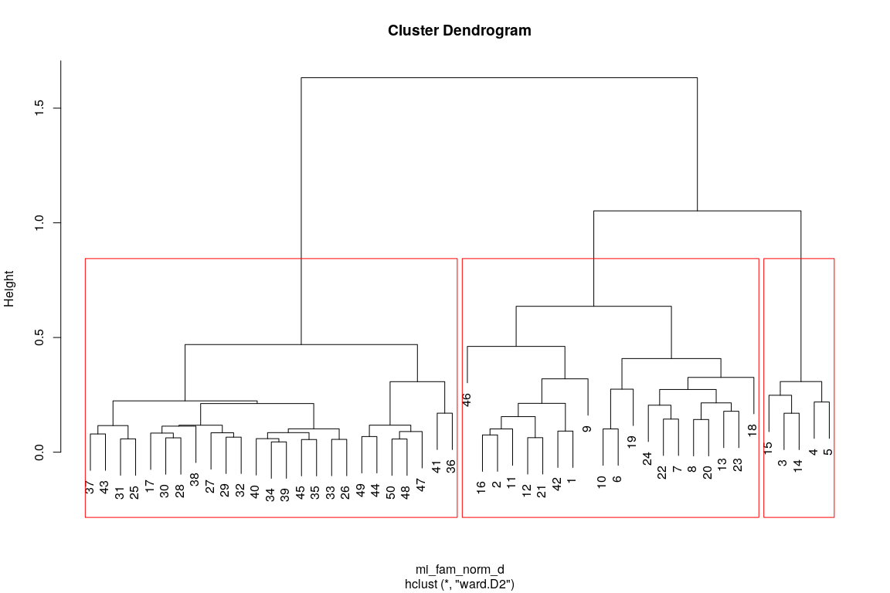
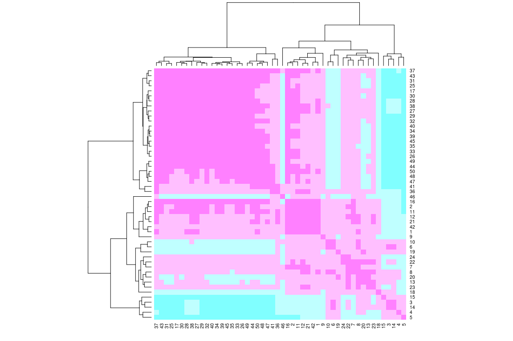
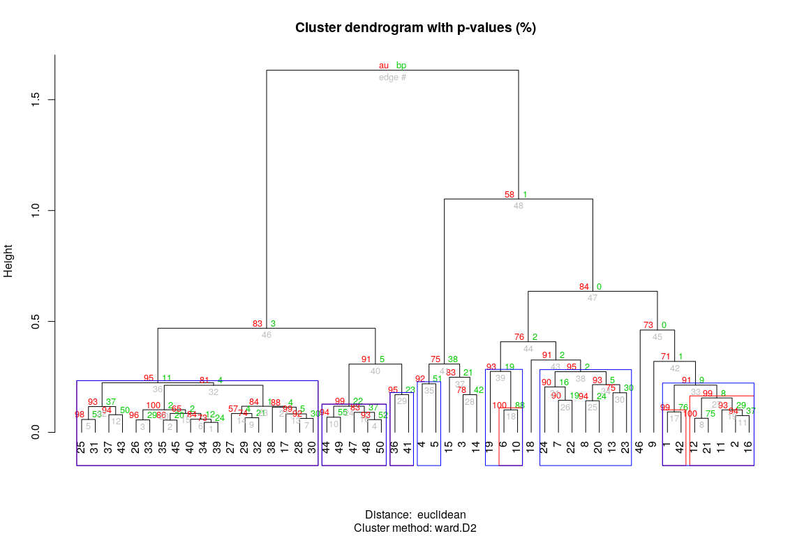
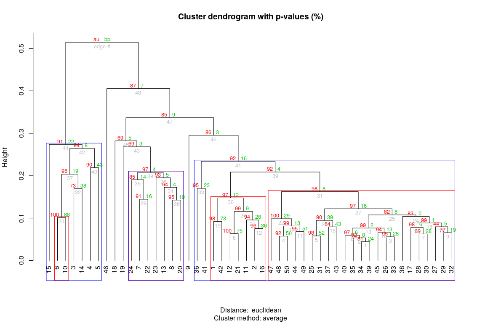

Análisis de agrupamiento (cluster analysis). <br> Parte 2:
Interpretación y comparación de resultados
================
JR
11 de noviembre, 2020

``` r
knitr::opts_chunk$set(fig.width=12, fig.height=8)
```

## Preámbulo

### Cargar paquetes

``` r
library(vegan)
```

    ## Loading required package: permute

    ## Loading required package: lattice

    ## This is vegan 2.5-6

``` r
library(tidyverse)
```

    ## ── Attaching packages ───────────────────────────────────────── tidyverse 1.2.1 ──

    ## ✓ ggplot2 3.3.2     ✓ purrr   0.3.4
    ## ✓ tibble  3.0.3     ✓ dplyr   0.8.3
    ## ✓ tidyr   1.0.0     ✓ stringr 1.4.0
    ## ✓ readr   1.3.1     ✓ forcats 0.4.0

    ## ── Conflicts ──────────────────────────────────────────── tidyverse_conflicts() ──
    ## x dplyr::filter() masks stats::filter()
    ## x dplyr::lag()    masks stats::lag()

``` r
library(broom)
library(cluster)
library(gclus)
```

    ## Registered S3 method overwritten by 'gclus':
    ##   method         from 
    ##   reorder.hclust vegan

``` r
library(pvclust)
library(sf)
```

    ## Linking to GEOS 3.6.2, GDAL 2.2.3, PROJ 4.9.3

``` r
source('biodata/funciones.R')
```

### Cargar datos

``` r
load('biodata/Apocynaceae-Meliaceae-Sapotaceae.Rdata')
mi_fam <- mc_apcyn_melic_saptc
load('biodata/matriz_ambiental.Rdata')
mi_fam %>% tibble
```

    ## # A tibble: 50 x 16
    ##    `Aspidosperma s… `Cedrela odorat… `Chrysophyllum … `Chrysophyllum …
    ##               <dbl>            <dbl>            <dbl>            <dbl>
    ##  1                3                0               21                2
    ##  2                2                0               11                1
    ##  3                2                0               19                1
    ##  4                3                0               38                2
    ##  5                2                1               21                0
    ##  6                3                0               18                0
    ##  7                0                0                9                3
    ##  8                4                0               14                0
    ##  9                5                0               25                0
    ## 10                1                0               17                1
    ## # … with 40 more rows, and 12 more variables: `Guarea bullata` <dbl>,
    ## #   `Guarea grandifolia` <dbl>, `Guarea guidonia` <dbl>, `Lacmellea
    ## #   panamensis` <dbl>, `Pouteria fossicola` <dbl>, `Pouteria
    ## #   reticulata` <dbl>, `Pouteria stipitata` <dbl>, `Rauvolfia
    ## #   littoralis` <dbl>, `Tabernaemontana arborea` <dbl>, `Thevetia
    ## #   ahouai` <dbl>, `Trichilia pallida` <dbl>, `Trichilia
    ## #   tuberculata` <dbl>

``` r
bci_env_grid %>% tibble
```

    ## # A tibble: 50 x 39
    ##       id categoria_de_ed… geologia habitat quebrada heterogeneidad_… UTM.EW
    ##    <dbl> <fct>            <fct>    <fct>   <fct>               <dbl>  <dbl>
    ##  1     1 c3               Tb       OldSlo… Yes                0.627  6.26e5
    ##  2     2 c3               Tb       OldLow  Yes                0.394  6.26e5
    ##  3     3 c3               Tb       OldLow  No                 0      6.26e5
    ##  4     4 c3               Tb       OldLow  No                 0      6.26e5
    ##  5     5 c3               Tb       OldSlo… No                 0.461  6.26e5
    ##  6     6 c3               Tb       OldLow  No                 0.0768 6.26e5
    ##  7     7 c3               Tb       OldLow  Yes                0.381  6.26e5
    ##  8     8 c3               Tb       OldLow  Yes                0.211  6.26e5
    ##  9     9 c3               Tb       OldLow  No                 0      6.26e5
    ## 10    10 c3               Tb       OldLow  No                 0      6.26e5
    ## # … with 40 more rows, and 32 more variables: UTM.NS <dbl>,
    ## #   geomorf_llanura_pct <dbl>, geomorf_pico_pct <dbl>,
    ## #   geomorf_interfluvio_pct <dbl>, geomorf_hombrera_pct <dbl>,
    ## #   `geomorf_espolón/gajo_pct` <dbl>, geomorf_vertiente_pct <dbl>,
    ## #   geomorf_vaguada_pct <dbl>, geomorf_piedemonte_pct <dbl>,
    ## #   geomorf_valle_pct <dbl>, geomorf_sima_pct <dbl>, Al <dbl>, B <dbl>,
    ## #   Ca <dbl>, Cu <dbl>, Fe <dbl>, K <dbl>, Mg <dbl>, Mn <dbl>, P <dbl>,
    ## #   Zn <dbl>, N <dbl>, N.min. <dbl>, pH <dbl>, elevacion_media <dbl>,
    ## #   pendiente_media <dbl>, orientacion_media <dbl>,
    ## #   curvatura_perfil_media <dbl>, curvatura_tangencial_media <dbl>,
    ## #   geometry <POLYGON [m]>, abundancia_global <dbl>, riqueza_global <int>

### Generar matriz de distancias de cuerdas

``` r
mi_fam_norm <- decostand(mi_fam, "normalize")
mi_fam_norm_d <- vegdist(mi_fam_norm, "euc")
mi_fam_norm_d %>% tidy
```

    ## # A tibble: 1,225 x 3
    ##    item1 item2 distance
    ##    <int> <int>    <dbl>
    ##  1     2     1    0.109
    ##  2     3     1    0.468
    ##  3     4     1    0.448
    ##  4     5     1    0.538
    ##  5     6     1    0.324
    ##  6     7     1    0.230
    ##  7     8     1    0.189
    ##  8     9     1    0.247
    ##  9    10     1    0.295
    ## 10    11     1    0.150
    ## # … with 1,215 more rows

## Interpretación visual de dendrogramas

[En el script anterior](aa_analisis_de_agrupamiento_1_jerarquico.md)
realicé los dendrogramas a partir de una matriz de cuerdas aplicando
distintos métodos. El objetivo de este script es mostrarte cómo
explorar, de manera visual y analítica, cuál o cuáles métodos de
agrupamiento son idóneos para sintetizar tus resultados, cuántos grupos
hacen sentido en un análisis de agrupamiento y, con suerte, determinar a
qué grupo parece pertenecer cada sitio.

La primera evaluación de los dendrogramas NO debe venir de la mano de
sofisticados análisis ni de procedimientos mecánicos. Te recomiendo que
los explores visualmente, con la intención de identificar grupos
(clústers) consistentes, es decir, aquellos que se repiten entre
dendrogramas. Asimismo, identifica aquellos elementos que, de manera
consistente entre dendrogramas, no parezcan agruparse con otros.

Evita concentrar tu vista en grupos extremadamente pequeños; comienza
analizando el árbol desde arriba hacia abajo, prefiere encontrar grupos
grandes y consistentes entre dendrogramas (si los hay). No atomices el
dendrograma a menos que sea estrictamente necesario. Observar muchos
grupos pequeños te impedirá ver los posibles patrones globales. Ahora
bien, si hubiere grupos pequeños reiteradamente, entonces considéralos.
No obstante, los cuadros de 1 Ha de la parcela de BCI están
autocorrelacionados espacialmente, por lo que normalmente encontrarás
grupos grandes.

Anota tus impresiones, para que las compares con los resultados que
posteriormente obtendrás; si confirmas patrones detectados visualmente,
la evidencia se irá acumulando en una dirección. Si por el contrario,
detectas inconsistencia, es el momento de revisar los scripts de
generación de dendrogramas; si luego de revisar ves que todo está
correcto, entonces debes seguir explorando patrones con otras técnicas o
utilizando distintos criterios de agrupamiento. Cuando termines la
exploración visual, entonces continúa aplicando otras técnicas
analíticas.

Para la exploración visual, generaré los objetos de cluster dentro de
una lista:

``` r
lista_cl <- list(
        cl_single = hclust(mi_fam_norm_d, method = 'single'),
        cl_complete = hclust(mi_fam_norm_d, method = 'complete'),
        cl_upgma = hclust(mi_fam_norm_d, method = 'average'),
        cl_ward = hclust(mi_fam_norm_d, method = 'ward.D2')
)
```

Un plot en panel 2x2 ayuda a visualizarlos todos de manera conjunta. En
tu caso, observa y compara todos los dendrogramas:

``` r
par(mfrow = c(2,2))
invisible(map(names(lista_cl), function(x) plot(lista_cl[[x]], main = x, hang = -1)))
```

<!-- -->

``` r
par(mfrow = c(1,1))
```

En mi caso, exceptuando el dendrograma generado por medio del enlace
simple, detecto al menos 2 grupos consistentes (integrados por múltiples
posibles subgrupos), los cuales mencionaré usando los identificadores de
sitios:

  - Un grupo pequeño, compuesto por los sitios 1, 42, 12, 21, 11, 2 y
    16.
  - Un “grupo” heterogéneo y grande, conformado por 25, 31,…, 26,…,
    35,…, 34,…,32, 17,…, 30, que también parece incluir a 44, 49, 47,
    48, 50.

Además de los grupos anteriores, detecto elementos que no forman grupos,
es decir, sitios que aparecen aislados del resto, como por ejemplo el 46
y, en algunos métodos, también el 9.

## Elegir método y número de clústers

Existen varios criterios para elegir un dendrograma idóneo, como por
ejemplo, los gráficos tipo-Shepard y la correlación cofenética. Centraré
mi atención en esta última. Igualmente, una vez elijas el método de
agrupamiento idóneo, existen varios métodos para decidir cuántos
clústers son óptimos, como la anchura de silueta (*silhouette width*,
que explicaré) y los niveles de fusión (*fusion levels*, este último te
lo dejo para autoapredizaje).

### Seleccionar método de agrupamiento por correlación cofenética

La correlación cofenética impica conocer la distancia cofenética, y esta
última se entiende mejor con un ejemplo: elige un objeto (e.g. sitio,
cuadro de 1 ha) cualquiera, “escala” por el árbol hasta llegar a un
nodo, luego desciende hasta el objeto más cercano. El recorrido que
acabas de realizar se denomina distancia cofenética. Ahora,
hipotéticamente, construye una matriz de distancias cofenéticas entre
todos los objetos (a pares), y calcula la correlación de ésta con la
matriz de distancias original. Esto último se denomina “correlación
cofenética”. El método con el valor más alto de correlación cofenética
es el que mejor sintetiza la distancia original y, por lo tanto, será el
preferido. Normalmente, la mayor correlación cofenética la brindan UPGMA
y enlace completo, pero no elijas un método de agrupamiento
mecánicamente basándote sólo en este criterio (ver notas más adelante
al respecto).

Usando la lista de objetos de clústers, calcularé la correlación
cofenética dentro de un `map` (una función del paquete `purrr`,
perteneciente a la colección `tidyverse`), para así repetir el mismo
proceso con los cuatro objetos de clusters en una sentencia:

``` r
map_df(lista_cl, function(x) {
        coph_d <- cophenetic(x)
        corr <- cor(mi_fam_norm_d, coph_d)
        return(corr)
})
```

    ## # A tibble: 1 x 4
    ##   cl_single cl_complete cl_upgma cl_ward
    ##       <dbl>       <dbl>    <dbl>   <dbl>
    ## 1     0.748       0.853    0.864   0.591

Habrás notado que, tanto UPGMA como enlace completo, tienen valores
altos de correlación cofenética. Un método complementario para explorar
la correlación cofenética es el diagrama tipo-Shepard, el cual te
recomiendo aprender a usar por tu cuenta si deseas profundizar.

### Elegir número de clústers

Elegiré UPGMA como método de agrupamiento y determinaré cuántos grupos
son idóneos de acuerdo a su anchura de silueta (*silhouette width*). Sin
embargo, no lo haré sólo para UPGMA, también contrastaré con Ward. ¿Por
qué? De entrada, se sabe que UPGMA tendrá una buena correlación
cofenética, dado que dicho método está diseñado para maximizarla. Sin
embargo, me interesa explorar patrones con sentido ecológico, no sólo
seguir procedimientos mecánicos y, al menos en mi caso, el método de
Ward podría hacer más sentido ecológico que UPGMA.

El objetivo de la función `calcular_anchuras_siluetas` está implícito en
su nombre. Esta función requiere de tres argumentos: matriz de comunidad
original, matriz de distancias, y objeto de clúster. La función
`calcular_anchuras_siluetas` devuelve como resultado una lista con dos
objetos (los explico más abajo): 1) Las anchuras promedio para cada
partición, excepto para la partición `i=1` y `i=50`, por ser
irrelevantes (se les asigna 0); 2) Número óptimo de grupos. Haré los
cálculos para UPGMA y Ward, y luego explico en qué consisten los
resultados.

Para UPGMA:

``` r
anch_sil_upgma <- calcular_anchuras_siluetas(
        mc_orig = mi_fam, 
        distancias = mi_fam_norm_d, 
        cluster = lista_cl$cl_upgma)
anch_sil_upgma
```

    ## $anchuras_siluetas
    ##  [1] 0.000000000 0.497227058 0.397814274 0.393315605 0.347610203
    ##  [6] 0.330190712 0.303411977 0.291446886 0.303415560 0.239076155
    ## [11] 0.233416290 0.253256540 0.259056163 0.267689186 0.260757138
    ## [16] 0.260662924 0.260521122 0.237214739 0.230326945 0.229999688
    ## [21] 0.221928608 0.214698947 0.210398081 0.178850174 0.175547500
    ## [26] 0.181202540 0.165788087 0.149195806 0.131454456 0.126864825
    ## [31] 0.127717891 0.115800245 0.112221448 0.109183092 0.094229092
    ## [36] 0.084743801 0.083949119 0.084009561 0.078643048 0.071445497
    ## [41] 0.060323782 0.049604701 0.035098668 0.031101489 0.028658135
    ## [46] 0.018498894 0.008694614 0.002622854 0.004898513 0.000000000
    ## 
    ## $n_grupos_optimo
    ## [1] 2

El objeto `anchuras_siluetas` de la lista `anch_sil_upgma` te muestra un
vector con los promedios de anchuras de siluetas para todas las posibles
particiones con sentido. Al ser promedios, lo que reflejan es el valor
de las siluetas de manera general. Si para una partición dada, se
registran promedios de siluetas grandes, se interpreta entonces que
habrá muchos casos de grupos claramente aislados para dicha partición.

Igualmente, el objeto `n_grupos_optimo` te indica cuál es el número
óptimo de clústers a crear, es decir, en cuántos grupos cortar el
árbol. Esto se determina programáticamente por medio de la posición que
ocupa el promedio más alto, que en este caso es la posición dos. Sin
embargo, te recomiendo NO usar este número a ciegas. Verifica si el
valor máximo, que en este caso ocupa la posición dos, se diferencia o se
parece mucho a los de su entorno, por ejemplo, al valor de la posición
3. En mi caso, el valor de anchura promedio de la posición 2 se
diferencia, por mucho, del de la posición 3. Por lo tanto, puedo elegir
con seguridad 2 como número de clústers óptimo.

Haré el gráfico de dendrograma, aunque nota que en este caso primero
reordenaré los sitios con la función `reorder.hclust`, de tal suerte que
los sitios más próximos en términos de distancias aparecerán próximos
también en el dendrograma.

``` r
u_dend_reord <- reorder.hclust(lista_cl$cl_upgma, mi_fam_norm_d)
plot(u_dend_reord, hang = -1)
rect.hclust(
        tree = u_dend_reord,
        k = anch_sil_upgma$n_grupos_optimo)
```

<!-- -->

Ahora compararé el dendrograma con el mapa de calor en un mismo gráfico,
colocando los dendrogramas en los márgenes del gráfico. Verificaré si el
número de grupos hace sentido, recordando los grupos que inicialmente
identifiqué.

``` r
heatmap(
        as.matrix(mi_fam_norm_d),
        Rowv = as.dendrogram(u_dend_reord),
        symm = TRUE,
        margin = c(3, 3),
        col = rev(cm.colors(4))
)
```

<!-- -->

En general, hay dos grupos, uno grande y otro pequeño, y parece haber un
tercero en el mapa de calor. El grupo grande ocupa la mancha rosa
central que se extiende hasta el borde inferior derecho, y el grupo
pequeño ocupa la posición superior derecha. Aunque los promedios de
anchura de siluetas sugerían usar 2 grupos, el mapa de calor parece
sugerir que existe un tercer grupo entre los dos anteriores,
representado por los sitios 18, 8,…, 7,…, 19.

Mostraré el resultado para Ward:

``` r
anch_sil_ward <- calcular_anchuras_siluetas(
        mc_orig = mi_fam, 
        distancias = mi_fam_norm_d, 
        cluster = lista_cl$cl_ward)
anch_sil_ward
```

    ## $anchuras_siluetas
    ##  [1] 0.000000000 0.359197472 0.342844912 0.295971460 0.263445050
    ##  [6] 0.267884590 0.254649875 0.253608144 0.255010585 0.255155829
    ## [11] 0.250948411 0.251427670 0.258660249 0.256709221 0.215305926
    ## [16] 0.211603141 0.211371472 0.204996675 0.205765930 0.207873704
    ## [21] 0.204980862 0.198216814 0.191329020 0.191387386 0.185503406
    ## [26] 0.181202540 0.156471190 0.142669155 0.146490679 0.146229943
    ## [31] 0.140554256 0.136183014 0.119590733 0.107673087 0.105295130
    ## [36] 0.096251438 0.089625148 0.089694555 0.080209263 0.074842750
    ## [41] 0.067645199 0.060795323 0.046289289 0.042292110 0.036925808
    ## [46] 0.026766568 0.016962288 0.005944595 0.004898513 0.000000000
    ## 
    ## $n_grupos_optimo
    ## [1] 2

En este caso, el valor máximo, que ocupa la posición número 2, no se
diferencia mucho del de la posición 3. Al parecer, sería igualmente
válido elegir 2 o 3 particiones, por tener promedios de anchuras de
siluetas bastante parecidos. Por tal razón, cortaré el dendrograma en 2
y en 3 grupos, respectivamente:

``` r
w_dend_reord <- reorder.hclust(lista_cl$cl_ward, mi_fam_norm_d)
plot(w_dend_reord, hang = -1)
rect.hclust(
        tree = w_dend_reord,
        k = anch_sil_ward$n_grupos_optimo)
```

<!-- -->

``` r
plot(w_dend_reord, hang = -1)
rect.hclust(
        tree = w_dend_reord,
        k = anch_sil_ward$n_grupos_optimo + 1)
```

<!-- -->

Comparando el dendrograma con el mapa de calor. Verificar si el número
de grupos hace sentido.

``` r
heatmap(
        as.matrix(mi_fam_norm_d),
        Rowv = as.dendrogram(w_dend_reord),
        symm = TRUE,
        margin = c(3, 3),
        col = rev(cm.colors(4))
)
```

<!-- -->

Nótese que este dendrograma hace más sentido que el sugerido por UPGMA.
En cualquier casos, conservaré ambos resultados para seguir evaluando a
posteriori y contrastando con nuevos métodos.

### Evaluación mediante remuestreo por *bootstrap* multiescalar

Con suerte, un agrupamiento aplicado a datos muestrales reflejará los
patrones naturales de organización. Sin embargo, lo que con toda
seguridad mostrará es el sesgo de muestreo. Afortunadamente, los datos
de BCI son censales, por lo que el sesgo de muestreo es una preocupación
menor o inexistente.

Sin embargo, los datos de BCI también tienen sesgo, pues se usa un DAP
de corte para decidir si un individuo es censado o no. Si consideramos
que el universo es “todos los individuos de 1 cm o más de tallo”, pues
el sesgo es bajísimo, pero si quisiéramos extraer conclusiones aplicadas
a toda comunidad, cometeríamos errores debidos a sesgo por muestreo.

No obstante, aun con todas sus bondades, los datos censales carecen de
una fortaleza: no reflejan asociación con grandes unidades de hábitats
y, a lo sumo, revelan asociación con microhábitats muy específicos, por
lo que extraer conclusiones sobre patrones de asociación con variables
ambientales de manera más general, presenta sus limitaciones.

Por estas razones, los análisis de agrupamientos realizados hasta este
punto, reflejan tanto el mencionado sesgo y las limitaciones impuestas
por el pequeño espacio territorial estudiado. Una forma de validar la
robustez de los resultados anteriores, consiste en realizar un
remuestreo por medio de *bootstrap*, un método que consiste en tomar
muestras aleatorias de los datos y realizar, con cada una, análisis de
agrupamiento. Este proceso se repite varias veces (e.g. 1000 veces), es
decir, se realizan varias iteraciones. Al finalizar, se cuenta la
proporción de veces que un grupo dado aparece consistentemente como
clúster (tasa de éxito), la cual se denomina probabilidad de
*bootstrap* del clúster en cuestión (*bootstrap probability*, BP). A
este procedimiento se le ha añadido más recientemente el criterio de
remuestreo por *bootstrap* multiescalar, es decir, considerar muestras
de tamaños diferentes, a lo que se denomina valores de probabilidad
aproximadamente insesgados (*approximately unbiased*, AU). Los valores
de AU son, en principio, más fiables que los de BP, por lo que serán los
preferidos en este análisis.

El método de remuestreo por *boostrap* multiescalar está implementado en
el paquete `pvclust`, y la función del mismo nombre se encarga de
realizarlo. IMPORTANTE: la matriz de comunidad, que en este caso es la
matriz normalizada, debe transponerse previamente; de ahí que verás el
uso de la función `t()` en el primer argumento de `pvclust`. La función
primero genera un agrupamiento, por lo que debemos especificar con qué
método, en este caso lo haré tanto con UPGMA como con Ward, para así
validar los dos métodos ejecutados anteriormente.

La función `pvclust` devolverá un dendrograma enriquecido, que incluirá
los valors de AU y BP de cada nodo del dendrograma en cuestión. Los
valores de AU serán especialmente relevantes, porque con ellos trazaré
dos “decoraciones” de ayuda:

  - Rectángulos de borde azul, para todos aquellos grupos que resulten
    con valores de AU\>0.91 en sus nodos. Estos rectángulos permitirán
    ver los grandes grupos sin perder robustez, dado que prefiero el
    enfoque de agrupador (*lumper*) por encima del desglosador
    (*splitter*); con esto además evito la tendencia de dividir en
    demasiados grupos pequeños, la cual vengo evitando desde análisis
    anteriores por el alto grado de autocorrelación espacial que afecta
    a los datos de BCI.

  - Líneas inferiores rojas, que resaltan aquellos grupos (o subgrupos)
    que obtuvieron AU\>0.95. Estos grupos son considerados como
    sólidamente coherentes, es decir, aquellos cuya singularidad es
    prácticamente indiscutible. No obstante, suelen ser pequeños con
    relación a los anteriores.

Ten presente que, al realizar remuestreo por *bootstrap* multiescalar,
cada corrida puede arrojar resultados diferentes, dado que el
procedimiento implica remuestreo. No obstante, los patrones
indiscutibles estarán siempre presentes en cada corrida. Para garantizar
reproducibilidad, utilicé el argumento `iseed` en la función `pvclust`.

#### UPGMA

``` r
cl_pvclust_upgma <-
        pvclust(t(mi_fam_norm),
                method.hclust = "average",
                method.dist = "euc",
                iseed = 91, # Resultado reproducible
                parallel = TRUE)
```

    ## Creating a temporary cluster...done:
    ## socket cluster with 7 nodes on host 'localhost'
    ## Multiscale bootstrap... Done.

``` r
# Añadir los valores de p
plot(cl_pvclust_upgma, hang = -1)
# Añadir rectángulos a los grupos significativos
lines(cl_pvclust_upgma)
pvrect(cl_pvclust_upgma, alpha = 0.91, border = 4)
```

<!-- -->

#### Ward

``` r
cl_pvclust_ward <-
        pvclust(t(mi_fam_norm),
                method.hclust = "ward.D2",
                method.dist = "euc",
                iseed = 191, # Resultado reproducible
                parallel = TRUE)
```

    ## Creating a temporary cluster...done:
    ## socket cluster with 7 nodes on host 'localhost'
    ## Multiscale bootstrap... Done.

``` r
# Añadir los valores de p
plot(cl_pvclust_ward, hang = -1)
# Añadir rectángulos a los grupos significativos
lines(cl_pvclust_ward)
pvrect(cl_pvclust_ward, alpha = 0.91, border = 4)
```

<!-- -->

### Recapitulando los grupos de sitios.

#### Patrones comunes y dispares

Detecto algunos patrones consistentes en cuanto a grupos de sitios según
composición de las especies de mi familia asignada:

  - Tanto en UPGMA como en Ward, detecté al menos dos o tres grandes
    grupos. Con el primer método, UPGMA, noté buena coincidencia entre
    el número de grupos detectados por el criterio de *silhouette width*
    y por `pvclust`.

  - En el caso específico del dendrograma Ward, `pvclust` atomizó los
    sitios en demasiados grupos. Este resultado podría ser de interés
    para determinados análisis, como por ejemplo, si se consideraran
    microhábitats muy específicos o si entre mis familia asignada se
    registrasen especialistas muy selectivos.

#### ¿Cómo declaro los grupos de sitios?

Para conservar las clasificaciones de grupos de sitios anteriores,
crearé un vector con el identificador del grupo al que pertenece cada
grupo. Es importante imprimir el resultado, para confirmar que los
sitios estén ordenados según aparecen en las matrices de comunidad y
ambiental.

UPGMA:

``` r
(grupos_upgma_k2 <- as.factor(cutree(lista_cl$cl_upgma, k = 2)))
```

    ##  1  2  3  4  5  6  7  8  9 10 11 12 13 14 15 16 17 18 19 20 21 22 23 24 25 
    ##  1  1  2  2  2  2  1  1  1  2  1  1  1  2  2  1  1  1  1  1  1  1  1  1  1 
    ## 26 27 28 29 30 31 32 33 34 35 36 37 38 39 40 41 42 43 44 45 46 47 48 49 50 
    ##  1  1  1  1  1  1  1  1  1  1  1  1  1  1  1  1  1  1  1  1  1  1  1  1  1 
    ## Levels: 1 2

En este caso, los sitios 1 y 2 pertenecen al grupo 1, los sitios 3 al 6
pertenecen al grupo 2, nuevamente, del 7 al 9 pertenecen al grupo 1, el
sitio 10 pertenece al grupo 2, y así sucesivamente. Preguntaré cuántos
sitios hay en cada grupo mediante la función `table`:

``` r
table(grupos_upgma_k2)
```

    ## grupos_upgma_k2
    ##  1  2 
    ## 43  7

Nota lo desiguales que son estos grupos, un efecto esperado dado el alto
grado de autocorrelación espacial que tienen entre sí los cuadros de 1
Ha de BCI. Este desequilibrio afecta las inferencias que realizaré en
*scripts* posteriores, pero para fines didácticos los realizaré de todas
maneras. No obstante, en tu caso, esperaría y desearía que tu familia
asignada ofrezca resultados de agrupamiento más
    equilibrados.

Ward:

``` r
(grupos_ward_k3 <- as.factor(cutree(lista_cl$cl_ward, k = 3)))
```

    ##  1  2  3  4  5  6  7  8  9 10 11 12 13 14 15 16 17 18 19 20 21 22 23 24 25 
    ##  1  1  2  2  2  1  1  1  1  1  1  1  1  2  2  1  3  1  1  1  1  1  1  1  3 
    ## 26 27 28 29 30 31 32 33 34 35 36 37 38 39 40 41 42 43 44 45 46 47 48 49 50 
    ##  3  3  3  3  3  3  3  3  3  3  3  3  3  3  3  3  1  3  3  3  1  3  3  3  3 
    ## Levels: 1 2 3

``` r
table(grupos_ward_k3)
```

    ## grupos_ward_k3
    ##  1  2  3 
    ## 20  5 25

Guardaré estos vectores en archivos para reutilizarlos en *scripts*
posteriores:

``` r
saveRDS(grupos_upgma_k2, 'grupos_upgma_k2.RDS')
saveRDS(grupos_ward_k3, 'grupos_ward_k3.RDS')
```

Evita usar este, y cualquier otro procedimiento, de manera mecánica. En
tu caso, quizá tengas que cortar tus dendrogramas en más o menos grupos
de sitios. También podría resultar que alguno de dichos métodos, o
ambos, sean irrelevante para tu caso, por lo que probablemente tendrás
que elegir otro que haga sentido ecológico a tus datos (por ejemplo,
*complete*).

En el próximo *script*, aprenderás a comparar este resultado con las
variables ambientales. También podrás evaluar cómo se distribuyen los
grupos de sitios en un mapa, usando las herramientas del paquete
`mapview`.
