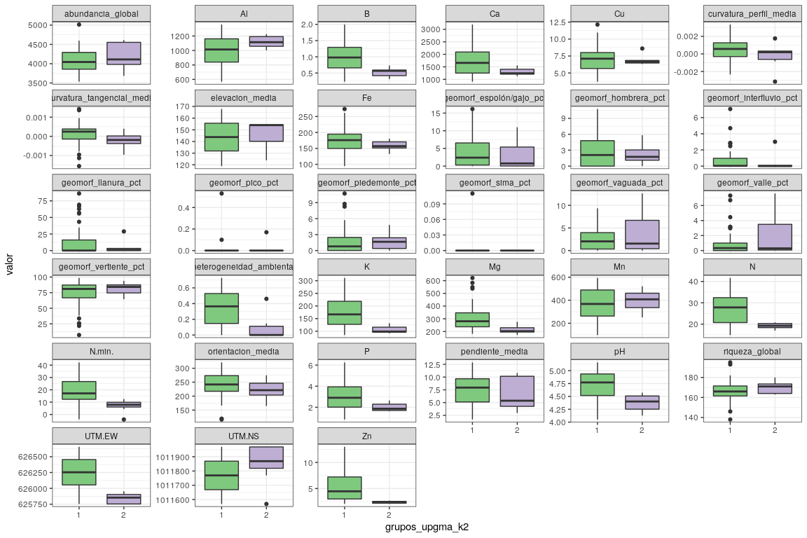
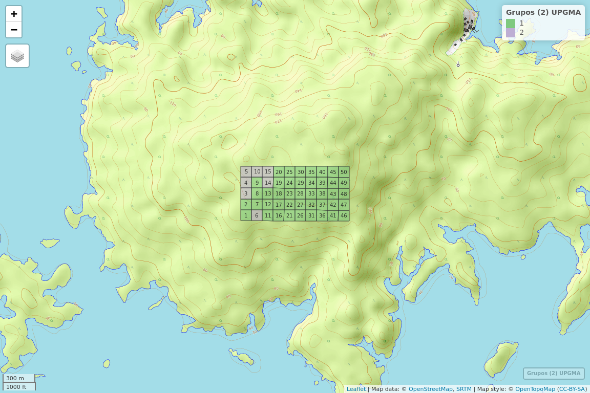
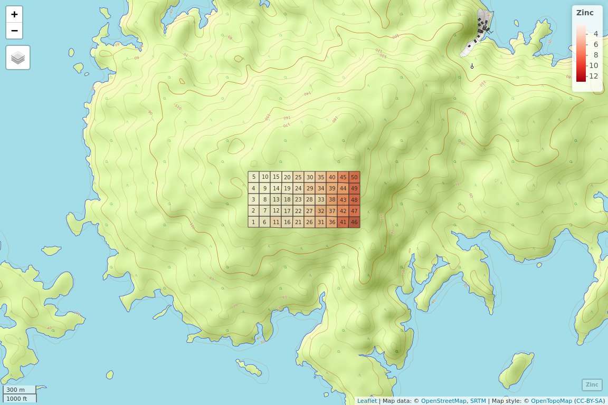
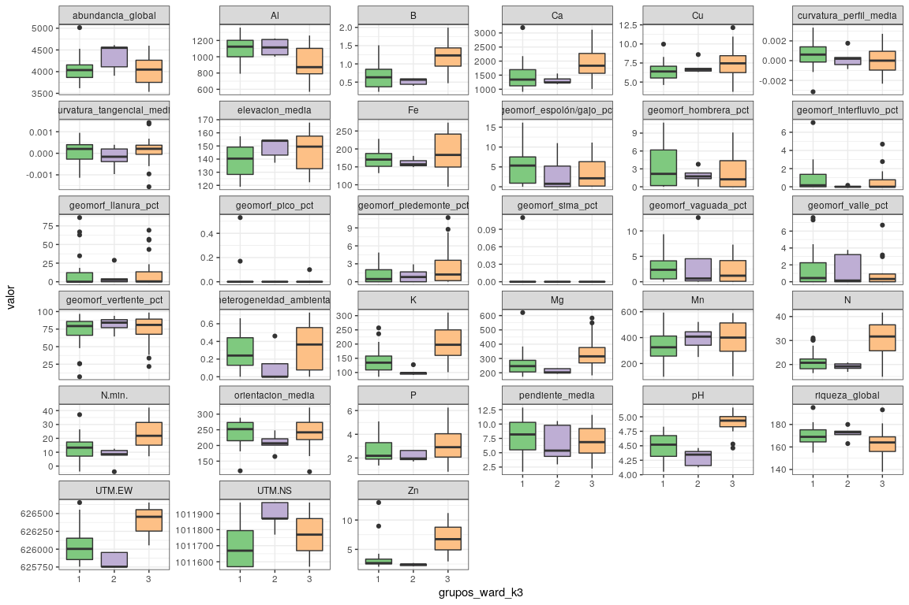
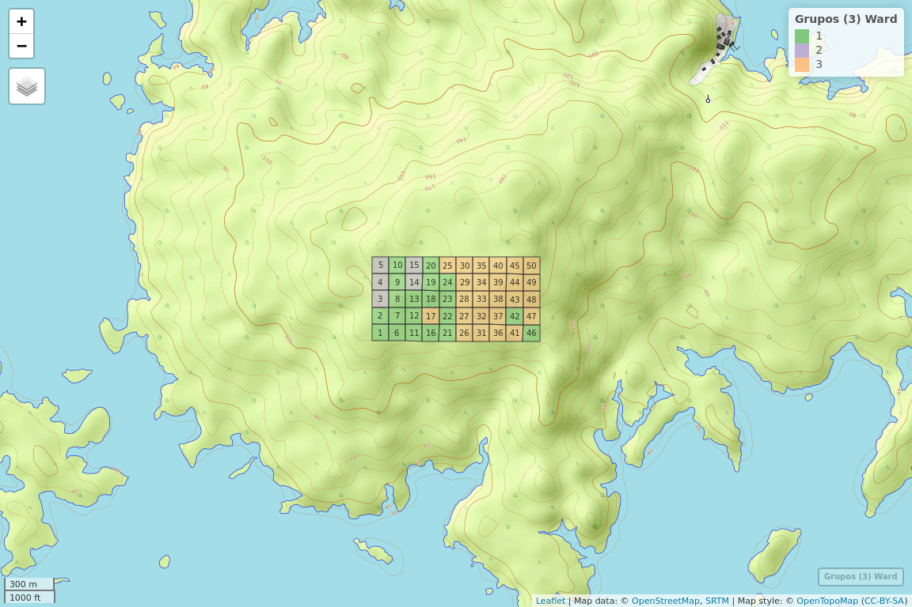
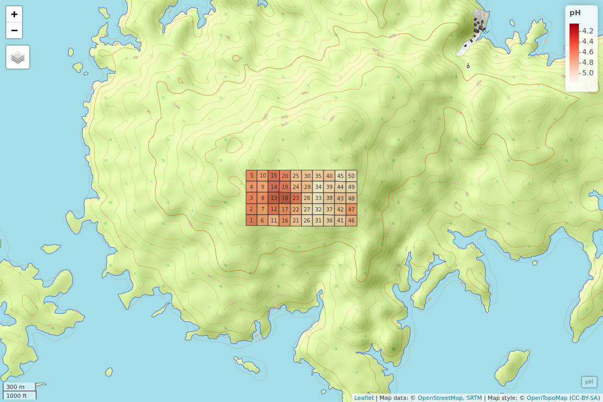

Análisis de agrupamiento (cluster analysis). <br> Parte 3: Grupos
(clústers), variables ambientales y mapas
================
JR
15 de noviembre, 2020

``` r
knitr::opts_chunk$set(fig.width=12, fig.height=8)
```

## Preámbulo

### Cargar paquetes

``` r
library(mapview)
library(tidyverse)
```

    ## ── Attaching packages ────────────────────────────────────────────── tidyverse 1.2.1 ──

    ## ✓ ggplot2 3.3.2     ✓ purrr   0.3.4
    ## ✓ tibble  3.0.3     ✓ dplyr   0.8.3
    ## ✓ tidyr   1.0.0     ✓ stringr 1.4.0
    ## ✓ readr   1.3.1     ✓ forcats 0.4.0

    ## ── Conflicts ───────────────────────────────────────────────── tidyverse_conflicts() ──
    ## x dplyr::filter() masks stats::filter()
    ## x dplyr::lag()    masks stats::lag()

``` r
library(sf)
```

    ## Linking to GEOS 3.6.2, GDAL 2.2.3, PROJ 4.9.3

``` r
library(RColorBrewer)
source('biodata/funciones.R')
```

### Cargar datos

``` r
load('biodata/Apocynaceae-Meliaceae-Sapotaceae.Rdata')
load('biodata/matriz_ambiental.Rdata')
grupos_upgma_k2 <- readRDS('grupos_upgma_k2.RDS')
table(grupos_upgma_k2) #Importante, tener en cuenta los desiguales tamaños de los grupos
```

    ## grupos_upgma_k2
    ##  1  2 
    ## 43  7

``` r
grupos_ward_k3 <- readRDS('grupos_ward_k3.RDS')
table(grupos_ward_k3)
```

    ## grupos_ward_k3
    ##  1  2  3 
    ## 20  5 25

### Paletas

``` r
rojo <- colorRampPalette(brewer.pal(8, "Reds"))
rojo_inv <- colorRampPalette(rev(brewer.pal(8, "Reds")))
colores_grupos <- brewer.pal(8, "Accent")
```

## Explorar efectos

### Pruebas de igualdad de promedios de las variables entre 2 grupos

Para evaluar homogeneidad de promedios usaré las pruebas *t* (medias),
basada en la distribución *t* de *Student*, y la prueba no paramétrica
de la suma de rangos de Wilcoxon (medianas), usando como variable de
agrupamiento los grupos establecidos en el agrupamiento UPGMA. Nota que
en mi caso UPGMA clasifica los sitios en dos grupos, pero en tu caso
podría ser distinto (para evaluar homogeneidad de promedios de un número
mayor de grupos, ver sección siguiente).

Primero crearé un objeto que permita realizar tanto las pruebas como los
diagramas de cajas.

``` r
(m_amb_upgma_k2 <- bci_env_grid %>%
  select_if(is.numeric) %>% select(-id) %>% 
  mutate(grupos_upgma_k2) %>%
  st_drop_geometry() %>% 
  pivot_longer(-grupos_upgma_k2, names_to = "variable", values_to = "valor"))
```

    ## # A tibble: 1,650 x 3
    ##    grupos_upgma_k2 variable                       valor
    ##    <fct>           <chr>                          <dbl>
    ##  1 1               heterogeneidad_ambiental       0.627
    ##  2 1               UTM.EW                    625754.   
    ##  3 1               UTM.NS                   1011569.   
    ##  4 1               geomorf_llanura_pct           10.0  
    ##  5 1               geomorf_pico_pct               0    
    ##  6 1               geomorf_interfluvio_pct        0.83 
    ##  7 1               geomorf_hombrera_pct          10.8  
    ##  8 1               geomorf_espolón/gajo_pct       7.26 
    ##  9 1               geomorf_vertiente_pct         67.1  
    ## 10 1               geomorf_vaguada_pct            3.28 
    ## # … with 1,640 more rows

A continuación, las pruebas:

``` r
m_amb_upgma_k2 %>%
  group_by(variable) %>%
  summarise(
    p_valor_t = t.test(valor ~ grupos_upgma_k2)$p.value,
    p_valor_w = wilcox.test(valor ~ grupos_upgma_k2, exact = F)$p.value) %>%
  arrange(p_valor_t) %>%
  print(n=Inf)
```

    ## # A tibble: 33 x 3
    ##    variable                      p_valor_t p_valor_w
    ##    <chr>                             <dbl>     <dbl>
    ##  1 UTM.EW                     0.0000000123  0.000360
    ##  2 Zn                         0.0000000181  0.000474
    ##  3 N                          0.000000122   0.00790 
    ##  4 K                          0.000000300   0.00158 
    ##  5 B                          0.00000570    0.00669 
    ##  6 Mg                         0.0000881     0.00669 
    ##  7 Ca                         0.000179      0.0650  
    ##  8 N.min.                     0.000232      0.00231 
    ##  9 P                          0.000937      0.0471  
    ## 10 pH                         0.00121       0.00859 
    ## 11 heterogeneidad_ambiental   0.00695       0.0138  
    ## 12 Al                         0.0131        0.162   
    ## 13 Fe                         0.0213        0.171   
    ## 14 geomorf_llanura_pct        0.115         0.858   
    ## 15 curvatura_tangencial_media 0.123         0.105   
    ## 16 UTM.NS                     0.132         0.0896  
    ## 17 geomorf_vertiente_pct      0.135         0.576   
    ## 18 riqueza_global             0.250         0.320   
    ## 19 orientacion_media          0.275         0.219   
    ## 20 curvatura_perfil_media     0.294         0.263   
    ## 21 geomorf_sima_pct           0.323         0.729   
    ## 22 abundancia_global          0.354         0.229   
    ## 23 geomorf_valle_pct          0.370         0.431   
    ## 24 Mn                         0.448         0.576   
    ## 25 geomorf_vaguada_pct        0.453         0.595   
    ## 26 geomorf_hombrera_pct       0.533         0.899   
    ## 27 geomorf_interfluvio_pct    0.566         0.505   
    ## 28 Cu                         0.597         0.845   
    ## 29 geomorf_espolón/gajo_pct   0.611         0.425   
    ## 30 elevacion_media            0.637         0.716   
    ## 31 geomorf_pico_pct           0.732         0.342   
    ## 32 pendiente_media            0.750         0.845   
    ## 33 geomorf_piedemonte_pct     0.907         0.746

Interesa observar las variables que obtuvieron valores de p\<0.01.
Reitero que, en mi caso, mis grupos resultaron muy desiguales,
recordando: el grupo 1 tiene 43 sitios (43) y el grupo 2 tiene 7. Este
desigual número de sitios por grupo, hace que la prueba estadística
pierda potencia, porque se viola la recomendación de evitar tamaños de
los tratamientos muy desiguales.

Por otra parte, este es un buen momento para “revisitar” tus análisis
exploratorios de datos (AED), específicamente el análisis de correlación
(*script* 5). Es probable que algunas de las variables ambientales que
presentaron efecto entre grupos (las que obtuvieron p\<0.01), te
aparezca también como significativamente correlacionada con la
abundancia o la riqueza en el script 5 de AED.

Los gráficos:

``` r
m_amb_upgma_k2 %>% 
  group_by(variable) %>% 
  ggplot() + aes(x = grupos_upgma_k2, y = valor, fill = grupos_upgma_k2) + 
  geom_boxplot() + 
  scale_fill_brewer(palette = 'Accent') +
  theme_bw() +
  theme(legend.position="none") +
  facet_wrap(~ variable, scales = 'free_y')
```

<!-- -->

Mapas:

``` r
mapa_upgma_k2 <- mapView(
  bci_env_grid %>% mutate(grupos_upgma_k2),
  layer.name = 'Grupos (2) UPGMA',
  alpha.regions = 0.6,
  map.types = 'OpenTopoMap',
  legend = T,
  col.regions = colores_grupos[1:2],
  zcol = 'grupos_upgma_k2') %>%
  addStaticLabels(label = bci_env_grid$id) %>% 
  leaflet::setView(
    lng = -79.85136,
    lat = 9.15097,
    zoom = 15)
mapa_upgma_k2
```

<!-- -->

``` r
mapa_upgma_k2 %>% mapshot(
  file = 'mapa_upgma_k2.png', 
  remove_controls = c("zoomControl", "layersControl", "homeButton")
)
```

Mapa de una de las variables donde se presentó efecto de su promedio
(p\<0.01), en este caso, Zinc (`Zn`)

``` r
mapa_zn <- mapView(
  bci_env_grid,
  layer.name = 'Zinc',
  alpha.regions = 0.6,
  map.types = 'OpenTopoMap',
  legend = T,
  col.regions = rojo,
  zcol = 'Zn') %>%
  addStaticLabels(label = bci_env_grid$id) %>% 
  leaflet::setView(
    lng = -79.85136,
    lat = 9.15097,
    zoom = 15)
mapa_zn
```

<!-- -->

``` r
mapa_zn %>% mapshot(
  file = 'mapa_zinc.png', 
  remove_controls = c("zoomControl", "layersControl", "homeButton")
)
```

### Pruebas de igualdad de promedios de las variables entre 3 grupos o más

Objeto común:

``` r
(m_amb_ward_k3 <- bci_env_grid %>%
  select_if(is.numeric) %>% select(-id) %>% 
  mutate(grupos_ward_k3) %>%
  st_drop_geometry() %>% 
  pivot_longer(-grupos_ward_k3, names_to = "variable", values_to = "valor"))
```

    ## # A tibble: 1,650 x 3
    ##    grupos_ward_k3 variable                       valor
    ##    <fct>          <chr>                          <dbl>
    ##  1 1              heterogeneidad_ambiental       0.627
    ##  2 1              UTM.EW                    625754.   
    ##  3 1              UTM.NS                   1011569.   
    ##  4 1              geomorf_llanura_pct           10.0  
    ##  5 1              geomorf_pico_pct               0    
    ##  6 1              geomorf_interfluvio_pct        0.83 
    ##  7 1              geomorf_hombrera_pct          10.8  
    ##  8 1              geomorf_espolón/gajo_pct       7.26 
    ##  9 1              geomorf_vertiente_pct         67.1  
    ## 10 1              geomorf_vaguada_pct            3.28 
    ## # … with 1,640 more rows

Pruebas, en este caso ANOVA (evalúa homogeneidad de medias; no se
cumplen muchos de los supuestos requeridos para esta prueba) y
Kruskal-Wallis (evalúa homogeneidad de medianas):

``` r
m_amb_ward_k3 %>% 
  group_by(variable) %>% 
  summarise(
    p_valor_a = oneway.test(valor ~ grupos_ward_k3)$p.value,
    p_valor_k = kruskal.test(valor ~ grupos_ward_k3)$p.value) %>%
  arrange(p_valor_k) %>%
  print(n=Inf)
```

    ## # A tibble: 33 x 3
    ##    variable                   p_valor_a   p_valor_k
    ##    <chr>                          <dbl>       <dbl>
    ##  1 pH                           3.00e-6 0.000000215
    ##  2 UTM.EW                       2.56e-7 0.000000794
    ##  3 Zn                           5.75e-9 0.00000221 
    ##  4 N                            5.06e-7 0.0000397  
    ##  5 B                            1.03e-7 0.0000491  
    ##  6 K                            6.91e-7 0.000124   
    ##  7 N.min.                       1.32e-3 0.000921   
    ##  8 Mg                           1.76e-5 0.00348    
    ##  9 Ca                           4.85e-4 0.00559    
    ## 10 Al                           9.99e-3 0.0105     
    ## 11 riqueza_global               4.56e-2 0.0188     
    ## 12 UTM.NS                       1.28e-2 0.0430     
    ## 13 Cu                           1.27e-1 0.0858     
    ## 14 orientacion_media            1.37e-1 0.138      
    ## 15 abundancia_global            2.10e-1 0.147      
    ## 16 elevacion_media              1.20e-1 0.150      
    ## 17 heterogeneidad_ambiental     1.19e-1 0.158      
    ## 18 geomorf_interfluvio_pct      7.44e-3 0.285      
    ## 19 P                            3.82e-2 0.298      
    ## 20 Mn                           2.94e-1 0.303      
    ## 21 geomorf_piedemonte_pct       2.26e-1 0.312      
    ## 22 curvatura_perfil_media       4.67e-1 0.379      
    ## 23 geomorf_espolón/gajo_pct     3.91e-1 0.429      
    ## 24 Fe                           1.09e-1 0.437      
    ## 25 geomorf_sima_pct           NaN       0.472      
    ## 26 curvatura_tangencial_media   5.52e-1 0.552      
    ## 27 geomorf_pico_pct           NaN       0.569      
    ## 28 geomorf_hombrera_pct         3.10e-1 0.612      
    ## 29 pendiente_media              6.84e-1 0.618      
    ## 30 geomorf_valle_pct            4.50e-1 0.679      
    ## 31 geomorf_vaguada_pct          6.52e-1 0.699      
    ## 32 geomorf_vertiente_pct        3.53e-1 0.711      
    ## 33 geomorf_llanura_pct          6.35e-1 0.791

Gráficos:

``` r
m_amb_ward_k3 %>% 
  group_by(variable) %>% 
  ggplot() + aes(x = grupos_ward_k3, y = valor, fill = grupos_ward_k3) + 
  geom_boxplot() + 
  scale_fill_brewer(palette = 'Accent') +
  theme_bw() +
  theme(legend.position="none") +
  facet_wrap(~ variable, scales = 'free_y')
```

<!-- -->

Mapas:

``` r
mapa_ward_k3 <- mapView(
  bci_env_grid %>% mutate(grupos_ward_k3),
  layer.name = 'Grupos (3) Ward',
  alpha.regions = 0.6,
  map.types = 'OpenTopoMap',
  legend = T,
  col.regions = colores_grupos[1:3],
  zcol = 'grupos_ward_k3') %>%
  addStaticLabels(label = bci_env_grid$id) %>% 
  leaflet::setView(
    lng = -79.85136,
    lat = 9.15097,
    zoom = 15)
mapa_ward_k3
```

<!-- -->

``` r
mapa_ward_k3 %>% mapshot(
  file = 'mapa_ward_k3.png', 
  remove_controls = c("zoomControl", "layersControl", "homeButton")
)
```

Mapa de una de las variables donde se presentó efecto de su promedio
(p\<0.01), en este caso, Zinc (`Zn`)

``` r
mapa_ph <- mapView(
  bci_env_grid,
  layer.name = 'pH',
  alpha.regions = 0.6,
  map.types = 'OpenTopoMap',
  legend = T,
  col.regions = rojo_inv,
  zcol = 'pH') %>%
  addStaticLabels(label = bci_env_grid$id) %>% 
  leaflet::setView(
    lng = -79.85136,
    lat = 9.15097,
    zoom = 15)
mapa_ph
```

<!-- -->

``` r
mapa_ph %>% mapshot(
  file = 'mapa_ph.png', 
  remove_controls = c("zoomControl", "layersControl", "homeButton")
)
```
