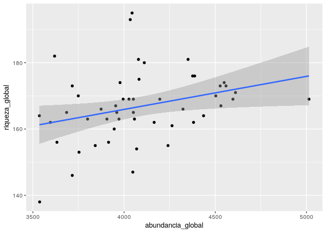
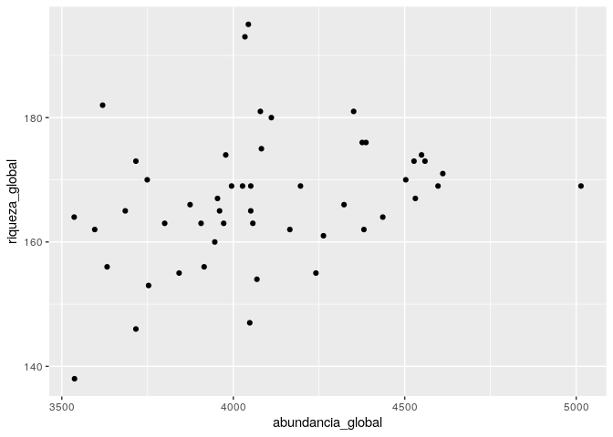
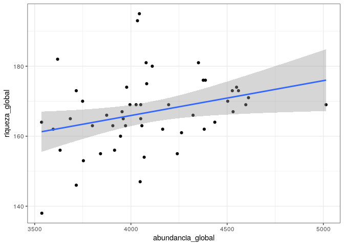
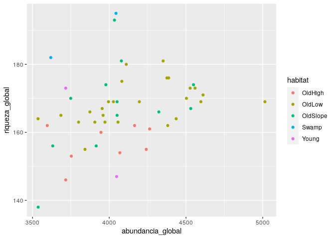
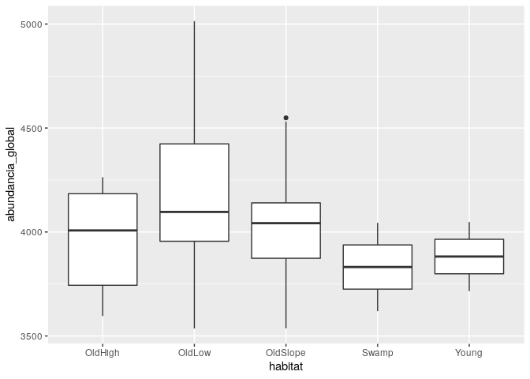
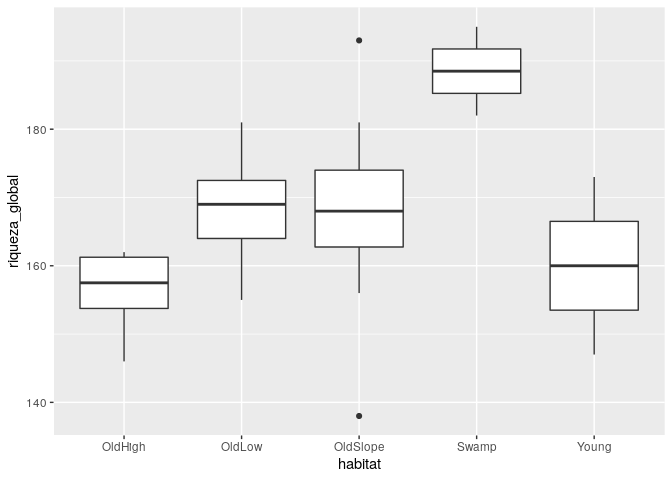
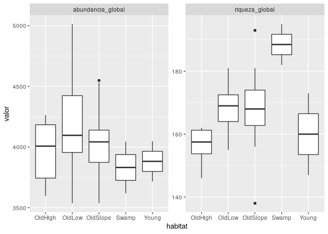

Análisis exploratorio de datos. Colección tidyverse
================
JR
18 de octubre, 2020

# ¿Qué es tidyverse?

Es una colección de paquetes con los que podrás importar, transformar,
visualizar, modelar y presentar datos. La colección se compone de 8
paquetes, de los cuales verás sobre todo 3: `dplyr`, `tidyr` y
`ggplot2`.

Todos estos paquetes comparten estructuras comunes. Una de las
herramientas que incorpora la colección es la pipa `%>%` (**SHORTCUT:
`CTRL+SHIFT+M`**), la cual importa desde el paquete `magrittr`. Usarás
la pipa para construir “tuberías” de procesamiento sin necesidad de
crear objetos intermedios. En una tubería, puedes interpretar la pipa
como **“luego”**, y verás más adelante por qué. La función principal de
la pipa (tiene muchas, pero esta es la más importante) es pasar el
resultado del objeto a su izquierda como primer argumento de la función
a su derecha. El siguiente ejemplo explica su uso:

`objeto1 %>% funcion1()` es equivalente a `funcion1(argumento1 =
objeto1)`

> La idea del *pipe* pertenece a la tradición de sistemas tipo Unix y,
> en origen, su función era comunicar distintos procesos, usando la
> salida estándar de uno (*stdout*) como entrada estándar (*stdin*) del
> siguiente.

Su ventaja radica en que, si necesitaras continuar procesando los datos,
no tendrás que anidar ni crear objetos intermedios. En el siguiente
ejemplo, asigno el resultado de una cadena al objeto nombrado
`resultado`:

`resultado <- objeto1 %>% funcion1() %>% funcion2() %>% funcion3()`

Puedes leer lo anterior como *"objeto1 pasa como primer argumento de
funcion1, **luego** el resultado de funcion1 pasa como primer argumento
de funcion2, **luego** el resultado de funcion2 pasa como primer
argumento de funcion3*.

Para replicar esta operación sin la pipa, podrías realizarlo de, por
ejemplo, dos maneras distintas:

  - Opción 1, anidar:

`resultado <- funcion3(funcion2(funcion1(objeto1)))`

Opción 2, crear objetos intermedios:

`tmp1 <- funcion1(objeto1)` `tmp2 <- funcion2(tmp1)` `resultado <-
funcion3(tmp2)`

Notarás que, comparada con estas dos últimas opciones, la tubería es más
limpia que estas dos últimas opciones. La tubería puedes leerla de forma
encandenada, a diferencia del estilo anidado y de creación de objetos
intermedios, que añade una cierta complejidad de lectura para el
usuario/a, sobre todo para personas sin conocimientos de programación.
Precisamente por esta razón fue que decidí introducir la colección
tidyverse, para así mostrarte algunas ideas que podrás aplicar a tus
datos y, en principio, para facilitarte la vida (“*no me ayude’ tali*”).
Ahora bien, si decides programar en R más adelante, deberás aprender las
capacidades de programación orientada a objetos y programación funcional
de
    R.

¡Comencemos\!

## Paquetes

``` r
library(tidyverse)
```

    ## ── Attaching packages ──────────────────────────────────── tidyverse 1.2.1 ──

    ## ✓ ggplot2 3.3.2     ✓ purrr   0.3.4
    ## ✓ tibble  3.0.3     ✓ dplyr   0.8.3
    ## ✓ tidyr   1.0.0     ✓ stringr 1.4.0
    ## ✓ readr   1.3.1     ✓ forcats 0.4.0

    ## ── Conflicts ─────────────────────────────────────── tidyverse_conflicts() ──
    ## x dplyr::filter() masks stats::filter()
    ## x dplyr::lag()    masks stats::lag()

``` r
library(sf)
```

    ## Linking to GEOS 3.6.2, GDAL 2.2.3, PROJ 4.9.3

> `sf` te ayudará a leer el objeto `bci_env_grid` como un *simple
> feature*, el cual se encuentra dentro del archivo
> `biodata/matriz_ambiental.Rdata`. Esto extenderá las capacidades
> espaciales del objeto.

## Cargar datos

``` r
load('biodata/matriz_ambiental.Rdata')
load('biodata/Apocynaceae-Meliaceae-Sapotaceae.Rdata')
```

## Paquete `dplyr`

Te servirá para manipular datos mediante verbos. Los verbos de `dplyr`
que conocerás son (hay muchos otros): `select()`, `filter()`,
`arrange()`, `mutate()`, `group_by()`, `summarise()` y `join`.

### Verbo `select`

Comúnmente, necesitas seleccionar una o varias columnas de una tabla.
Para esto existe el verbo `select`. Te muestro un ejemplo aplicado a la
matriz de comunidad (que por ahora la verás como `simple feature`),
seleccionando las columnas `id` (número identificador de quadrat) y `pH`
(pH del suelo):

``` r
bci_env_grid %>%
  select(id, pH)
```

    ## Simple feature collection with 50 features and 2 fields
    ## geometry type:  POLYGON
    ## dimension:      XY
    ## bbox:           xmin: 625704 ymin: 1011519 xmax: 626704 ymax: 1012019
    ## epsg (SRID):    32617
    ## proj4string:    +proj=utm +zone=17 +datum=WGS84 +units=m +no_defs
    ## First 10 features:
    ##    id      pH                       geometry
    ## 1   1 4.32432 POLYGON ((625704 1011519, 6...
    ## 2   2 4.37548 POLYGON ((625704 1011619, 6...
    ## 3   3 4.34700 POLYGON ((625704 1011719, 6...
    ## 4   4 4.46112 POLYGON ((625704 1011819, 6...
    ## 5   5 4.40128 POLYGON ((625704 1011919, 6...
    ## 6   6 4.57252 POLYGON ((625804 1011519, 6...
    ## 7   7 4.55972 POLYGON ((625804 1011619, 6...
    ## 8   8 4.41168 POLYGON ((625804 1011719, 6...
    ## 9   9 4.53336 POLYGON ((625804 1011819, 6...
    ## 10 10 4.55500 POLYGON ((625804 1011919, 6...

> Importante: el objeto `bci_env_grid` permanece intacto, a menos que se
> use dicho nombre para reasignarlo a otro objeto. Mientras no se use el
> asignador `<-`, sólo verás que manipulo y visualizo copias del objeto
> original. Fíjate en la clase del objeto `bci_env_grid`. Para ello
> usaré la función de R `class`. No sólo se admiten verbos `dplyr`,
> cualquier función puede usarse:

``` r
bci_env_grid %>%
  class
```

    ## [1] "sf"         "data.frame"

El objeto `bci_env_grid` es a la vez de clase `sf` (*simple feature*) y
`data.frame`, es decir, es tanto tabla como objeto espacial, por lo que
se puede representar en un mapa. Este objeto no pierde la clase `sf`,
por lo que verás que aparece información geométrica y geoespacial en el
encabezado, y luego un extracto de la tabla de datos (como máximo, las
10 primeras filas). Para convertirlo a un simple `data.frame`, hay que
“tumbar” su geometría con `st_drop_geometry`:

``` r
bci_env_grid %>%
  select(id, pH) %>%
  st_drop_geometry
```

    ##    id      pH
    ## 1   1 4.32432
    ## 2   2 4.37548
    ## 3   3 4.34700
    ## 4   4 4.46112
    ## 5   5 4.40128
    ## 6   6 4.57252
    ## 7   7 4.55972
    ## 8   8 4.41168
    ## 9   9 4.53336
    ## 10 10 4.55500
    ## 11 11 4.71792
    ## 12 12 4.29640
    ## 13 13 4.12084
    ## 14 14 4.12820
    ## 15 15 4.15760
    ## 16 16 4.50452
    ## 17 17 4.46092
    ## 18 18 4.05204
    ## 19 19 4.24652
    ## 20 20 4.33736
    ## 21 21 4.77492
    ## 22 22 4.67260
    ## 23 23 4.29220
    ## 24 24 4.69712
    ## 25 25 4.74796
    ## 26 26 4.96144
    ## 27 27 4.97480
    ## 28 28 4.84068
    ## 29 29 4.75024
    ## 30 30 4.75976
    ## 31 31 5.00428
    ## 32 32 5.15908
    ## 33 33 5.05812
    ## 34 34 5.05132
    ## 35 35 4.85808
    ## 36 36 4.93364
    ## 37 37 4.93540
    ## 38 38 4.88152
    ## 39 39 4.93488
    ## 40 40 4.77104
    ## 41 41 4.89252
    ## 42 42 4.82900
    ## 43 43 4.82804
    ## 44 44 4.94864
    ## 45 45 5.02364
    ## 46 46 4.68412
    ## 47 47 4.52992
    ## 48 48 4.87296
    ## 49 49 5.00388
    ## 50 50 5.02052

Fíjate ahora en la clase de `bci_env_grid %>% select(id, pH) %>%
st_drop_geometry`, que en este caso es sólo `data.frame`:

``` r
bci_env_grid %>%
  select(id, pH) %>%
  st_drop_geometry %>%
  class
```

    ## [1] "data.frame"

> Al introducir un `<enter>` después de la pipa, el código puede
> continuar en la línea siguiente. Esto se hace para evitar que la línea
> de código sea legible sin necesidad de desplazarse hacia la derecha
> (es aconsejable no superar los 80 caracteres en una misma línea de
> código, según recomiendan en la [Google’s R Style
> Guide](https://google.github.io/styleguide/Rguide.html)). Como
> convención, escribiré un `<enter>` después de cada operador pipa.

Seleccionaré, y a la vez renombraré, dos columnas con `select`
(recuerda: no estoy modificando el objeto original, simplemente trabajo
en copias no asignadas). De paso, sólo mostraré las 6 primeras filas al
aplicar `head` al final de la tubería (no sólo se admiten verbos
`dplyr`, cualquier función de R puede entrar en la tubería):

``` r
bci_env_grid %>%
  select(id_de_quadrat = id, pH_del_suelo = pH) %>%
  st_drop_geometry %>%
  head
```

    ##   id_de_quadrat pH_del_suelo
    ## 1             1      4.32432
    ## 2             2      4.37548
    ## 3             3      4.34700
    ## 4             4      4.46112
    ## 5             5      4.40128
    ## 6             6      4.57252

Otra funcionalidad de `select` es poder seleccionar columnas según
patrones. Por ejemplo, si quisera seleccionar únicamente las variables
sobre geomorfología (todas las columnas que comienzan por `geomorf`),
podría hacerlo con relativa facilidad usando la función de ayuda
`contains`

``` r
bci_env_grid %>%
  select(contains('geomorf')) %>%
  st_drop_geometry
```

    ##    geomorf_llanura_pct geomorf_pico_pct geomorf_interfluvio_pct
    ## 1                10.02             0.00                    0.83
    ## 2                34.77             0.00                    0.36
    ## 3                 0.00             0.00                    0.00
    ## 4                 0.00             0.00                    0.16
    ## 5                 2.58             0.00                    0.00
    ## 6                 0.00             0.17                    3.01
    ## 7                 0.00             0.53                    2.87
    ## 8                 0.00             0.00                    0.00
    ## 9                 0.00             0.00                    0.00
    ## 10                1.03             0.00                    0.00
    ## 11                0.00             0.00                    1.22
    ## 12                0.00             0.00                    0.19
    ## 13               18.57             0.00                    0.10
    ## 14               28.84             0.00                    0.00
    ## 15                3.87             0.00                    0.02
    ## 16                0.00             0.00                    0.41
    ## 17                0.00             0.00                    4.69
    ## 18                3.40             0.00                    0.00
    ## 19               86.10             0.00                    0.00
    ## 20               62.79             0.00                    0.00
    ## 21                0.00             0.00                    0.13
    ## 22                0.00             0.00                    7.06
    ## 23                0.00             0.00                    0.00
    ## 24               66.92             0.00                    0.00
    ## 25               56.95             0.00                    0.03
    ## 26                0.93             0.00                    0.05
    ## 27                7.31             0.10                    1.70
    ## 28                0.00             0.00                    0.00
    ## 29               23.54             0.00                    0.00
    ## 30               21.38             0.00                    0.00
    ## 31                0.46             0.00                    0.60
    ## 32                0.00             0.00                    1.38
    ## 33                0.00             0.00                    0.00
    ## 34               10.95             0.00                    0.00
    ## 35               43.35             0.00                    0.00
    ## 36                0.00             0.00                    1.10
    ## 37                7.45             0.00                    2.77
    ## 38                0.00             0.00                    0.00
    ## 39               12.92             0.00                    0.00
    ## 40               69.15             0.00                    0.09
    ## 41                0.00             0.00                    0.77
    ## 42                0.00             0.00                    2.47
    ## 43                0.00             0.00                    0.00
    ## 44               13.36             0.00                    0.00
    ## 45               55.93             0.00                    0.00
    ## 46                0.00             0.00                    1.82
    ## 47                0.02             0.00                    0.02
    ## 48                0.00             0.00                    1.16
    ## 49                0.00             0.00                    0.00
    ## 50                0.00             0.00                    0.00
    ##    geomorf_hombrera_pct geomorf_espolón/gajo_pct geomorf_vertiente_pct
    ## 1                 10.76                     7.26                 67.07
    ## 2                 10.65                     0.64                 47.97
    ## 3                  1.36                     5.21                 77.04
    ## 4                  0.00                    10.99                 84.18
    ## 5                  1.74                     0.00                 93.86
    ## 6                  0.86                     5.57                 72.04
    ## 7                  2.99                    16.15                 63.48
    ## 8                  0.26                     9.53                 88.20
    ## 9                  2.24                     6.45                 84.34
    ## 10                 5.83                     0.03                 86.46
    ## 11                 0.00                     6.23                 84.65
    ## 12                 0.00                     5.10                 85.72
    ## 13                 8.32                     2.39                 69.10
    ## 14                 3.78                     0.02                 64.45
    ## 15                 2.31                     0.75                 88.40
    ## 16                 0.00                     1.86                 96.65
    ## 17                 0.00                     6.41                 75.31
    ## 18                 4.80                     0.99                 89.93
    ## 19                 5.08                     0.00                  7.17
    ## 20                 7.61                     0.06                 25.80
    ## 21                 0.00                    15.62                 76.77
    ## 22                 2.09                     6.31                 72.85
    ## 23                 0.00                     1.64                 94.21
    ## 24                 7.21                     0.01                 25.79
    ## 25                 4.82                     0.02                 33.66
    ## 26                 2.81                    11.12                 78.39
    ## 27                 3.75                     3.03                 69.02
    ## 28                 0.00                     2.74                 93.41
    ## 29                 9.10                     0.00                 66.28
    ## 30                 0.46                     0.21                 65.81
    ## 31                 2.86                     6.32                 82.26
    ## 32                 0.76                     8.75                 78.72
    ## 33                 0.00                     0.85                 98.18
    ## 34                 4.79                     0.18                 80.97
    ## 35                 6.38                     0.00                 47.73
    ## 36                 0.00                     9.72                 82.13
    ## 37                 4.55                     3.55                 67.63
    ## 38                 0.20                     8.99                 85.96
    ## 39                 3.12                     0.03                 82.83
    ## 40                 3.17                     0.07                 21.80
    ## 41                 0.00                     4.76                 86.16
    ## 42                 0.80                     8.65                 81.87
    ## 43                 0.00                     2.13                 97.47
    ## 44                 6.08                     6.65                 73.91
    ## 45                 4.37                     0.00                 38.40
    ## 46                 0.69                     8.27                 84.28
    ## 47                 1.25                     1.77                 91.30
    ## 48                 0.12                     2.23                 89.18
    ## 49                 0.00                     0.38                 98.50
    ## 50                 0.00                     0.75                 97.71
    ##    geomorf_vaguada_pct geomorf_piedemonte_pct geomorf_valle_pct
    ## 1                 3.28                   0.78              0.00
    ## 2                 0.57                   4.88              0.16
    ## 3                12.62                   0.00              3.77
    ## 4                 4.53                   0.00              0.14
    ## 5                 0.17                   1.65              0.00
    ## 6                 8.85                   1.90              7.60
    ## 7                 9.34                   0.19              4.45
    ## 8                 0.35                   0.00              1.66
    ## 9                 3.75                   0.00              3.11
    ## 10                1.54                   4.82              0.29
    ## 11                7.31                   0.00              0.59
    ## 12                7.13                   0.00              1.86
    ## 13                0.53                   0.99              0.00
    ## 14                0.00                   2.91              0.00
    ## 15                0.64                   0.79              3.22
    ## 16                1.08                   0.00              0.00
    ## 17                4.40                   2.48              6.71
    ## 18                0.88                   0.00              0.00
    ## 19                0.00                   1.65              0.00
    ## 20                0.15                   3.58              0.01
    ## 21                5.20                   0.02              2.26
    ## 22                2.03                   2.34              7.32
    ## 23                2.68                   0.71              0.76
    ## 24                0.00                   0.07              0.00
    ## 25                0.00                   4.25              0.27
    ## 26                5.62                   0.09              0.99
    ## 27                3.36                   8.76              2.97
    ## 28                2.43                   0.57              0.85
    ## 29                0.00                   1.08              0.00
    ## 30                0.62                  10.72              0.80
    ## 31                5.26                   1.32              0.92
    ## 32                3.63                   3.59              3.17
    ## 33                0.97                   0.00              0.00
    ## 34                0.32                   2.74              0.05
    ## 35                0.09                   2.45              0.00
    ## 36                6.20                   0.19              0.66
    ## 37                4.81                   8.26              0.98
    ## 38                4.17                   0.00              0.68
    ## 39                0.07                   1.03              0.00
    ## 40                0.00                   5.72              0.00
    ## 41                7.30                   0.00              1.01
    ## 42                3.68                   2.39              0.14
    ## 43                0.40                   0.00              0.00
    ## 44                0.00                   0.00              0.00
    ## 45                0.09                   1.21              0.00
    ## 46                2.67                   0.02              2.25
    ## 47                3.49                   1.30              0.85
    ## 48                3.26                   3.72              0.33
    ## 49                0.52                   0.60              0.00
    ## 50                1.19                   0.35              0.00
    ##    geomorf_sima_pct
    ## 1              0.00
    ## 2              0.00
    ## 3              0.00
    ## 4              0.00
    ## 5              0.00
    ## 6              0.00
    ## 7              0.00
    ## 8              0.00
    ## 9              0.11
    ## 10             0.00
    ## 11             0.00
    ## 12             0.00
    ## 13             0.00
    ## 14             0.00
    ## 15             0.00
    ## 16             0.00
    ## 17             0.00
    ## 18             0.00
    ## 19             0.00
    ## 20             0.00
    ## 21             0.00
    ## 22             0.00
    ## 23             0.00
    ## 24             0.00
    ## 25             0.00
    ## 26             0.00
    ## 27             0.00
    ## 28             0.00
    ## 29             0.00
    ## 30             0.00
    ## 31             0.00
    ## 32             0.00
    ## 33             0.00
    ## 34             0.00
    ## 35             0.00
    ## 36             0.00
    ## 37             0.00
    ## 38             0.00
    ## 39             0.00
    ## 40             0.00
    ## 41             0.00
    ## 42             0.00
    ## 43             0.00
    ## 44             0.00
    ## 45             0.00
    ## 46             0.00
    ## 47             0.00
    ## 48             0.00
    ## 49             0.00
    ## 50             0.00

…y también usando expresiones regulares con `matches`, usando por
ejemplo dos cadenas de caracteres…

``` r
bci_env_grid %>%
  select(matches('geomorf|habit', ignore.case = F)) %>%
  st_drop_geometry
```

    ##     habitat geomorf_llanura_pct geomorf_pico_pct geomorf_interfluvio_pct
    ## 1  OldSlope               10.02             0.00                    0.83
    ## 2    OldLow               34.77             0.00                    0.36
    ## 3    OldLow                0.00             0.00                    0.00
    ## 4    OldLow                0.00             0.00                    0.16
    ## 5  OldSlope                2.58             0.00                    0.00
    ## 6    OldLow                0.00             0.17                    3.01
    ## 7    OldLow                0.00             0.53                    2.87
    ## 8    OldLow                0.00             0.00                    0.00
    ## 9    OldLow                0.00             0.00                    0.00
    ## 10   OldLow                1.03             0.00                    0.00
    ## 11   OldLow                0.00             0.00                    1.22
    ## 12   OldLow                0.00             0.00                    0.19
    ## 13   OldLow               18.57             0.00                    0.10
    ## 14   OldLow               28.84             0.00                    0.00
    ## 15   OldLow                3.87             0.00                    0.02
    ## 16 OldSlope                0.00             0.00                    0.41
    ## 17   OldLow                0.00             0.00                    4.69
    ## 18    Swamp                3.40             0.00                    0.00
    ## 19   OldLow               86.10             0.00                    0.00
    ## 20   OldLow               62.79             0.00                    0.00
    ## 21 OldSlope                0.00             0.00                    0.13
    ## 22   OldLow                0.00             0.00                    7.06
    ## 23    Swamp                0.00             0.00                    0.00
    ## 24   OldLow               66.92             0.00                    0.00
    ## 25   OldLow               56.95             0.00                    0.03
    ## 26 OldSlope                0.93             0.00                    0.05
    ## 27   OldLow                7.31             0.10                    1.70
    ## 28   OldLow                0.00             0.00                    0.00
    ## 29  OldHigh               23.54             0.00                    0.00
    ## 30    Young               21.38             0.00                    0.00
    ## 31   OldLow                0.46             0.00                    0.60
    ## 32  OldHigh                0.00             0.00                    1.38
    ## 33  OldHigh                0.00             0.00                    0.00
    ## 34  OldHigh               10.95             0.00                    0.00
    ## 35    Young               43.35             0.00                    0.00
    ## 36 OldSlope                0.00             0.00                    1.10
    ## 37  OldHigh                7.45             0.00                    2.77
    ## 38  OldHigh                0.00             0.00                    0.00
    ## 39  OldHigh               12.92             0.00                    0.00
    ## 40  OldHigh               69.15             0.00                    0.09
    ## 41 OldSlope                0.00             0.00                    0.77
    ## 42 OldSlope                0.00             0.00                    2.47
    ## 43 OldSlope                0.00             0.00                    0.00
    ## 44 OldSlope               13.36             0.00                    0.00
    ## 45 OldSlope               55.93             0.00                    0.00
    ## 46   OldLow                0.00             0.00                    1.82
    ## 47   OldLow                0.02             0.00                    0.02
    ## 48   OldLow                0.00             0.00                    1.16
    ## 49   OldLow                0.00             0.00                    0.00
    ## 50 OldSlope                0.00             0.00                    0.00
    ##    geomorf_hombrera_pct geomorf_espolón/gajo_pct geomorf_vertiente_pct
    ## 1                 10.76                     7.26                 67.07
    ## 2                 10.65                     0.64                 47.97
    ## 3                  1.36                     5.21                 77.04
    ## 4                  0.00                    10.99                 84.18
    ## 5                  1.74                     0.00                 93.86
    ## 6                  0.86                     5.57                 72.04
    ## 7                  2.99                    16.15                 63.48
    ## 8                  0.26                     9.53                 88.20
    ## 9                  2.24                     6.45                 84.34
    ## 10                 5.83                     0.03                 86.46
    ## 11                 0.00                     6.23                 84.65
    ## 12                 0.00                     5.10                 85.72
    ## 13                 8.32                     2.39                 69.10
    ## 14                 3.78                     0.02                 64.45
    ## 15                 2.31                     0.75                 88.40
    ## 16                 0.00                     1.86                 96.65
    ## 17                 0.00                     6.41                 75.31
    ## 18                 4.80                     0.99                 89.93
    ## 19                 5.08                     0.00                  7.17
    ## 20                 7.61                     0.06                 25.80
    ## 21                 0.00                    15.62                 76.77
    ## 22                 2.09                     6.31                 72.85
    ## 23                 0.00                     1.64                 94.21
    ## 24                 7.21                     0.01                 25.79
    ## 25                 4.82                     0.02                 33.66
    ## 26                 2.81                    11.12                 78.39
    ## 27                 3.75                     3.03                 69.02
    ## 28                 0.00                     2.74                 93.41
    ## 29                 9.10                     0.00                 66.28
    ## 30                 0.46                     0.21                 65.81
    ## 31                 2.86                     6.32                 82.26
    ## 32                 0.76                     8.75                 78.72
    ## 33                 0.00                     0.85                 98.18
    ## 34                 4.79                     0.18                 80.97
    ## 35                 6.38                     0.00                 47.73
    ## 36                 0.00                     9.72                 82.13
    ## 37                 4.55                     3.55                 67.63
    ## 38                 0.20                     8.99                 85.96
    ## 39                 3.12                     0.03                 82.83
    ## 40                 3.17                     0.07                 21.80
    ## 41                 0.00                     4.76                 86.16
    ## 42                 0.80                     8.65                 81.87
    ## 43                 0.00                     2.13                 97.47
    ## 44                 6.08                     6.65                 73.91
    ## 45                 4.37                     0.00                 38.40
    ## 46                 0.69                     8.27                 84.28
    ## 47                 1.25                     1.77                 91.30
    ## 48                 0.12                     2.23                 89.18
    ## 49                 0.00                     0.38                 98.50
    ## 50                 0.00                     0.75                 97.71
    ##    geomorf_vaguada_pct geomorf_piedemonte_pct geomorf_valle_pct
    ## 1                 3.28                   0.78              0.00
    ## 2                 0.57                   4.88              0.16
    ## 3                12.62                   0.00              3.77
    ## 4                 4.53                   0.00              0.14
    ## 5                 0.17                   1.65              0.00
    ## 6                 8.85                   1.90              7.60
    ## 7                 9.34                   0.19              4.45
    ## 8                 0.35                   0.00              1.66
    ## 9                 3.75                   0.00              3.11
    ## 10                1.54                   4.82              0.29
    ## 11                7.31                   0.00              0.59
    ## 12                7.13                   0.00              1.86
    ## 13                0.53                   0.99              0.00
    ## 14                0.00                   2.91              0.00
    ## 15                0.64                   0.79              3.22
    ## 16                1.08                   0.00              0.00
    ## 17                4.40                   2.48              6.71
    ## 18                0.88                   0.00              0.00
    ## 19                0.00                   1.65              0.00
    ## 20                0.15                   3.58              0.01
    ## 21                5.20                   0.02              2.26
    ## 22                2.03                   2.34              7.32
    ## 23                2.68                   0.71              0.76
    ## 24                0.00                   0.07              0.00
    ## 25                0.00                   4.25              0.27
    ## 26                5.62                   0.09              0.99
    ## 27                3.36                   8.76              2.97
    ## 28                2.43                   0.57              0.85
    ## 29                0.00                   1.08              0.00
    ## 30                0.62                  10.72              0.80
    ## 31                5.26                   1.32              0.92
    ## 32                3.63                   3.59              3.17
    ## 33                0.97                   0.00              0.00
    ## 34                0.32                   2.74              0.05
    ## 35                0.09                   2.45              0.00
    ## 36                6.20                   0.19              0.66
    ## 37                4.81                   8.26              0.98
    ## 38                4.17                   0.00              0.68
    ## 39                0.07                   1.03              0.00
    ## 40                0.00                   5.72              0.00
    ## 41                7.30                   0.00              1.01
    ## 42                3.68                   2.39              0.14
    ## 43                0.40                   0.00              0.00
    ## 44                0.00                   0.00              0.00
    ## 45                0.09                   1.21              0.00
    ## 46                2.67                   0.02              2.25
    ## 47                3.49                   1.30              0.85
    ## 48                3.26                   3.72              0.33
    ## 49                0.52                   0.60              0.00
    ## 50                1.19                   0.35              0.00
    ##    geomorf_sima_pct
    ## 1              0.00
    ## 2              0.00
    ## 3              0.00
    ## 4              0.00
    ## 5              0.00
    ## 6              0.00
    ## 7              0.00
    ## 8              0.00
    ## 9              0.11
    ## 10             0.00
    ## 11             0.00
    ## 12             0.00
    ## 13             0.00
    ## 14             0.00
    ## 15             0.00
    ## 16             0.00
    ## 17             0.00
    ## 18             0.00
    ## 19             0.00
    ## 20             0.00
    ## 21             0.00
    ## 22             0.00
    ## 23             0.00
    ## 24             0.00
    ## 25             0.00
    ## 26             0.00
    ## 27             0.00
    ## 28             0.00
    ## 29             0.00
    ## 30             0.00
    ## 31             0.00
    ## 32             0.00
    ## 33             0.00
    ## 34             0.00
    ## 35             0.00
    ## 36             0.00
    ## 37             0.00
    ## 38             0.00
    ## 39             0.00
    ## 40             0.00
    ## 41             0.00
    ## 42             0.00
    ## 43             0.00
    ## 44             0.00
    ## 45             0.00
    ## 46             0.00
    ## 47             0.00
    ## 48             0.00
    ## 49             0.00
    ## 50             0.00

…o pidiendo todas las columnas que comienzan por mayúsculas, excepto las
que comienzan por “U”, lo cual excluye las coordenadas (e.g. `UTM.NS`),
y deja sólo los elementos de análisis de suelo.

``` r
bci_env_grid %>%
  select(matches('^[A-T,Z]', ignore.case = F)) %>%
  st_drop_geometry
```

    ##           Al       B        Ca       Cu        Fe         K       Mg
    ## 1   901.0908 0.79448 1680.0208  6.20312 135.28696 141.88128 279.1291
    ## 2   954.2488 0.66968 1503.3648  6.03148 141.80804 137.23932 280.4524
    ## 3  1114.1122 0.59516 1182.3114  6.79768 157.08784  98.69056 230.3973
    ## 4  1023.5793 0.56780 1558.0202  6.63400 153.17464  98.36412 228.9468
    ## 5  1001.8848 0.39876 1242.2508  6.44428 149.25092  94.07208 202.6820
    ## 6  1091.4672 0.73120 1441.9773  6.49552 173.86820 131.89280 276.5010
    ## 7  1183.8837 0.34012 1111.4430  5.55292 138.26784 117.12156 242.1834
    ## 8  1256.1447 0.32224 1029.2103  6.28208 147.15632 104.30808 184.5147
    ## 9  1122.3259 0.46360 1230.2712  7.17968 153.00336 110.24420 206.6087
    ## 10 1171.6015 0.31404 1126.8639  6.88668 132.56612 104.81508 172.3453
    ## 11 1013.5624 1.50976 1873.0745  7.48400 169.34240 174.48772 345.3183
    ## 12 1262.3526 0.48120 1189.9041  5.33012 159.76404  89.17376 206.3466
    ## 13 1357.9247 0.23540 1045.2174  4.62248 177.71660  98.93424 188.1626
    ## 14 1212.0214 0.44020 1236.2203  6.31780 167.26568  91.46908 198.4673
    ## 15 1224.3872 0.58436 1366.2008  8.60500 180.59228 127.33096 193.4852
    ## 16  958.6041 1.02476 1628.9744  7.39196 187.20824 166.63760 262.1374
    ## 17 1260.5981 0.68944 1314.7934  4.80024 141.08968 110.83156 269.0626
    ## 18 1280.1033 0.37996  909.3261  4.78156 191.02360  84.94960 205.3593
    ## 19 1304.1727 0.51880 1117.5724  5.77340 157.71204 130.36940 231.7253
    ## 20 1125.7407 0.59432 1271.2058  6.77700 165.65836 146.50684 199.9320
    ## 21  804.9620 1.17772 1947.9060  8.29748 187.65200 207.58808 316.0532
    ## 22 1157.2663 0.70176 1414.6026  5.48304 171.20196 138.90496 250.9801
    ## 23 1130.7224 0.34772 1121.9840  5.29832 204.55984 111.69532 223.8185
    ## 24 1055.4840 0.76788 1740.2999  6.49560 183.49752 154.91056 306.9667
    ## 25  943.2088 0.90908 1658.3516  7.03820 149.49928 190.32096 322.9448
    ## 26  644.7222 0.97880 1566.8018  6.24088 165.54480 149.67524 242.2473
    ## 27  848.1534 0.64652 1151.2299  5.13840 138.47796 131.41020 203.5124
    ## 28  638.7177 0.47056 1010.5889  3.72740  94.50952 100.97304 182.0278
    ## 29 1013.5558 0.93808 1379.6197  6.09004 143.43312 161.64440 269.9327
    ## 30  841.9146 0.78008 1318.3777  5.26196 145.11908 124.21560 257.4512
    ## 31  836.8036 1.32640 1873.1199  7.30100 160.57508 197.62396 259.6383
    ## 32  994.0596 1.26224 1836.4184  7.25440 150.13084 200.43848 305.0934
    ## 33  707.7167 0.77364 1186.6139  4.34448 117.07408 117.20788 186.6955
    ## 34 1064.6256 1.17532 1656.3648  7.45520 164.64424 159.99860 286.4056
    ## 35 1230.4947 1.38336 1643.1194  7.82752 183.79920 168.62984 270.8634
    ## 36  790.1534 1.46984 2288.0281  9.32800 198.43920 221.93992 375.7485
    ## 37 1119.7306 1.17560 1814.7733  8.05352 175.82200 207.74720 314.9025
    ## 38 1102.9625 1.43692 2026.0728  7.96676 187.93804 221.69932 321.2459
    ## 39 1164.9511 1.46856 2032.2939  7.94704 183.26968 215.24008 376.5321
    ## 40 1172.9498 1.23084 1805.0447  7.14824 189.99692 175.79060 297.1220
    ## 41  797.2259 1.99308 3114.3613 12.13564 246.92548 310.86508 582.5601
    ## 42 1033.7388 1.16824 2176.3146  9.97004 223.95776 236.06648 383.7002
    ## 43 1166.2359 1.17224 2154.3347 10.28108 273.39360 249.97808 328.6912
    ## 44 1053.4426 1.24832 2222.0407  9.00388 261.28372 251.34784 348.0416
    ## 45  872.3968 1.83836 2721.2012  8.45536 260.26808 264.50464 455.7394
    ## 46  791.1177 1.25436 3189.7200  7.04104 228.12284 256.95232 620.8935
    ## 47  853.5622 0.94416 2272.7515  7.10896 190.71560 189.50200 400.3700
    ## 48  787.2073 1.32144 2623.4932 10.38720 252.47976 290.58492 433.1598
    ## 49  612.2286 1.76808 2986.5023 10.95828 247.31548 306.73588 548.8605
    ## 50  569.5315 1.73740 2872.5805  8.21896 241.44388 295.57168 537.5199
    ##          Mn       P       Zn        N   N.min.
    ## 1  266.9997 1.95248  2.96948 18.46500 -3.88544
    ## 2  320.4786 2.24740  2.53208 21.59896  5.64388
    ## 3  445.0708 1.95484  2.24672 20.24516 -4.06408
    ## 4  407.7580 2.63444  2.44284 20.84232  7.89012
    ## 5  250.5403 1.86356  2.13748 16.94500  8.53716
    ## 6  477.3249 1.61612  2.63148 20.29812  4.38948
    ## 7  300.6756 2.12696  2.15556 20.09600  8.33632
    ## 8  204.2532 3.10668  2.07284 21.50216 -0.03472
    ## 9  414.7284 1.99128  2.33068 21.43224  0.05456
    ## 10 329.6930 1.68548  2.05104 18.28212  7.69104
    ## 11 593.4441 2.26524  4.21016 17.66160 12.43908
    ## 12 411.4410 3.04908  2.65716 16.41632 12.13188
    ## 13 120.3541 5.08560  2.51296 17.53460  9.99180
    ## 14 341.3418 2.64316  2.46420 19.22192 11.24440
    ## 15 521.1689 1.70724  2.68512 18.41064 12.54100
    ## 16 393.6943 2.07072  3.30712 18.04436 20.04908
    ## 17 294.6730 4.10280  2.95548 18.92764 16.21112
    ## 18  97.7732 4.93916  2.59364 16.59108 15.43316
    ## 19 254.2865 3.85320  2.58732 20.43300 22.67264
    ## 20 360.1285 2.01588  2.67460 20.99108 15.72420
    ## 21 443.9581 1.75920  4.25764 30.09788 15.87932
    ## 22 258.3372 4.01948  3.19204 27.83632 20.57952
    ## 23 136.7116 4.76356  3.03268 23.78884 16.47284
    ## 24 320.7670 3.02600  3.44568 31.06028 14.15144
    ## 25 237.8575 2.95544  4.09124 32.75832  9.87668
    ## 26 334.3206 1.51060  4.92072 33.83268 19.85712
    ## 27 251.5363 2.90336  4.47264 30.03868 19.38572
    ## 28 101.4256 2.07696  3.82540 30.91848 12.76032
    ## 29 284.2103 4.04536  5.16404 36.89956 13.94100
    ## 30 209.3292 2.41024  3.87976 36.74812 11.19868
    ## 31 327.8550 2.00940  5.57804 33.18100 21.85324
    ## 32 336.4792 4.90372  6.42960 28.85868 22.53260
    ## 33 205.4515 3.11964  4.24540 30.78876 11.04200
    ## 34 388.0369 5.21556  5.91652 36.53824  7.09476
    ## 35 400.3702 3.80704  5.39516 32.63108 17.11192
    ## 36 486.4034 2.91232  6.84324 41.64388 22.15292
    ## 37 491.5143 3.40312  6.74040 38.92268 19.59704
    ## 38 548.3310 6.19656  7.36012 39.04968 15.07688
    ## 39 553.7187 6.25144  7.05788 31.66516 26.97056
    ## 40 404.0450 5.62520  7.08976 30.54752 29.00896
    ## 41 550.8899 2.57328 10.78212 38.13780 31.46776
    ## 42 529.0872 1.36512  8.96552 30.39916 26.46048
    ## 43 589.4242 2.18936  8.77904 32.19116 27.47740
    ## 44 525.7541 2.31204  7.83100 25.22300 39.27656
    ## 45 513.5218 3.17768  9.39208 25.70404 38.14724
    ## 46 371.1350 1.51256 12.97524 21.79476 37.09404
    ## 47 410.1818 1.20892 10.63096 14.89032 41.35176
    ## 48 516.6594 0.99936 10.92440 18.82576 42.19536
    ## 49 507.5793 0.84340 11.18948 22.64272 41.89168
    ## 50 367.5458 1.66460 10.58664 22.40540 38.22128

### Verbo `filter`

Ahora mostraré sólo los elementos con `pH` mayor que 5, usando el verbo
`filter`

``` r
bci_env_grid %>%
  select(id, pH) %>%
  st_drop_geometry %>%
  filter(pH>5)
```

    ##   id      pH
    ## 1 31 5.00428
    ## 2 32 5.15908
    ## 3 33 5.05812
    ## 4 34 5.05132
    ## 5 45 5.02364
    ## 6 49 5.00388
    ## 7 50 5.02052

O filtro por aquellos con `id` 31 y 50:

``` r
bci_env_grid %>%
  select(id, pH) %>%
  st_drop_geometry %>%
  filter(id == c(31, 50))
```

    ##   id      pH
    ## 1 31 5.00428
    ## 2 50 5.02052

### Verbo `arrange`

Pruebo también con la matriz de comunidad. Por ejemplo, introduzco en la
tubería la función `colSums`, que devuelve un vector cuyos elementos
están nombrados (tienen un atributo, en este caso, el nombre de
especie), donde cada elemento representa la abundancia por especie.

``` r
mc_apcyn_melic_saptc %>%
  colSums
```

    ## Aspidosperma spruceanum         Cedrela odorata Chrysophyllum argenteum 
    ##                     473                      12                     711 
    ##   Chrysophyllum cainito          Guarea bullata      Guarea grandifolia 
    ##                     171                     725                      65 
    ##         Guarea guidonia    Lacmellea panamensis      Pouteria fossicola 
    ##                    1889                     102                       3 
    ##     Pouteria reticulata      Pouteria stipitata    Rauvolfia littoralis 
    ##                    1084                      60                       1 
    ## Tabernaemontana arborea         Thevetia ahouai       Trichilia pallida 
    ##                    1732                      84                     472 
    ##   Trichilia tuberculata 
    ##                   10842

Y también obtengo la abundancia por quadrat.

``` r
mc_apcyn_melic_saptc %>%
  rowSums
```

    ##   1   2   3   4   5   6   7   8   9  10  11  12  13  14  15  16  17  18 
    ## 309 313 215 237 188 193 253 215 180 214 266 231 306 278 315 349 217 385 
    ##  19  20  21  22  23  24  25  26  27  28  29  30  31  32  33  34  35  36 
    ## 201 429 282 234 491 219 551 371 414 311 254 459 432 426 610 581 531 350 
    ##  37  38  39  40  41  42  43  44  45  46  47  48  49  50 
    ## 340 359 555 593 361 298 430 684 609 167 257 724 745 494

Uso a continuación el verbo `arrange` para mostrar los registros de la
matriz ambiental ordenados ascendentemente por pH.

``` r
bci_env_grid %>%
  select(id, pH) %>%
  st_drop_geometry %>%
  arrange(pH)
```

    ##    id      pH
    ## 1  18 4.05204
    ## 2  13 4.12084
    ## 3  14 4.12820
    ## 4  15 4.15760
    ## 5  19 4.24652
    ## 6  23 4.29220
    ## 7  12 4.29640
    ## 8   1 4.32432
    ## 9  20 4.33736
    ## 10  3 4.34700
    ## 11  2 4.37548
    ## 12  5 4.40128
    ## 13  8 4.41168
    ## 14 17 4.46092
    ## 15  4 4.46112
    ## 16 16 4.50452
    ## 17 47 4.52992
    ## 18  9 4.53336
    ## 19 10 4.55500
    ## 20  7 4.55972
    ## 21  6 4.57252
    ## 22 22 4.67260
    ## 23 46 4.68412
    ## 24 24 4.69712
    ## 25 11 4.71792
    ## 26 25 4.74796
    ## 27 29 4.75024
    ## 28 30 4.75976
    ## 29 40 4.77104
    ## 30 21 4.77492
    ## 31 43 4.82804
    ## 32 42 4.82900
    ## 33 28 4.84068
    ## 34 35 4.85808
    ## 35 48 4.87296
    ## 36 38 4.88152
    ## 37 41 4.89252
    ## 38 36 4.93364
    ## 39 39 4.93488
    ## 40 37 4.93540
    ## 41 44 4.94864
    ## 42 26 4.96144
    ## 43 27 4.97480
    ## 44 49 5.00388
    ## 45 31 5.00428
    ## 46 50 5.02052
    ## 47 45 5.02364
    ## 48 34 5.05132
    ## 49 33 5.05812
    ## 50 32 5.15908

Ahora usaré `arrange` para mostrar los registros de la matriz ambiental
ordenados DESCendentemente por pH.

``` r
bci_env_grid %>%
  select(id, pH) %>%
  st_drop_geometry %>%
  arrange(desc(pH))
```

    ##    id      pH
    ## 1  32 5.15908
    ## 2  33 5.05812
    ## 3  34 5.05132
    ## 4  45 5.02364
    ## 5  50 5.02052
    ## 6  31 5.00428
    ## 7  49 5.00388
    ## 8  27 4.97480
    ## 9  26 4.96144
    ## 10 44 4.94864
    ## 11 37 4.93540
    ## 12 39 4.93488
    ## 13 36 4.93364
    ## 14 41 4.89252
    ## 15 38 4.88152
    ## 16 48 4.87296
    ## 17 35 4.85808
    ## 18 28 4.84068
    ## 19 42 4.82900
    ## 20 43 4.82804
    ## 21 21 4.77492
    ## 22 40 4.77104
    ## 23 30 4.75976
    ## 24 29 4.75024
    ## 25 25 4.74796
    ## 26 11 4.71792
    ## 27 24 4.69712
    ## 28 46 4.68412
    ## 29 22 4.67260
    ## 30  6 4.57252
    ## 31  7 4.55972
    ## 32 10 4.55500
    ## 33  9 4.53336
    ## 34 47 4.52992
    ## 35 16 4.50452
    ## 36  4 4.46112
    ## 37 17 4.46092
    ## 38  8 4.41168
    ## 39  5 4.40128
    ## 40  2 4.37548
    ## 41  3 4.34700
    ## 42 20 4.33736
    ## 43  1 4.32432
    ## 44 12 4.29640
    ## 45 23 4.29220
    ## 46 19 4.24652
    ## 47 15 4.15760
    ## 48 14 4.12820
    ## 49 13 4.12084
    ## 50 18 4.05204

### Verbo `mutate`

Usaré el verbo `mutate` para crear una nueva columna. Por ejemplo, creo
una columna que contenga `habitat` y `quebrada` separadas por una coma:

``` r
bci_env_grid %>%
  st_drop_geometry %>%
  select(habitat, quebrada) %>% 
  mutate(habitat_quebrada = paste(habitat, quebrada, sep = ', '))
```

    ##     habitat quebrada habitat_quebrada
    ## 1  OldSlope      Yes    OldSlope, Yes
    ## 2    OldLow      Yes      OldLow, Yes
    ## 3    OldLow       No       OldLow, No
    ## 4    OldLow       No       OldLow, No
    ## 5  OldSlope       No     OldSlope, No
    ## 6    OldLow       No       OldLow, No
    ## 7    OldLow      Yes      OldLow, Yes
    ## 8    OldLow      Yes      OldLow, Yes
    ## 9    OldLow       No       OldLow, No
    ## 10   OldLow       No       OldLow, No
    ## 11   OldLow       No       OldLow, No
    ## 12   OldLow       No       OldLow, No
    ## 13   OldLow      Yes      OldLow, Yes
    ## 14   OldLow       No       OldLow, No
    ## 15   OldLow       No       OldLow, No
    ## 16 OldSlope       No     OldSlope, No
    ## 17   OldLow       No       OldLow, No
    ## 18    Swamp       No        Swamp, No
    ## 19   OldLow       No       OldLow, No
    ## 20   OldLow       No       OldLow, No
    ## 21 OldSlope       No     OldSlope, No
    ## 22   OldLow       No       OldLow, No
    ## 23    Swamp       No        Swamp, No
    ## 24   OldLow       No       OldLow, No
    ## 25   OldLow       No       OldLow, No
    ## 26 OldSlope       No     OldSlope, No
    ## 27   OldLow       No       OldLow, No
    ## 28   OldLow       No       OldLow, No
    ## 29  OldHigh       No      OldHigh, No
    ## 30    Young       No        Young, No
    ## 31   OldLow       No       OldLow, No
    ## 32  OldHigh       No      OldHigh, No
    ## 33  OldHigh       No      OldHigh, No
    ## 34  OldHigh       No      OldHigh, No
    ## 35    Young       No        Young, No
    ## 36 OldSlope       No     OldSlope, No
    ## 37  OldHigh       No      OldHigh, No
    ## 38  OldHigh       No      OldHigh, No
    ## 39  OldHigh       No      OldHigh, No
    ## 40  OldHigh       No      OldHigh, No
    ## 41 OldSlope       No     OldSlope, No
    ## 42 OldSlope       No     OldSlope, No
    ## 43 OldSlope       No     OldSlope, No
    ## 44 OldSlope       No     OldSlope, No
    ## 45 OldSlope      Yes    OldSlope, Yes
    ## 46   OldLow       No       OldLow, No
    ## 47   OldLow       No       OldLow, No
    ## 48   OldLow       No       OldLow, No
    ## 49   OldLow       No       OldLow, No
    ## 50 OldSlope      Yes    OldSlope, Yes

Ahora `mutate`, pero con números: creo una columna de área de cada
cuadro (necesitas también la función `st_area`, del paquete `sf`):

``` r
bci_env_grid %>%
  mutate(area = st_area(geometry)) %>%
  select(id, area) %>%
  st_drop_geometry %>%
  head
```

    ##   id        area
    ## 1  1 10000 [m^2]
    ## 2  2 10000 [m^2]
    ## 3  3 10000 [m^2]
    ## 4  4 10000 [m^2]
    ## 5  5 10000 [m^2]
    ## 6  6 10000 [m^2]

…y ahora más complejo: obtengo la densidad de individuos por metro
cuadrado, ordenados descendentemente por dicha densidad, y conservando
sólo los 6 registros con mayores densidades.

``` r
bci_env_grid %>%
  mutate(area = st_area(geometry), densidad_indiv = abundancia_global/area) %>% 
  select(id, densidad_indiv) %>% 
  st_drop_geometry %>% 
  arrange(desc(densidad_indiv)) %>% 
  head
```

    ##   id densidad_indiv
    ## 1 20 0.5014 [1/m^2]
    ## 2  3 0.4611 [1/m^2]
    ## 3 48 0.4597 [1/m^2]
    ## 4 15 0.4559 [1/m^2]
    ## 5  5 0.4549 [1/m^2]
    ## 6 43 0.4531 [1/m^2]

### Verbos `group_by` y `summarise`

Los verbos `group_by` y `summarise` son útiles para producir resúmenes
por grupos.

Agruparé la matriz ambiental por la columna `habitat`, dejando sólo las
variables numericas que hagan sentido (por ejemplo, excluyo `id`,
`UTM.EW`, `UTM.NS`), y lo asignaré a `agrupado_por_habitat` para luego
reutilizarlo:

``` r
agrupado_por_habitat <- bci_env_grid %>%
  st_drop_geometry %>%
  group_by(habitat) %>% 
  select_if(is.numeric) %>%
  select(-id, -UTM.EW, -UTM.NS)
agrupado_por_habitat
```

    ## # A tibble: 50 x 32
    ## # Groups:   habitat [5]
    ##    habitat heterogeneidad_… geomorf_llanura… geomorf_pico_pct
    ##  * <fct>              <dbl>            <dbl>            <dbl>
    ##  1 OldSlo…           0.627             10.0              0   
    ##  2 OldLow            0.394             34.8              0   
    ##  3 OldLow            0                  0                0   
    ##  4 OldLow            0                  0                0   
    ##  5 OldSlo…           0.461              2.58             0   
    ##  6 OldLow            0.0768             0                0.17
    ##  7 OldLow            0.381              0                0.53
    ##  8 OldLow            0.211              0                0   
    ##  9 OldLow            0                  0                0   
    ## 10 OldLow            0                  1.03             0   
    ## # … with 40 more rows, and 28 more variables:
    ## #   geomorf_interfluvio_pct <dbl>, geomorf_hombrera_pct <dbl>,
    ## #   `geomorf_espolón/gajo_pct` <dbl>, geomorf_vertiente_pct <dbl>,
    ## #   geomorf_vaguada_pct <dbl>, geomorf_piedemonte_pct <dbl>,
    ## #   geomorf_valle_pct <dbl>, geomorf_sima_pct <dbl>, Al <dbl>, B <dbl>,
    ## #   Ca <dbl>, Cu <dbl>, Fe <dbl>, K <dbl>, Mg <dbl>, Mn <dbl>, P <dbl>,
    ## #   Zn <dbl>, N <dbl>, N.min. <dbl>, pH <dbl>, elevacion_media <dbl>,
    ## #   pendiente_media <dbl>, orientacion_media <dbl>,
    ## #   curvatura_perfil_media <dbl>, curvatura_tangencial_media <dbl>,
    ## #   abundancia_global <dbl>, riqueza_global <int>

Observa el encabezado: el objeto es `A tibble: 50 x 32` y hay 5 grupos
(`Groups: habitat [5]`). Calculo cuántos elementos (filas) hay por
grupo:

``` r
agrupado_por_habitat %>% summarise(n = n())
```

    ## # A tibble: 5 x 2
    ##   habitat      n
    ##   <fct>    <int>
    ## 1 OldHigh      8
    ## 2 OldLow      26
    ## 3 OldSlope    12
    ## 4 Swamp        2
    ## 5 Young        2

…y también algunos estadísticos de las columnas `pH`,
`abundancia_global` y `riqueza_global` por ejemplo:

``` r
agrupado_por_habitat %>%
  summarise(
    n = n(),
    media_pH = mean(pH),
    media_abundancia = mean(abundancia_global),
    media_riqueza = mean(riqueza_global)
  )
```

    ## # A tibble: 5 x 5
    ##   habitat      n media_pH media_abundancia media_riqueza
    ##   <fct>    <int>    <dbl>            <dbl>         <dbl>
    ## 1 OldHigh      8     4.94            3969.          157.
    ## 2 OldLow      26     4.55            4182.          168.
    ## 3 OldSlope    12     4.79            4036.          167.
    ## 4 Swamp        2     4.17            3832.          188.
    ## 5 Young        2     4.81            3882           160

…o la media de todas las variables numéricas

``` r
agrupado_por_habitat %>%
  summarise_all(mean)
```

    ## # A tibble: 5 x 32
    ##   habitat heterogeneidad_… geomorf_llanura… geomorf_pico_pct
    ##   <fct>              <dbl>            <dbl>            <dbl>
    ## 1 OldHigh            0.305            15.5            0     
    ## 2 OldLow             0.235            14.1            0.0308
    ## 3 OldSlo…            0.396             6.90           0     
    ## 4 Swamp              0.642             1.7            0     
    ## 5 Young              0.474            32.4            0     
    ## # … with 28 more variables: geomorf_interfluvio_pct <dbl>,
    ## #   geomorf_hombrera_pct <dbl>, `geomorf_espolón/gajo_pct` <dbl>,
    ## #   geomorf_vertiente_pct <dbl>, geomorf_vaguada_pct <dbl>,
    ## #   geomorf_piedemonte_pct <dbl>, geomorf_valle_pct <dbl>,
    ## #   geomorf_sima_pct <dbl>, Al <dbl>, B <dbl>, Ca <dbl>, Cu <dbl>,
    ## #   Fe <dbl>, K <dbl>, Mg <dbl>, Mn <dbl>, P <dbl>, Zn <dbl>, N <dbl>,
    ## #   N.min. <dbl>, pH <dbl>, elevacion_media <dbl>, pendiente_media <dbl>,
    ## #   orientacion_media <dbl>, curvatura_perfil_media <dbl>,
    ## #   curvatura_tangencial_media <dbl>, abundancia_global <dbl>,
    ## #   riqueza_global <dbl>

…no caben, mejor por partes

``` r
agrupado_por_habitat %>%
  summarise_all(mean) %>% 
  select(1:6) %>% 
  print(width=300)
```

    ## # A tibble: 5 x 6
    ##   habitat  heterogeneidad_ambiental geomorf_llanura_pct geomorf_pico_pct
    ##   <fct>                       <dbl>               <dbl>            <dbl>
    ## 1 OldHigh                     0.305               15.5            0     
    ## 2 OldLow                      0.235               14.1            0.0308
    ## 3 OldSlope                    0.396                6.90           0     
    ## 4 Swamp                       0.642                1.7            0     
    ## 5 Young                       0.474               32.4            0     
    ##   geomorf_interfluvio_pct geomorf_hombrera_pct
    ##                     <dbl>                <dbl>
    ## 1                   0.53                  3.21
    ## 2                   0.962                 2.85
    ## 3                   0.48                  2.21
    ## 4                   0                     2.4 
    ## 5                   0                     3.42

``` r
agrupado_por_habitat %>%
  summarise_all(mean) %>% 
  select(1,7:12) %>% 
  print(width=300)
```

    ## # A tibble: 5 x 7
    ##   habitat  `geomorf_espolón/gajo_pct` geomorf_vertiente_pct
    ##   <fct>                         <dbl>                 <dbl>
    ## 1 OldHigh                       2.80                   72.8
    ## 2 OldLow                        4.10                   70.9
    ## 3 OldSlope                      5.71                   80.9
    ## 4 Swamp                         1.32                   92.1
    ## 5 Young                         0.105                  56.8
    ##   geomorf_vaguada_pct geomorf_piedemonte_pct geomorf_valle_pct
    ##                 <dbl>                  <dbl>             <dbl>
    ## 1               1.75                   2.80              0.61 
    ## 2               3.26                   1.81              1.90 
    ## 3               2.85                   0.557             0.422
    ## 4               1.78                   0.355             0.38 
    ## 5               0.355                  6.59              0.4  
    ##   geomorf_sima_pct
    ##              <dbl>
    ## 1          0      
    ## 2          0.00423
    ## 3          0      
    ## 4          0      
    ## 5          0

``` r
agrupado_por_habitat %>%
  summarise_all(mean) %>% 
  select(1, 13:25) %>% 
  print(width=300)
```

    ## # A tibble: 5 x 14
    ##   habitat     Al     B    Ca    Cu    Fe     K    Mg    Mn     P    Zn
    ##   <fct>    <dbl> <dbl> <dbl> <dbl> <dbl> <dbl> <dbl> <dbl> <dbl> <dbl>
    ## 1 OldHigh  1043. 1.18  1717.  7.03  164. 182.   295.  401.  4.85  6.25
    ## 2 OldLow   1046. 0.737 1558.  6.62  167. 147.   276.  350.  2.45  4.29
    ## 3 OldSlope  883. 1.25  2135.  8.50  211. 216.   360.  438.  2.11  6.73
    ## 4 Swamp    1205. 0.364 1016.  5.04  198.  98.3  215.  117.  4.85  2.81
    ## 5 Young    1036. 1.08  1481.  6.54  164. 146.   264.  305.  3.11  4.64
    ##       N N.min.    pH
    ##   <dbl>  <dbl> <dbl>
    ## 1  34.2   18.2  4.94
    ## 2  22.2   15.5  4.55
    ## 3  27.8   23.6  4.79
    ## 4  20.2   16.0  4.17
    ## 5  34.7   14.2  4.81

``` r
agrupado_por_habitat %>%
  summarise_all(mean) %>% 
  select(1, 26:32) %>%
  print(width=300)
```

    ## # A tibble: 5 x 8
    ##   habitat  elevacion_media pendiente_media orientacion_media
    ##   <fct>              <dbl>           <dbl>             <dbl>
    ## 1 OldHigh             153.            6.46              237.
    ## 2 OldLow              142.            6.88              228.
    ## 3 OldSlope            140.            8.31              263.
    ## 4 Swamp               146.           12.1               278.
    ## 5 Young               161.            3.66              186.
    ##   curvatura_perfil_media curvatura_tangencial_media abundancia_global
    ##                    <dbl>                      <dbl>             <dbl>
    ## 1              0.000382                   0.000245              3969.
    ## 2              0.0000968                 -0.0000619             4182.
    ## 3              0.000848                   0.000277              4036.
    ## 4              0.000663                  -0.000187              3832.
    ## 5             -0.000192                  -0.0000480             3882 
    ##   riqueza_global
    ##            <dbl>
    ## 1           157.
    ## 2           168.
    ## 3           167.
    ## 4           188.
    ## 5           160

…y no sólo un estadístico, sino varios:

``` r
agrupado_por_habitat %>%
  summarise_all(
    list(
      media = mean,
      mediana = median,
      varianza = var,
      minimo = min,
      maximo = max
    )
  )
```

    ## # A tibble: 5 x 156
    ##   habitat heterogeneidad_… geomorf_llanura… geomorf_pico_pc…
    ##   <fct>              <dbl>            <dbl>            <dbl>
    ## 1 OldHigh            0.305            15.5            0     
    ## 2 OldLow             0.235            14.1            0.0308
    ## 3 OldSlo…            0.396             6.90           0     
    ## 4 Swamp              0.642             1.7            0     
    ## 5 Young              0.474            32.4            0     
    ## # … with 152 more variables: geomorf_interfluvio_pct_media <dbl>,
    ## #   geomorf_hombrera_pct_media <dbl>,
    ## #   `geomorf_espolón/gajo_pct_media` <dbl>,
    ## #   geomorf_vertiente_pct_media <dbl>, geomorf_vaguada_pct_media <dbl>,
    ## #   geomorf_piedemonte_pct_media <dbl>, geomorf_valle_pct_media <dbl>,
    ## #   geomorf_sima_pct_media <dbl>, Al_media <dbl>, B_media <dbl>,
    ## #   Ca_media <dbl>, Cu_media <dbl>, Fe_media <dbl>, K_media <dbl>,
    ## #   Mg_media <dbl>, Mn_media <dbl>, P_media <dbl>, Zn_media <dbl>,
    ## #   N_media <dbl>, N.min._media <dbl>, pH_media <dbl>,
    ## #   elevacion_media_media <dbl>, pendiente_media_media <dbl>,
    ## #   orientacion_media_media <dbl>, curvatura_perfil_media_media <dbl>,
    ## #   curvatura_tangencial_media_media <dbl>, abundancia_global_media <dbl>,
    ## #   riqueza_global_media <dbl>, heterogeneidad_ambiental_mediana <dbl>,
    ## #   geomorf_llanura_pct_mediana <dbl>, geomorf_pico_pct_mediana <dbl>,
    ## #   geomorf_interfluvio_pct_mediana <dbl>,
    ## #   geomorf_hombrera_pct_mediana <dbl>,
    ## #   `geomorf_espolón/gajo_pct_mediana` <dbl>,
    ## #   geomorf_vertiente_pct_mediana <dbl>,
    ## #   geomorf_vaguada_pct_mediana <dbl>,
    ## #   geomorf_piedemonte_pct_mediana <dbl>, geomorf_valle_pct_mediana <dbl>,
    ## #   geomorf_sima_pct_mediana <dbl>, Al_mediana <dbl>, B_mediana <dbl>,
    ## #   Ca_mediana <dbl>, Cu_mediana <dbl>, Fe_mediana <dbl>, K_mediana <dbl>,
    ## #   Mg_mediana <dbl>, Mn_mediana <dbl>, P_mediana <dbl>, Zn_mediana <dbl>,
    ## #   N_mediana <dbl>, N.min._mediana <dbl>, pH_mediana <dbl>,
    ## #   elevacion_media_mediana <dbl>, pendiente_media_mediana <dbl>,
    ## #   orientacion_media_mediana <dbl>, curvatura_perfil_media_mediana <dbl>,
    ## #   curvatura_tangencial_media_mediana <dbl>,
    ## #   abundancia_global_mediana <dbl>, riqueza_global_mediana <dbl>,
    ## #   heterogeneidad_ambiental_varianza <dbl>,
    ## #   geomorf_llanura_pct_varianza <dbl>, geomorf_pico_pct_varianza <dbl>,
    ## #   geomorf_interfluvio_pct_varianza <dbl>,
    ## #   geomorf_hombrera_pct_varianza <dbl>,
    ## #   `geomorf_espolón/gajo_pct_varianza` <dbl>,
    ## #   geomorf_vertiente_pct_varianza <dbl>,
    ## #   geomorf_vaguada_pct_varianza <dbl>,
    ## #   geomorf_piedemonte_pct_varianza <dbl>,
    ## #   geomorf_valle_pct_varianza <dbl>, geomorf_sima_pct_varianza <dbl>,
    ## #   Al_varianza <dbl>, B_varianza <dbl>, Ca_varianza <dbl>,
    ## #   Cu_varianza <dbl>, Fe_varianza <dbl>, K_varianza <dbl>,
    ## #   Mg_varianza <dbl>, Mn_varianza <dbl>, P_varianza <dbl>,
    ## #   Zn_varianza <dbl>, N_varianza <dbl>, N.min._varianza <dbl>,
    ## #   pH_varianza <dbl>, elevacion_media_varianza <dbl>,
    ## #   pendiente_media_varianza <dbl>, orientacion_media_varianza <dbl>,
    ## #   curvatura_perfil_media_varianza <dbl>,
    ## #   curvatura_tangencial_media_varianza <dbl>,
    ## #   abundancia_global_varianza <dbl>, riqueza_global_varianza <dbl>,
    ## #   heterogeneidad_ambiental_minimo <dbl>,
    ## #   geomorf_llanura_pct_minimo <dbl>, geomorf_pico_pct_minimo <dbl>,
    ## #   geomorf_interfluvio_pct_minimo <dbl>,
    ## #   geomorf_hombrera_pct_minimo <dbl>,
    ## #   `geomorf_espolón/gajo_pct_minimo` <dbl>,
    ## #   geomorf_vertiente_pct_minimo <dbl>, geomorf_vaguada_pct_minimo <dbl>,
    ## #   geomorf_piedemonte_pct_minimo <dbl>, geomorf_valle_pct_minimo <dbl>, …

Ejecuto también un ANOVA de una vía, de la `riqueza_global` respecto de
`habitat` de tipo `Old*` (e.g. `OldHigh`, `OldLow`, `OldSlope`)

``` r
agrupado_por_habitat %>%
  filter(str_detect(habitat, 'Old*')) %>%
  oneway.test(formula = riqueza_global ~ habitat)
```

    ## 
    ##  One-way analysis of means (not assuming equal variances)
    ## 
    ## data:  riqueza_global and habitat
    ## F = 12.572, num df = 2.000, denom df = 16.122, p-value = 0.0005125

El resultado sugiere que “existen ‘diferencias significativas’ de
`riqueza_global` entre `habitat` de tipo `Old*`”. Esta expresión,
“diferencias significativas”, resuena mucho en ciencia hoy en día, y
más bien “chirría”. De ella hablaré más adelante, por lo pronto, donde
quiera que la veas, levanta una ceja.

Finalmente, te muestro `join`. Más que una función, `join` es una
función genérica con varios métodos para unir tablas que comparten al
menos un atributo en común, siendo `inner_join` el más usado. Imagina un
caso de uso: calculas abundancia de tu familia de plantas por cada
quadrat de 1 ha. Ahora necesitas unir dicha información a la matriz
ambiental. Aunque hay múltiples soluciones, `inner_join` es la que con
mayor consistencia resuelve este problema.

Obtendré una tabla con dos columnas: código identificador de quadrat de
1 ha (le llamaré `id`), y abundancia de todas las plantas de mi familia
por quadrat (le llamaré `abundancia_mi_familia`)

``` r
id_abundancia_fam <- mc_apcyn_melic_saptc %>%
  mutate(abundancia_mi_familia = rowSums(.)) %>% 
  rownames_to_column(var = 'id') %>%
  mutate(id = as.numeric(id)) %>% #Numérico, garantiza compatibilidad con id de bci_env_grid
  select(id, abundancia_mi_familia)
id_abundancia_fam %>% tibble
```

    ## # A tibble: 50 x 2
    ##       id abundancia_mi_familia
    ##    <dbl>                 <dbl>
    ##  1     1                   309
    ##  2     2                   313
    ##  3     3                   215
    ##  4     4                   237
    ##  5     5                   188
    ##  6     6                   193
    ##  7     7                   253
    ##  8     8                   215
    ##  9     9                   180
    ## 10    10                   214
    ## # … with 40 more rows

Dado que `id_abundancia_fam` y `bci_env_grid` comparten el campo `id`, a
través de éste se puede realizar la unión. Primero escribiré
`bci_env_grid`, luego la función `inner_join`, que tiene como argumentos
la tabla `x` y la tabla `y`. La tabla `x`, primer argumento, será
`bci_env_grid`, y la tabla `y` será `id_abundancia_fam`. El campo de
unión será `id`, el cual es compartido.

``` r
bci_env_grid %>%
  inner_join(y = id_abundancia_fam, by = 'id')
```

    ## Simple feature collection with 50 features and 39 fields
    ## geometry type:  POLYGON
    ## dimension:      XY
    ## bbox:           xmin: 625704 ymin: 1011519 xmax: 626704 ymax: 1012019
    ## epsg (SRID):    32617
    ## proj4string:    +proj=utm +zone=17 +datum=WGS84 +units=m +no_defs
    ## First 10 features:
    ##    id categoria_de_edad geologia  habitat quebrada
    ## 1   1                c3       Tb OldSlope      Yes
    ## 2   2                c3       Tb   OldLow      Yes
    ## 3   3                c3       Tb   OldLow       No
    ## 4   4                c3       Tb   OldLow       No
    ## 5   5                c3       Tb OldSlope       No
    ## 6   6                c3       Tb   OldLow       No
    ## 7   7                c3       Tb   OldLow      Yes
    ## 8   8                c3       Tb   OldLow      Yes
    ## 9   9                c3       Tb   OldLow       No
    ## 10 10                c3       Tb   OldLow       No
    ##    heterogeneidad_ambiental UTM.EW  UTM.NS geomorf_llanura_pct
    ## 1                    0.6272 625754 1011569               10.02
    ## 2                    0.3936 625754 1011669               34.77
    ## 3                    0.0000 625754 1011769                0.00
    ## 4                    0.0000 625754 1011869                0.00
    ## 5                    0.4608 625754 1011969                2.58
    ## 6                    0.0768 625854 1011569                0.00
    ## 7                    0.3808 625854 1011669                0.00
    ## 8                    0.2112 625854 1011769                0.00
    ## 9                    0.0000 625854 1011869                0.00
    ## 10                   0.0000 625854 1011969                1.03
    ##    geomorf_pico_pct geomorf_interfluvio_pct geomorf_hombrera_pct
    ## 1              0.00                    0.83                10.76
    ## 2              0.00                    0.36                10.65
    ## 3              0.00                    0.00                 1.36
    ## 4              0.00                    0.16                 0.00
    ## 5              0.00                    0.00                 1.74
    ## 6              0.17                    3.01                 0.86
    ## 7              0.53                    2.87                 2.99
    ## 8              0.00                    0.00                 0.26
    ## 9              0.00                    0.00                 2.24
    ## 10             0.00                    0.00                 5.83
    ##    geomorf_espolón/gajo_pct geomorf_vertiente_pct geomorf_vaguada_pct
    ## 1                      7.26                 67.07                3.28
    ## 2                      0.64                 47.97                0.57
    ## 3                      5.21                 77.04               12.62
    ## 4                     10.99                 84.18                4.53
    ## 5                      0.00                 93.86                0.17
    ## 6                      5.57                 72.04                8.85
    ## 7                     16.15                 63.48                9.34
    ## 8                      9.53                 88.20                0.35
    ## 9                      6.45                 84.34                3.75
    ## 10                     0.03                 86.46                1.54
    ##    geomorf_piedemonte_pct geomorf_valle_pct geomorf_sima_pct        Al
    ## 1                    0.78              0.00             0.00  901.0908
    ## 2                    4.88              0.16             0.00  954.2488
    ## 3                    0.00              3.77             0.00 1114.1122
    ## 4                    0.00              0.14             0.00 1023.5793
    ## 5                    1.65              0.00             0.00 1001.8848
    ## 6                    1.90              7.60             0.00 1091.4672
    ## 7                    0.19              4.45             0.00 1183.8837
    ## 8                    0.00              1.66             0.00 1256.1447
    ## 9                    0.00              3.11             0.11 1122.3259
    ## 10                   4.82              0.29             0.00 1171.6015
    ##          B       Ca      Cu       Fe         K       Mg       Mn       P
    ## 1  0.79448 1680.021 6.20312 135.2870 141.88128 279.1291 266.9997 1.95248
    ## 2  0.66968 1503.365 6.03148 141.8080 137.23932 280.4524 320.4786 2.24740
    ## 3  0.59516 1182.311 6.79768 157.0878  98.69056 230.3973 445.0708 1.95484
    ## 4  0.56780 1558.020 6.63400 153.1746  98.36412 228.9468 407.7580 2.63444
    ## 5  0.39876 1242.251 6.44428 149.2509  94.07208 202.6820 250.5403 1.86356
    ## 6  0.73120 1441.977 6.49552 173.8682 131.89280 276.5010 477.3249 1.61612
    ## 7  0.34012 1111.443 5.55292 138.2678 117.12156 242.1834 300.6756 2.12696
    ## 8  0.32224 1029.210 6.28208 147.1563 104.30808 184.5147 204.2532 3.10668
    ## 9  0.46360 1230.271 7.17968 153.0034 110.24420 206.6087 414.7284 1.99128
    ## 10 0.31404 1126.864 6.88668 132.5661 104.81508 172.3453 329.6930 1.68548
    ##         Zn        N   N.min.      pH elevacion_media pendiente_media
    ## 1  2.96948 18.46500 -3.88544 4.32432        136.5520       10.226696
    ## 2  2.53208 21.59896  5.64388 4.37548        142.0903        3.047809
    ## 3  2.24672 20.24516 -4.06408 4.34700        137.2355       10.523937
    ## 4  2.44284 20.84232  7.89012 4.46112        143.0398        9.790396
    ## 5  2.13748 16.94500  8.53716 4.40128        154.1270        5.368328
    ## 6  2.63148 20.29812  4.38948 4.57252        123.8959       10.795729
    ## 7  2.15556 20.09600  8.33632 4.55972        138.6581       12.870604
    ## 8  2.07284 21.50216 -0.03472 4.41168        146.2986        7.778736
    ## 9  2.33068 21.43224  0.05456 4.53336        149.0022        7.079292
    ## 10 2.05104 18.28212  7.69104 4.55500        154.7737        4.158707
    ##    orientacion_media curvatura_perfil_media curvatura_tangencial_media
    ## 1           288.3795           0.0028371971               0.0005204064
    ## 2           181.3852           0.0013339481               0.0007514740
    ## 3           164.9017          -0.0008496227              -0.0009649617
    ## 4           221.3076           0.0001992615              -0.0001589584
    ## 5           248.0873           0.0017627041               0.0003943572
    ## 6           244.4480          -0.0031542362              -0.0003680417
    ## 7           218.3005           0.0018408727               0.0003022548
    ## 8           205.6930           0.0011782487               0.0001404646
    ## 9           239.3841           0.0010674261              -0.0011360541
    ## 10          274.6112           0.0003328637              -0.0001897943
    ##    abundancia_global riqueza_global abundancia_mi_familia
    ## 1               4079            181                   309
    ## 2               3800            163                   313
    ## 3               4611            171                   215
    ## 4               3906            163                   237
    ## 5               4549            174                   188
    ## 6               3685            165                   193
    ## 7               4527            173                   253
    ## 8               4376            176                   215
    ## 9               4381            162                   180
    ## 10              4057            163                   214
    ##                          geometry
    ## 1  POLYGON ((625704 1011519, 6...
    ## 2  POLYGON ((625704 1011619, 6...
    ## 3  POLYGON ((625704 1011719, 6...
    ## 4  POLYGON ((625704 1011819, 6...
    ## 5  POLYGON ((625704 1011919, 6...
    ## 6  POLYGON ((625804 1011519, 6...
    ## 7  POLYGON ((625804 1011619, 6...
    ## 8  POLYGON ((625804 1011719, 6...
    ## 9  POLYGON ((625804 1011819, 6...
    ## 10 POLYGON ((625804 1011919, 6...

El resultado muestra la `bci_env_grid`, ahora con los datos de mi
familia como parte de la matriz. Nótese que no asigné el objeto, por lo
que la matriz ambiental original sigue intacta.

## `tidyr`

Te ayudará a reordenar datos, mediante transformación de su estructura,
para organizarlos de forma “tidy”. Los verbos de `tidyr` que conocerás
son (también cuenta con muchas otras): `pivot_longer()` (antiguamente
`gather()`) y `pivot_wider()` (antiguamente `spread()`).

### Verbo `pivot_longer`

Cuando necesitas reunir varias columnas, o lo que es lo mismo, hacerlas
que pivoten a lo largo en la tabla, utilizas este verbo. Pasas de tener
una tabla organizada a lo ancho a tenerla organizada a lo largo.


*Tomado de: UC Business Analytics R Programming Guide. Reshaping Your
Data with tidyr. <https://uc-r.github.io/tidyr>*

Es común realizar “reunión” columnas cuando nos interesa aplicar
análisis masivos a múltiples variables utilizando un criterio de
agrupamiento.

Pongo un ejemplo. Por tipo de hábitat, ¿cuánto es el promedio de los
porcentajes de cada uno de los 10 tipos de unidades geomorfológicas?
`pivot_longer` lo hará al final, pero primero, hay que seleccionar solo
las columnas de porcentajes de unidades geomorfológicas y la de habitat…

``` r
pivotpaso1 <- bci_env_grid %>%
  st_drop_geometry %>% 
  select(matches('geomorf|habitat'))
pivotpaso1 %>% tibble
```

    ## # A tibble: 50 x 11
    ##    habitat geomorf_llanura… geomorf_pico_pct geomorf_interfl…
    ##    <fct>              <dbl>            <dbl>            <dbl>
    ##  1 OldSlo…            10.0              0                0.83
    ##  2 OldLow             34.8              0                0.36
    ##  3 OldLow              0                0                0   
    ##  4 OldLow              0                0                0.16
    ##  5 OldSlo…             2.58             0                0   
    ##  6 OldLow              0                0.17             3.01
    ##  7 OldLow              0                0.53             2.87
    ##  8 OldLow              0                0                0   
    ##  9 OldLow              0                0                0   
    ## 10 OldLow              1.03             0                0   
    ## # … with 40 more rows, and 7 more variables: geomorf_hombrera_pct <dbl>,
    ## #   `geomorf_espolón/gajo_pct` <dbl>, geomorf_vertiente_pct <dbl>,
    ## #   geomorf_vaguada_pct <dbl>, geomorf_piedemonte_pct <dbl>,
    ## #   geomorf_valle_pct <dbl>, geomorf_sima_pct <dbl>

…luego reunir todas las columnas de geomorfología pivotando en torno a
la columna `habitat`…

``` r
pivotpaso2 <- pivotpaso1 %>%
  pivot_longer(
    cols = contains('geomorf'),
    names_to = 'variable',
    values_to = 'valor')
pivotpaso2 %>% tibble
```

    ## # A tibble: 500 x 3
    ##    habitat  variable                  valor
    ##    <fct>    <chr>                     <dbl>
    ##  1 OldSlope geomorf_llanura_pct      10.0  
    ##  2 OldSlope geomorf_pico_pct          0    
    ##  3 OldSlope geomorf_interfluvio_pct   0.83 
    ##  4 OldSlope geomorf_hombrera_pct     10.8  
    ##  5 OldSlope geomorf_espolón/gajo_pct  7.26 
    ##  6 OldSlope geomorf_vertiente_pct    67.1  
    ##  7 OldSlope geomorf_vaguada_pct       3.28 
    ##  8 OldSlope geomorf_piedemonte_pct    0.780
    ##  9 OldSlope geomorf_valle_pct         0    
    ## 10 OldSlope geomorf_sima_pct          0    
    ## # … with 490 more rows

…y finalmente obtener las medias de porcentajes de geomorfología por
cada grupo de habitat, presentando en orden alfabético los tipos de
hábitat y luego, dentro de cada tipo de hábitat, descendentemente por
media.

``` r
pivotpaso3 <- pivotpaso2 %>%
  group_by(habitat, variable) %>% 
  summarise(media = mean(valor))
pivotpaso3 %>% arrange(habitat, desc(media)) %>% print(n=Inf)
```

    ## # A tibble: 50 x 3
    ## # Groups:   habitat [5]
    ##    habitat  variable                    media
    ##    <fct>    <chr>                       <dbl>
    ##  1 OldHigh  geomorf_vertiente_pct    72.8    
    ##  2 OldHigh  geomorf_llanura_pct      15.5    
    ##  3 OldHigh  geomorf_hombrera_pct      3.21   
    ##  4 OldHigh  geomorf_espolón/gajo_pct  2.80   
    ##  5 OldHigh  geomorf_piedemonte_pct    2.80   
    ##  6 OldHigh  geomorf_vaguada_pct       1.75   
    ##  7 OldHigh  geomorf_valle_pct         0.61   
    ##  8 OldHigh  geomorf_interfluvio_pct   0.53   
    ##  9 OldHigh  geomorf_pico_pct          0      
    ## 10 OldHigh  geomorf_sima_pct          0      
    ## 11 OldLow   geomorf_vertiente_pct    70.9    
    ## 12 OldLow   geomorf_llanura_pct      14.1    
    ## 13 OldLow   geomorf_espolón/gajo_pct  4.10   
    ## 14 OldLow   geomorf_vaguada_pct       3.26   
    ## 15 OldLow   geomorf_hombrera_pct      2.85   
    ## 16 OldLow   geomorf_valle_pct         1.90   
    ## 17 OldLow   geomorf_piedemonte_pct    1.81   
    ## 18 OldLow   geomorf_interfluvio_pct   0.962  
    ## 19 OldLow   geomorf_pico_pct          0.0308 
    ## 20 OldLow   geomorf_sima_pct          0.00423
    ## 21 OldSlope geomorf_vertiente_pct    80.9    
    ## 22 OldSlope geomorf_llanura_pct       6.90   
    ## 23 OldSlope geomorf_espolón/gajo_pct  5.71   
    ## 24 OldSlope geomorf_vaguada_pct       2.85   
    ## 25 OldSlope geomorf_hombrera_pct      2.21   
    ## 26 OldSlope geomorf_piedemonte_pct    0.557  
    ## 27 OldSlope geomorf_interfluvio_pct   0.48   
    ## 28 OldSlope geomorf_valle_pct         0.422  
    ## 29 OldSlope geomorf_pico_pct          0      
    ## 30 OldSlope geomorf_sima_pct          0      
    ## 31 Swamp    geomorf_vertiente_pct    92.1    
    ## 32 Swamp    geomorf_hombrera_pct      2.4    
    ## 33 Swamp    geomorf_vaguada_pct       1.78   
    ## 34 Swamp    geomorf_llanura_pct       1.7    
    ## 35 Swamp    geomorf_espolón/gajo_pct  1.32   
    ## 36 Swamp    geomorf_valle_pct         0.38   
    ## 37 Swamp    geomorf_piedemonte_pct    0.355  
    ## 38 Swamp    geomorf_interfluvio_pct   0      
    ## 39 Swamp    geomorf_pico_pct          0      
    ## 40 Swamp    geomorf_sima_pct          0      
    ## 41 Young    geomorf_vertiente_pct    56.8    
    ## 42 Young    geomorf_llanura_pct      32.4    
    ## 43 Young    geomorf_piedemonte_pct    6.59   
    ## 44 Young    geomorf_hombrera_pct      3.42   
    ## 45 Young    geomorf_valle_pct         0.4    
    ## 46 Young    geomorf_vaguada_pct       0.355  
    ## 47 Young    geomorf_espolón/gajo_pct  0.105  
    ## 48 Young    geomorf_interfluvio_pct   0      
    ## 49 Young    geomorf_pico_pct          0      
    ## 50 Young    geomorf_sima_pct          0

`pivot_longer` también es útil para realizar paneles de gráficos de
muchas variables, como verás en la siguiente sección.

La operación contraria a `pivot_longer` se realiza con `pivot_wider`.
Supongamos que ahora necesitamos que la tabla anterior se muestre a lo
ancho, pivtoando igualmente `habitat`, expandiendo la columna `variable`
y utilizando como relleno de las celdas, los valores de la columna
media. Esto se consigue así:

``` r
pivotpaso3 %>%
  ungroup() %>%
  pivot_wider(
    id_cols = habitat,
    names_from = variable,
    values_from = media)
```

    ## # A tibble: 5 x 11
    ##   habitat `geomorf_espoló… geomorf_hombrer… geomorf_interfl…
    ##   <fct>              <dbl>            <dbl>            <dbl>
    ## 1 OldHigh            2.80              3.21            0.53 
    ## 2 OldLow             4.10              2.85            0.962
    ## 3 OldSlo…            5.71              2.21            0.48 
    ## 4 Swamp              1.32              2.4             0    
    ## 5 Young              0.105             3.42            0    
    ## # … with 7 more variables: geomorf_llanura_pct <dbl>,
    ## #   geomorf_pico_pct <dbl>, geomorf_piedemonte_pct <dbl>,
    ## #   geomorf_sima_pct <dbl>, geomorf_vaguada_pct <dbl>,
    ## #   geomorf_valle_pct <dbl>, geomorf_vertiente_pct <dbl>

## `ggplot2`

Te ayudará en la visualización de tus datos, utilizando gramática de
gráficos.

Un gráfico `ggplot` utiliza capas para mostrar la información. Los
objetos fuente son `data.frame`. Puedes combinar varias fuentes de datos
y, de una fuente de datos, puedes estilizar cada elemento a graficar
mediante las denominadas capas “estéticas” (`aes`). Igualmente, puedes
combinar distintas geometrías mediante las funciones `geom_*`. La
estructura `ggplot` utiliza el símbolo `+` para agregar capas.

Explicaré su uso con ejemplos, descomponiendo las partes de una
sentencia `ggplot` para fines didácticos, aunque se pueden generar
gráficos escribiendo todas las partes en una sola sentencia.

Primero incluiré la función `ggplot`, para crear un espacio de
coordenadas según los datos disponibles en `bci_env_grid`. Lo escribo
como primera parte de la estructura y, lógicamente, como no especifico
datos más detalles, sólo se creará un espacio (sin coordenadas) a
rellenar.

``` r
p0 <- ggplot(bci_env_grid)
p0
```

<!-- -->

A continuación, definiré las variables estéticas sobre las que
construiré la simbología, añadiéndolas al objeto anterior mediante el
operador `+`. Utilizaré las variables `riqueza_global` y
`abundancia_global` para hacer un gráfico de dispersión.

``` r
p1 <- p0 + aes(x = abundancia_global, y = riqueza_global)
p1
```

<!-- -->

El espacio de coordenadas ya está creado, y `ggplot2` está preparado
para aceptar geometrías. Le añadiré una capa de puntos mediante
`geom_point`, a la cual no tendré que definirle coordenadas de mapeo `x`
e `y`, porque las tomará de la definición global realizada en `p1`:

``` r
p2 <- p1 + geom_point()
p2
```

<!-- -->

Dado que en `p1` definí las coordenadas de mapeo `aes(x =
abundancia_global, y = riqueza_global)`, puedo añadir, además de
`geom_point`, más capas que reaprovechen dicha definición. Por ejemplo,
añadiré una capa de resumen a `p2` basada en modelo (`geom_smoot`), por
ejemplo usando un modelo lineal `lm`.

``` r
p3 <- p2 + geom_smooth(formula = y ~ x, method = 'lm')
p3
```

<!-- -->

En `p3`, tanto `geom_point` como `geom_smooth` aprovechan las
coordenadas del mapeo definido en `p1`.

Una forma alterna permite definir la capa estética dentro de la
geometría con resultado idéntico. Por ejemplo:

``` r
p4 <- p0 +
  geom_point(mapping = aes(x = abundancia_global, y = riqueza_global))
p4
```

<!-- -->

Esta forma tiene la ventaja de ser más corta, pero tiene la desventaja
de que impide reutilizar las coordenadas de mapeo para otras geometrías,
como vimos con `geom_point` y `geom_smooth` en `p3`, que aprovechaban el
mismo mapeo de coordenadas simultáneamente.

También definiré propiedades globales del gráfico mediante temas.

``` r
p5 <- p3 + theme_bw()
p5
```

<!-- -->

``` r
p6 <- p3 + theme_classic()
p6
```

<!-- -->

``` r
p7 <- p3 + theme_minimal()
p7
```

<!-- -->

Con una variable categórica, se pueden estilizar los elementos del
gráfico. Por ejemplo, haré que los puntos se coloreen en función de
`habitat`.

``` r
p8 <- p0 +
  geom_point(
    mapping = aes(
      x = abundancia_global,
      y = riqueza_global,
      color = habitat))
p8
```

<!-- -->

Ahora mostraré cómo construir el último gráfico con una sentencia de
conjunto, sin reaprovechar objetos anteriores:

``` r
p9 <- ggplot(bci_env_grid) +
  geom_point(
    mapping = aes(
      x = abundancia_global,
      y = riqueza_global,
      color = habitat))
p9
```

<!-- -->

Las posibilidades de personalización de gráficos de `ggplot2` son
enormes y superan el cometido de esta introducción. Sin embargo, te
mostraré algunas funcionalidades adicionales que usarás en la
asignatura. Un gráfico muy usado en estadística es el diagrama de cajas
(*box-plot*). Este gráfico resume, a golpe de vista, los principales
estadísticos descriptivos de un conjunto de datos (cuartiles, extremos,
*outliers*, dispersión). Visita [la entrada de Wikipedia sobre
\*box-plot](https://es.wikipedia.org/wiki/Diagrama_de_caja) para
aprender más sobre este útil gráficos. Es común que el *box-plot* se use
para comparar una variable entre distintos tratamientos. En el siguiente
ejemplo, muestro la variable `abundancia_global` considerando a
`habitat` como tratamiento:

``` r
p10 <- p0 +
  geom_boxplot(mapping = aes(x = habitat, y = abundancia_global))
p10
```

<!-- -->

Y ejemplifico también `riqueza_global`:

``` r
p11 <- p0 +
  geom_boxplot(mapping = aes(x = habitat, y = riqueza_global))
p11
```

<!-- -->

…la cual muestra efectos más marcados que `abundancia_global`.

Los dos gráficos anteriores son muy informativos, pero tienen la
desventaja de que para poder compararlos, debo moverme a lo largo de la
hoja. Una solución ideal sería verlos a ambos en un panel de gráficos.
Esto es posible utilizando `facet_*`, reordenando los datos previamente
con `pivot_longer` de `tidyr`

Necesitamos tres columnas, una con los nombres de los hábitats, otra con
los nombres de las variables, y otra con los valores, algo tal que…

``` r
habitat_riqueza_abundancia <- bci_env_grid %>% st_drop_geometry %>% 
  select(habitat, abundancia_global, riqueza_global) %>% 
  pivot_longer(
    cols = c(abundancia_global, riqueza_global),
    names_to = 'variable',
    values_to = 'valor')
habitat_riqueza_abundancia
```

    ## # A tibble: 100 x 3
    ##    habitat  variable          valor
    ##    <fct>    <chr>             <dbl>
    ##  1 OldSlope abundancia_global  4079
    ##  2 OldSlope riqueza_global      181
    ##  3 OldLow   abundancia_global  3800
    ##  4 OldLow   riqueza_global      163
    ##  5 OldLow   abundancia_global  4611
    ##  6 OldLow   riqueza_global      171
    ##  7 OldLow   abundancia_global  3906
    ##  8 OldLow   riqueza_global      163
    ##  9 OldSlope abundancia_global  4549
    ## 10 OldSlope riqueza_global      174
    ## # … with 90 more rows

Construiré el gráfico definiendo a `habitat` en el eje `x`, y valor en
`y`, mientras que usaré `variable` para establecer facetas del panel,
donde el eje `y`, que es el valor, quedará libre para cada variable,
puesto que la abundancia y la riqueza tienen escalas de medición muy
diferentes. Quedará algo tal que esto…

``` r
habitat_riqueza_abundancia %>% 
  ggplot() + 
  aes(x = habitat, y = valor) + 
  geom_boxplot() + 
  facet_wrap( ~ variable, scal = 'free_y')
```

<!-- -->

En resumen, usa `tidyverse` para sacar el máximo provecho de tus datos.
El paquete `dplyr` te ayuda a manipular eficientemente; `tidyr` te
servirá para reordenar los datos, ya sea para obtener resúmenes
estadísticos eficientemente, como para generar gráficos de resumen;
`ggplot2` te ayudará con la parte gráfica, que es siempre importante en
tu manuscrito.
