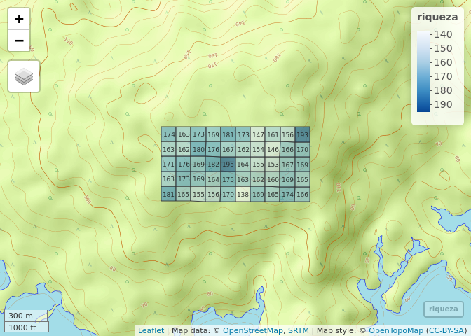
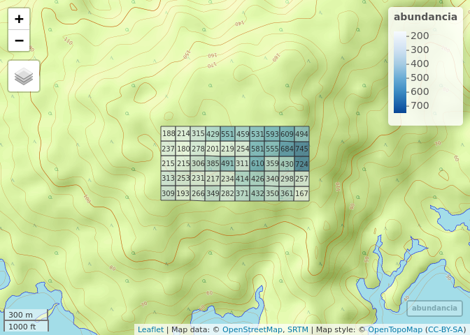
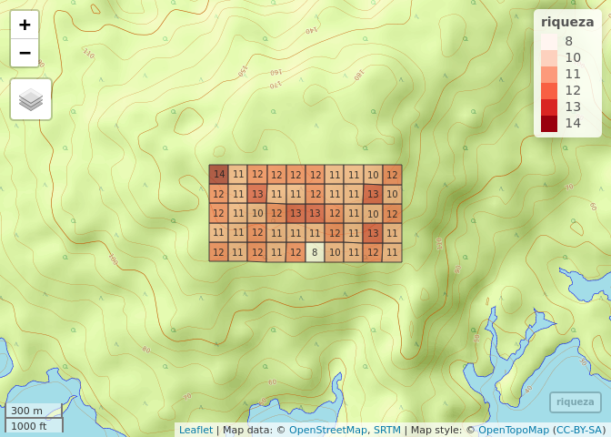

Análisis exploratorio de datos. Mapas de riqueza y abundancia global y
de mi familia
================
JR
25 de octubre, 2020

### Cargar paquetes

``` r
library(mapview)
library(tidyverse)
```

    ## ── Attaching packages ─────────────────────────────── tidyverse 1.2.1 ──

    ## ✓ ggplot2 3.3.2     ✓ purrr   0.3.4
    ## ✓ tibble  3.0.3     ✓ dplyr   0.8.3
    ## ✓ tidyr   1.0.0     ✓ stringr 1.4.0
    ## ✓ readr   1.3.1     ✓ forcats 0.4.0

    ## ── Conflicts ────────────────────────────────── tidyverse_conflicts() ──
    ## x dplyr::filter() masks stats::filter()
    ## x dplyr::lag()    masks stats::lag()

``` r
library(vegan)
```

    ## Loading required package: permute

    ## Loading required package: lattice

    ## This is vegan 2.5-6

``` r
library(sf)
```

    ## Linking to GEOS 3.6.2, GDAL 2.2.3, PROJ 4.9.3

``` r
library(RColorBrewer)
```

### Cargar datos

``` r
load('biodata/matriz_ambiental.Rdata')
load('biodata/Apocynaceae-Meliaceae-Sapotaceae.Rdata')
```

### Explorar el objeto de matriz ambiental

``` r
bci_env_grid
```

    ## Simple feature collection with 50 features and 38 fields
    ## geometry type:  POLYGON
    ## dimension:      XY
    ## bbox:           xmin: 625704 ymin: 1011519 xmax: 626704 ymax: 1012019
    ## epsg (SRID):    32617
    ## proj4string:    +proj=utm +zone=17 +datum=WGS84 +units=m +no_defs
    ## First 10 features:
    ##    id categoria_de_edad geologia  habitat quebrada
    ## 1   1                c3       Tb OldSlope      Yes
    ## 2   2                c3       Tb   OldLow      Yes
    ## 3   3                c3       Tb   OldLow       No
    ## 4   4                c3       Tb   OldLow       No
    ## 5   5                c3       Tb OldSlope       No
    ## 6   6                c3       Tb   OldLow       No
    ## 7   7                c3       Tb   OldLow      Yes
    ## 8   8                c3       Tb   OldLow      Yes
    ## 9   9                c3       Tb   OldLow       No
    ## 10 10                c3       Tb   OldLow       No
    ##    heterogeneidad_ambiental UTM.EW  UTM.NS geomorf_llanura_pct
    ## 1                    0.6272 625754 1011569               10.02
    ## 2                    0.3936 625754 1011669               34.77
    ## 3                    0.0000 625754 1011769                0.00
    ## 4                    0.0000 625754 1011869                0.00
    ## 5                    0.4608 625754 1011969                2.58
    ## 6                    0.0768 625854 1011569                0.00
    ## 7                    0.3808 625854 1011669                0.00
    ## 8                    0.2112 625854 1011769                0.00
    ## 9                    0.0000 625854 1011869                0.00
    ## 10                   0.0000 625854 1011969                1.03
    ##    geomorf_pico_pct geomorf_interfluvio_pct geomorf_hombrera_pct
    ## 1              0.00                    0.83                10.76
    ## 2              0.00                    0.36                10.65
    ## 3              0.00                    0.00                 1.36
    ## 4              0.00                    0.16                 0.00
    ## 5              0.00                    0.00                 1.74
    ## 6              0.17                    3.01                 0.86
    ## 7              0.53                    2.87                 2.99
    ## 8              0.00                    0.00                 0.26
    ## 9              0.00                    0.00                 2.24
    ## 10             0.00                    0.00                 5.83
    ##    geomorf_espolón/gajo_pct geomorf_vertiente_pct geomorf_vaguada_pct
    ## 1                      7.26                 67.07                3.28
    ## 2                      0.64                 47.97                0.57
    ## 3                      5.21                 77.04               12.62
    ## 4                     10.99                 84.18                4.53
    ## 5                      0.00                 93.86                0.17
    ## 6                      5.57                 72.04                8.85
    ## 7                     16.15                 63.48                9.34
    ## 8                      9.53                 88.20                0.35
    ## 9                      6.45                 84.34                3.75
    ## 10                     0.03                 86.46                1.54
    ##    geomorf_piedemonte_pct geomorf_valle_pct geomorf_sima_pct        Al
    ## 1                    0.78              0.00             0.00  901.0908
    ## 2                    4.88              0.16             0.00  954.2488
    ## 3                    0.00              3.77             0.00 1114.1122
    ## 4                    0.00              0.14             0.00 1023.5793
    ## 5                    1.65              0.00             0.00 1001.8848
    ## 6                    1.90              7.60             0.00 1091.4672
    ## 7                    0.19              4.45             0.00 1183.8837
    ## 8                    0.00              1.66             0.00 1256.1447
    ## 9                    0.00              3.11             0.11 1122.3259
    ## 10                   4.82              0.29             0.00 1171.6015
    ##          B       Ca      Cu       Fe         K       Mg       Mn       P
    ## 1  0.79448 1680.021 6.20312 135.2870 141.88128 279.1291 266.9997 1.95248
    ## 2  0.66968 1503.365 6.03148 141.8080 137.23932 280.4524 320.4786 2.24740
    ## 3  0.59516 1182.311 6.79768 157.0878  98.69056 230.3973 445.0708 1.95484
    ## 4  0.56780 1558.020 6.63400 153.1746  98.36412 228.9468 407.7580 2.63444
    ## 5  0.39876 1242.251 6.44428 149.2509  94.07208 202.6820 250.5403 1.86356
    ## 6  0.73120 1441.977 6.49552 173.8682 131.89280 276.5010 477.3249 1.61612
    ## 7  0.34012 1111.443 5.55292 138.2678 117.12156 242.1834 300.6756 2.12696
    ## 8  0.32224 1029.210 6.28208 147.1563 104.30808 184.5147 204.2532 3.10668
    ## 9  0.46360 1230.271 7.17968 153.0034 110.24420 206.6087 414.7284 1.99128
    ## 10 0.31404 1126.864 6.88668 132.5661 104.81508 172.3453 329.6930 1.68548
    ##         Zn        N   N.min.      pH elevacion_media pendiente_media
    ## 1  2.96948 18.46500 -3.88544 4.32432        136.5520       10.226696
    ## 2  2.53208 21.59896  5.64388 4.37548        142.0903        3.047809
    ## 3  2.24672 20.24516 -4.06408 4.34700        137.2355       10.523937
    ## 4  2.44284 20.84232  7.89012 4.46112        143.0398        9.790396
    ## 5  2.13748 16.94500  8.53716 4.40128        154.1270        5.368328
    ## 6  2.63148 20.29812  4.38948 4.57252        123.8959       10.795729
    ## 7  2.15556 20.09600  8.33632 4.55972        138.6581       12.870604
    ## 8  2.07284 21.50216 -0.03472 4.41168        146.2986        7.778736
    ## 9  2.33068 21.43224  0.05456 4.53336        149.0022        7.079292
    ## 10 2.05104 18.28212  7.69104 4.55500        154.7737        4.158707
    ##    orientacion_media curvatura_perfil_media curvatura_tangencial_media
    ## 1           288.3795           0.0028371971               0.0005204064
    ## 2           181.3852           0.0013339481               0.0007514740
    ## 3           164.9017          -0.0008496227              -0.0009649617
    ## 4           221.3076           0.0001992615              -0.0001589584
    ## 5           248.0873           0.0017627041               0.0003943572
    ## 6           244.4480          -0.0031542362              -0.0003680417
    ## 7           218.3005           0.0018408727               0.0003022548
    ## 8           205.6930           0.0011782487               0.0001404646
    ## 9           239.3841           0.0010674261              -0.0011360541
    ## 10          274.6112           0.0003328637              -0.0001897943
    ##                          geometry abundancia_global riqueza_global
    ## 1  POLYGON ((625704 1011519, 6...              4079            181
    ## 2  POLYGON ((625704 1011619, 6...              3800            163
    ## 3  POLYGON ((625704 1011719, 6...              4611            171
    ## 4  POLYGON ((625704 1011819, 6...              3906            163
    ## 5  POLYGON ((625704 1011919, 6...              4549            174
    ## 6  POLYGON ((625804 1011519, 6...              3685            165
    ## 7  POLYGON ((625804 1011619, 6...              4527            173
    ## 8  POLYGON ((625804 1011719, 6...              4376            176
    ## 9  POLYGON ((625804 1011819, 6...              4381            162
    ## 10 POLYGON ((625804 1011919, 6...              4057            163

### Generar mapa de cuadros sin simbología

``` r
mapa_cuadros <- mapView(
  bci_env_grid,
  col.regions = 'grey80',
  alpha.regions = 0.3,
  map.types = 'OpenTopoMap',
  legend = F, zoom = 14,
  zcol = 'id') %>% addStaticLabels() %>%
  leaflet::setView(
    lng = -79.85136,
    lat = 9.15097,
    zoom = 15)
mapa_cuadros
```

<!-- -->

### Paletas

``` r
azul <- colorRampPalette(brewer.pal(8, "Blues"))
rojo <- colorRampPalette(brewer.pal(8, "Reds"))
```

### Mapa de cuadros, simbología por abundancia global

``` r
mapa_cuadros_abun_global <- mapView(
  bci_env_grid,
  layer.name = 'abundancia',
  alpha.regions = 0.6,
  map.types = 'OpenTopoMap',
  legend = T, zoom = 14,
  col.regions = azul,
  zcol = 'abundancia_global') %>%
  addStaticLabels(label = bci_env_grid$abundancia_global, textsize = "7pt") %>%
  leaflet::setView(
    lng = -79.85136,
    lat = 9.15097,
    zoom = 15)
mapa_cuadros_abun_global
```

<!-- -->

### Mapa de cuadros, simbología por riqueza global

``` r
mapa_cuadros_riq_global <- mapView(
  bci_env_grid,
  layer.name = 'riqueza',
  alpha.regions = 0.6,
  map.types = 'OpenTopoMap',
  legend = T, zoom = 14,
  col.regions = azul,
  zcol = 'riqueza_global') %>%
  addStaticLabels(label = bci_env_grid$riqueza_global, textsize = "7pt") %>%
  leaflet::setView(
    lng = -79.85136,
    lat = 9.15097,
    zoom = 15)
mapa_cuadros_riq_global
```

<!-- -->

### Mapa de cuadros, simbología por abundancia de mi familia

``` r
mapa_cuadros_abun_mi_familia <- mapView(
  bci_env_grid %>% mutate(abun = rowSums(mc_apcyn_melic_saptc)),
  layer.name = 'abundancia',
  alpha.regions = 0.6,
  map.types = 'OpenTopoMap',
  legend = T, zoom = 14,
  col.regions = azul,
  zcol = 'abun') %>%
  addStaticLabels(label = rowSums(mc_apcyn_melic_saptc)) %>%
  leaflet::setView(
    lng = -79.85136,
    lat = 9.15097,
    zoom = 15)
mapa_cuadros_abun_mi_familia
```

<!-- -->

### Mapa de cuadros, simbología por riqueza de mi familia

``` r
mapa_cuadros_riq_mi_familia <- mapView(
  bci_env_grid %>% mutate(riq = specnumber(mc_apcyn_melic_saptc)),
  layer.name = 'riqueza',
  alpha.regions = 0.6,
  map.types = 'OpenTopoMap',
  legend = T, zoom = 14,
  col.regions = azul,
  zcol = 'riq') %>%
  addStaticLabels(label = specnumber(mc_apcyn_melic_saptc)) %>%
  leaflet::setView(
    lng = -79.85136,
    lat = 9.15097,
    zoom = 15)
mapa_cuadros_riq_mi_familia
```

<!-- -->
