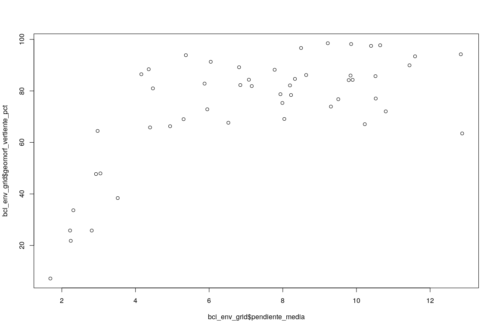
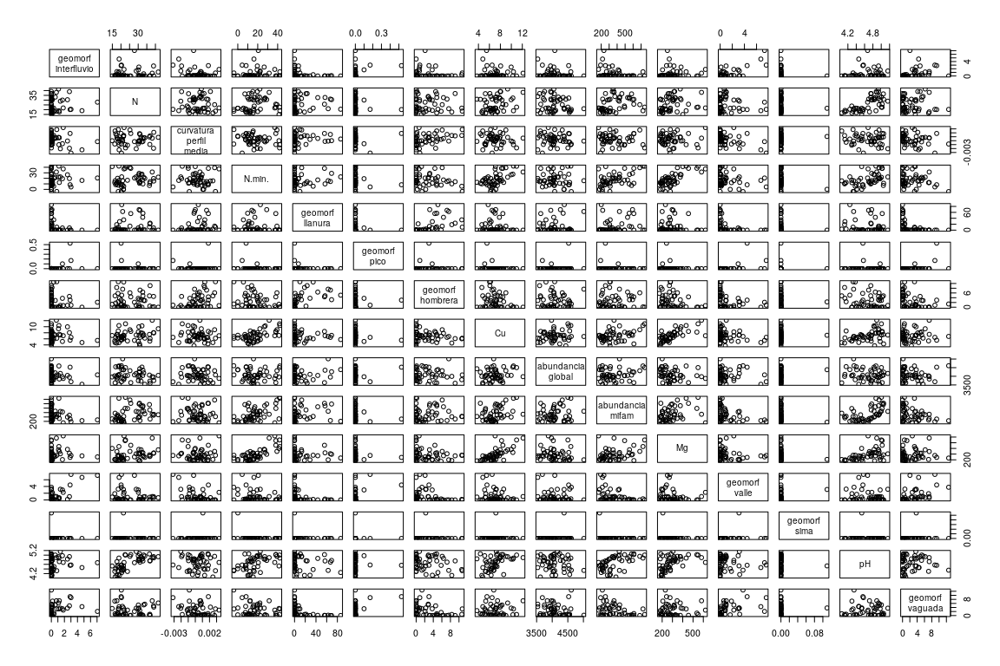
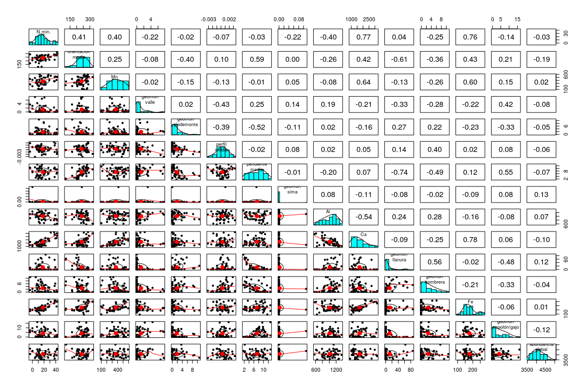
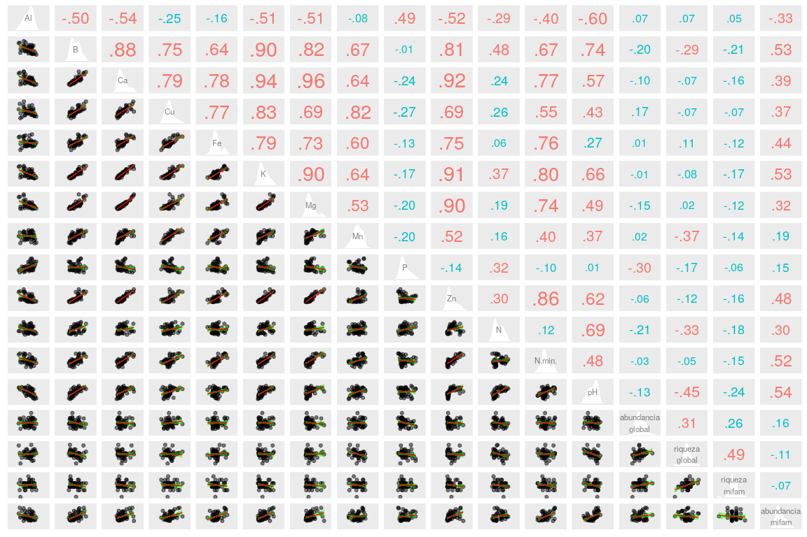
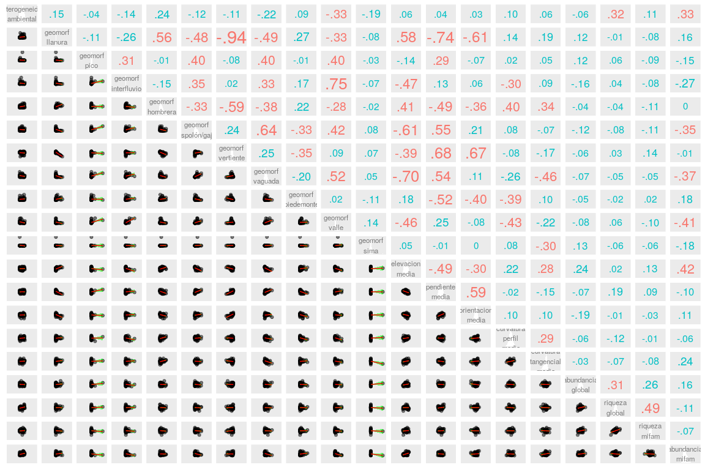
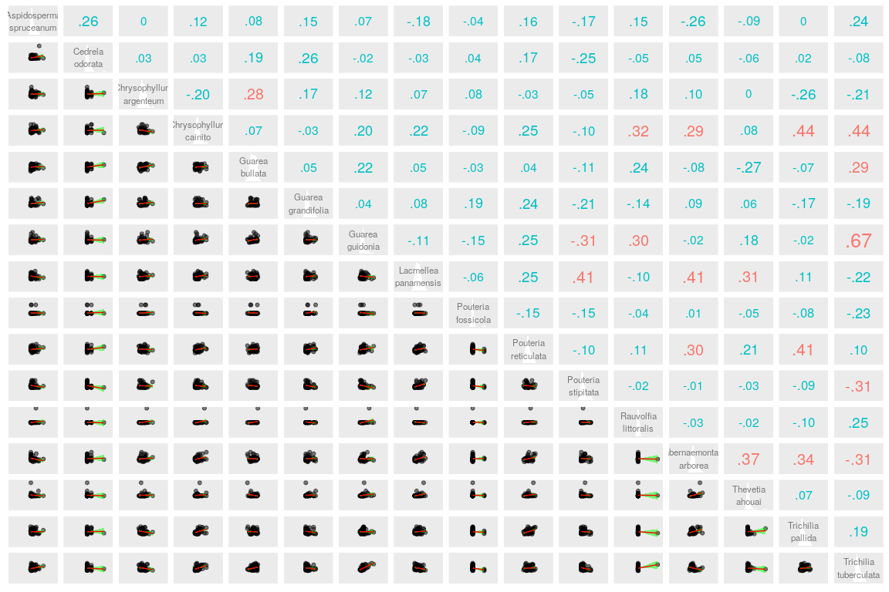

Análisis exploratorio de datos. Correlaciones entre variables
ambientales
================
JR
25 de octubre, 2020

``` r
knitr::opts_chunk$set(fig.width=12, fig.height=8)
```

### Cargar paquetes

``` r
library(tidyverse)
```

    ## ── Attaching packages ──────────────────────────────── tidyverse 1.2.1 ──

    ## ✓ ggplot2 3.3.2     ✓ purrr   0.3.4
    ## ✓ tibble  3.0.3     ✓ dplyr   0.8.3
    ## ✓ tidyr   1.0.0     ✓ stringr 1.4.0
    ## ✓ readr   1.3.1     ✓ forcats 0.4.0

    ## ── Conflicts ─────────────────────────────────── tidyverse_conflicts() ──
    ## x dplyr::filter() masks stats::filter()
    ## x dplyr::lag()    masks stats::lag()

``` r
library(sf)
```

    ## Linking to GEOS 3.6.2, GDAL 2.2.3, PROJ 4.9.3

``` r
library(ez)
```

    ## Registered S3 methods overwritten by 'lme4':
    ##   method                          from
    ##   cooks.distance.influence.merMod car 
    ##   influence.merMod                car 
    ##   dfbeta.influence.merMod         car 
    ##   dfbetas.influence.merMod        car

``` r
library(psych)
```

    ## 
    ## Attaching package: 'psych'

    ## The following objects are masked from 'package:ggplot2':
    ## 
    ##     %+%, alpha

``` r
library(vegan)
```

    ## Loading required package: permute

    ## Loading required package: lattice

    ## This is vegan 2.5-6

### Cargar datos

``` r
load('biodata/matriz_ambiental.Rdata')
load('biodata/Apocynaceae-Meliaceae-Sapotaceae.Rdata')
```

### Una correlación simple

``` r
cor(bci_env_grid$pendiente_media, bci_env_grid$geomorf_vertiente_pct)
```

    ## [1] 0.6807189

``` r
plot(bci_env_grid$pendiente_media, bci_env_grid$geomorf_vertiente_pct)
```

<!-- -->

``` r
cor.test(bci_env_grid$pendiente_media, bci_env_grid$geomorf_vertiente_pct)
```

    ## 
    ##  Pearson's product-moment correlation
    ## 
    ## data:  bci_env_grid$pendiente_media and bci_env_grid$geomorf_vertiente_pct
    ## t = 6.438, df = 48, p-value = 5.353e-08
    ## alternative hypothesis: true correlation is not equal to 0
    ## 95 percent confidence interval:
    ##  0.4964337 0.8062930
    ## sample estimates:
    ##       cor 
    ## 0.6807189

### Generar objeto de columnas numéricas

El objeto que generaré, denominado `env_num`, no tendrá las columnas
`id` y las de coordenadas UTM, y añadiré la abundancia y riqueza de mi
familia. Al mismo tiempo, insertaré un enter (`\n`) en nombres largos de
variables, para acomodar los nombres de variables al panel de
correlaciones; por ejemplo, el nombre `riqueza_global` se renombra a
`riqueza\nglobal`.

``` r
env_num <- bci_env_grid %>%
  dplyr::select_if(is.numeric) %>%
  dplyr::select(-id, -matches('^U.*')) %>% 
  st_drop_geometry %>% 
  mutate(
    riqueza_mifam = specnumber(mc_apcyn_melic_saptc),
    abundancia_mifam = rowSums(mc_apcyn_melic_saptc)) %>% 
  rename_all(gsub, pattern = '_pct$', replacement = '') %>% 
  rename_all(gsub, pattern = '_| ', replacement = '\n')
env_num %>% tibble
```

    ## # A tibble: 50 x 33
    ##    `heterogeneidad… `geomorf\nllanu… `geomorf\npico` `geomorf\ninter…
    ##               <dbl>            <dbl>           <dbl>            <dbl>
    ##  1           0.627             10.0             0                0.83
    ##  2           0.394             34.8             0                0.36
    ##  3           0                  0               0                0   
    ##  4           0                  0               0                0.16
    ##  5           0.461              2.58            0                0   
    ##  6           0.0768             0               0.17             3.01
    ##  7           0.381              0               0.53             2.87
    ##  8           0.211              0               0                0   
    ##  9           0                  0               0                0   
    ## 10           0                  1.03            0                0   
    ## # … with 40 more rows, and 29 more variables: `geomorf\nhombrera` <dbl>,
    ## #   `geomorf\nespolón/gajo` <dbl>, `geomorf\nvertiente` <dbl>,
    ## #   `geomorf\nvaguada` <dbl>, `geomorf\npiedemonte` <dbl>,
    ## #   `geomorf\nvalle` <dbl>, `geomorf\nsima` <dbl>, Al <dbl>, B <dbl>,
    ## #   Ca <dbl>, Cu <dbl>, Fe <dbl>, K <dbl>, Mg <dbl>, Mn <dbl>, P <dbl>,
    ## #   Zn <dbl>, N <dbl>, N.min. <dbl>, pH <dbl>, `elevacion\nmedia` <dbl>,
    ## #   `pendiente\nmedia` <dbl>, `orientacion\nmedia` <dbl>,
    ## #   `curvatura\nperfil\nmedia` <dbl>,
    ## #   `curvatura\ntangencial\nmedia` <dbl>, `abundancia\nglobal` <dbl>,
    ## #   `riqueza\nglobal` <int>, `riqueza\nmifam` <int>,
    ## #   `abundancia\nmifam` <dbl>

### Panel de correlaciones con herramientas del paquete `graphics` y `psych`

``` r
cor(env_num)
```

    ##                              heterogeneidad\nambiental geomorf\nllanura
    ## heterogeneidad\nambiental                   1.00000000      0.151524864
    ## geomorf\nllanura                            0.15152486      1.000000000
    ## geomorf\npico                              -0.03654420     -0.109641620
    ## geomorf\ninterfluvio                       -0.14304975     -0.255075441
    ## geomorf\nhombrera                           0.23813550      0.561238461
    ## geomorf\nespolón/gajo                      -0.12398387     -0.480952664
    ## geomorf\nvertiente                         -0.10760808     -0.936021041
    ## geomorf\nvaguada                           -0.21699655     -0.487426369
    ## geomorf\npiedemonte                         0.09178847      0.274961582
    ## geomorf\nvalle                             -0.33353519     -0.331865574
    ## geomorf\nsima                              -0.18861034     -0.082579485
    ## Al                                         -0.27149563      0.244121544
    ## B                                           0.19427075     -0.018635559
    ## Ca                                          0.17238702     -0.092055467
    ## Cu                                          0.01855075     -0.103503781
    ## Fe                                          0.16340433     -0.022052312
    ## K                                           0.22717845     -0.039636537
    ## Mg                                          0.20298347     -0.072565416
    ## Mn                                         -0.30562256     -0.126246187
    ## P                                           0.04060713      0.251319268
    ## Zn                                          0.16641589     -0.115608323
    ## N                                           0.07505040      0.087968678
    ## N.min.                                      0.23632729      0.037224684
    ## pH                                          0.09997339     -0.116825380
    ## elevacion\nmedia                            0.06331257      0.579192342
    ## pendiente\nmedia                            0.03555621     -0.740593553
    ## orientacion\nmedia                          0.02983155     -0.612554040
    ## curvatura\nperfil\nmedia                    0.09646316      0.135708028
    ## curvatura\ntangencial\nmedia                0.06411283      0.194083963
    ## abundancia\nglobal                         -0.06168971      0.116244242
    ## riqueza\nglobal                             0.31510336     -0.006862305
    ## riqueza\nmifam                              0.11379716     -0.077475193
    ## abundancia\nmifam                           0.32655877      0.159943711
    ##                              geomorf\npico geomorf\ninterfluvio
    ## heterogeneidad\nambiental      -0.03654420         -0.143049752
    ## geomorf\nllanura               -0.10964162         -0.255075441
    ## geomorf\npico                   1.00000000          0.308103451
    ## geomorf\ninterfluvio            0.30810345          1.000000000
    ## geomorf\nhombrera              -0.00860784         -0.152808828
    ## geomorf\nespolón/gajo           0.39850972          0.353972346
    ## geomorf\nvertiente             -0.07504688          0.020958088
    ## geomorf\nvaguada                0.40003315          0.326753499
    ## geomorf\npiedemonte            -0.01497172          0.172704941
    ## geomorf\nvalle                  0.40040992          0.750465523
    ## geomorf\nsima                  -0.02917009         -0.073507631
    ## Al                              0.11389501          0.126915238
    ## B                              -0.21278884         -0.023665928
    ## Ca                             -0.17932617          0.003252645
    ## Cu                             -0.16124349         -0.099900033
    ## Fe                             -0.16612582         -0.061216566
    ## K                              -0.14704695         -0.001820510
    ## Mg                             -0.09941416          0.067016144
    ## Mn                             -0.05668200          0.013736991
    ## P                              -0.11462479          0.014179610
    ## Zn                             -0.17745080         -0.019654920
    ## N                              -0.12480377         -0.002648420
    ## N.min.                         -0.15629847          0.036022385
    ## pH                             -0.03572307          0.066188217
    ## elevacion\nmedia               -0.13903813         -0.465588476
    ## pendiente\nmedia                0.28636708          0.129227630
    ## orientacion\nmedia             -0.06614587          0.063443522
    ## curvatura\nperfil\nmedia        0.01773130         -0.295125619
    ## curvatura\ntangencial\nmedia    0.05066238          0.091776163
    ## abundancia\nglobal              0.12074374         -0.161013568
    ## riqueza\nglobal                 0.06328114          0.038893655
    ## riqueza\nmifam                 -0.08955775         -0.079470281
    ## abundancia\nmifam              -0.14519414         -0.270958214
    ##                              geomorf\nhombrera geomorf\nespolón/gajo
    ## heterogeneidad\nambiental          0.238135497           -0.12398387
    ## geomorf\nllanura                   0.561238461           -0.48095266
    ## geomorf\npico                     -0.008607840            0.39850972
    ## geomorf\ninterfluvio              -0.152808828            0.35397235
    ## geomorf\nhombrera                  1.000000000           -0.32707055
    ## geomorf\nespolón/gajo             -0.327070552            1.00000000
    ## geomorf\nvertiente                -0.592858317            0.23551433
    ## geomorf\nvaguada                  -0.384236993            0.63707377
    ## geomorf\npiedemonte                0.215622001           -0.32770168
    ## geomorf\nvalle                    -0.283749730            0.41866655
    ## geomorf\nsima                     -0.024624821            0.08249440
    ## Al                                 0.280569290           -0.08391235
    ## B                                 -0.222581915            0.01270258
    ## Ca                                -0.252800650            0.06392465
    ## Cu                                -0.225600367            0.05158225
    ## Fe                                -0.211737952           -0.05978654
    ## K                                 -0.205025010            0.02837884
    ## Mg                                -0.244042191            0.03699867
    ## Mn                                -0.257149747            0.15298517
    ## P                                  0.167838995           -0.16089946
    ## Zn                                -0.277611620           -0.03479949
    ## N                                 -0.032411804            0.05944339
    ## N.min.                            -0.252475415           -0.13721190
    ## pH                                -0.244830570            0.10214918
    ## elevacion\nmedia                   0.411419405           -0.60733390
    ## pendiente\nmedia                  -0.492137643            0.54627099
    ## orientacion\nmedia                -0.357363104            0.21471119
    ## curvatura\nperfil\nmedia           0.399221532            0.08274536
    ## curvatura\ntangencial\nmedia       0.337714833           -0.06697925
    ## abundancia\nglobal                -0.035692226           -0.12071081
    ## riqueza\nglobal                   -0.040911724           -0.07894605
    ## riqueza\nmifam                    -0.106170120           -0.11111560
    ## abundancia\nmifam                 -0.004192019           -0.34757532
    ##                              geomorf\nvertiente geomorf\nvaguada
    ## heterogeneidad\nambiental           -0.10760808      -0.21699655
    ## geomorf\nllanura                    -0.93602104      -0.48742637
    ## geomorf\npico                       -0.07504688       0.40003315
    ## geomorf\ninterfluvio                 0.02095809       0.32675350
    ## geomorf\nhombrera                   -0.59285832      -0.38423699
    ## geomorf\nespolón/gajo                0.23551433       0.63707377
    ## geomorf\nvertiente                   1.00000000       0.25008564
    ## geomorf\nvaguada                     0.25008564       1.00000000
    ## geomorf\npiedemonte                 -0.34833083      -0.19694394
    ## geomorf\nvalle                       0.08991290       0.52084271
    ## geomorf\nsima                        0.06931148       0.04902976
    ## Al                                  -0.29103641      -0.08671349
    ## B                                    0.07541835       0.02862928
    ## Ca                                   0.15242065       0.01582037
    ## Cu                                   0.16352528       0.05164722
    ## Fe                                   0.12888217      -0.10779374
    ## K                                    0.10133494      -0.04691053
    ## Mg                                   0.11937587       0.04714160
    ## Mn                                   0.11756740       0.26893068
    ## P                                   -0.22247111      -0.24929779
    ## Zn                                   0.20345965      -0.06494723
    ## N                                   -0.10540213      -0.03510175
    ## N.min.                               0.07303652      -0.21215806
    ## pH                                   0.12164270       0.01501369
    ## elevacion\nmedia                    -0.39159435      -0.69508470
    ## pendiente\nmedia                     0.68071889       0.54308434
    ## orientacion\nmedia                   0.67362509       0.11410368
    ## curvatura\nperfil\nmedia            -0.07751324      -0.25860336
    ## curvatura\ntangencial\nmedia        -0.17018330      -0.46000188
    ## abundancia\nglobal                  -0.05923980      -0.07347329
    ## riqueza\nglobal                      0.02976364      -0.04758248
    ## riqueza\nmifam                       0.13512138      -0.04908185
    ## abundancia\nmifam                   -0.01153059      -0.37247424
    ##                              geomorf\npiedemonte geomorf\nvalle
    ## heterogeneidad\nambiental             0.09178847    -0.33353519
    ## geomorf\nllanura                      0.27496158    -0.33186557
    ## geomorf\npico                        -0.01497172     0.40040992
    ## geomorf\ninterfluvio                  0.17270494     0.75046552
    ## geomorf\nhombrera                     0.21562200    -0.28374973
    ## geomorf\nespolón/gajo                -0.32770168     0.41866655
    ## geomorf\nvertiente                   -0.34833083     0.08991290
    ## geomorf\nvaguada                     -0.19694394     0.52084271
    ## geomorf\npiedemonte                   1.00000000     0.02060817
    ## geomorf\nvalle                        0.02060817     1.00000000
    ## geomorf\nsima                        -0.10619848     0.14266921
    ## Al                                    0.02135501     0.19202457
    ## B                                    -0.07616967    -0.23190072
    ## Ca                                   -0.15932328    -0.20592804
    ## Cu                                   -0.13522881    -0.22734564
    ## Fe                                   -0.23185844    -0.21950277
    ## K                                    -0.08038514    -0.23896533
    ## Mg                                   -0.14097605    -0.13422011
    ## Mn                                   -0.15162562    -0.01642899
    ## P                                     0.08099726    -0.05271346
    ## Zn                                   -0.05032912    -0.24728698
    ## N                                     0.23602181    -0.15618613
    ## N.min.                               -0.02133486    -0.22032792
    ## pH                                    0.14236339    -0.10015029
    ## elevacion\nmedia                      0.17620175    -0.45748568
    ## pendiente\nmedia                     -0.52361874     0.24758747
    ## orientacion\nmedia                   -0.40175443    -0.07864133
    ## curvatura\nperfil\nmedia             -0.38621713    -0.42638717
    ## curvatura\ntangencial\nmedia          0.10340999    -0.21810652
    ## abundancia\nglobal                   -0.04849105    -0.07964416
    ## riqueza\nglobal                      -0.02283868     0.05659044
    ## riqueza\nmifam                        0.02423369    -0.10226550
    ## abundancia\nmifam                     0.17909252    -0.41377051
    ##                              geomorf\nsima          Al           B
    ## heterogeneidad\nambiental     -0.188610345 -0.27149563  0.19427075
    ## geomorf\nllanura              -0.082579485  0.24412154 -0.01863556
    ## geomorf\npico                 -0.029170089  0.11389501 -0.21278884
    ## geomorf\ninterfluvio          -0.073507631  0.12691524 -0.02366593
    ## geomorf\nhombrera             -0.024624821  0.28056929 -0.22258191
    ## geomorf\nespolón/gajo          0.082494401 -0.08391235  0.01270258
    ## geomorf\nvertiente             0.069311484 -0.29103641  0.07541835
    ## geomorf\nvaguada               0.049029758 -0.08671349  0.02862928
    ## geomorf\npiedemonte           -0.106198484  0.02135501 -0.07616967
    ## geomorf\nvalle                 0.142669210  0.19202457 -0.23190072
    ## geomorf\nsima                  1.000000000  0.07971805 -0.14821374
    ## Al                             0.079718048  1.00000000 -0.50347841
    ## B                             -0.148213739 -0.50347841  1.00000000
    ## Ca                            -0.114744379 -0.54452387  0.87815297
    ## Cu                             0.008776089 -0.25070103  0.74913795
    ## Fe                            -0.090390519 -0.15642725  0.64345967
    ## K                             -0.129660660 -0.50560944  0.90414820
    ## Mg                            -0.120791313 -0.51424122  0.82043770
    ## Mn                             0.051158338 -0.07583613  0.66839009
    ## P                             -0.093332430  0.49363244 -0.01014299
    ## Zn                            -0.134454628 -0.51873942  0.81370011
    ## N                             -0.086336446 -0.28655605  0.47690784
    ## N.min.                        -0.216760183 -0.39691802  0.67200651
    ## pH                            -0.064828355 -0.60443747  0.74248234
    ## elevacion\nmedia               0.054322119  0.28458834 -0.05511810
    ## pendiente\nmedia              -0.007504468 -0.19728212 -0.01426481
    ## orientacion\nmedia             0.004044733 -0.26371760  0.30122137
    ## curvatura\nperfil\nmedia       0.076451432  0.02181939 -0.01891267
    ## curvatura\ntangencial\nmedia  -0.298662474  0.17685018  0.06359353
    ## abundancia\nglobal             0.129527346  0.07138538 -0.19904043
    ## riqueza\nglobal               -0.064717336  0.06654608 -0.29125946
    ## riqueza\nmifam                -0.062656960  0.05007771 -0.21268556
    ## abundancia\nmifam             -0.177078660 -0.33355046  0.53000838
    ##                                        Ca           Cu          Fe
    ## heterogeneidad\nambiental     0.172387017  0.018550746  0.16340433
    ## geomorf\nllanura             -0.092055467 -0.103503781 -0.02205231
    ## geomorf\npico                -0.179326174 -0.161243488 -0.16612582
    ## geomorf\ninterfluvio          0.003252645 -0.099900033 -0.06121657
    ## geomorf\nhombrera            -0.252800650 -0.225600367 -0.21173795
    ## geomorf\nespolón/gajo         0.063924655  0.051582252 -0.05978654
    ## geomorf\nvertiente            0.152420655  0.163525278  0.12888217
    ## geomorf\nvaguada              0.015820367  0.051647221 -0.10779374
    ## geomorf\npiedemonte          -0.159323283 -0.135228814 -0.23185844
    ## geomorf\nvalle               -0.205928035 -0.227345636 -0.21950277
    ## geomorf\nsima                -0.114744379  0.008776089 -0.09039052
    ## Al                           -0.544523865 -0.250701031 -0.15642725
    ## B                             0.878152969  0.749137949  0.64345967
    ## Ca                            1.000000000  0.787673417  0.77764845
    ## Cu                            0.787673417  1.000000000  0.76624250
    ## Fe                            0.777648448  0.766242498  1.00000000
    ## K                             0.944666190  0.831981939  0.79115651
    ## Mg                            0.962838215  0.692275397  0.72934911
    ## Mn                            0.636904505  0.816537823  0.59606051
    ## P                            -0.242380907 -0.270836600 -0.13105265
    ## Zn                            0.920899454  0.688356193  0.74619122
    ## N                             0.237657927  0.257658860  0.06189394
    ## N.min.                        0.773502886  0.553455539  0.75853270
    ## pH                            0.565700873  0.428919701  0.26758899
    ## elevacion\nmedia             -0.117590318 -0.018296881  0.06494292
    ## pendiente\nmedia              0.072329746 -0.038624541  0.11789032
    ## orientacion\nmedia            0.417586392  0.309596084  0.42865043
    ## curvatura\nperfil\nmedia      0.045624214 -0.083539359  0.01712172
    ## curvatura\ntangencial\nmedia  0.075363856  0.042900605  0.21786085
    ## abundancia\nglobal           -0.095685049  0.172648319  0.01240196
    ## riqueza\nglobal              -0.071523626 -0.071502754  0.10690478
    ## riqueza\nmifam               -0.157449384 -0.072746427 -0.11873894
    ## abundancia\nmifam             0.393813085  0.374329606  0.44247377
    ##                                        K          Mg          Mn
    ## heterogeneidad\nambiental     0.22717845  0.20298347 -0.30562256
    ## geomorf\nllanura             -0.03963654 -0.07256542 -0.12624619
    ## geomorf\npico                -0.14704695 -0.09941416 -0.05668200
    ## geomorf\ninterfluvio         -0.00182051  0.06701614  0.01373699
    ## geomorf\nhombrera            -0.20502501 -0.24404219 -0.25714975
    ## geomorf\nespolón/gajo         0.02837884  0.03699867  0.15298517
    ## geomorf\nvertiente            0.10133494  0.11937587  0.11756740
    ## geomorf\nvaguada             -0.04691053  0.04714160  0.26893068
    ## geomorf\npiedemonte          -0.08038514 -0.14097605 -0.15162562
    ## geomorf\nvalle               -0.23896533 -0.13422011 -0.01642899
    ## geomorf\nsima                -0.12966066 -0.12079131  0.05115834
    ## Al                           -0.50560944 -0.51424122 -0.07583613
    ## B                             0.90414820  0.82043770  0.66839009
    ## Ca                            0.94466619  0.96283822  0.63690450
    ## Cu                            0.83198194  0.69227540  0.81653782
    ## Fe                            0.79115651  0.72934911  0.59606051
    ## K                             1.00000000  0.89688762  0.63664079
    ## Mg                            0.89688762  1.00000000  0.53142418
    ## Mn                            0.63664079  0.53142418  1.00000000
    ## P                            -0.16825669 -0.20450010 -0.19874380
    ## Zn                            0.90857572  0.89532380  0.52468590
    ## N                             0.36521225  0.18869464  0.15825867
    ## N.min.                        0.79549169  0.74036330  0.39833956
    ## pH                            0.66312291  0.49273905  0.36864997
    ## elevacion\nmedia             -0.04044154 -0.13581675 -0.09803146
    ## pendiente\nmedia              0.03668027  0.10955172 -0.01253161
    ## orientacion\nmedia            0.37123003  0.38014243  0.25049357
    ## curvatura\nperfil\nmedia     -0.02371649  0.02529640 -0.12522378
    ## curvatura\ntangencial\nmedia  0.17009028  0.01292878  0.01955491
    ## abundancia\nglobal           -0.01265411 -0.14965464  0.01619581
    ## riqueza\nglobal              -0.07693286  0.02044371 -0.36690038
    ## riqueza\nmifam               -0.16596207 -0.12131782 -0.13567974
    ## abundancia\nmifam             0.52528715  0.32452391  0.18626132
    ##                                        P          Zn            N
    ## heterogeneidad\nambiental     0.04060713  0.16641589  0.075050400
    ## geomorf\nllanura              0.25131927 -0.11560832  0.087968678
    ## geomorf\npico                -0.11462479 -0.17745080 -0.124803772
    ## geomorf\ninterfluvio          0.01417961 -0.01965492 -0.002648420
    ## geomorf\nhombrera             0.16783900 -0.27761162 -0.032411804
    ## geomorf\nespolón/gajo        -0.16089946 -0.03479949  0.059443388
    ## geomorf\nvertiente           -0.22247111  0.20345965 -0.105402133
    ## geomorf\nvaguada             -0.24929779 -0.06494723 -0.035101750
    ## geomorf\npiedemonte           0.08099726 -0.05032912  0.236021810
    ## geomorf\nvalle               -0.05271346 -0.24728698 -0.156186127
    ## geomorf\nsima                -0.09333243 -0.13445463 -0.086336446
    ## Al                            0.49363244 -0.51873942 -0.286556052
    ## B                            -0.01014299  0.81370011  0.476907839
    ## Ca                           -0.24238091  0.92089945  0.237657927
    ## Cu                           -0.27083660  0.68835619  0.257658860
    ## Fe                           -0.13105265  0.74619122  0.061893935
    ## K                            -0.16825669  0.90857572  0.365212252
    ## Mg                           -0.20450010  0.89532380  0.188694642
    ## Mn                           -0.19874380  0.52468590  0.158258671
    ## P                             1.00000000 -0.13570664  0.318125934
    ## Zn                           -0.13570664  1.00000000  0.304006729
    ## N                             0.31812593  0.30400673  1.000000000
    ## N.min.                       -0.10479958  0.85888106  0.123128181
    ## pH                            0.01424687  0.62499689  0.694479259
    ## elevacion\nmedia              0.36659765 -0.02297804  0.092828852
    ## pendiente\nmedia             -0.12604281  0.07913069 -0.140409705
    ## orientacion\nmedia           -0.11283696  0.45254792 -0.097494591
    ## curvatura\nperfil\nmedia      0.11213029  0.01139772 -0.003492053
    ## curvatura\ntangencial\nmedia  0.16331615  0.13208418  0.034575585
    ## abundancia\nglobal           -0.30243805 -0.06212955 -0.212204373
    ## riqueza\nglobal              -0.16664231 -0.11913960 -0.331726481
    ## riqueza\nmifam               -0.06188383 -0.15936666 -0.181564110
    ## abundancia\nmifam             0.15004652  0.48055162  0.301319208
    ##                                   N.min.           pH elevacion\nmedia
    ## heterogeneidad\nambiental     0.23632729  0.099973386      0.063312569
    ## geomorf\nllanura              0.03722468 -0.116825380      0.579192342
    ## geomorf\npico                -0.15629847 -0.035723074     -0.139038128
    ## geomorf\ninterfluvio          0.03602238  0.066188217     -0.465588476
    ## geomorf\nhombrera            -0.25247542 -0.244830570      0.411419405
    ## geomorf\nespolón/gajo        -0.13721190  0.102149178     -0.607333903
    ## geomorf\nvertiente            0.07303652  0.121642703     -0.391594352
    ## geomorf\nvaguada             -0.21215806  0.015013688     -0.695084696
    ## geomorf\npiedemonte          -0.02133486  0.142363385      0.176201751
    ## geomorf\nvalle               -0.22032792 -0.100150288     -0.457485680
    ## geomorf\nsima                -0.21676018 -0.064828355      0.054322119
    ## Al                           -0.39691802 -0.604437472      0.284588339
    ## B                             0.67200651  0.742482340     -0.055118104
    ## Ca                            0.77350289  0.565700873     -0.117590318
    ## Cu                            0.55345554  0.428919701     -0.018296881
    ## Fe                            0.75853270  0.267588986      0.064942920
    ## K                             0.79549169  0.663122908     -0.040441540
    ## Mg                            0.74036330  0.492739048     -0.135816747
    ## Mn                            0.39833956  0.368649968     -0.098031455
    ## P                            -0.10479958  0.014246866      0.366597651
    ## Zn                            0.85888106  0.624996888     -0.022978042
    ## N                             0.12312818  0.694479259      0.092828852
    ## N.min.                        1.00000000  0.483098323      0.027571634
    ## pH                            0.48309832  1.000000000     -0.008068715
    ## elevacion\nmedia              0.02757163 -0.008068715      1.000000000
    ## pendiente\nmedia             -0.02631982  0.008319740     -0.487801537
    ## orientacion\nmedia            0.41046657  0.201153575     -0.304609855
    ## curvatura\nperfil\nmedia     -0.06909559 -0.097126137      0.217078557
    ## curvatura\ntangencial\nmedia  0.21940799  0.128791933      0.284896500
    ## abundancia\nglobal           -0.03284162 -0.125324627      0.241934953
    ## riqueza\nglobal              -0.04803748 -0.449850123      0.024060472
    ## riqueza\nmifam               -0.15169450 -0.239394938      0.134867822
    ## abundancia\nmifam             0.51777807  0.544914458      0.418387160
    ##                              pendiente\nmedia orientacion\nmedia
    ## heterogeneidad\nambiental         0.035556209        0.029831553
    ## geomorf\nllanura                 -0.740593553       -0.612554040
    ## geomorf\npico                     0.286367081       -0.066145868
    ## geomorf\ninterfluvio              0.129227630        0.063443522
    ## geomorf\nhombrera                -0.492137643       -0.357363104
    ## geomorf\nespolón/gajo             0.546270987        0.214711188
    ## geomorf\nvertiente                0.680718892        0.673625088
    ## geomorf\nvaguada                  0.543084342        0.114103684
    ## geomorf\npiedemonte              -0.523618742       -0.401754434
    ## geomorf\nvalle                    0.247587465       -0.078641331
    ## geomorf\nsima                    -0.007504468        0.004044733
    ## Al                               -0.197282121       -0.263717595
    ## B                                -0.014264814        0.301221373
    ## Ca                                0.072329746        0.417586392
    ## Cu                               -0.038624541        0.309596084
    ## Fe                                0.117890319        0.428650425
    ## K                                 0.036680268        0.371230031
    ## Mg                                0.109551718        0.380142426
    ## Mn                               -0.012531606        0.250493570
    ## P                                -0.126042812       -0.112836962
    ## Zn                                0.079130685        0.452547917
    ## N                                -0.140409705       -0.097494591
    ## N.min.                           -0.026319824        0.410466566
    ## pH                                0.008319740        0.201153575
    ## elevacion\nmedia                 -0.487801537       -0.304609855
    ## pendiente\nmedia                  1.000000000        0.593527338
    ## orientacion\nmedia                0.593527338        1.000000000
    ## curvatura\nperfil\nmedia         -0.019511293        0.101754097
    ## curvatura\ntangencial\nmedia     -0.152896236        0.104616226
    ## abundancia\nglobal               -0.071502767       -0.193145207
    ## riqueza\nglobal                   0.188287528       -0.009676424
    ## riqueza\nmifam                    0.094411147       -0.029227097
    ## abundancia\nmifam                -0.095112898        0.109045413
    ##                              curvatura\nperfil\nmedia
    ## heterogeneidad\nambiental                 0.096463156
    ## geomorf\nllanura                          0.135708028
    ## geomorf\npico                             0.017731300
    ## geomorf\ninterfluvio                     -0.295125619
    ## geomorf\nhombrera                         0.399221532
    ## geomorf\nespolón/gajo                     0.082745358
    ## geomorf\nvertiente                       -0.077513245
    ## geomorf\nvaguada                         -0.258603359
    ## geomorf\npiedemonte                      -0.386217125
    ## geomorf\nvalle                           -0.426387170
    ## geomorf\nsima                             0.076451432
    ## Al                                        0.021819389
    ## B                                        -0.018912669
    ## Ca                                        0.045624214
    ## Cu                                       -0.083539359
    ## Fe                                        0.017121720
    ## K                                        -0.023716491
    ## Mg                                        0.025296401
    ## Mn                                       -0.125223781
    ## P                                         0.112130286
    ## Zn                                        0.011397719
    ## N                                        -0.003492053
    ## N.min.                                   -0.069095587
    ## pH                                       -0.097126137
    ## elevacion\nmedia                          0.217078557
    ## pendiente\nmedia                         -0.019511293
    ## orientacion\nmedia                        0.101754097
    ## curvatura\nperfil\nmedia                  1.000000000
    ## curvatura\ntangencial\nmedia              0.290315358
    ## abundancia\nglobal                       -0.064653310
    ## riqueza\nglobal                          -0.124226167
    ## riqueza\nmifam                           -0.008137301
    ## abundancia\nmifam                        -0.058620662
    ##                              curvatura\ntangencial\nmedia
    ## heterogeneidad\nambiental                      0.06411283
    ## geomorf\nllanura                               0.19408396
    ## geomorf\npico                                  0.05066238
    ## geomorf\ninterfluvio                           0.09177616
    ## geomorf\nhombrera                              0.33771483
    ## geomorf\nespolón/gajo                         -0.06697925
    ## geomorf\nvertiente                            -0.17018330
    ## geomorf\nvaguada                              -0.46000188
    ## geomorf\npiedemonte                            0.10340999
    ## geomorf\nvalle                                -0.21810652
    ## geomorf\nsima                                 -0.29866247
    ## Al                                             0.17685018
    ## B                                              0.06359353
    ## Ca                                             0.07536386
    ## Cu                                             0.04290060
    ## Fe                                             0.21786085
    ## K                                              0.17009028
    ## Mg                                             0.01292878
    ## Mn                                             0.01955491
    ## P                                              0.16331615
    ## Zn                                             0.13208418
    ## N                                              0.03457558
    ## N.min.                                         0.21940799
    ## pH                                             0.12879193
    ## elevacion\nmedia                               0.28489650
    ## pendiente\nmedia                              -0.15289624
    ## orientacion\nmedia                             0.10461623
    ## curvatura\nperfil\nmedia                       0.29031536
    ## curvatura\ntangencial\nmedia                   1.00000000
    ## abundancia\nglobal                            -0.02910432
    ## riqueza\nglobal                               -0.07497277
    ## riqueza\nmifam                                -0.08121611
    ## abundancia\nmifam                              0.23776630
    ##                              abundancia\nglobal riqueza\nglobal
    ## heterogeneidad\nambiental           -0.06168971     0.315103360
    ## geomorf\nllanura                     0.11624424    -0.006862305
    ## geomorf\npico                        0.12074374     0.063281144
    ## geomorf\ninterfluvio                -0.16101357     0.038893655
    ## geomorf\nhombrera                   -0.03569223    -0.040911724
    ## geomorf\nespolón/gajo               -0.12071081    -0.078946049
    ## geomorf\nvertiente                  -0.05923980     0.029763636
    ## geomorf\nvaguada                    -0.07347329    -0.047582484
    ## geomorf\npiedemonte                 -0.04849105    -0.022838681
    ## geomorf\nvalle                      -0.07964416     0.056590441
    ## geomorf\nsima                        0.12952735    -0.064717336
    ## Al                                   0.07138538     0.066546083
    ## B                                   -0.19904043    -0.291259455
    ## Ca                                  -0.09568505    -0.071523626
    ## Cu                                   0.17264832    -0.071502754
    ## Fe                                   0.01240196     0.106904783
    ## K                                   -0.01265411    -0.076932864
    ## Mg                                  -0.14965464     0.020443705
    ## Mn                                   0.01619581    -0.366900376
    ## P                                   -0.30243805    -0.166642310
    ## Zn                                  -0.06212955    -0.119139602
    ## N                                   -0.21220437    -0.331726481
    ## N.min.                              -0.03284162    -0.048037477
    ## pH                                  -0.12532463    -0.449850123
    ## elevacion\nmedia                     0.24193495     0.024060472
    ## pendiente\nmedia                    -0.07150277     0.188287528
    ## orientacion\nmedia                  -0.19314521    -0.009676424
    ## curvatura\nperfil\nmedia            -0.06465331    -0.124226167
    ## curvatura\ntangencial\nmedia        -0.02910432    -0.074972772
    ## abundancia\nglobal                   1.00000000     0.306348924
    ## riqueza\nglobal                      0.30634892     1.000000000
    ## riqueza\nmifam                       0.26314176     0.487175847
    ## abundancia\nmifam                    0.15685877    -0.114302982
    ##                              riqueza\nmifam abundancia\nmifam
    ## heterogeneidad\nambiental       0.113797163       0.326558773
    ## geomorf\nllanura               -0.077475193       0.159943711
    ## geomorf\npico                  -0.089557747      -0.145194137
    ## geomorf\ninterfluvio           -0.079470281      -0.270958214
    ## geomorf\nhombrera              -0.106170120      -0.004192019
    ## geomorf\nespolón/gajo          -0.111115598      -0.347575323
    ## geomorf\nvertiente              0.135121380      -0.011530593
    ## geomorf\nvaguada               -0.049081849      -0.372474237
    ## geomorf\npiedemonte             0.024233686       0.179092520
    ## geomorf\nvalle                 -0.102265500      -0.413770506
    ## geomorf\nsima                  -0.062656960      -0.177078660
    ## Al                              0.050077708      -0.333550463
    ## B                              -0.212685562       0.530008381
    ## Ca                             -0.157449384       0.393813085
    ## Cu                             -0.072746427       0.374329606
    ## Fe                             -0.118738944       0.442473771
    ## K                              -0.165962071       0.525287152
    ## Mg                             -0.121317821       0.324523911
    ## Mn                             -0.135679736       0.186261318
    ## P                              -0.061883829       0.150046517
    ## Zn                             -0.159366659       0.480551622
    ## N                              -0.181564110       0.301319208
    ## N.min.                         -0.151694496       0.517778071
    ## pH                             -0.239394938       0.544914458
    ## elevacion\nmedia                0.134867822       0.418387160
    ## pendiente\nmedia                0.094411147      -0.095112898
    ## orientacion\nmedia             -0.029227097       0.109045413
    ## curvatura\nperfil\nmedia       -0.008137301      -0.058620662
    ## curvatura\ntangencial\nmedia   -0.081216113       0.237766299
    ## abundancia\nglobal              0.263141763       0.156858771
    ## riqueza\nglobal                 0.487175847      -0.114302982
    ## riqueza\nmifam                  1.000000000      -0.066386461
    ## abundancia\nmifam              -0.066386461       1.000000000

``` r
ncol(env_num)
```

    ## [1] 33

``` r
pairs(env_num[,sample(1:33, 15)]) # paquete graphics
```

<!-- -->

``` r
env_num[,sample(1:33, 15)] %>% pairs.panels #paquete psych
```

<!-- -->

### Panel de correlaciones con `ez`

#### Todas las variables (se empasta). Comentado, sólo mostrado para fines didácticos

``` r
# p_cor_todos <- env_num %>%
#   ezCor(r_size_lims = c(4,8), label_size = 4)
# p_cor_todos
```

#### Sólo suelo (elementos y pH), abundancia/riqueza

``` r
p_cor_suelo_ar <- env_num %>%
  dplyr::select(matches('^[A-T,Z]|abundancia|riqueza|^pH$', ignore.case = F)) %>%
  ezCor(r_size_lims = c(4,8), label_size = 3)
p_cor_suelo_ar
```

    ## `geom_smooth()` using formula 'y ~ x'
    ## `geom_smooth()` using formula 'y ~ x'

<!-- -->

#### Sólo heterogeneidad, geomorfologia, abundancia/riqueza

``` r
p_cor_geomorf_ar <- env_num %>%
  dplyr::select(-matches('^[A-T,Z]|pH', ignore.case = F)) %>%
  ezCor(r_size_lims = c(4,8), label_size = 3)
p_cor_geomorf_ar
```

    ## `geom_smooth()` using formula 'y ~ x'
    ## `geom_smooth()` using formula 'y ~ x'

<!-- -->

#### Matriz de comunidad

``` r
p_cor_mc <- mc_apcyn_melic_saptc %>%
  rename_all(gsub, pattern = '_| ', replacement = '\n') %>% 
  ezCor(r_size_lims = c(4,8), label_size = 3)
p_cor_mc
```

    ## `geom_smooth()` using formula 'y ~ x'
    ## `geom_smooth()` using formula 'y ~ x'

<!-- -->
