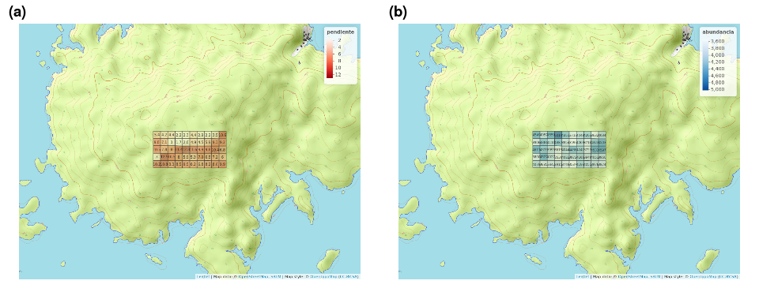

Cómo integrar varias imágenes (e.g. gráficos, fotos, mapas) en una sola (aka 'panel')
================
JR
8 de enero, 2021

``` r
knitr::opts_chunk$set(fig.width=10, fig.height=4)
```

Cargar paquetes
---------------

``` r
library(cowplot)
```

    ## 
    ## ********************************************************

    ## Note: As of version 1.0.0, cowplot does not change the

    ##   default ggplot2 theme anymore. To recover the previous

    ##   behavior, execute:
    ##   theme_set(theme_cowplot())

    ## ********************************************************

``` r
library(ggplot2)
library(magick) #En caso de error, "sudo apt install libmagick++-dev"
```

    ## Linking to ImageMagick 6.9.7.4
    ## Enabled features: fontconfig, freetype, fftw, lcms, pango, x11
    ## Disabled features: cairo, ghostscript, rsvg, webp

    ## Using 8 threads

Sin usar función ("didáctico")
------------------------------

``` r
pngs <- list.files(pattern='*.png')
sample(pngs, 3)
```

    ## [1] "mapas_variables_ambientales_numericas_tmap.png"  
    ## [2] "matriz_correlacion_geomorf_abun_riq_spearman.png"
    ## [3] "mapa_upgma_k2.png"

### Creación repetitiva de gráficos

> *Sorry, "Don't repeat yourself"*

``` r
p1 <- ggdraw() + draw_image(pngs[1], scale = 0.9)
p2 <- ggdraw() + draw_image(pngs[2], scale = 0.9)
p3 <- ggdraw() + draw_image(pngs[3], scale = 0.9)
```

### Generar JPG

``` r
jpeg('ejemplo_de_panel_varios_plots.jpg', width = 1920, height = 540, res = 150)
plot_grid(p1, p2, p3, labels = c('(a)','(b)','(c)'), nrow = 1)
dev.off()
```

    ## png 
    ##   2

Usando función `crear_panel`
----------------------------

> *"Don't repeat yourself"*

Primero, cargar la función:

Desde un clon del repo `scripts-de-analisis-BCI`

``` r
source('biodata/funciones.R')
```

Desde cualquier lugar

``` r
devtools::source_url('https://raw.githubusercontent.com/biogeografia-master/scripts-de-analisis-BCI/master/biodata/funciones.R')
```

    ## SHA-1 hash of file is b0dc507338fe6a7d927760b5a7a06b2612b753c7

Ejecutar

``` r
crear_panel('mapa_cuadros_pendiente.png', 'mapa_cuadros_abun_global.png')
```



Guardar en archivo de salida

``` r
jpeg('ejemplo_de_panel_varios_plots.jpg', width = 1080, height = 500, res = 175)
crear_panel('mapa_cuadros_pendiente.png', 'mapa_cuadros_abun_global.png')
dev.off()
```

    ## png 
    ##   2
