Análisis de diversidad. <br> Parte 1: Diversidad alpha
================
JR
29 de noviembre, 2020

``` r
knitr::opts_chunk$set(fig.width=12, fig.height=8)
```

## Preámbulo

### Cargar paquetes

``` r
library(vegan)
```

    ## Loading required package: permute

    ## Loading required package: lattice

    ## This is vegan 2.5-6

``` r
library(adespatial)
```

    ## Registered S3 methods overwritten by 'adegraphics':
    ##   method         from
    ##   biplot.dudi    ade4
    ##   kplot.foucart  ade4
    ##   kplot.mcoa     ade4
    ##   kplot.mfa      ade4
    ##   kplot.pta      ade4
    ##   kplot.sepan    ade4
    ##   kplot.statis   ade4
    ##   scatter.coa    ade4
    ##   scatter.dudi   ade4
    ##   scatter.nipals ade4
    ##   scatter.pco    ade4
    ##   score.acm      ade4
    ##   score.mix      ade4
    ##   score.pca      ade4
    ##   screeplot.dudi ade4

    ## Registered S3 method overwritten by 'spdep':
    ##   method   from
    ##   plot.mst ape

    ## Registered S3 methods overwritten by 'adespatial':
    ##   method             from       
    ##   plot.multispati    adegraphics
    ##   print.multispati   ade4       
    ##   summary.multispati ade4

``` r
library(plyr)
library(RColorBrewer)
library(tidyverse)
```

    ## ── Attaching packages ──────────────────────────────── tidyverse 1.2.1 ──

    ## ✓ ggplot2 3.3.2     ✓ purrr   0.3.4
    ## ✓ tibble  3.0.3     ✓ dplyr   0.8.3
    ## ✓ tidyr   1.0.0     ✓ stringr 1.4.0
    ## ✓ readr   1.3.1     ✓ forcats 0.4.0

    ## ── Conflicts ─────────────────────────────────── tidyverse_conflicts() ──
    ## x dplyr::arrange()   masks plyr::arrange()
    ## x purrr::compact()   masks plyr::compact()
    ## x dplyr::count()     masks plyr::count()
    ## x dplyr::failwith()  masks plyr::failwith()
    ## x dplyr::filter()    masks stats::filter()
    ## x dplyr::id()        masks plyr::id()
    ## x dplyr::lag()       masks stats::lag()
    ## x dplyr::mutate()    masks plyr::mutate()
    ## x dplyr::rename()    masks plyr::rename()
    ## x dplyr::summarise() masks plyr::summarise()
    ## x dplyr::summarize() masks plyr::summarize()

``` r
library(sf)
```

    ## Linking to GEOS 3.6.2, GDAL 2.2.3, PROJ 4.9.3

``` r
library(SpadeR)
library(iNEXT)
```

    ## 
    ## Attaching package: 'iNEXT'

    ## The following object is masked from 'package:SpadeR':
    ## 
    ##     ChaoSpecies

``` r
source('biodata/funciones.R')
```

### Cargar datos

``` r
load('biodata/Apocynaceae-Meliaceae-Sapotaceae.Rdata')
load('biodata/matriz_ambiental.Rdata')
mi_fam <- mc_apcyn_melic_saptc
bci_env_grid %>% tibble
```

    ## # A tibble: 50 x 39
    ##       id categoria_de_ed… geologia habitat quebrada heterogeneidad_… UTM.EW
    ##    <dbl> <fct>            <fct>    <fct>   <fct>               <dbl>  <dbl>
    ##  1     1 c3               Tb       OldSlo… Yes                0.627  6.26e5
    ##  2     2 c3               Tb       OldLow  Yes                0.394  6.26e5
    ##  3     3 c3               Tb       OldLow  No                 0      6.26e5
    ##  4     4 c3               Tb       OldLow  No                 0      6.26e5
    ##  5     5 c3               Tb       OldSlo… No                 0.461  6.26e5
    ##  6     6 c3               Tb       OldLow  No                 0.0768 6.26e5
    ##  7     7 c3               Tb       OldLow  Yes                0.381  6.26e5
    ##  8     8 c3               Tb       OldLow  Yes                0.211  6.26e5
    ##  9     9 c3               Tb       OldLow  No                 0      6.26e5
    ## 10    10 c3               Tb       OldLow  No                 0      6.26e5
    ## # … with 40 more rows, and 32 more variables: UTM.NS <dbl>,
    ## #   geomorf_llanura_pct <dbl>, geomorf_pico_pct <dbl>,
    ## #   geomorf_interfluvio_pct <dbl>, geomorf_hombrera_pct <dbl>,
    ## #   `geomorf_espolón/gajo_pct` <dbl>, geomorf_vertiente_pct <dbl>,
    ## #   geomorf_vaguada_pct <dbl>, geomorf_piedemonte_pct <dbl>,
    ## #   geomorf_valle_pct <dbl>, geomorf_sima_pct <dbl>, Al <dbl>, B <dbl>,
    ## #   Ca <dbl>, Cu <dbl>, Fe <dbl>, K <dbl>, Mg <dbl>, Mn <dbl>, P <dbl>,
    ## #   Zn <dbl>, N <dbl>, N.min. <dbl>, pH <dbl>, elevacion_media <dbl>,
    ## #   pendiente_media <dbl>, orientacion_media <dbl>,
    ## #   curvatura_perfil_media <dbl>, curvatura_tangencial_media <dbl>,
    ## #   geometry <POLYGON [m]>, abundancia_global <dbl>, riqueza_global <int>

``` r
grupos_upgma_k2 <- readRDS('grupos_upgma_k2.RDS')
table(grupos_upgma_k2)
```

    ## grupos_upgma_k2
    ##  1  2 
    ## 43  7

``` r
grupos_ward_k3 <- readRDS('grupos_ward_k3.RDS')
table(grupos_ward_k3)
```

    ## grupos_ward_k3
    ##  1  2  3 
    ## 20  5 25

## Diversidad alpha

**La tentación de medir la diversidad mediante un único número, ha
atrapado a muchos investigadores en el pasado**. En distintos momentos,
sobre todo durante el siglo XX, se desarrollaron varios índices de
diversidad, que hoy vemos en la bibliografía, a veces usados de manera
indiscriminada o sin sentido ecológico.

**La riqueza de especies, una cifra de uso común en estudios ecológicos,
es un elemento muy simple** de la medición biodiversidad. La diversidad
va más allá de la riqueza de especies, puesto que tiene muchas
dimensiones y puede medirse de múltiples maneras. Además, **hay otros
tipos de diversidad, desde el genoma hasta el paisaje**, y en estudios
de ecología de comunidades, está atrayendo cada vez más atención el
análisis de la **diversidad funcional y la diversidad filogenética**
(Borcard et al., 2018; Magurran, 2004).

El término **“diversidad biológica”** se asume que fue acuñado a
principios de los 80, y **se atribuye a Lovejoy**. Magurran lo atribuye
a Gerbilskii y Petrunkevitch (1955), pero con una acepción diferente a
la actual. Whiteside y Harmsworth (1967) lo usan también tempranamente.
Norse y otros (1986), la dividen por primera vez en genética, de
especies y ecológica.

**Biodiversidad** es de factura más reciente, y es una contracción de
“biológica-diversidad” (del inglés *biological diversity*). Se
atribuye a **Walter G. Rosen** (1986), mientras planeaba un evento
científico sobre el tema. Las actas del evento se publicaron como un
**libro titulado “Biodiversidad”, editado por Edward O. Wilson**.

La definición de biodiversidad del PNUMA es: “**variabilidad entre
organismos vivos** de todos los medios, incluyendo terrestres, marinos y
otros sistemas acuáticos, y los complejos ecológicos de los cuales
forman parte. Esto incluye la diversidad intraespecífica,
interespecífica y de ecosistemas”. Se trata de una definición de
sentido amplio. Harper y Hawsworth sugieren esos mismos tres niveles,
con los adjetivos **“genética”, “de organismos” y “ecológica”**.

**Hubbell** (2001) ofrece una definición más adaptada a la práctica
actual y mucho más restringida: “biodiversidad es sinónimo de **riqueza
de especies y de abundancia relativa de especies** en el espacio y en el
tiempo”. Magurran utiliza **“diversidad biológica” y “biodiversidad”
como sinónimos**, y la define como “la **variedad y la abundancia** de
especies en una unidad de estudio”, siguiendo lo planteado por Hubbel.

En estas dos últimas acepciones (Hubbell y Magurran), la diversidad
biológica puede dividirse en dos componentes: **riqueza de especies y
equidad**. Las mediciones de la biodiversidad, de las cuales hay un gran
número, dan un peso relativo diferenciado a dichos componentes.

### La diversidad de especies como un único número

Usaré la notación *q* para designar el número de especies o riqueza de
especies. Cualquier unidad de muestreo contiene un número determinado de
individuos que pertenece a un cierto número de especies y, dado el hecho
de que algunas especies son más raras que otras, es decir, son menos
detectables, **el número total de especies de una unidad de muestreo o
de un conjunto de unidades de muestreo, se incrementa al aumentar el
área/volumen o el número de individuos muestreados**. Por lo tanto, la
comparación de la riqueza de especies entre dos unidades de muestreo, la
cual es un estimado del número de especies real, estará sesgada (Borcard
et al., 2018).

#### Riqueza de especies y rarefacción

Magurran (2004) distingue entre **densidad de especies**, que equivale
al número de especies por unidad de área de colecta, y **riqueza
numérica de especies**, que es el número de especies por número de
individuos o por unidad de biomasa.

Para asegurar la comparabilidad entre sitios, se han propuesto distintos
métodos. Uno es la rarefacción, propuesta originalmente por Sanders
(1968) y estandarizada por Hurlbert (1971), que estima el número de
especies en unidades de muestreo conteniendo el mismo número de
individuos, usando datos no transformados; se basa, por lo tanto, en el
concepto de riqueza numérica de especies. Es decir, se determina *q’*
por unidad estándar de muestreo *n’* de un universo que contiene *q*
especies, *n* individuos y *n<sub>i</sub>* individuos pertenecientes a
*i*
especies.

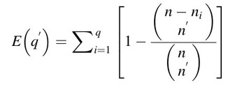

#### Componentes de la diversidad de especies basada en abundancia: riqueza y equidad

Si asumimos que un sitio de muestreo es una variable cualitativa, y cada
especies un “estado”. Bajo esta lógica, la dispersión de esta variable
se calcula usando las frecuencias relativas *p<sub>i</sub>* de los
*q*-estados usando la conocida entropía de Shannon (1948):

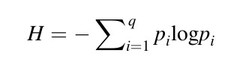

Desde el punto de vista ecológico, la entropía de Shannon tiene dos
propiedades importantes: 1) Crece al aumentar la riqueza de especies
*q*; 2) Crece con la uniformidad (=equidad o equitabilidad, es decir,
qué tan bien repartida se encuentra la abundancia entre las especies).
Para una *q* dada, la entropía de Shannon asume su valor máximo cuando
todas las especies están igualmente representadas, y es equivalente al
logaritmo de la riqueza:

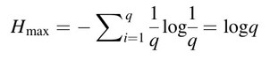

``` r
foo1 <- c(25, 16, 9, 4, 1)
diversity(foo1)
```

    ## [1] 1.277269

``` r
foo2 <- c(11, 11, 11, 11, 11)
diversity(foo2)
```

    ## [1] 1.609438

Por otra parte, la **equidad de Pielou** (1966) es la razón entre la
entropía de Shannon y su valor máximo; también se le conoce como
**equidad de Shannon**. La equidad de Pielou es estrechamente
dependiente de la riqueza, pero es un índice muy usado en trabajos
ecológicos:

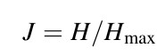

La equidad (en general, no sólo la medida por Pielou), se relaciona con
la forma de los modelos de abundancia de especies, que son funciones
ajustadas a los gráficos a los gráficos rango-abundancia
(horizontal=especies por rango de abundancia, vertical=logaritmo de las
abundancias). Los principales modelos son, ordenados de menor a mayor
equidad representada, geométrico, log, lognormal y de la vara quebrada.
Los modelos de abundancia de especies se pueden consultar mediante la
función `radfit` de `{vegan}`. La mayoría de estos modelos son realmente
modelos lineales generalizados.

Otra medida común es el índice de concentración de Simpson (1949), λ,
que equivale a la probabilidad de que dos individuos elegidos al azar
pertenezcan a la misma especie.

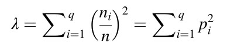

Este valor aumenta con la dominancia (de ahí su nombre “índice de
concentración”), por lo que realmente no mide diversidad, sino más bien
dominancia. Para transformarlo en un índice de diversidad, se utiliza
D=1-λ, que es el índice de Gini-Simpson, o D=1/λ, que es el inverso de
Simpson (**menos sensible a cambios de la abundancia en las especies muy
comunes**).

La riqueza de especies, la entropía de Shannon y la **diversidad** de
Simpson son realmente casos especiales de la entropía generalizada de
Renyi (1961):

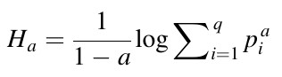

donde *a* es el orden de la medida de entropía (*a=0,1,2…*), la cual
cuantifica la importancia de la abundancia de especies y, por lo tanto,
la equidad. Hill (1973) propuso usar los correspondientes números de
diversidad:

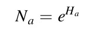

Las tres primeras entropias de Renyi (*H<sub>a</sub>*), donde *a=0, 1 y
2*, y los correspondientes números de diversidad de Hill,
(*N<sub>a</sub>*), son realmente índices que ya conocemos:
*H<sub>0</sub>=H<sub>max</sub>=log(q)*, *H<sub>1</sub>=H=entropia de
Shannon*, *H<sub>2</sub>=-log(λ)*. Por otra parte, los tres primeros
números de diversidad de Hill, *N<sub>0</sub>=q*, simplemente la
riqueza de especies, *N<sub>1</sub>=exp(H)*, número de especies
abundantes, y *N<sub>1</sub>=1/λ*, inverso de Simpson. De lo anterior se
deriva que, **a medida que se incrementa *a*, se le da mayor importancia
a la o las especies más abundantes**.

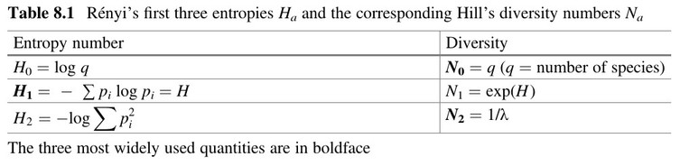 <br> \> Según Borcard et al.,
2018.

Bajo esta notación, el índice de equidad de Pielou (o equidad de
Shannon) equivale a *J=H<sub>1</sub>/H<sub>0</sub>*, que es a fin de
cuentas una ratio. Hill propuso también otras ratios:
*E<sub>1</sub>=N<sub>1</sub>/N<sub>0</sub>* a la cual el propio Hill
denominó como su versión de la equidad de Shannon y
*E<sub>2</sub>=N<sub>2</sub>/N<sub>0</sub>*. Por lo tanto, Hill no sólo
propuso números de diversidad, sino también ratios.

Los números de diversidad y las ratios de Hill son menos sensibles a las
matrices de comunidad con fuerte dominancia, y producen los denominados
“números equivalentes”. Se pueden interpretar como “el número de
elementos igualmente probables (individuos, especies, etc.) necesarios
para producir el valor observado del índice de diversidad” (Ellison,
2010, modificado por Jost, 2007). Además, **los números de diversidad de
Hill son preferibles para la interpretación a través de modelos
lineales, porque tienen mayor probabilidad de estar relacionados
linealmente con variables ambientales**.

**Estas afirmaciones tienen implicaciones muy importantes desde el punto
de vista ecológico, puesto que tus datos podrían mostrar tendencias
antes los números de Hill y no necesariamente con la entropia de Shannon
o el clásico índice de
    Simpson**.

**Índices**

``` r
(indices <- alpha_div(mi_fam))
```

    ##    N0         H      Hb2       N1     N1b2       N2         J       E10
    ## 1  12 1.6332076 2.356221 5.120272 5.120272 3.263973 0.6572511 0.4266894
    ## 2  11 1.4743239 2.127000 4.368081 4.368081 2.808503 0.6148408 0.3970983
    ## 3  12 1.8800127 2.712285 6.553588 6.553588 5.158464 0.7565728 0.5461323
    ## 4  12 1.9489438 2.811732 7.021268 7.021268 5.527901 0.7843127 0.5851057
    ## 5  14 2.0374641 2.939439 7.671131 7.671131 6.229115 0.7720424 0.5479379
    ## 6  11 1.7739952 2.559334 5.894355 5.894355 4.354062 0.7398134 0.5358505
    ## 7  11 1.5795743 2.278844 4.852889 4.852889 3.190400 0.6587336 0.4411718
    ## 8  11 1.7748622 2.560585 5.899468 5.899468 4.034651 0.7401750 0.5363153
    ## 9  11 1.5521865 2.239332 4.721783 4.721783 3.075755 0.6473120 0.4292530
    ## 10 11 1.7478244 2.521578 5.742097 5.742097 4.330182 0.7288994 0.5220088
    ## 11 12 1.5660134 2.259280 4.787524 4.787524 2.983219 0.6302102 0.3989604
    ## 12 12 1.6093553 2.321809 4.999587 4.999587 3.232629 0.6476522 0.4166323
    ## 13 10 1.5751086 2.272401 4.831266 4.831266 3.573893 0.6840610 0.4831266
    ## 14 13 1.9124554 2.759090 6.769691 6.769691 4.949661 0.7456114 0.5207455
    ## 15 12 1.9993996 2.884524 7.384621 7.384621 6.058062 0.8046176 0.6153851
    ## 16 11 1.4385993 2.075460 4.214788 4.214788 2.653559 0.5999425 0.3831625
    ## 17 11 1.3062661 1.884544 3.692361 3.692361 2.155596 0.5447553 0.3356692
    ## 18 12 1.7974127 2.593118 6.034016 6.034016 4.497527 0.7233321 0.5028346
    ## 19 11 1.9693742 2.841206 7.166191 7.166191 5.221791 0.8212928 0.6514719
    ## 20 12 1.8750675 2.705151 6.521259 6.521259 4.575972 0.7545827 0.5434383
    ## 21 12 1.6159640 2.331343 5.032737 5.032737 3.243230 0.6503118 0.4193948
    ## 22 11 1.6007611 2.309410 4.956804 4.956804 3.243455 0.6675692 0.4506185
    ## 23 13 1.5169532 2.188501 4.558316 4.558316 3.088209 0.5914164 0.3506397
    ## 24 11 1.6939361 2.443833 5.440855 5.440855 3.522141 0.7064262 0.4946231
    ## 25 12 1.3224436 1.907883 3.752580 3.752580 2.238500 0.5321905 0.3127150
    ## 26  8 1.0102210 1.457441 2.746208 2.746208 1.814384 0.4858136 0.3432760
    ## 27 11 1.3716353 1.978851 3.941791 3.941791 2.391795 0.5720164 0.3583447
    ## 28 13 1.4201584 2.048855 4.137776 4.137776 2.369742 0.5536789 0.3182904
    ## 29 12 1.4150196 2.041442 4.116567 4.116567 2.352538 0.5694458 0.3430473
    ## 30 12 1.2491131 1.802089 3.487249 3.487249 2.009260 0.5026801 0.2906041
    ## 31 10 1.1859867 1.711017 3.273916 3.273916 2.004081 0.5150675 0.3273916
    ## 32 12 1.3511469 1.949293 3.861852 3.861852 2.230038 0.5437415 0.3218210
    ## 33 12 1.1963386 1.725952 3.307983 3.307983 1.979571 0.4814421 0.2756652
    ## 34 11 1.1967355 1.726524 3.309296 3.309296 1.933572 0.4990775 0.3008451
    ## 35 11 1.0020862 1.445705 2.723959 2.723959 1.675596 0.4179024 0.2476326
    ## 36 11 1.7410093 2.511746 5.703097 5.703097 3.740458 0.7260573 0.5184634
    ## 37 11 1.5006907 2.165039 4.484786 4.484786 2.687122 0.6258366 0.4077078
    ## 38 11 1.3429370 1.937449 3.830277 3.830277 2.338062 0.5600482 0.3482070
    ## 39 11 1.1982430 1.728699 3.314288 3.314288 1.937130 0.4997061 0.3012989
    ## 40 11 1.1208420 1.617033 3.067436 3.067436 1.837314 0.4674274 0.2788578
    ## 41 12 1.5992853 2.307281 4.949494 4.949494 3.146558 0.6435997 0.4124578
    ## 42 13 1.7178246 2.478297 5.572393 5.572393 3.675358 0.6697304 0.4286456
    ## 43 10 1.3122004 1.893105 3.714338 3.714338 2.261995 0.5698814 0.3714338
    ## 44 13 1.2825406 1.850315 3.605789 3.605789 2.195270 0.5000257 0.2773684
    ## 45 10 0.8911966 1.285725 2.438045 2.438045 1.605747 0.3870418 0.2438045
    ## 46 11 1.8746534 2.704553 6.518560 6.518560 4.566727 0.7817912 0.5925963
    ## 47 11 1.3761854 1.985416 3.959768 3.959768 2.489878 0.5739139 0.3599789
    ## 48 12 1.1591440 1.672291 3.187204 3.187204 2.103908 0.4664739 0.2656003
    ## 49 10 0.9895725 1.427651 2.690084 2.690084 1.812948 0.4297659 0.2690084
    ## 50 12 1.3152628 1.897523 3.725730 3.725730 2.327655 0.5293007 0.3104775
    ##          E20
    ## 1  0.2719977
    ## 2  0.2553184
    ## 3  0.4298720
    ## 4  0.4606584
    ## 5  0.4449368
    ## 6  0.3958238
    ## 7  0.2900364
    ## 8  0.3667865
    ## 9  0.2796141
    ## 10 0.3936529
    ## 11 0.2486016
    ## 12 0.2693857
    ## 13 0.3573893
    ## 14 0.3807431
    ## 15 0.5048385
    ## 16 0.2412326
    ## 17 0.1959633
    ## 18 0.3747939
    ## 19 0.4747083
    ## 20 0.3813310
    ## 21 0.2702692
    ## 22 0.2948595
    ## 23 0.2375545
    ## 24 0.3201947
    ## 25 0.1865416
    ## 26 0.2267980
    ## 27 0.2174359
    ## 28 0.1822878
    ## 29 0.1960448
    ## 30 0.1674384
    ## 31 0.2004081
    ## 32 0.1858365
    ## 33 0.1649643
    ## 34 0.1757792
    ## 35 0.1523270
    ## 36 0.3400416
    ## 37 0.2442838
    ## 38 0.2125511
    ## 39 0.1761027
    ## 40 0.1670285
    ## 41 0.2622132
    ## 42 0.2827198
    ## 43 0.2261995
    ## 44 0.1688669
    ## 45 0.1605747
    ## 46 0.4151570
    ## 47 0.2263526
    ## 48 0.1753256
    ## 49 0.1812948
    ## 50 0.1939712

``` r
pairs(indices,
      lower.panel = panel.smooth,
      upper.panel = panel.cor,
      diag.panel = panel.hist,
      main = "Pearson Correlation Matrix")
```

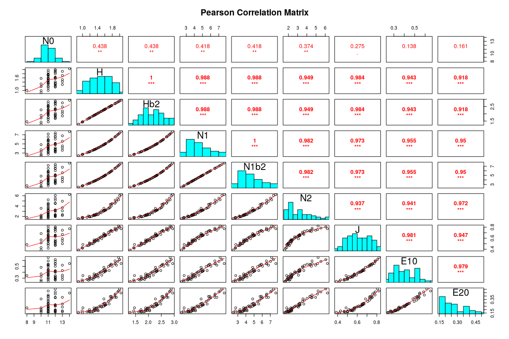<!-- -->

``` r
indices_env <- bind_cols(
  indices,
  bci_env_grid %>%
    select_if(is.numeric) %>%
    st_drop_geometry %>%
    select(-id) %>% 
    select(-matches('^geom.*pct$')))
indices_env %>% tibble
```

    ## # A tibble: 50 x 32
    ##       N0     H   Hb2    N1  N1b2    N2     J   E10   E20 heterogeneidad_…
    ##    <int> <dbl> <dbl> <dbl> <dbl> <dbl> <dbl> <dbl> <dbl>            <dbl>
    ##  1    12  1.63  2.36  5.12  5.12  3.26 0.657 0.427 0.272           0.627 
    ##  2    11  1.47  2.13  4.37  4.37  2.81 0.615 0.397 0.255           0.394 
    ##  3    12  1.88  2.71  6.55  6.55  5.16 0.757 0.546 0.430           0     
    ##  4    12  1.95  2.81  7.02  7.02  5.53 0.784 0.585 0.461           0     
    ##  5    14  2.04  2.94  7.67  7.67  6.23 0.772 0.548 0.445           0.461 
    ##  6    11  1.77  2.56  5.89  5.89  4.35 0.740 0.536 0.396           0.0768
    ##  7    11  1.58  2.28  4.85  4.85  3.19 0.659 0.441 0.290           0.381 
    ##  8    11  1.77  2.56  5.90  5.90  4.03 0.740 0.536 0.367           0.211 
    ##  9    11  1.55  2.24  4.72  4.72  3.08 0.647 0.429 0.280           0     
    ## 10    11  1.75  2.52  5.74  5.74  4.33 0.729 0.522 0.394           0     
    ## # … with 40 more rows, and 22 more variables: UTM.EW <dbl>, UTM.NS <dbl>,
    ## #   Al <dbl>, B <dbl>, Ca <dbl>, Cu <dbl>, Fe <dbl>, K <dbl>, Mg <dbl>,
    ## #   Mn <dbl>, P <dbl>, Zn <dbl>, N <dbl>, N.min. <dbl>, pH <dbl>,
    ## #   elevacion_media <dbl>, pendiente_media <dbl>, orientacion_media <dbl>,
    ## #   curvatura_perfil_media <dbl>, curvatura_tangencial_media <dbl>,
    ## #   abundancia_global <dbl>, riqueza_global <int>

``` r
ezCorM(indices_env, r_size_lims = c(3,5), label_size = 4)
```

    ## 
    ## Attaching package: 'reshape2'

    ## The following object is masked from 'package:tidyr':
    ## 
    ##     smiths

    ## `geom_smooth()` using formula 'y ~ x'
    ## `geom_smooth()` using formula 'y ~ x'

<!-- -->

**Modelos de abundancia de especies**

``` r
mi_fam_mae <- radfit(mi_fam)
```

    ## Warning: glm.fit: algorithm did not converge
    
    ## Warning: glm.fit: algorithm did not converge
    
    ## Warning: glm.fit: algorithm did not converge
    
    ## Warning: glm.fit: algorithm did not converge
    
    ## Warning: glm.fit: algorithm did not converge
    
    ## Warning: glm.fit: algorithm did not converge
    
    ## Warning: glm.fit: algorithm did not converge
    
    ## Warning: glm.fit: algorithm did not converge
    
    ## Warning: glm.fit: algorithm did not converge
    
    ## Warning: glm.fit: algorithm did not converge
    
    ## Warning: glm.fit: algorithm did not converge
    
    ## Warning: glm.fit: algorithm did not converge

``` r
plot(mi_fam_mae)
```

<!-- -->

**Rarefacción**

Riqueza por sitio

``` r
riqueza <- specnumber(mi_fam)
riqueza %>% sort
```

    ## 26 13 31 43 45 49  2  6  7  8  9 10 16 17 19 22 24 27 34 35 36 37 38 39 40 
    ##  8 10 10 10 10 10 11 11 11 11 11 11 11 11 11 11 11 11 11 11 11 11 11 11 11 
    ## 46 47  1  3  4 11 12 15 18 20 21 25 29 30 32 33 41 48 50 14 23 28 42 44  5 
    ## 11 11 12 12 12 12 12 12 12 12 12 12 12 12 12 12 12 12 12 13 13 13 13 13 14

Sitios con riqueza máxima y mínima

``` r
riqueza[riqueza == min(riqueza)]
```

    ## 26 
    ##  8

``` r
riqueza[riqueza == max(riqueza)]
```

    ##  5 
    ## 14

``` r
range(riqueza)
```

    ## [1]  8 14

Abundancia por sitio

``` r
abundancia <- rowSums(mi_fam)
abundancia %>% sort
```

    ##  46   9   5   6  19  10   3   8  17  24  12  22   4   7  29  47  11  14 
    ## 167 180 188 193 201 214 215 215 217 219 231 234 237 253 254 257 266 278 
    ##  21  42  13   1  28   2  15  37  16  36  38  41  26  18  27  32  20  43 
    ## 282 298 306 309 311 313 315 340 349 350 359 361 371 385 414 426 429 430 
    ##  31  30  23  50  35  25  39  34  40  45  33  44  48  49 
    ## 432 459 491 494 531 551 555 581 593 609 610 684 724 745

Sitios con abundancia máxima y mínima

``` r
abundancia[abundancia == min(abundancia)]
```

    ##  46 
    ## 167

``` r
abundancia[abundancia == max(abundancia)]
```

    ##  49 
    ## 745

``` r
(rango_abun <- range(abundancia))
```

    ## [1] 167 745

Abundancia en el sitio más pobre

``` r
abundancia[riqueza == min(riqueza)]
```

    ##  26 
    ## 371

Abundancia en el sitio más rico

``` r
abundancia[riqueza == max(riqueza)]
```

    ##   5 
    ## 188

Riqueza en el sitio con menor abundancia

``` r
riqueza[abundancia == min(abundancia)]
```

    ## 46 
    ## 11

Riqueza en el sitio con mayor abundancia

``` r
riqueza[abundancia == max(abundancia)]
```

    ## 49 
    ## 10

Rarefacción a la abundancia más pequeña encontrada

``` r
riqueza_menor_abun <- rarefy(mi_fam, sample = rango_abun[1])
# Compare ranking of observed and rarefied cores
sort(riqueza)
```

    ## 26 13 31 43 45 49  2  6  7  8  9 10 16 17 19 22 24 27 34 35 36 37 38 39 40 
    ##  8 10 10 10 10 10 11 11 11 11 11 11 11 11 11 11 11 11 11 11 11 11 11 11 11 
    ## 46 47  1  3  4 11 12 15 18 20 21 25 29 30 32 33 41 48 50 14 23 28 42 44  5 
    ## 11 11 12 12 12 12 12 12 12 12 12 12 12 12 12 12 12 12 12 13 13 13 13 13 14

``` r
sort(round(riqueza_menor_abun))
```

    ## 26 45 49 13 16 31 35 40 43 48  2  7 10 18 25 27 32 33 34 37 38 39 41 44 47 
    ##  7  8  8  9  9  9  9  9  9  9 10 10 10 10 10 10 10 10 10 10 10 10 10 10 10 
    ## 50  1  3  6  8  9 11 12 15 17 19 20 21 22 23 24 28 29 30 36 46  4 14 42  5 
    ## 10 11 11 11 11 11 11 11 11 11 11 11 11 11 11 11 11 11 11 11 11 12 12 12 14

``` r
rarecurve(
  mi_fam,
  step = 1,
  sample = rango_abun[1],
  xlab = "Número de individuos (tamaño de muestra)",
  ylab = "Especies",
  label = TRUE,
  col = "blue"
)
```

<!-- -->

### Riqueza de especies, estimación y comparación, “completitud de muestra” (existe en el diccionario) (Chao y Chiu, 2016)

``` r
specpool(mi_fam)
```

    ##     Species chao   chao.se jack1 jack1.se jack2     boot   boot.se  n
    ## All      16   16 0.4744405 16.98     0.98 17.94 16.40955 0.5222938 50

``` r
specpool(mi_fam)[[1]]/specpool(mi_fam)*100
```

    ##     Species chao  chao.se   jack1 jack1.se    jack2     boot boot.se  n
    ## All     100  100 3372.394 94.2285 1632.653 89.18618 97.50419 3063.41 32

Lista comprensiva de métodos (incluyendo recientes):

  - **Enfoques asintóticos. Estiman la riqueza de especies**:
      - Paramétricos:
          - Modelo homogéneo (estándar y MLE)
      - No paramétricos:
          - Chao1 y Chao1-bc
          - iChao1
          - Basados en “cobertura” o “completitud de muestra”. ACE para
            datos de abundancia
          - Estimadores Jackknife (de primer y segundo órdenes)
  - **Enfoques no asintóticos. Se utilizan para hacer rarefacción y
    extrapolación**:
      - Basados en tamaño de la muestra
      - Basados en “cobertura” o “completitud de muestra”

Matriz de comunidad combinada (todos los sitios forman uno)

``` r
mi_fam_combinada <- colSums(mi_fam)
mi_fam_combinada %>% sort
```

    ##    Rauvolfia littoralis      Pouteria fossicola         Cedrela odorata 
    ##                       1                       3                      12 
    ##      Pouteria stipitata      Guarea grandifolia         Thevetia ahouai 
    ##                      60                      65                      84 
    ##    Lacmellea panamensis   Chrysophyllum cainito       Trichilia pallida 
    ##                     102                     171                     472 
    ## Aspidosperma spruceanum Chrysophyllum argenteum          Guarea bullata 
    ##                     473                     711                     725 
    ##     Pouteria reticulata Tabernaemontana arborea         Guarea guidonia 
    ##                    1084                    1732                    1889 
    ##   Trichilia tuberculata 
    ##                   10842

``` r
mi_fam_combinada_chao <- estimacion_riqueza_chao(
  mc = mi_fam_combinada,
  tamano_rarefaccion = 40000)
mi_fam_combinada_chao$asintoticos_estimacion
```

    ## 
    ## (1) BASIC DATA INFORMATION:
    ## 
    ##                                          Variable Value
    ##     Sample size                                 n 18426
    ##     Number of observed species                  D    16
    ##     Coverage estimate for entire dataset        C     1
    ##     CV for entire dataset                      CV 2.231
    ##     Cut-off point                               k    10
    ## 
    ##                                                       Variable Value
    ##     Number of observed individuals for rare group       n_rare     4
    ##     Number of observed species for rare group           D_rare     2
    ##     Estimate of the sample coverage for rare group      C_rare  0.75
    ##     Estimate of CV for rare group in ACE               CV_rare 0.577
    ##     Estimate of CV1 for rare group in ACE-1           CV1_rare 0.745
    ##     Number of observed individuals for abundant group   n_abun 18422
    ##     Number of observed species for abundant group       D_abun    14
    ## 
    ## NULL
    ## 
    ## 
    ## (2) SPECIES RICHNESS ESTIMATORS TABLE:
    ## 
    ##                               Estimate  s.e. 95%Lower 95%Upper
    ##     Homogeneous Model           16.667 1.333   16.055   24.013
    ##     Homogeneous (MLE)           16.000 0.529   16.000   17.493
    ##     Chao1 (Chao, 1984)          16.000 0.529   16.000   17.493
    ##     Chao1-bc                    16.000 0.529   16.000   17.493
    ##     iChao1 (Chiu et al. 2014)   16.250 0.529   16.019   19.221
    ##     ACE (Chao & Lee, 1992)      17.111 2.510   16.080   31.504
    ##     ACE-1 (Chao & Lee, 1992)    17.407 3.669   16.085   39.348
    ##     1st order jackknife         17.000 1.414   16.128   23.801
    ##     2nd order jackknife         18.000 2.449   16.306   29.056
    ## 
    ## 
    ## (3) DESCRIPTION OF ESTIMATORS/MODELS:
    ## 
    ## Homogeneous Model: This model assumes that all species have the same incidence or detection probabilities. See Eq. (3.2) of Lee and Chao (1994) or Eq. (12a) in Chao and Chiu (2016b).
    ## 
    ## Chao2 (Chao, 1987): This approach uses the frequencies of uniques and duplicates to estimate the number of undetected species; see Chao (1987) or Eq. (11a) in Chao and Chiu (2016b).
    ##      
    ## Chao2-bc: A bias-corrected form for the Chao2 estimator; see Chao (2005).
    ##   
    ## iChao2: An improved Chao2 estimator; see Chiu et al. (2014).
    ## 
    ## ICE (Incidence-based Coverage Estimator): A non-parametric estimator originally proposed by Lee and Chao (1994) in the context of capture-recapture data analysis. The observed species are separated as frequent and infrequent species groups; only data in the infrequent group are used to estimate the number of undetected species. The estimated CV for species in the infrequent group characterizes the degree of heterogeneity among species incidence probabilities. See Eq. (12b) of Chao and Chiu (2016b), which is an improved version of Eq. (3.18) in Lee and Chao (1994). This model is also called Model(h) in capture-recapture literature where h denotes "heterogeneity".
    ## 
    ## ICE-1: A modified ICE for highly-heterogeneous cases.
    ## 
    ## 1st order jackknife: It uses the frequency of uniques to estimate the number of undetected species; see Burnham and Overton (1978).
    ## 
    ## 2nd order jackknife: It uses the frequencies of uniques and duplicates to estimate the number of undetected species; see Burnham and Overton (1978).
    ## 
    ## 95% Confidence interval: A log-transformation is used for all estimators so that the lower bound of the resulting interval is at least the number of observed species. See Chao (1987).

``` r
mi_fam_combinada_chao$no_asintoticos_rarefaccion_extrapolacion
```

    ## Compare 1 assemblages with Hill number order q = 0.
    ## $class: iNEXT
    ## 
    ## $DataInfo: basic data information
    ##     site     n S.obs SC f1 f2 f3 f4 f5 f6 f7 f8 f9 f10
    ## 1 site.1 18426    16  1  1  0  1  0  0  0  0  0  0   0
    ## 
    ## $iNextEst: diversity estimates with rarefied and extrapolated samples.
    ##         m       method order     qD qD.LCL qD.UCL    SC SC.LCL SC.UCL
    ## 1       1 interpolated     0  1.000  1.000  1.000 0.374  0.367   0.38
    ## 100  9213 interpolated     0 15.375 14.592 16.158 1.000  1.000   1.00
    ## 200 18426     observed     0 16.000 14.865 17.135 1.000  1.000   1.00
    ## 300 29159 extrapolated     0 16.000 14.630 17.370 1.000  1.000   1.00
    ## 400 40000 extrapolated     0 16.000 14.536 17.464 1.000  1.000   1.00
    ## 
    ## $AsyEst: asymptotic diversity estimates along with related statistics.
    ##                   Observed Estimator Est_s.e. 95% Lower 95% Upper
    ## Species Richness    16.000    16.000    0.529    16.000    17.493
    ## Shannon diversity    4.560     4.562    0.044     4.560     4.648
    ## Simpson diversity    2.677     2.677    0.027     2.677     2.729
    ## 
    ## NOTE: Only show five estimates, call iNEXT.object$iNextEst. to show complete output.

``` r
mi_fam_combinada_chao$no_asintoticos_rarefaccion_extrapolacion_grafico
```

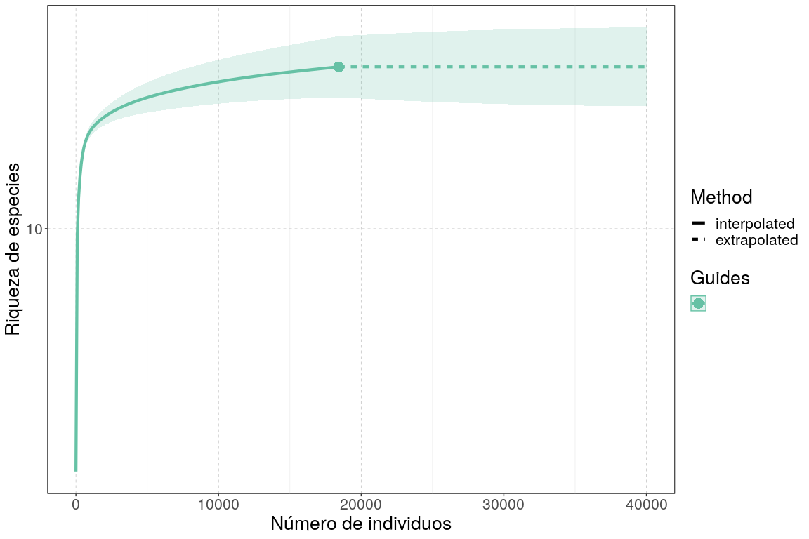<!-- -->

Matriz de comunidad agrupada según Ward (tres grupos)

``` r
mi_fam_k3 <- mi_fam %>%
  mutate(g=grupos_ward_k3) %>%
  group_by(g) %>%
  summarise_all(sum) %>%
  select(-g) %>% 
  data.frame
mi_fam_k3 %>% rowSums %>% sort
```

    ## [1]  1233  5535 11658

``` r
mi_fam_k3_chao <- estimacion_riqueza_chao(
  mc = mi_fam_k3,
  tamano_rarefaccion = 20000)
```

    ## Warning: In this case, it can't estimate the variance of 2nd-order-jackknife estimation

``` r
mi_fam_k3_chao$asintoticos_estimacion
```

    ## $`1`
    ## 
    ## (1) BASIC DATA INFORMATION:
    ## 
    ##                                          Variable Value
    ##     Sample size                                 n  5535
    ##     Number of observed species                  D    15
    ##     Coverage estimate for entire dataset        C     1
    ##     CV for entire dataset                      CV 1.767
    ##     Cut-off point                               k    10
    ## 
    ##                                                       Variable Value
    ##     Number of observed individuals for rare group       n_rare     4
    ##     Number of observed species for rare group           D_rare     2
    ##     Estimate of the sample coverage for rare group      C_rare     1
    ##     Estimate of CV for rare group in ACE               CV_rare     0
    ##     Estimate of CV1 for rare group in ACE-1           CV1_rare     0
    ##     Number of observed individuals for abundant group   n_abun  5531
    ##     Number of observed species for abundant group       D_abun    13
    ## 
    ## NULL
    ## 
    ## 
    ## (2) SPECIES RICHNESS ESTIMATORS TABLE:
    ## 
    ##                               Estimate  s.e. 95%Lower 95%Upper
    ##     Homogeneous Model               15 0.484       15   16.241
    ##     Homogeneous (MLE)               15 0.484       15   16.241
    ##     Chao1 (Chao, 1984)              15 0.484       15   16.241
    ##     Chao1-bc                        15 0.484       15   16.241
    ##     iChao1 (Chiu et al. 2014)       15 0.484       15   16.241
    ##     ACE (Chao & Lee, 1992)          15 0.484       15   16.241
    ##     ACE-1 (Chao & Lee, 1992)        15 0.484       15   16.241
    ##     1st order jackknife             15 0.484       15   16.241
    ##     2nd order jackknife             15 0.484       15   16.241
    ## 
    ## 
    ## (3) DESCRIPTION OF ESTIMATORS/MODELS:
    ## 
    ## Homogeneous Model: This model assumes that all species have the same incidence or detection probabilities. See Eq. (3.2) of Lee and Chao (1994) or Eq. (12a) in Chao and Chiu (2016b).
    ## 
    ## Chao2 (Chao, 1987): This approach uses the frequencies of uniques and duplicates to estimate the number of undetected species; see Chao (1987) or Eq. (11a) in Chao and Chiu (2016b).
    ##      
    ## Chao2-bc: A bias-corrected form for the Chao2 estimator; see Chao (2005).
    ##   
    ## iChao2: An improved Chao2 estimator; see Chiu et al. (2014).
    ## 
    ## ICE (Incidence-based Coverage Estimator): A non-parametric estimator originally proposed by Lee and Chao (1994) in the context of capture-recapture data analysis. The observed species are separated as frequent and infrequent species groups; only data in the infrequent group are used to estimate the number of undetected species. The estimated CV for species in the infrequent group characterizes the degree of heterogeneity among species incidence probabilities. See Eq. (12b) of Chao and Chiu (2016b), which is an improved version of Eq. (3.18) in Lee and Chao (1994). This model is also called Model(h) in capture-recapture literature where h denotes "heterogeneity".
    ## 
    ## ICE-1: A modified ICE for highly-heterogeneous cases.
    ## 
    ## 1st order jackknife: It uses the frequency of uniques to estimate the number of undetected species; see Burnham and Overton (1978).
    ## 
    ## 2nd order jackknife: It uses the frequencies of uniques and duplicates to estimate the number of undetected species; see Burnham and Overton (1978).
    ## 
    ## 95% Confidence interval: A log-transformation is used for all estimators so that the lower bound of the resulting interval is at least the number of observed species. See Chao (1987).
    ## 
    ## $`2`
    ## 
    ## (1) BASIC DATA INFORMATION:
    ## 
    ##                                          Variable Value
    ##     Sample size                                 n  1233
    ##     Number of observed species                  D    15
    ##     Coverage estimate for entire dataset        C 0.999
    ##     CV for entire dataset                      CV 1.279
    ##     Cut-off point                               k    10
    ## 
    ##                                                       Variable Value
    ##     Number of observed individuals for rare group       n_rare    34
    ##     Number of observed species for rare group           D_rare     6
    ##     Estimate of the sample coverage for rare group      C_rare 0.971
    ##     Estimate of CV for rare group in ACE               CV_rare 0.423
    ##     Estimate of CV1 for rare group in ACE-1           CV1_rare 0.463
    ##     Number of observed individuals for abundant group   n_abun  1199
    ##     Number of observed species for abundant group       D_abun     9
    ## 
    ## NULL
    ## 
    ## 
    ## (2) SPECIES RICHNESS ESTIMATORS TABLE:
    ## 
    ##                               Estimate  s.e. 95%Lower 95%Upper
    ##     Homogeneous Model           15.182 0.477   15.011   18.042
    ##     Homogeneous (MLE)           15.000 0.593   15.000   16.726
    ##     Chao1 (Chao, 1984)          15.500 1.322   15.030   23.436
    ##     Chao1-bc                    15.000 0.593   15.000   16.726
    ##     iChao1 (Chiu et al. 2014)   15.500 1.322   15.030   23.436
    ##     ACE (Chao & Lee, 1992)      15.366 0.850   15.025   20.280
    ##     ACE-1 (Chao & Lee, 1992)    15.403 0.952   15.027   20.939
    ##     1st order jackknife         15.999 1.413   15.128   22.797
    ##     2nd order jackknife         16.000 2.447   15.065   30.373
    ## 
    ## 
    ## (3) DESCRIPTION OF ESTIMATORS/MODELS:
    ## 
    ## Homogeneous Model: This model assumes that all species have the same incidence or detection probabilities. See Eq. (3.2) of Lee and Chao (1994) or Eq. (12a) in Chao and Chiu (2016b).
    ## 
    ## Chao2 (Chao, 1987): This approach uses the frequencies of uniques and duplicates to estimate the number of undetected species; see Chao (1987) or Eq. (11a) in Chao and Chiu (2016b).
    ##      
    ## Chao2-bc: A bias-corrected form for the Chao2 estimator; see Chao (2005).
    ##   
    ## iChao2: An improved Chao2 estimator; see Chiu et al. (2014).
    ## 
    ## ICE (Incidence-based Coverage Estimator): A non-parametric estimator originally proposed by Lee and Chao (1994) in the context of capture-recapture data analysis. The observed species are separated as frequent and infrequent species groups; only data in the infrequent group are used to estimate the number of undetected species. The estimated CV for species in the infrequent group characterizes the degree of heterogeneity among species incidence probabilities. See Eq. (12b) of Chao and Chiu (2016b), which is an improved version of Eq. (3.18) in Lee and Chao (1994). This model is also called Model(h) in capture-recapture literature where h denotes "heterogeneity".
    ## 
    ## ICE-1: A modified ICE for highly-heterogeneous cases.
    ## 
    ## 1st order jackknife: It uses the frequency of uniques to estimate the number of undetected species; see Burnham and Overton (1978).
    ## 
    ## 2nd order jackknife: It uses the frequencies of uniques and duplicates to estimate the number of undetected species; see Burnham and Overton (1978).
    ## 
    ## 95% Confidence interval: A log-transformation is used for all estimators so that the lower bound of the resulting interval is at least the number of observed species. See Chao (1987).
    ## 
    ## $`3`
    ## 
    ## (1) BASIC DATA INFORMATION:
    ## 
    ##                                          Variable Value
    ##     Sample size                                 n 11658
    ##     Number of observed species                  D    15
    ##     Coverage estimate for entire dataset        C     1
    ##     CV for entire dataset                      CV  2.46
    ##     Cut-off point                               k    10
    ## 
    ##                                                       Variable Value
    ##     Number of observed individuals for rare group       n_rare     9
    ##     Number of observed species for rare group           D_rare     2
    ##     Estimate of the sample coverage for rare group      C_rare 0.889
    ##     Estimate of CV for rare group in ACE               CV_rare 0.866
    ##     Estimate of CV1 for rare group in ACE-1           CV1_rare 1.186
    ##     Number of observed individuals for abundant group   n_abun 11649
    ##     Number of observed species for abundant group       D_abun    13
    ## 
    ## NULL
    ## 
    ## 
    ## (2) SPECIES RICHNESS ESTIMATORS TABLE:
    ## 
    ##                               Estimate  s.e. 95%Lower 95%Upper
    ##     Homogeneous Model           15.250 0.637   15.015   19.038
    ##     Homogeneous (MLE)           15.000 0.483   15.000   16.347
    ##     Chao1 (Chao, 1984)          15.000 0.483   15.000   16.347
    ##     Chao1-bc                    15.000 0.483   15.000   16.347
    ##     iChao1 (Chiu et al. 2014)   15.000 0.483   15.000   16.347
    ##     ACE (Chao & Lee, 1992)      16.094 2.597   15.074   31.216
    ##     ACE-1 (Chao & Lee, 1992)    16.832 5.241   15.099   48.920
    ##     1st order jackknife         16.000 1.414   15.128   22.801
    ##     2nd order jackknife         17.000 2.449   15.306   28.055
    ## 
    ## 
    ## (3) DESCRIPTION OF ESTIMATORS/MODELS:
    ## 
    ## Homogeneous Model: This model assumes that all species have the same incidence or detection probabilities. See Eq. (3.2) of Lee and Chao (1994) or Eq. (12a) in Chao and Chiu (2016b).
    ## 
    ## Chao2 (Chao, 1987): This approach uses the frequencies of uniques and duplicates to estimate the number of undetected species; see Chao (1987) or Eq. (11a) in Chao and Chiu (2016b).
    ##      
    ## Chao2-bc: A bias-corrected form for the Chao2 estimator; see Chao (2005).
    ##   
    ## iChao2: An improved Chao2 estimator; see Chiu et al. (2014).
    ## 
    ## ICE (Incidence-based Coverage Estimator): A non-parametric estimator originally proposed by Lee and Chao (1994) in the context of capture-recapture data analysis. The observed species are separated as frequent and infrequent species groups; only data in the infrequent group are used to estimate the number of undetected species. The estimated CV for species in the infrequent group characterizes the degree of heterogeneity among species incidence probabilities. See Eq. (12b) of Chao and Chiu (2016b), which is an improved version of Eq. (3.18) in Lee and Chao (1994). This model is also called Model(h) in capture-recapture literature where h denotes "heterogeneity".
    ## 
    ## ICE-1: A modified ICE for highly-heterogeneous cases.
    ## 
    ## 1st order jackknife: It uses the frequency of uniques to estimate the number of undetected species; see Burnham and Overton (1978).
    ## 
    ## 2nd order jackknife: It uses the frequencies of uniques and duplicates to estimate the number of undetected species; see Burnham and Overton (1978).
    ## 
    ## 95% Confidence interval: A log-transformation is used for all estimators so that the lower bound of the resulting interval is at least the number of observed species. See Chao (1987).

``` r
mi_fam_k3_chao$no_asintoticos_rarefaccion_extrapolacion
```

    ## Compare 3 assemblages with Hill number order q = 0.
    ## $class: iNEXT
    ## 
    ## $DataInfo: basic data information
    ##   site     n S.obs     SC f1 f2 f3 f4 f5 f6 f7 f8 f9 f10
    ## 1    1  5535    15 1.0000  0  2  0  0  0  0  0  0  0   0
    ## 2    2  1233    15 0.9992  1  1  0  0  0  0  2  1  1   0
    ## 3    3 11658    15 1.0000  1  0  0  0  0  0  0  1  0   0
    ## 
    ## $iNextEst: diversity estimates with rarefied and extrapolated samples.
    ## $`1`
    ##         m       method order   qD qD.LCL qD.UCL    SC SC.LCL SC.UCL
    ## 1       1 interpolated     0  1.0  1.000  1.000 0.275  0.265  0.284
    ## 100  2767 interpolated     0 14.5 13.674 15.326 1.000  0.999  1.000
    ## 200  5535     observed     0 15.0 14.030 15.970 1.000  1.000  1.000
    ## 300 12731 extrapolated     0 15.0 13.873 16.127 1.000  1.000  1.000
    ## 400 20000 extrapolated     0 15.0 13.855 16.145 1.000  1.000  1.000
    ## 
    ## $`2`
    ##         m       method order     qD qD.LCL qD.UCL    SC SC.LCL SC.UCL
    ## 1       1 interpolated     0  1.000  1.000  1.000 0.176  0.166  0.185
    ## 100   616 interpolated     0 14.228 13.245 15.211 0.998  0.997  1.000
    ## 200  1233     observed     0 15.000 13.510 16.490 0.999  0.998  1.000
    ## 300 10569 extrapolated     0 15.500 13.115 17.884 1.000  1.000  1.000
    ## 400 20000 extrapolated     0 15.500 13.114 17.885 1.000  1.000  1.000
    ## 
    ## $`3`
    ##         m       method order     qD qD.LCL qD.UCL   SC SC.LCL SC.UCL
    ## 1       1 interpolated     0  1.000  1.000  1.000 0.47  0.457  0.483
    ## 100  5829 interpolated     0 14.496 13.817 15.175 1.00  1.000  1.000
    ## 200 11658     observed     0 15.000 14.039 15.961 1.00  1.000  1.000
    ## 300 15808 extrapolated     0 15.000 14.039 15.961 1.00  1.000  1.000
    ## 400 20000 extrapolated     0 15.000 14.039 15.961 1.00  1.000  1.000
    ## 
    ## 
    ## $AsyEst: asymptotic diversity estimates along with related statistics.
    ##   Site         Diversity Observed Estimator  s.e.    LCL    UCL
    ## 1    1  Species richness   15.000    15.000 0.484 15.000 16.241
    ## 2    1 Shannon diversity    5.731     5.738 0.091  5.731  5.917
    ## 3    1 Simpson diversity    3.638     3.640 0.066  3.638  3.770
    ## 4    2  Species richness   15.000    15.500 1.322 15.030 23.436
    ## 5    2 Shannon diversity    7.321     7.366 0.184  7.321  7.727
    ## 6    2 Simpson diversity    5.676     5.698 0.180  5.676  6.050
    ## 7    3  Species richness   15.000    15.000 0.483 15.000 16.347
    ## 8    3 Shannon diversity    3.640     3.643 0.047  3.640  3.734
    ## 9    3 Simpson diversity    2.127     2.127 0.022  2.127  2.171
    ## 
    ## NOTE: Only show five estimates, call iNEXT.object$iNextEst. to show complete output.

``` r
mi_fam_k3_chao$no_asintoticos_rarefaccion_extrapolacion_grafico
```

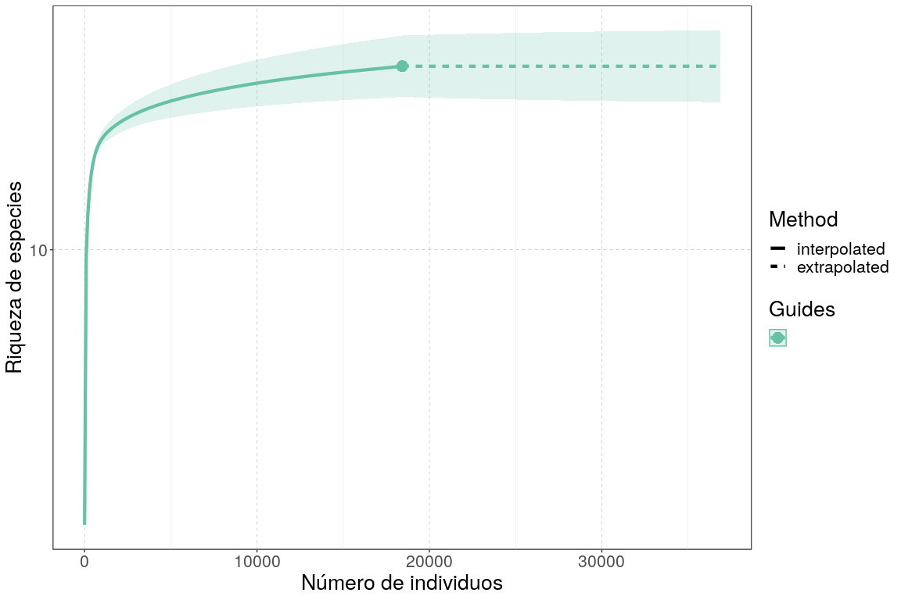<!-- -->
