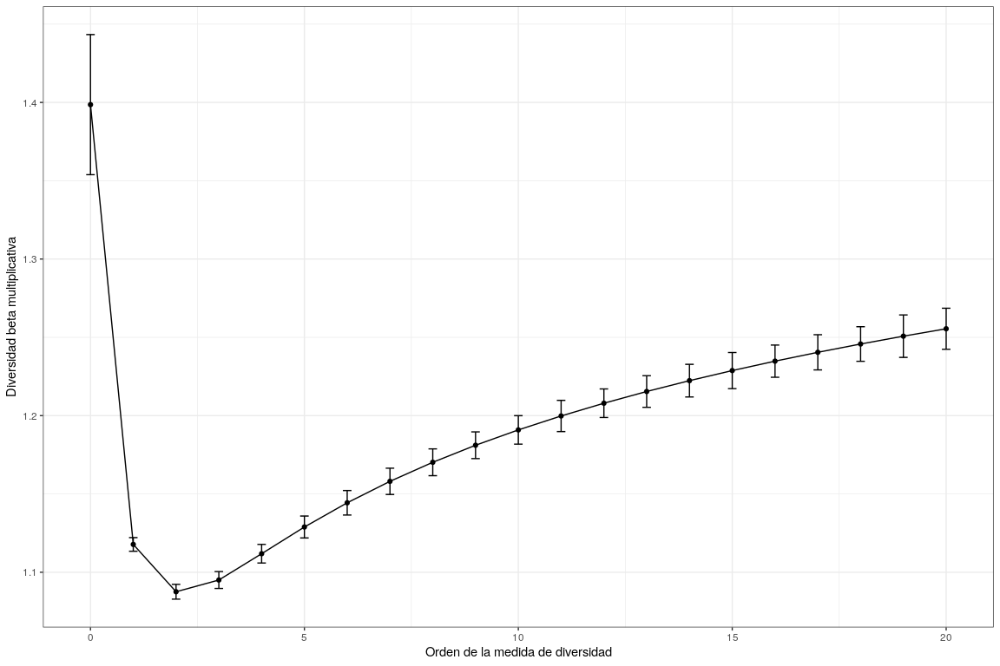

Análisis de diversidad. <br> Parte 2: Diversidad beta
================
JR
2 de diciembre, 2020

``` r
knitr::opts_chunk$set(fig.width=12, fig.height=8)
```

## Preámbulo

### Cargar paquetes

``` r
library(vegan)
```

    ## Loading required package: permute

    ## Loading required package: lattice

    ## This is vegan 2.5-6

``` r
library(adespatial)
```

    ## Registered S3 methods overwritten by 'adegraphics':
    ##   method         from
    ##   biplot.dudi    ade4
    ##   kplot.foucart  ade4
    ##   kplot.mcoa     ade4
    ##   kplot.mfa      ade4
    ##   kplot.pta      ade4
    ##   kplot.sepan    ade4
    ##   kplot.statis   ade4
    ##   scatter.coa    ade4
    ##   scatter.dudi   ade4
    ##   scatter.nipals ade4
    ##   scatter.pco    ade4
    ##   score.acm      ade4
    ##   score.mix      ade4
    ##   score.pca      ade4
    ##   screeplot.dudi ade4

    ## Registered S3 method overwritten by 'spdep':
    ##   method   from
    ##   plot.mst ape

    ## Registered S3 methods overwritten by 'adespatial':
    ##   method             from       
    ##   plot.multispati    adegraphics
    ##   print.multispati   ade4       
    ##   summary.multispati ade4

``` r
library(plyr)
library(tidyverse)
```

    ## ── Attaching packages ─────────────────────────────── tidyverse 1.2.1 ──

    ## ✓ ggplot2 3.3.2     ✓ purrr   0.3.4
    ## ✓ tibble  3.0.3     ✓ dplyr   0.8.3
    ## ✓ tidyr   1.0.0     ✓ stringr 1.4.0
    ## ✓ readr   1.3.1     ✓ forcats 0.4.0

    ## ── Conflicts ────────────────────────────────── tidyverse_conflicts() ──
    ## x dplyr::arrange()   masks plyr::arrange()
    ## x purrr::compact()   masks plyr::compact()
    ## x dplyr::count()     masks plyr::count()
    ## x dplyr::failwith()  masks plyr::failwith()
    ## x dplyr::filter()    masks stats::filter()
    ## x dplyr::id()        masks plyr::id()
    ## x dplyr::lag()       masks stats::lag()
    ## x dplyr::mutate()    masks plyr::mutate()
    ## x dplyr::rename()    masks plyr::rename()
    ## x dplyr::summarise() masks plyr::summarise()
    ## x dplyr::summarize() masks plyr::summarize()

``` r
library(sf)
```

    ## Linking to GEOS 3.6.2, GDAL 2.2.3, PROJ 4.9.3

``` r
library(vegetarian)
library(mapview)
source('biodata/funciones.R')
```

### Cargar datos

``` r
load('biodata/Apocynaceae-Meliaceae-Sapotaceae.Rdata')
load('biodata/matriz_ambiental.Rdata')
mi_fam <- mc_apcyn_melic_saptc
bci_env_grid %>% tibble
```

    ## # A tibble: 50 x 39
    ##       id categoria_de_ed… geologia habitat quebrada heterogeneidad_… UTM.EW
    ##    <dbl> <fct>            <fct>    <fct>   <fct>               <dbl>  <dbl>
    ##  1     1 c3               Tb       OldSlo… Yes                0.627  6.26e5
    ##  2     2 c3               Tb       OldLow  Yes                0.394  6.26e5
    ##  3     3 c3               Tb       OldLow  No                 0      6.26e5
    ##  4     4 c3               Tb       OldLow  No                 0      6.26e5
    ##  5     5 c3               Tb       OldSlo… No                 0.461  6.26e5
    ##  6     6 c3               Tb       OldLow  No                 0.0768 6.26e5
    ##  7     7 c3               Tb       OldLow  Yes                0.381  6.26e5
    ##  8     8 c3               Tb       OldLow  Yes                0.211  6.26e5
    ##  9     9 c3               Tb       OldLow  No                 0      6.26e5
    ## 10    10 c3               Tb       OldLow  No                 0      6.26e5
    ## # … with 40 more rows, and 32 more variables: UTM.NS <dbl>,
    ## #   geomorf_llanura_pct <dbl>, geomorf_pico_pct <dbl>,
    ## #   geomorf_interfluvio_pct <dbl>, geomorf_hombrera_pct <dbl>,
    ## #   `geomorf_espolón/gajo_pct` <dbl>, geomorf_vertiente_pct <dbl>,
    ## #   geomorf_vaguada_pct <dbl>, geomorf_piedemonte_pct <dbl>,
    ## #   geomorf_valle_pct <dbl>, geomorf_sima_pct <dbl>, Al <dbl>, B <dbl>,
    ## #   Ca <dbl>, Cu <dbl>, Fe <dbl>, K <dbl>, Mg <dbl>, Mn <dbl>, P <dbl>,
    ## #   Zn <dbl>, N <dbl>, N.min. <dbl>, pH <dbl>, elevacion_media <dbl>,
    ## #   pendiente_media <dbl>, orientacion_media <dbl>,
    ## #   curvatura_perfil_media <dbl>, curvatura_tangencial_media <dbl>,
    ## #   geometry <POLYGON [m]>, abundancia_global <dbl>, riqueza_global <int>

## Diversidad beta

En la concepción de Whittaker, la diversidad alfa es la local o de
sitio, la diversidad beta es la variación espacial de la diversidad
entre sitios, y la diversidad gamma es la regional. Se escribe
fácilmente, pero definirlo o establecer límites entre una y otra es más
complejo.

La diversidad alfa la medimos usando métricas que ponderan comúnmente la
riqueza y la equidad. En la diversidad gamma normalmente realizamos el
mismo procedimiento, pero aplicado a muestras representativas a escala
regional. Sin embargo, la diversidad beta no es tan simple. Dado que la
variación espacial de la composición de especies entre sitios se puede
abordar de múltiples maneras, la diversidad beta es sin duda un gran
desafío.

### Diversidad beta con un único número

``` r
beta_multiplicativa <- calcular_beta_multiplicativa(
  mc = mi_fam,
  orden = 0:20)
beta_multiplicativa
```

    ## $beta_multiplicativa
    ## # A tibble: 21 x 3
    ##    orden  beta   error
    ##    <int> <dbl>   <dbl>
    ##  1     0  1.40 0.0512 
    ##  2     1  1.12 0.00428
    ##  3     2  1.09 0.00450
    ##  4     3  1.10 0.00598
    ##  5     4  1.11 0.00604
    ##  6     5  1.13 0.00676
    ##  7     6  1.14 0.00698
    ##  8     7  1.16 0.00744
    ##  9     8  1.17 0.00763
    ## 10     9  1.18 0.00794
    ## # … with 11 more rows
    ## 
    ## $grafico

<!-- -->

Notar que, para esta matriz de comunidad, la diversidad beta
multiplicativa disminuye en escenarios donde se le otorga más
importancia a la equidad que a la riqueza. En los datos de mi familia, y
en general en cualquier conjunto de datos, esto puede atribuirse a la
gran similaridad global entre sitios; en el contexto actual, con
composiciones de especies autocorrelacionadas espacialmente, el
reemplazo es bajo.

SCBD (species contribution to beta diversity) y LCBD (local
contribution…)

``` r
determinar_contrib_local_y_especie(
  mc = mi_fam,
  alpha = 0.05,
  nperm = 9999,
  metodo = 'hellinger')
```

    ## $betadiv
    ## $beta
    ##   SStotal   BDtotal 
    ## 2.8745264 0.0586638 
    ## 
    ## $SCBD
    ## Aspidosperma spruceanum         Cedrela odorata Chrysophyllum argenteum 
    ##            0.1033675044            0.0105969883            0.0839011242 
    ##   Chrysophyllum cainito          Guarea bullata      Guarea grandifolia 
    ##            0.0297382847            0.0550468634            0.0267841297 
    ##         Guarea guidonia    Lacmellea panamensis      Pouteria fossicola 
    ##            0.0584408350            0.0321901589            0.0043941205 
    ##     Pouteria reticulata      Pouteria stipitata    Rauvolfia littoralis 
    ##            0.0612351308            0.0392306298            0.0004984294 
    ## Tabernaemontana arborea         Thevetia ahouai       Trichilia pallida 
    ##            0.1832419760            0.0655042140            0.0778049859 
    ##   Trichilia tuberculata 
    ##            0.1680246250 
    ## 
    ## $LCBD
    ##           1           2           3           4           5           6 
    ## 0.013973589 0.006431326 0.032936589 0.038021860 0.052306048 0.024839911 
    ##           7           8           9          10          11          12 
    ## 0.017322405 0.013288470 0.025324439 0.022035000 0.004034457 0.004538162 
    ##          13          14          15          16          17          18 
    ## 0.030773098 0.034260658 0.037308991 0.007082420 0.013282441 0.054057197 
    ##          19          20          21          22          23          24 
    ## 0.031235639 0.017602557 0.010496701 0.014235819 0.021921759 0.020666895 
    ##          25          26          27          28          29          30 
    ## 0.015627209 0.019794002 0.006421964 0.006861600 0.009328598 0.012968037 
    ##          31          32          33          34          35          36 
    ## 0.020304473 0.011627743 0.016948789 0.015202250 0.022996531 0.020759570 
    ##          37          38          39          40          41          42 
    ## 0.012001028 0.005677488 0.011228199 0.020814500 0.031856215 0.015914154 
    ##          43          44          45          46          47          48 
    ## 0.014015878 0.012151577 0.025654079 0.039778543 0.026009401 0.020072675 
    ##          49          50 
    ## 0.025127045 0.012882022 
    ## 
    ## $p.LCBD
    ##      1      2      3      4      5      6      7      8      9     10 
    ## 0.6550 0.9639 0.1316 0.0772 0.0184 0.2560 0.5061 0.6913 0.2339 0.3319 
    ##     11     12     13     14     15     16     17     18     19     20 
    ## 0.9950 0.9926 0.1492 0.1004 0.0745 0.9482 0.6804 0.0151 0.1304 0.4816 
    ##     21     22     23     24     25     26     27     28     29     30 
    ## 0.8045 0.6319 0.3222 0.3568 0.5647 0.3925 0.9590 0.9528 0.8654 0.7040 
    ##     31     32     33     34     35     36     37     38     39     40 
    ## 0.3889 0.7715 0.5300 0.6034 0.3139 0.3729 0.7580 0.9764 0.7924 0.3795 
    ##     41     42     43     44     45     46     47     48     49     50 
    ## 0.1366 0.5754 0.6686 0.7460 0.2431 0.0653 0.2360 0.4014 0.2511 0.7092 
    ## 
    ## $p.adj
    ##      1      2      3      4      5      6      7      8      9     10 
    ## 1.0000 1.0000 1.0000 1.0000 0.9016 1.0000 1.0000 1.0000 1.0000 1.0000 
    ##     11     12     13     14     15     16     17     18     19     20 
    ## 1.0000 1.0000 1.0000 1.0000 1.0000 1.0000 1.0000 0.7550 1.0000 1.0000 
    ##     21     22     23     24     25     26     27     28     29     30 
    ## 1.0000 1.0000 1.0000 1.0000 1.0000 1.0000 1.0000 1.0000 1.0000 1.0000 
    ##     31     32     33     34     35     36     37     38     39     40 
    ## 1.0000 1.0000 1.0000 1.0000 1.0000 1.0000 1.0000 1.0000 1.0000 1.0000 
    ##     41     42     43     44     45     46     47     48     49     50 
    ## 1.0000 1.0000 1.0000 1.0000 1.0000 1.0000 1.0000 1.0000 1.0000 1.0000 
    ## 
    ## $method
    ## [1] "hellinger" NA         
    ## 
    ## $note
    ## [1] "Info -- This coefficient is Euclidean"
    ## 
    ## $D
    ## [1] NA
    ## 
    ## attr(,"class")
    ## [1] "beta.div"
    ## 
    ## $especies_contribuyen_betadiv
    ## Aspidosperma spruceanum Chrysophyllum argenteum Tabernaemontana arborea 
    ##              0.10336750              0.08390112              0.18324198 
    ##         Thevetia ahouai       Trichilia pallida   Trichilia tuberculata 
    ##              0.06550421              0.07780499              0.16802462 
    ## 
    ## $sitios_contribuyen_betadiv
    ## [1] "5"  "18"
    ## 
    ## $valor_de_ajustado_lcbd
    ##      1      2      3      4      5      6      7      8      9     10 
    ## 1.0000 1.0000 1.0000 1.0000 0.9016 1.0000 1.0000 1.0000 1.0000 1.0000 
    ##     11     12     13     14     15     16     17     18     19     20 
    ## 1.0000 1.0000 1.0000 1.0000 1.0000 1.0000 1.0000 0.7550 1.0000 1.0000 
    ##     21     22     23     24     25     26     27     28     29     30 
    ## 1.0000 1.0000 1.0000 1.0000 1.0000 1.0000 1.0000 1.0000 1.0000 1.0000 
    ##     31     32     33     34     35     36     37     38     39     40 
    ## 1.0000 1.0000 1.0000 1.0000 1.0000 1.0000 1.0000 1.0000 1.0000 1.0000 
    ##     41     42     43     44     45     46     47     48     49     50 
    ## 1.0000 1.0000 1.0000 1.0000 1.0000 1.0000 1.0000 1.0000 1.0000 1.0000 
    ## 
    ## $sitios_contribuyen_betadiv_ajustado
    ## character(0)

``` r
mapa_cuadros <- mapView(
  bci_env_grid,
  col.regions = 'grey80',
  alpha.regions = 0.3,
  map.types = 'OpenTopoMap',
  legend = F, zoom = 14,
  zcol = 'id') %>% addStaticLabels() %>%
  leaflet::setView(
    lng = -79.85136,
    lat = 9.15097,
    zoom = 15)
mapa_cuadros
```

<!-- -->
