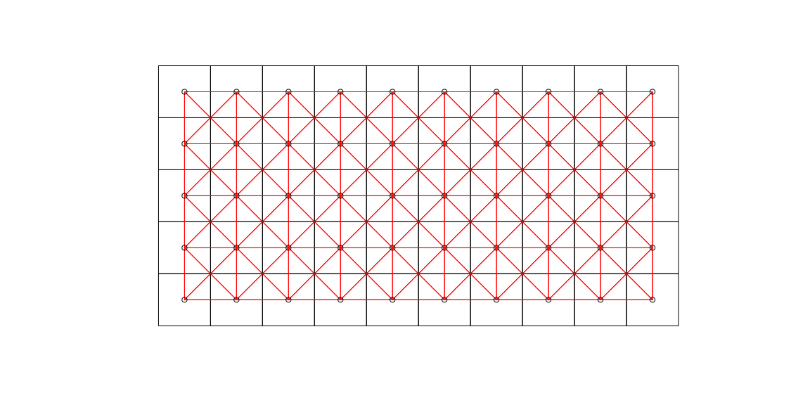
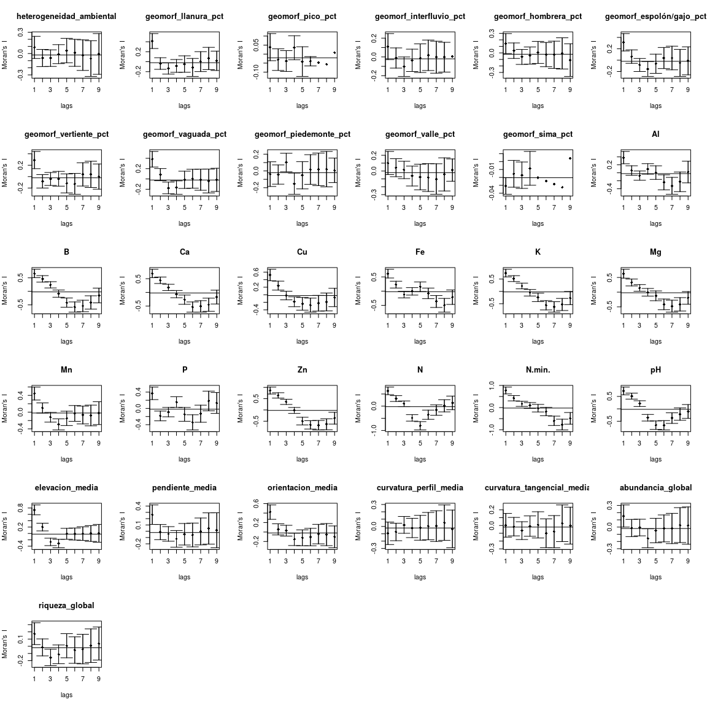
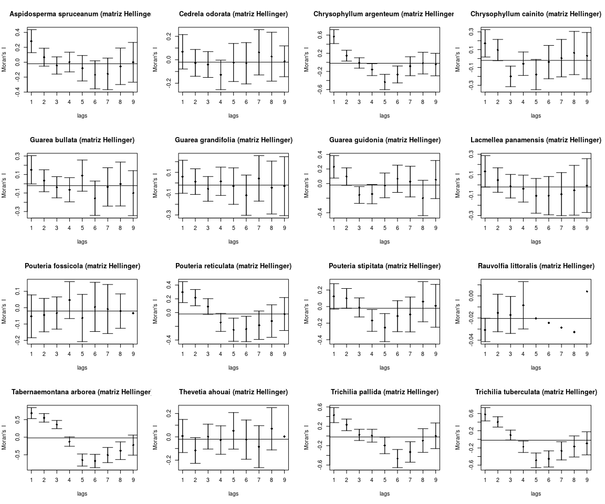
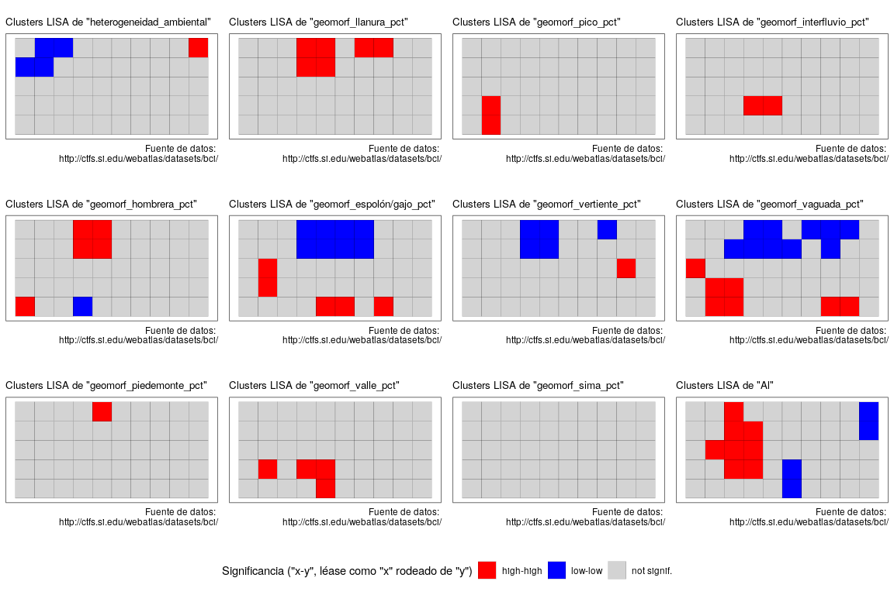
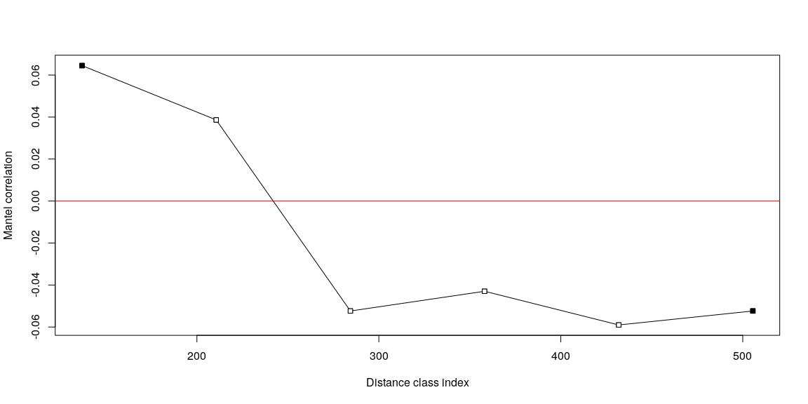
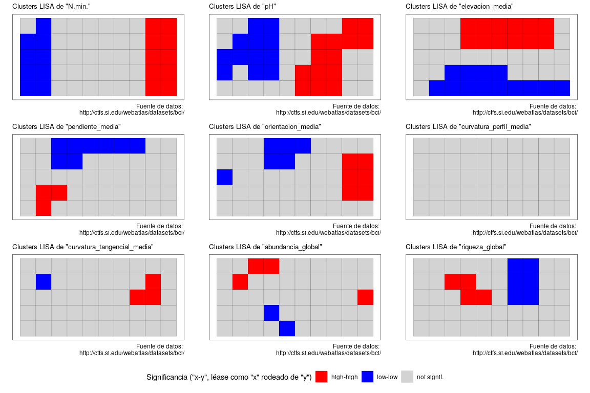
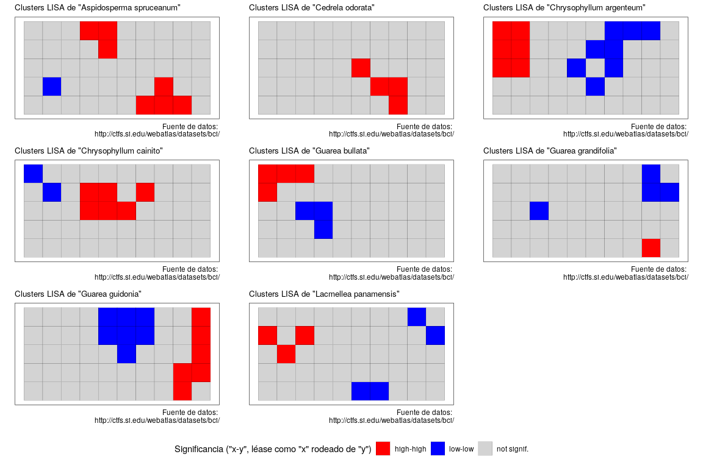
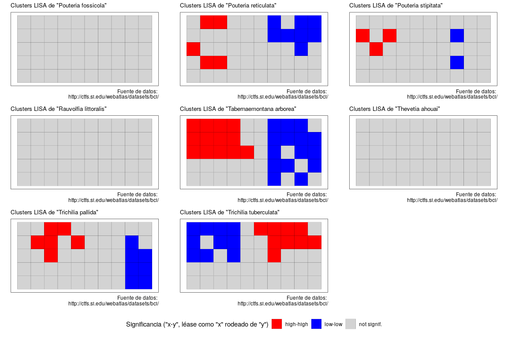
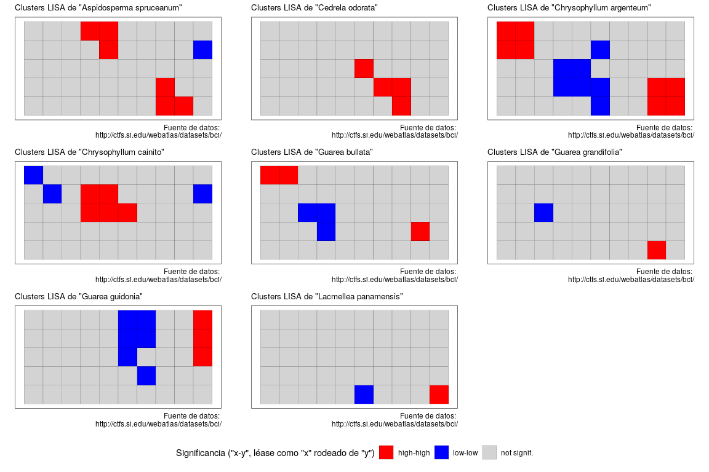
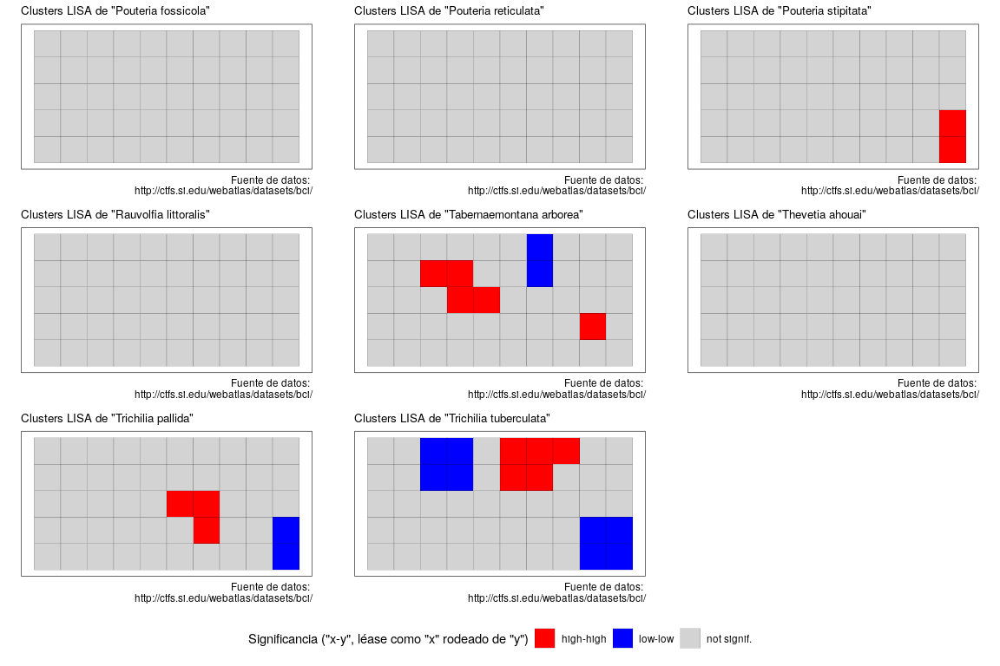

Análisis espacial de datos ecológicos. <br> Autocorrelación
================
JR
5 de diciembre, 2020

``` r
knitr::opts_chunk$set(fig.width=12, fig.height=8)
```

## Preámbulo

### Cargar paquetes

``` r
library(ape)
library(spdep)
```

    ## Loading required package: sp

    ## Loading required package: spData

    ## To access larger datasets in this package, install the spDataLarge
    ## package with: `install.packages('spDataLarge',
    ## repos='https://nowosad.github.io/drat/', type='source')`

    ## Loading required package: sf

    ## Linking to GEOS 3.6.2, GDAL 2.2.3, PROJ 4.9.3

    ## Registered S3 method overwritten by 'spdep':
    ##   method   from
    ##   plot.mst ape

``` r
library(ade4)
```

    ## 
    ## Attaching package: 'ade4'

    ## The following object is masked from 'package:spdep':
    ## 
    ##     mstree

``` r
library(adegraphics)
```

    ## Registered S3 methods overwritten by 'adegraphics':
    ##   method         from
    ##   biplot.dudi    ade4
    ##   kplot.foucart  ade4
    ##   kplot.mcoa     ade4
    ##   kplot.mfa      ade4
    ##   kplot.pta      ade4
    ##   kplot.sepan    ade4
    ##   kplot.statis   ade4
    ##   scatter.coa    ade4
    ##   scatter.dudi   ade4
    ##   scatter.nipals ade4
    ##   scatter.pco    ade4
    ##   score.acm      ade4
    ##   score.mix      ade4
    ##   score.pca      ade4
    ##   screeplot.dudi ade4

    ## 
    ## Attaching package: 'adegraphics'

    ## The following objects are masked from 'package:ade4':
    ## 
    ##     kplotsepan.coa, s.arrow, s.class, s.corcircle, s.distri,
    ##     s.image, s.label, s.logo, s.match, s.traject, s.value,
    ##     table.value, triangle.class

    ## The following object is masked from 'package:ape':
    ## 
    ##     zoom

``` r
library(adespatial)
```

    ## Registered S3 methods overwritten by 'adespatial':
    ##   method             from       
    ##   plot.multispati    adegraphics
    ##   print.multispati   ade4       
    ##   summary.multispati ade4

    ## 
    ## Attaching package: 'adespatial'

    ## The following object is masked from 'package:ade4':
    ## 
    ##     multispati

``` r
library(vegan)
```

    ## Loading required package: permute

    ## Loading required package: lattice

    ## This is vegan 2.5-6

``` r
library(tidyverse)
```

    ## ── Attaching packages ──────────────────────────────── tidyverse 1.2.1 ──

    ## ✓ ggplot2 3.3.2     ✓ purrr   0.3.4
    ## ✓ tibble  3.0.3     ✓ dplyr   0.8.3
    ## ✓ tidyr   1.0.0     ✓ stringr 1.4.0
    ## ✓ readr   1.3.1     ✓ forcats 0.4.0

    ## ── Conflicts ─────────────────────────────────── tidyverse_conflicts() ──
    ## x dplyr::filter() masks stats::filter()
    ## x dplyr::lag()    masks stats::lag()

``` r
library(sf)
library(gridExtra)
```

    ## 
    ## Attaching package: 'gridExtra'

    ## The following object is masked from 'package:dplyr':
    ## 
    ##     combine

``` r
library(grid)
library(gtable)
source('biodata/funciones.R')
source('https://raw.githubusercontent.com/maestria-geotel-master/unidad-3-asignacion-1-vecindad-autocorrelacion-espacial/master/lisaclusters.R')
```

### Cargar datos

``` r
load('biodata/Apocynaceae-Meliaceae-Sapotaceae.Rdata')
load('biodata/matriz_ambiental.Rdata')
mi_fam <- mc_apcyn_melic_saptc
mi_fam %>% tibble
```

    ## # A tibble: 50 x 16
    ##    `Aspidosperma s… `Cedrela odorat… `Chrysophyllum … `Chrysophyllum …
    ##               <dbl>            <dbl>            <dbl>            <dbl>
    ##  1                3                0               21                2
    ##  2                2                0               11                1
    ##  3                2                0               19                1
    ##  4                3                0               38                2
    ##  5                2                1               21                0
    ##  6                3                0               18                0
    ##  7                0                0                9                3
    ##  8                4                0               14                0
    ##  9                5                0               25                0
    ## 10                1                0               17                1
    ## # … with 40 more rows, and 12 more variables: `Guarea bullata` <dbl>,
    ## #   `Guarea grandifolia` <dbl>, `Guarea guidonia` <dbl>, `Lacmellea
    ## #   panamensis` <dbl>, `Pouteria fossicola` <dbl>, `Pouteria
    ## #   reticulata` <dbl>, `Pouteria stipitata` <dbl>, `Rauvolfia
    ## #   littoralis` <dbl>, `Tabernaemontana arborea` <dbl>, `Thevetia
    ## #   ahouai` <dbl>, `Trichilia pallida` <dbl>, `Trichilia
    ## #   tuberculata` <dbl>

``` r
bci_env_grid %>% tibble
```

    ## # A tibble: 50 x 39
    ##       id categoria_de_ed… geologia habitat quebrada heterogeneidad_… UTM.EW
    ##    <dbl> <fct>            <fct>    <fct>   <fct>               <dbl>  <dbl>
    ##  1     1 c3               Tb       OldSlo… Yes                0.627  6.26e5
    ##  2     2 c3               Tb       OldLow  Yes                0.394  6.26e5
    ##  3     3 c3               Tb       OldLow  No                 0      6.26e5
    ##  4     4 c3               Tb       OldLow  No                 0      6.26e5
    ##  5     5 c3               Tb       OldSlo… No                 0.461  6.26e5
    ##  6     6 c3               Tb       OldLow  No                 0.0768 6.26e5
    ##  7     7 c3               Tb       OldLow  Yes                0.381  6.26e5
    ##  8     8 c3               Tb       OldLow  Yes                0.211  6.26e5
    ##  9     9 c3               Tb       OldLow  No                 0      6.26e5
    ## 10    10 c3               Tb       OldLow  No                 0      6.26e5
    ## # … with 40 more rows, and 32 more variables: UTM.NS <dbl>,
    ## #   geomorf_llanura_pct <dbl>, geomorf_pico_pct <dbl>,
    ## #   geomorf_interfluvio_pct <dbl>, geomorf_hombrera_pct <dbl>,
    ## #   `geomorf_espolón/gajo_pct` <dbl>, geomorf_vertiente_pct <dbl>,
    ## #   geomorf_vaguada_pct <dbl>, geomorf_piedemonte_pct <dbl>,
    ## #   geomorf_valle_pct <dbl>, geomorf_sima_pct <dbl>, Al <dbl>, B <dbl>,
    ## #   Ca <dbl>, Cu <dbl>, Fe <dbl>, K <dbl>, Mg <dbl>, Mn <dbl>, P <dbl>,
    ## #   Zn <dbl>, N <dbl>, N.min. <dbl>, pH <dbl>, elevacion_media <dbl>,
    ## #   pendiente_media <dbl>, orientacion_media <dbl>,
    ## #   curvatura_perfil_media <dbl>, curvatura_tangencial_media <dbl>,
    ## #   geometry <POLYGON [m]>, abundancia_global <dbl>, riqueza_global <int>

## Preparar datos

### Generar matriz Hellinger

``` r
mi_fam_hel <- decostand (mi_fam, "hellinger")
```

### Transformar matriz ambiental en objeto `sp`, generar vecindad

``` r
bci_env_grid_sp <- bci_env_grid %>% as_Spatial
centroides <- bci_env_grid %>% st_centroid
```

    ## Warning in st_centroid.sf(.): st_centroid assumes attributes are constant
    ## over geometries of x

``` r
bci_xy <- centroides %>% st_coordinates %>% as.data.frame
(vecindad <- bci_env_grid_sp %>% poly2nb)
```

    ## Neighbour list object:
    ## Number of regions: 50 
    ## Number of nonzero links: 314 
    ## Percentage nonzero weights: 12.56 
    ## Average number of links: 6.28

``` r
(pesos_b <- nb2listw(vecindad, style = 'B'))
```

    ## Characteristics of weights list object:
    ## Neighbour list object:
    ## Number of regions: 50 
    ## Number of nonzero links: 314 
    ## Percentage nonzero weights: 12.56 
    ## Average number of links: 6.28 
    ## 
    ## Weights style: B 
    ## Weights constants summary:
    ##    n   nn  S0  S1   S2
    ## B 50 2500 314 628 8488

``` r
plot(bci_env_grid_sp)
plot(vecindad, coords = bci_xy, add=T, col = 'red')
```

<!-- -->

## Autocorrelación espacial mediante correlograma

### Una y solo una variable ambiental

``` r
var_ph <- bci_env_grid %>% st_drop_geometry %>% pull(pH)
ph_correl <- sp.correlogram(vecindad,
                            var_ph,
                            order = 9,
                            method = "I",
                            zero.policy = TRUE)
print(ph_correl, digits = 2, p.adj.method = 'holm')
```

    ## Spatial correlogram for var_ph 
    ## method: Moran's I
    ##        estimate expectation variance standard deviate Pr(I) two sided    
    ## 1 (50)   0.7207     -0.0204   0.0060              9.6          <2e-16 ***
    ## 2 (50)   0.5124     -0.0204   0.0036              8.8          <2e-16 ***
    ## 3 (50)   0.2100     -0.0204   0.0034              4.0           3e-04 ***
    ## 4 (50)  -0.3586     -0.0204   0.0044             -5.1           2e-06 ***
    ## 5 (50)  -0.6586     -0.0204   0.0073             -7.5           6e-13 ***
    ## 6 (40)  -0.6618     -0.0256   0.0089             -6.7           1e-10 ***
    ## 7 (30)  -0.3727     -0.0345   0.0114             -3.2           0.005 ** 
    ## 8 (20)  -0.2125     -0.0526   0.0154             -1.3           0.397    
    ## 9 (10)  -0.1056     -0.1111   0.0193              0.0           0.968    
    ## ---
    ## Signif. codes:  0 '***' 0.001 '**' 0.01 '*' 0.05 '.' 0.1 ' ' 1

``` r
plot(ph_correl)
```

<!-- -->

### Múltiples variables

#### Abundancias de especies (matriz de comunidad transformada)

``` r
suppressWarnings(auto_spp_hel <- calcular_autocorrelacion(
  df_fuente = mi_fam_hel,
  orden = 9,
  obj_vecindad = vecindad,
  pos_var = '(matriz Hellinger)'))
print(auto_spp_hel, digits = 2, p.adj.method = 'holm')
```

    ## $`Aspidosperma spruceanum`
    ## Spatial correlogram for Aspidosperma spruceanum (matriz Hellinger) 
    ## method: Moran's I
    ##        estimate expectation variance standard deviate Pr(I) two sided    
    ## 1 (50)   0.2822     -0.0204   0.0059              3.9           8e-04 ***
    ## 2 (50)   0.0674     -0.0204   0.0036              1.5               1    
    ## 3 (50)  -0.0437     -0.0204   0.0033             -0.4               1    
    ## 4 (50)   0.0026     -0.0204   0.0044              0.3               1    
    ## 5 (50)  -0.0807     -0.0204   0.0072             -0.7               1    
    ## 6 (40)  -0.1689     -0.0256   0.0088             -1.5               1    
    ## 7 (30)  -0.1566     -0.0345   0.0112             -1.2               1    
    ## 8 (20)  -0.0544     -0.0526   0.0150              0.0               1    
    ## 9 (10)  -0.0012     -0.1111   0.0178              0.8               1    
    ## ---
    ## Signif. codes:  0 '***' 0.001 '**' 0.01 '*' 0.05 '.' 0.1 ' ' 1
    ## 
    ## $`Cedrela odorata`
    ## Spatial correlogram for Cedrela odorata (matriz Hellinger) 
    ## method: Moran's I
    ##        estimate expectation variance standard deviate Pr(I) two sided
    ## 1 (50)   0.0680     -0.0204   0.0054              1.2             1.0
    ## 2 (50)  -0.0264     -0.0204   0.0033             -0.1             1.0
    ## 3 (50)  -0.0405     -0.0204   0.0030             -0.4             1.0
    ## 4 (50)  -0.1291     -0.0204   0.0040             -1.7             0.8
    ## 5 (50)  -0.0233     -0.0204   0.0066              0.0             1.0
    ## 6 (40)  -0.0299     -0.0256   0.0078              0.0             1.0
    ## 7 (30)   0.0636     -0.0345   0.0093              1.0             1.0
    ## 8 (20)   0.0263     -0.0526   0.0109              0.8             1.0
    ## 9 (10)  -0.0131     -0.1111   0.0043              1.5             1.0
    ## 
    ## $`Chrysophyllum argenteum`
    ## Spatial correlogram for Chrysophyllum argenteum (matriz Hellinger) 
    ## method: Moran's I
    ##        estimate expectation variance standard deviate Pr(I) two sided    
    ## 1 (50)   0.5665     -0.0204   0.0058              7.7           1e-13 ***
    ## 2 (50)   0.1472     -0.0204   0.0035              2.8            0.03 *  
    ## 3 (50)  -0.0141     -0.0204   0.0033              0.1            1.00    
    ## 4 (50)  -0.1605     -0.0204   0.0043             -2.1            0.16    
    ## 5 (50)  -0.4333     -0.0204   0.0071             -4.9           8e-06 ***
    ## 6 (40)  -0.2670     -0.0256   0.0086             -2.6            0.06 .  
    ## 7 (30)  -0.0855     -0.0345   0.0109             -0.5            1.00    
    ## 8 (20)  -0.0165     -0.0526   0.0143              0.3            1.00    
    ## 9 (10)  -0.0489     -0.1111   0.0154              0.5            1.00    
    ## ---
    ## Signif. codes:  0 '***' 0.001 '**' 0.01 '*' 0.05 '.' 0.1 ' ' 1
    ## 
    ## $`Chrysophyllum cainito`
    ## Spatial correlogram for Chrysophyllum cainito (matriz Hellinger) 
    ## method: Moran's I
    ##        estimate expectation variance standard deviate Pr(I) two sided  
    ## 1 (50)   0.1708     -0.0204   0.0059              2.5            0.10  
    ## 2 (50)   0.0956     -0.0204   0.0036              1.9            0.37  
    ## 3 (50)  -0.2002     -0.0204   0.0033             -3.1            0.02 *
    ## 4 (50)  -0.0578     -0.0204   0.0043             -0.6            1.00  
    ## 5 (50)  -0.1797     -0.0204   0.0072             -1.9            0.37  
    ## 6 (40)  -0.0394     -0.0256   0.0087             -0.1            1.00  
    ## 7 (30)   0.0048     -0.0345   0.0111              0.4            1.00  
    ## 8 (20)   0.0625     -0.0526   0.0147              0.9            1.00  
    ## 9 (10)   0.0325     -0.1111   0.0170              1.1            1.00  
    ## ---
    ## Signif. codes:  0 '***' 0.001 '**' 0.01 '*' 0.05 '.' 0.1 ' ' 1
    ## 
    ## $`Guarea bullata`
    ## Spatial correlogram for Guarea bullata (matriz Hellinger) 
    ## method: Moran's I
    ##        estimate expectation variance standard deviate Pr(I) two sided
    ## 1 (50)   0.1510     -0.0204   0.0058              2.2             0.2
    ## 2 (50)   0.0327     -0.0204   0.0035              0.9             1.0
    ## 3 (50)  -0.0377     -0.0204   0.0033             -0.3             1.0
    ## 4 (50)  -0.0649     -0.0204   0.0043             -0.7             1.0
    ## 5 (50)   0.0880     -0.0204   0.0071              1.3             1.0
    ## 6 (40)  -0.1563     -0.0256   0.0086             -1.4             1.0
    ## 7 (30)  -0.0345     -0.0345   0.0108              0.0             1.0
    ## 8 (20)  -0.0028     -0.0526   0.0141              0.4             1.0
    ## 9 (10)  -0.1018     -0.1111   0.0148              0.1             1.0
    ## 
    ## $`Guarea grandifolia`
    ## Spatial correlogram for Guarea grandifolia (matriz Hellinger) 
    ## method: Moran's I
    ##        estimate expectation variance standard deviate Pr(I) two sided
    ## 1 (50)   0.0585     -0.0204   0.0060              1.0               1
    ## 2 (50)   0.0127     -0.0204   0.0036              0.5               1
    ## 3 (50)  -0.0554     -0.0204   0.0034             -0.6               1
    ## 4 (50)   0.0161     -0.0204   0.0044              0.5               1
    ## 5 (50)  -0.0292     -0.0204   0.0073             -0.1               1
    ## 6 (40)  -0.1144     -0.0256   0.0089             -0.9               1
    ## 7 (30)   0.0429     -0.0345   0.0114              0.7               1
    ## 8 (20)  -0.0430     -0.0526   0.0154              0.1               1
    ## 9 (10)  -0.0302     -0.1111   0.0191              0.6               1
    ## 
    ## $`Guarea guidonia`
    ## Spatial correlogram for Guarea guidonia (matriz Hellinger) 
    ## method: Moran's I
    ##        estimate expectation variance standard deviate Pr(I) two sided  
    ## 1 (50)   0.2293     -0.0204   0.0059              3.2            0.01 *
    ## 2 (50)   0.0958     -0.0204   0.0036              1.9            0.36  
    ## 3 (50)  -0.1561     -0.0204   0.0033             -2.4            0.15  
    ## 4 (50)  -0.1444     -0.0204   0.0043             -1.9            0.36  
    ## 5 (50)  -0.0247     -0.0204   0.0072             -0.1            1.00  
    ## 6 (40)   0.0660     -0.0256   0.0088              1.0            1.00  
    ## 7 (30)   0.0278     -0.0345   0.0111              0.6            1.00  
    ## 8 (20)  -0.1975     -0.0526   0.0147             -1.2            1.00  
    ## 9 (10)   0.0552     -0.1111   0.0170              1.3            1.00  
    ## ---
    ## Signif. codes:  0 '***' 0.001 '**' 0.01 '*' 0.05 '.' 0.1 ' ' 1
    ## 
    ## $`Lacmellea panamensis`
    ## Spatial correlogram for Lacmellea panamensis (matriz Hellinger) 
    ## method: Moran's I
    ##        estimate expectation variance standard deviate Pr(I) two sided
    ## 1 (50)   0.1322     -0.0204   0.0059              2.0             0.4
    ## 2 (50)   0.0474     -0.0204   0.0036              1.1             1.0
    ## 3 (50)  -0.0129     -0.0204   0.0033              0.1             1.0
    ## 4 (50)  -0.0364     -0.0204   0.0044             -0.2             1.0
    ## 5 (50)  -0.1074     -0.0204   0.0072             -1.0             1.0
    ## 6 (40)  -0.1054     -0.0256   0.0088             -0.9             1.0
    ## 7 (30)  -0.0907     -0.0345   0.0111             -0.5             1.0
    ## 8 (20)  -0.0529     -0.0526   0.0148              0.0             1.0
    ## 9 (10)  -0.0068     -0.1111   0.0174              0.8             1.0
    ## 
    ## $`Pouteria fossicola`
    ## Spatial correlogram for Pouteria fossicola (matriz Hellinger) 
    ## method: Moran's I

    ## Warning in sqrt(res[, 3]): NaNs produced

    ##        estimate expectation variance standard deviate Pr(I) two sided
    ## 1 (50)  -0.0530     -0.0204   0.0043             -0.5               1
    ## 2 (50)  -0.0453     -0.0204   0.0026             -0.5               1
    ## 3 (50)  -0.0327     -0.0204   0.0024             -0.3               1
    ## 4 (50)   0.0462     -0.0204   0.0032              1.2               1
    ## 5 (50)  -0.0634     -0.0204   0.0052             -0.6               1
    ## 6 (40)   0.0045     -0.0256   0.0057              0.4               1
    ## 7 (30)  -0.0082     -0.0345   0.0056              0.4               1
    ## 8 (20)  -0.0209     -0.0526   0.0028              0.6               1
    ## 9 (10)  -0.0335     -0.1111  -0.0224               NA              NA
    ## 
    ## $`Pouteria reticulata`
    ## Spatial correlogram for Pouteria reticulata (matriz Hellinger) 
    ## method: Moran's I
    ##        estimate expectation variance standard deviate Pr(I) two sided    
    ## 1 (50)   0.2969     -0.0204   0.0058              4.2           3e-04 ***
    ## 2 (50)   0.2171     -0.0204   0.0035              4.0           5e-04 ***
    ## 3 (50)   0.0877     -0.0204   0.0033              1.9            0.29    
    ## 4 (50)  -0.1433     -0.0204   0.0043             -1.9            0.29    
    ## 5 (50)  -0.2499     -0.0204   0.0071             -2.7            0.04 *  
    ## 6 (40)  -0.2386     -0.0256   0.0085             -2.3            0.13    
    ## 7 (30)  -0.1844     -0.0345   0.0107             -1.4            0.44    
    ## 8 (20)  -0.1238     -0.0526   0.0139             -0.6            0.91    
    ## 9 (10)  -0.0217     -0.1111   0.0144              0.7            0.91    
    ## ---
    ## Signif. codes:  0 '***' 0.001 '**' 0.01 '*' 0.05 '.' 0.1 ' ' 1
    ## 
    ## $`Pouteria stipitata`
    ## Spatial correlogram for Pouteria stipitata (matriz Hellinger) 
    ## method: Moran's I
    ##        estimate expectation variance standard deviate Pr(I) two sided  
    ## 1 (50)   0.1227     -0.0204   0.0059              1.9            0.37  
    ## 2 (50)   0.0990     -0.0204   0.0036              2.0            0.32  
    ## 3 (50)  -0.0106     -0.0204   0.0033              0.2            1.00  
    ## 4 (50)  -0.1673     -0.0204   0.0043             -2.2            0.21  
    ## 5 (50)  -0.2541     -0.0204   0.0072             -2.8            0.05 .
    ## 6 (40)  -0.1161     -0.0256   0.0087             -1.0            1.00  
    ## 7 (30)  -0.0953     -0.0345   0.0110             -0.6            1.00  
    ## 8 (20)   0.0585     -0.0526   0.0146              0.9            1.00  
    ## 9 (10)   0.0094     -0.1111   0.0167              0.9            1.00  
    ## ---
    ## Signif. codes:  0 '***' 0.001 '**' 0.01 '*' 0.05 '.' 0.1 ' ' 1
    ## 
    ## $`Rauvolfia littoralis`
    ## Spatial correlogram for Rauvolfia littoralis (matriz Hellinger) 
    ## method: Moran's I

    ## Warning in sqrt(res[, 3]): NaNs produced

    ##        estimate expectation variance standard deviate Pr(I) two sided
    ## 1 (50) -3.1e-02    -2.0e-02  2.8e-05             -2.0             0.2
    ## 2 (50) -1.5e-02    -2.0e-02  7.2e-05              0.6             1.0
    ## 3 (50) -1.7e-02    -2.0e-02  7.0e-05              0.4             1.0
    ## 4 (50) -8.5e-03    -2.0e-02  1.1e-04              1.1             1.0
    ## 5 (50) -2.0e-02    -2.0e-02  4.3e-19              0.0             1.0
    ## 6 (40) -2.4e-02    -2.6e-02 -2.5e-03               NA              NA
    ## 7 (30) -2.9e-02    -3.4e-02 -8.8e-03               NA              NA
    ## 8 (20) -3.3e-02    -5.3e-02 -2.9e-02               NA              NA
    ## 9 (10)  4.1e-03    -1.1e-01 -1.3e-01               NA              NA
    ## 
    ## $`Tabernaemontana arborea`
    ## Spatial correlogram for Tabernaemontana arborea (matriz Hellinger) 
    ## method: Moran's I
    ##        estimate expectation variance standard deviate Pr(I) two sided    
    ## 1 (50)   0.6835     -0.0204   0.0060              9.1          <2e-16 ***
    ## 2 (50)   0.5499     -0.0204   0.0037              9.4          <2e-16 ***
    ## 3 (50)   0.3584     -0.0204   0.0034              6.5           4e-10 ***
    ## 4 (50)  -0.1244     -0.0204   0.0044             -1.6            0.24    
    ## 5 (50)  -0.6489     -0.0204   0.0074             -7.3           2e-12 ***
    ## 6 (40)  -0.6763     -0.0256   0.0090             -6.9           4e-11 ***
    ## 7 (30)  -0.5064     -0.0345   0.0115             -4.4           4e-05 ***
    ## 8 (20)  -0.3844     -0.0526   0.0157             -2.6            0.02 *  
    ## 9 (10)  -0.2254     -0.1111   0.0203             -0.8            0.42    
    ## ---
    ## Signif. codes:  0 '***' 0.001 '**' 0.01 '*' 0.05 '.' 0.1 ' ' 1
    ## 
    ## $`Thevetia ahouai`
    ## Spatial correlogram for Thevetia ahouai (matriz Hellinger) 
    ## method: Moran's I

    ## Warning in sqrt(res[, 3]): NaNs produced

    ##        estimate expectation variance standard deviate Pr(I) two sided
    ## 1 (50)   0.0074     -0.0204   0.0050              0.4             1.0
    ## 2 (50)  -0.1169     -0.0204   0.0030             -1.7             0.6
    ## 3 (50)   0.0020     -0.0204   0.0028              0.4             1.0
    ## 4 (50)  -0.0274     -0.0204   0.0037             -0.1             1.0
    ## 5 (50)   0.0516     -0.0204   0.0061              0.9             1.0
    ## 6 (40)  -0.0239     -0.0256   0.0071              0.0             1.0
    ## 7 (30)  -0.0843     -0.0345   0.0081             -0.6             1.0
    ## 8 (20)   0.0690     -0.0526   0.0082              1.3             1.0
    ## 9 (10)   0.0032     -0.1111  -0.0046               NA              NA
    ## 
    ## $`Trichilia pallida`
    ## Spatial correlogram for Trichilia pallida (matriz Hellinger) 
    ## method: Moran's I
    ##        estimate expectation variance standard deviate Pr(I) two sided    
    ## 1 (50)   0.4303     -0.0204   0.0059              5.9           4e-08 ***
    ## 2 (50)   0.2294     -0.0204   0.0036              4.2           2e-04 ***
    ## 3 (50)   0.0226     -0.0204   0.0033              0.7            1.00    
    ## 4 (50)   0.0058     -0.0204   0.0044              0.4            1.00    
    ## 5 (50)  -0.1947     -0.0204   0.0072             -2.0            0.20    
    ## 6 (40)  -0.4666     -0.0256   0.0088             -4.7           2e-05 ***
    ## 7 (30)  -0.3298     -0.0345   0.0111             -2.8            0.03 *  
    ## 8 (20)  -0.0940     -0.0526   0.0149             -0.3            1.00    
    ## 9 (10)   0.0031     -0.1111   0.0175              0.9            1.00    
    ## ---
    ## Signif. codes:  0 '***' 0.001 '**' 0.01 '*' 0.05 '.' 0.1 ' ' 1
    ## 
    ## $`Trichilia tuberculata`
    ## Spatial correlogram for Trichilia tuberculata (matriz Hellinger) 
    ## method: Moran's I
    ##        estimate expectation variance standard deviate Pr(I) two sided    
    ## 1 (50)   0.5820     -0.0204   0.0059              7.8           5e-14 ***
    ## 2 (50)   0.4051     -0.0204   0.0036              7.1           1e-11 ***
    ## 3 (50)   0.0996     -0.0204   0.0033              2.1             0.1    
    ## 4 (50)  -0.1727     -0.0204   0.0044             -2.3             0.1    
    ## 5 (50)  -0.4885     -0.0204   0.0073             -5.5           3e-07 ***
    ## 6 (40)  -0.4566     -0.0256   0.0088             -4.6           3e-05 ***
    ## 7 (30)  -0.2672     -0.0345   0.0112             -2.2             0.1    
    ## 8 (20)  -0.1658     -0.0526   0.0150             -0.9             0.7    
    ## 9 (10)  -0.0928     -0.1111   0.0180              0.1             0.9    
    ## ---
    ## Signif. codes:  0 '***' 0.001 '**' 0.01 '*' 0.05 '.' 0.1 ' ' 1

``` r
dim_panel <- rev(n2mfrow(ncol(mi_fam_hel)))
```

``` r
par(mfrow = dim_panel)
suppressWarnings(invisible(lapply(auto_spp_hel, function(x) plot(x, main = x$var))))
```

<!-- -->

### Variables ambientales (matriz ambiental)

``` r
bci_env_grid_num <- bci_env_grid %>%
  st_drop_geometry %>% 
  select_if(is.numeric) %>% 
  select(-id, -UTM.EW, -UTM.NS)
suppressWarnings(auto_amb <- calcular_autocorrelacion(
  df_fuente = bci_env_grid_num,
  orden = 9,
  obj_vecindad = vecindad))
print(auto_amb, digits = 2, p.adj.method = 'holm')
```

    ## $heterogeneidad_ambiental
    ## Spatial correlogram for heterogeneidad_ambiental 
    ## method: Moran's I
    ##        estimate expectation variance standard deviate Pr(I) two sided
    ## 1 (50)   0.0860     -0.0204   0.0060              1.4               1
    ## 2 (50)  -0.0627     -0.0204   0.0037             -0.7               1
    ## 3 (50)  -0.0646     -0.0204   0.0034             -0.8               1
    ## 4 (50)  -0.0084     -0.0204   0.0044              0.2               1
    ## 5 (50)   0.0424     -0.0204   0.0074              0.7               1
    ## 6 (40)   0.0099     -0.0256   0.0090              0.4               1
    ## 7 (30)  -0.0221     -0.0345   0.0115              0.1               1
    ## 8 (20)  -0.0707     -0.0526   0.0158             -0.1               1
    ## 9 (10)  -0.0058     -0.1111   0.0205              0.7               1
    ## 
    ## $geomorf_llanura_pct
    ## Spatial correlogram for geomorf_llanura_pct 
    ## method: Moran's I
    ##        estimate expectation variance standard deviate Pr(I) two sided    
    ## 1 (50)   0.4144     -0.0204   0.0056              5.8           6e-08 ***
    ## 2 (50)  -0.0368     -0.0204   0.0034             -0.3             1.0    
    ## 3 (50)  -0.1373     -0.0204   0.0031             -2.1             0.3    
    ## 4 (50)  -0.0850     -0.0204   0.0041             -1.0             1.0    
    ## 5 (50)  -0.0474     -0.0204   0.0068             -0.3             1.0    
    ## 6 (40)  -0.1158     -0.0256   0.0082             -1.0             1.0    
    ## 7 (30)   0.0014     -0.0345   0.0100              0.4             1.0    
    ## 8 (20)   0.0644     -0.0526   0.0124              1.0             1.0    
    ## 9 (10)   0.0176     -0.1111   0.0094              1.3             1.0    
    ## ---
    ## Signif. codes:  0 '***' 0.001 '**' 0.01 '*' 0.05 '.' 0.1 ' ' 1
    ## 
    ## $geomorf_pico_pct
    ## Spatial correlogram for geomorf_pico_pct 
    ## method: Moran's I

    ## Warning in sqrt(res[, 3]): NaNs produced

    ##        estimate expectation variance standard deviate Pr(I) two sided
    ## 1 (50)  0.03862    -0.02041  0.00141              1.6             0.6
    ## 2 (50) -0.03069    -0.02041  0.00090             -0.3             1.0
    ## 3 (50) -0.03853    -0.02041  0.00084             -0.6             1.0
    ## 4 (50)  0.03524    -0.02041  0.00111              1.7             0.6
    ## 5 (50) -0.04169    -0.02041  0.00170             -0.5             1.0
    ## 6 (40) -0.03961    -0.02564  0.00017             -1.1             1.0
    ## 7 (30) -0.04795    -0.03448 -0.00408               NA              NA
    ## 8 (20) -0.05629    -0.05263 -0.01859               NA              NA
    ## 9 (10)  0.00834    -0.11111 -0.09284               NA              NA
    ## 
    ## $geomorf_interfluvio_pct
    ## Spatial correlogram for geomorf_interfluvio_pct 
    ## method: Moran's I

    ## Warning in sqrt(res[, 3]): NaNs produced

    ##        estimate expectation variance standard deviate Pr(I) two sided
    ## 1 (50)   0.1103     -0.0204   0.0048              1.9             0.5
    ## 2 (50)  -0.0114     -0.0204   0.0029              0.2             1.0
    ## 3 (50)  -0.1041     -0.0204   0.0027             -1.6             0.7
    ## 4 (50)  -0.0362     -0.0204   0.0035             -0.3             1.0
    ## 5 (50)  -0.0131     -0.0204   0.0058              0.1             1.0
    ## 6 (40)   0.0176     -0.0256   0.0066              0.5             1.0
    ## 7 (30)  -0.0027     -0.0345   0.0072              0.4             1.0
    ## 8 (20)  -0.0027     -0.0526   0.0063              0.6             1.0
    ## 9 (10)   0.0047     -0.1111  -0.0109               NA              NA
    ## 
    ## $geomorf_hombrera_pct
    ## Spatial correlogram for geomorf_hombrera_pct 
    ## method: Moran's I
    ##        estimate expectation variance standard deviate Pr(I) two sided
    ## 1 (50)   0.1432     -0.0204   0.0059              2.1             0.3
    ## 2 (50)   0.0338     -0.0204   0.0035              0.9             1.0
    ## 3 (50)  -0.0618     -0.0204   0.0033             -0.7             1.0
    ## 4 (50)  -0.0405     -0.0204   0.0043             -0.3             1.0
    ## 5 (50)   0.0074     -0.0204   0.0071              0.3             1.0
    ## 6 (40)  -0.0263     -0.0256   0.0086              0.0             1.0
    ## 7 (30)  -0.0287     -0.0345   0.0109              0.1             1.0
    ## 8 (20)  -0.0073     -0.0526   0.0143              0.4             1.0
    ## 9 (10)  -0.1108     -0.1111   0.0157              0.0             1.0
    ## 
    ## $`geomorf_espolón/gajo_pct`
    ## Spatial correlogram for geomorf_espolón/gajo_pct 
    ## method: Moran's I
    ##        estimate expectation variance standard deviate Pr(I) two sided    
    ## 1 (50)   0.3145     -0.0204   0.0058              4.4           1e-04 ***
    ## 2 (50)   0.0621     -0.0204   0.0035              1.4             1.0    
    ## 3 (50)  -0.0853     -0.0204   0.0033             -1.1             1.0    
    ## 4 (50)  -0.1560     -0.0204   0.0043             -2.1             0.3    
    ## 5 (50)  -0.0632     -0.0204   0.0071             -0.5             1.0    
    ## 6 (40)   0.0377     -0.0256   0.0086              0.7             1.0    
    ## 7 (30)   0.0377     -0.0345   0.0108              0.7             1.0    
    ## 8 (20)  -0.0486     -0.0526   0.0142              0.0             1.0    
    ## 9 (10)  -0.0121     -0.1111   0.0152              0.8             1.0    
    ## ---
    ## Signif. codes:  0 '***' 0.001 '**' 0.01 '*' 0.05 '.' 0.1 ' ' 1
    ## 
    ## $geomorf_vertiente_pct
    ## Spatial correlogram for geomorf_vertiente_pct 
    ## method: Moran's I
    ##        estimate expectation variance standard deviate Pr(I) two sided    
    ## 1 (50)  0.29101    -0.02041  0.00571              4.1           3e-04 ***
    ## 2 (50) -0.08243    -0.02041  0.00346             -1.1               1    
    ## 3 (50) -0.04148    -0.02041  0.00321             -0.4               1    
    ## 4 (50) -0.03723    -0.02041  0.00421             -0.3               1    
    ## 5 (50) -0.11889    -0.02041  0.00697             -1.2               1    
    ## 6 (40) -0.12709    -0.02564  0.00838             -1.1               1    
    ## 7 (30)  0.03935    -0.03448  0.01041              0.7               1    
    ## 8 (20)  0.03963    -0.05263  0.01329              0.8               1    
    ## 9 (10)  0.00098    -0.11111  0.01224              1.0               1    
    ## ---
    ## Signif. codes:  0 '***' 0.001 '**' 0.01 '*' 0.05 '.' 0.1 ' ' 1
    ## 
    ## $geomorf_vaguada_pct
    ## Spatial correlogram for geomorf_vaguada_pct 
    ## method: Moran's I
    ##        estimate expectation variance standard deviate Pr(I) two sided    
    ## 1 (50)   0.3821     -0.0204   0.0057              5.3           9e-07 ***
    ## 2 (50)   0.0835     -0.0204   0.0035              1.8            0.46    
    ## 3 (50)  -0.1747     -0.0204   0.0032             -2.7            0.05 .  
    ## 4 (50)  -0.1680     -0.0204   0.0042             -2.3            0.16    
    ## 5 (50)  -0.0172     -0.0204   0.0070              0.0            1.00    
    ## 6 (40)   0.0039     -0.0256   0.0084              0.3            1.00    
    ## 7 (30)  -0.0151     -0.0345   0.0105              0.2            1.00    
    ## 8 (20)  -0.0399     -0.0526   0.0134              0.1            1.00    
    ## 9 (10)  -0.0179     -0.1111   0.0127              0.8            1.00    
    ## ---
    ## Signif. codes:  0 '***' 0.001 '**' 0.01 '*' 0.05 '.' 0.1 ' ' 1
    ## 
    ## $geomorf_piedemonte_pct
    ## Spatial correlogram for geomorf_piedemonte_pct 
    ## method: Moran's I
    ##        estimate expectation variance standard deviate Pr(I) two sided
    ## 1 (50)  -0.0380     -0.0204   0.0054             -0.2             1.0
    ## 2 (50)  -0.0433     -0.0204   0.0033             -0.4             1.0
    ## 3 (50)   0.1007     -0.0204   0.0031              2.2             0.3
    ## 4 (50)  -0.1524     -0.0204   0.0040             -2.1             0.3
    ## 5 (50)  -0.0515     -0.0204   0.0066             -0.4             1.0
    ## 6 (40)   0.0170     -0.0256   0.0078              0.5             1.0
    ## 7 (30)   0.0189     -0.0345   0.0095              0.5             1.0
    ## 8 (20)   0.0212     -0.0526   0.0112              0.7             1.0
    ## 9 (10)   0.0070     -0.1111   0.0054              1.6             0.8
    ## 
    ## $geomorf_valle_pct
    ## Spatial correlogram for geomorf_valle_pct 
    ## method: Moran's I
    ##        estimate expectation variance standard deviate Pr(I) two sided
    ## 1 (50)   0.1019     -0.0204   0.0054              1.7             0.8
    ## 2 (50)   0.0425     -0.0204   0.0033              1.1             1.0
    ## 3 (50)   0.0139     -0.0204   0.0030              0.6             1.0
    ## 4 (50)  -0.0635     -0.0204   0.0040             -0.7             1.0
    ## 5 (50)  -0.0758     -0.0204   0.0066             -0.7             1.0
    ## 6 (40)  -0.0829     -0.0256   0.0078             -0.6             1.0
    ## 7 (30)  -0.1018     -0.0345   0.0094             -0.7             1.0
    ## 8 (20)  -0.0430     -0.0526   0.0111              0.1             1.0
    ## 9 (10)   0.0119     -0.1111   0.0050              1.7             0.7
    ## 
    ## $geomorf_sima_pct
    ## Spatial correlogram for geomorf_sima_pct 
    ## method: Moran's I

    ## Warning in sqrt(res[, 3]): NaNs produced

    ##        estimate expectation variance standard deviate Pr(I) two sided
    ## 1 (50) -3.1e-02    -2.0e-02  2.8e-05             -2.0             0.2
    ## 2 (50) -1.5e-02    -2.0e-02  7.2e-05              0.6             1.0
    ## 3 (50) -1.7e-02    -2.0e-02  7.0e-05              0.4             1.0
    ## 4 (50) -8.5e-03    -2.0e-02  1.1e-04              1.1             1.0
    ## 5 (50) -2.0e-02    -2.0e-02  3.8e-18              0.0             1.0
    ## 6 (40) -2.4e-02    -2.6e-02 -2.5e-03               NA              NA
    ## 7 (30) -2.9e-02    -3.4e-02 -8.8e-03               NA              NA
    ## 8 (20) -3.3e-02    -5.3e-02 -2.9e-02               NA              NA
    ## 9 (10)  4.1e-03    -1.1e-01 -1.3e-01               NA              NA
    ## 
    ## $Al
    ## Spatial correlogram for Al 
    ## method: Moran's I
    ##        estimate expectation variance standard deviate Pr(I) two sided    
    ## 1 (50)   0.3819     -0.0204   0.0060              5.2           2e-06 ***
    ## 2 (50)   0.0571     -0.0204   0.0036              1.3            0.80    
    ## 3 (50)  -0.0709     -0.0204   0.0034             -0.9            1.00    
    ## 4 (50)   0.0962     -0.0204   0.0044              1.8            0.47    
    ## 5 (50)   0.0053     -0.0204   0.0073              0.3            1.00    
    ## 6 (40)  -0.2392     -0.0256   0.0089             -2.3            0.16    
    ## 7 (30)  -0.3269     -0.0345   0.0113             -2.8            0.05 *  
    ## 8 (20)  -0.2260     -0.0526   0.0152             -1.4            0.80    
    ## 9 (10)   0.0200     -0.1111   0.0184              1.0            1.00    
    ## ---
    ## Signif. codes:  0 '***' 0.001 '**' 0.01 '*' 0.05 '.' 0.1 ' ' 1
    ## 
    ## $B
    ## Spatial correlogram for B 
    ## method: Moran's I
    ##        estimate expectation variance standard deviate Pr(I) two sided    
    ## 1 (50)   0.6610     -0.0204   0.0060              8.8          <2e-16 ***
    ## 2 (50)   0.4605     -0.0204   0.0036              8.0           1e-14 ***
    ## 3 (50)   0.2414     -0.0204   0.0034              4.5           2e-05 ***
    ## 4 (50)  -0.0839     -0.0204   0.0044             -1.0            0.68    
    ## 5 (50)  -0.4166     -0.0204   0.0073             -4.6           2e-05 ***
    ## 6 (40)  -0.5790     -0.0256   0.0089             -5.9           3e-08 ***
    ## 7 (30)  -0.5396     -0.0345   0.0113             -4.8           1e-05 ***
    ## 8 (20)  -0.4105     -0.0526   0.0152             -2.9            0.01 *  
    ## 9 (10)  -0.1525     -0.1111   0.0186             -0.3            0.76    
    ## ---
    ## Signif. codes:  0 '***' 0.001 '**' 0.01 '*' 0.05 '.' 0.1 ' ' 1
    ## 
    ## $Ca
    ## Spatial correlogram for Ca 
    ## method: Moran's I
    ##        estimate expectation variance standard deviate Pr(I) two sided    
    ## 1 (50)   0.6913     -0.0204   0.0059              9.3          <2e-16 ***
    ## 2 (50)   0.4427     -0.0204   0.0035              7.8           6e-14 ***
    ## 3 (50)   0.1828     -0.0204   0.0033              3.5           0.002 ** 
    ## 4 (50)  -0.0629     -0.0204   0.0043             -0.6           1.000    
    ## 5 (50)  -0.2655     -0.0204   0.0071             -2.9           0.011 *  
    ## 6 (40)  -0.5340     -0.0256   0.0087             -5.5           3e-07 ***
    ## 7 (30)  -0.5108     -0.0345   0.0109             -4.6           3e-05 ***
    ## 8 (20)  -0.4509     -0.0526   0.0144             -3.3           0.004 ** 
    ## 9 (10)  -0.1706     -0.1111   0.0158             -0.5           1.000    
    ## ---
    ## Signif. codes:  0 '***' 0.001 '**' 0.01 '*' 0.05 '.' 0.1 ' ' 1
    ## 
    ## $Cu
    ## Spatial correlogram for Cu 
    ## method: Moran's I
    ##        estimate expectation variance standard deviate Pr(I) two sided    
    ## 1 (50)   0.5227     -0.0204   0.0058              7.1           1e-11 ***
    ## 2 (50)   0.2417     -0.0204   0.0035              4.4           8e-05 ***
    ## 3 (50)  -0.0203     -0.0204   0.0033              0.0            1.00    
    ## 4 (50)  -0.1854     -0.0204   0.0043             -2.5            0.06 .  
    ## 5 (50)  -0.2395     -0.0204   0.0071             -2.6            0.06 .  
    ## 6 (40)  -0.2745     -0.0256   0.0086             -2.7            0.05 .  
    ## 7 (30)  -0.2244     -0.0345   0.0108             -1.8            0.27    
    ## 8 (20)  -0.1907     -0.0526   0.0141             -1.2            0.73    
    ## 9 (10)  -0.0721     -0.1111   0.0148              0.3            1.00    
    ## ---
    ## Signif. codes:  0 '***' 0.001 '**' 0.01 '*' 0.05 '.' 0.1 ' ' 1
    ## 
    ## $Fe
    ## Spatial correlogram for Fe 
    ## method: Moran's I
    ##        estimate expectation variance standard deviate Pr(I) two sided    
    ## 1 (50)   0.6149     -0.0204   0.0059              8.3           1e-15 ***
    ## 2 (50)   0.2292     -0.0204   0.0036              4.2           2e-04 ***
    ## 3 (50)  -0.1215     -0.0204   0.0033             -1.8           0.314    
    ## 4 (50)  -0.0069     -0.0204   0.0043              0.2           1.000    
    ## 5 (50)   0.1537     -0.0204   0.0072              2.1           0.199    
    ## 6 (40)  -0.0779     -0.0256   0.0087             -0.6           1.000    
    ## 7 (30)  -0.3643     -0.0345   0.0110             -3.2           0.010 ** 
    ## 8 (20)  -0.4965     -0.0526   0.0145             -3.7           0.002 ** 
    ## 9 (10)  -0.2124     -0.1111   0.0162             -0.8           1.000    
    ## ---
    ## Signif. codes:  0 '***' 0.001 '**' 0.01 '*' 0.05 '.' 0.1 ' ' 1
    ## 
    ## $K
    ## Spatial correlogram for K 
    ## method: Moran's I
    ##        estimate expectation variance standard deviate Pr(I) two sided    
    ## 1 (50)   0.7423     -0.0204   0.0059              9.9          <2e-16 ***
    ## 2 (50)   0.5183     -0.0204   0.0036              9.0          <2e-16 ***
    ## 3 (50)   0.2195     -0.0204   0.0033              4.2           2e-04 ***
    ## 4 (50)  -0.0541     -0.0204   0.0044             -0.5            0.61    
    ## 5 (50)  -0.2426     -0.0204   0.0073             -2.6            0.03 *  
    ## 6 (40)  -0.5610     -0.0256   0.0088             -5.7           8e-08 ***
    ## 7 (30)  -0.6277     -0.0345   0.0112             -5.6           1e-07 ***
    ## 8 (20)  -0.5285     -0.0526   0.0150             -3.9           4e-04 ***
    ## 9 (10)  -0.2705     -0.1111   0.0180             -1.2            0.47    
    ## ---
    ## Signif. codes:  0 '***' 0.001 '**' 0.01 '*' 0.05 '.' 0.1 ' ' 1
    ## 
    ## $Mg
    ## Spatial correlogram for Mg 
    ## method: Moran's I
    ##        estimate expectation variance standard deviate Pr(I) two sided    
    ## 1 (50)   0.6281     -0.0204   0.0057              8.6          <2e-16 ***
    ## 2 (50)   0.3285     -0.0204   0.0034              5.9           2e-08 ***
    ## 3 (50)   0.1441     -0.0204   0.0032              2.9           0.014 *  
    ## 4 (50)  -0.0036     -0.0204   0.0042              0.3           0.864    
    ## 5 (50)  -0.1247     -0.0204   0.0069             -1.3           0.632    
    ## 6 (40)  -0.4157     -0.0256   0.0083             -4.3           1e-04 ***
    ## 7 (30)  -0.4766     -0.0345   0.0103             -4.4           1e-04 ***
    ## 8 (20)  -0.4150     -0.0526   0.0131             -3.2           0.008 ** 
    ## 9 (10)  -0.1958     -0.1111   0.0116             -0.8           0.864    
    ## ---
    ## Signif. codes:  0 '***' 0.001 '**' 0.01 '*' 0.05 '.' 0.1 ' ' 1
    ## 
    ## $Mn
    ## Spatial correlogram for Mn 
    ## method: Moran's I
    ##        estimate expectation variance standard deviate Pr(I) two sided    
    ## 1 (50)   0.4428     -0.0204   0.0060              6.0           2e-08 ***
    ## 2 (50)   0.0998     -0.0204   0.0036              2.0             0.3    
    ## 3 (50)  -0.1231     -0.0204   0.0034             -1.8             0.5    
    ## 4 (50)  -0.2926     -0.0204   0.0044             -4.1           3e-04 ***
    ## 5 (50)  -0.1491     -0.0204   0.0073             -1.5             0.7    
    ## 6 (40)  -0.0307     -0.0256   0.0089             -0.1             1.0    
    ## 7 (30)  -0.0694     -0.0345   0.0113             -0.3             1.0    
    ## 8 (20)  -0.0795     -0.0526   0.0152             -0.2             1.0    
    ## 9 (10)  -0.0236     -0.1111   0.0185              0.6             1.0    
    ## ---
    ## Signif. codes:  0 '***' 0.001 '**' 0.01 '*' 0.05 '.' 0.1 ' ' 1
    ## 
    ## $P
    ## Spatial correlogram for P 
    ## method: Moran's I
    ##        estimate expectation variance standard deviate Pr(I) two sided    
    ## 1 (50)   0.3692     -0.0204   0.0059              5.1           3e-06 ***
    ## 2 (50)  -0.1859     -0.0204   0.0036             -2.8           0.039 *  
    ## 3 (50)  -0.0916     -0.0204   0.0033             -1.2           0.431    
    ## 4 (50)   0.1553     -0.0204   0.0043              2.7           0.046 *  
    ## 5 (50)  -0.1476     -0.0204   0.0072             -1.5           0.401    
    ## 6 (40)  -0.3433     -0.0256   0.0087             -3.4           0.005 ** 
    ## 7 (30)  -0.1307     -0.0345   0.0110             -0.9           0.431    
    ## 8 (20)   0.1820     -0.0526   0.0146              1.9           0.260    
    ## 9 (10)   0.1326     -0.1111   0.0165              1.9           0.260    
    ## ---
    ## Signif. codes:  0 '***' 0.001 '**' 0.01 '*' 0.05 '.' 0.1 ' ' 1
    ## 
    ## $Zn
    ## Spatial correlogram for Zn 
    ## method: Moran's I
    ##        estimate expectation variance standard deviate Pr(I) two sided    
    ## 1 (50)   0.8594     -0.0204   0.0059             11.4          <2e-16 ***
    ## 2 (50)   0.6435     -0.0204   0.0036             11.1          <2e-16 ***
    ## 3 (50)   0.3582     -0.0204   0.0033              6.6           3e-10 ***
    ## 4 (50)  -0.0233     -0.0204   0.0043              0.0             1.0    
    ## 5 (50)  -0.4952     -0.0204   0.0072             -5.6           9e-08 ***
    ## 6 (40)  -0.6619     -0.0256   0.0088             -6.8           7e-11 ***
    ## 7 (30)  -0.6784     -0.0345   0.0111             -6.1           5e-09 ***
    ## 8 (20)  -0.6366     -0.0526   0.0148             -4.8           5e-06 ***
    ## 9 (10)  -0.3667     -0.1111   0.0171             -2.0             0.1    
    ## ---
    ## Signif. codes:  0 '***' 0.001 '**' 0.01 '*' 0.05 '.' 0.1 ' ' 1
    ## 
    ## $N
    ## Spatial correlogram for N 
    ## method: Moran's I
    ##        estimate expectation variance standard deviate Pr(I) two sided    
    ## 1 (50)   0.6283     -0.0204   0.0060              8.4           5e-16 ***
    ## 2 (50)   0.3128     -0.0204   0.0036              5.5           2e-07 ***
    ## 3 (50)   0.0973     -0.0204   0.0034              2.0           0.172    
    ## 4 (50)  -0.4825     -0.0204   0.0044             -6.9           3e-11 ***
    ## 5 (50)  -0.8074     -0.0204   0.0073             -9.2          <2e-16 ***
    ## 6 (40)  -0.3515     -0.0256   0.0090             -3.4           0.003 ** 
    ## 7 (30)  -0.1628     -0.0345   0.0115             -1.2           0.461    
    ## 8 (20)   0.0154     -0.0526   0.0156              0.5           0.585    
    ## 9 (10)   0.1334     -0.1111   0.0198              1.7           0.247    
    ## ---
    ## Signif. codes:  0 '***' 0.001 '**' 0.01 '*' 0.05 '.' 0.1 ' ' 1
    ## 
    ## $N.min.
    ## Spatial correlogram for N.min. 
    ## method: Moran's I
    ##        estimate expectation variance standard deviate Pr(I) two sided    
    ## 1 (50)   0.7714     -0.0204   0.0059             10.3          <2e-16 ***
    ## 2 (50)   0.4234     -0.0204   0.0036              7.4           9e-13 ***
    ## 3 (50)   0.1690     -0.0204   0.0033              3.3           0.005 ** 
    ## 4 (50)   0.0946     -0.0204   0.0044              1.7           0.244    
    ## 5 (50)  -0.0270     -0.0204   0.0072             -0.1           0.938    
    ## 6 (40)  -0.1789     -0.0256   0.0088             -1.6           0.244    
    ## 7 (30)  -0.5971     -0.0345   0.0111             -5.3           6e-07 ***
    ## 8 (20)  -0.7668     -0.0526   0.0148             -5.9           3e-08 ***
    ## 9 (10)  -0.4867     -0.1111   0.0173             -2.9           0.017 *  
    ## ---
    ## Signif. codes:  0 '***' 0.001 '**' 0.01 '*' 0.05 '.' 0.1 ' ' 1
    ## 
    ## $pH
    ## Spatial correlogram for pH 
    ## method: Moran's I
    ##        estimate expectation variance standard deviate Pr(I) two sided    
    ## 1 (50)   0.7207     -0.0204   0.0060              9.6          <2e-16 ***
    ## 2 (50)   0.5124     -0.0204   0.0036              8.8          <2e-16 ***
    ## 3 (50)   0.2100     -0.0204   0.0034              4.0           3e-04 ***
    ## 4 (50)  -0.3586     -0.0204   0.0044             -5.1           2e-06 ***
    ## 5 (50)  -0.6586     -0.0204   0.0073             -7.5           6e-13 ***
    ## 6 (40)  -0.6618     -0.0256   0.0089             -6.7           1e-10 ***
    ## 7 (30)  -0.3727     -0.0345   0.0114             -3.2           0.005 ** 
    ## 8 (20)  -0.2125     -0.0526   0.0154             -1.3           0.397    
    ## 9 (10)  -0.1056     -0.1111   0.0193              0.0           0.968    
    ## ---
    ## Signif. codes:  0 '***' 0.001 '**' 0.01 '*' 0.05 '.' 0.1 ' ' 1
    ## 
    ## $elevacion_media
    ## Spatial correlogram for elevacion_media 
    ## method: Moran's I
    ##        estimate expectation variance standard deviate Pr(I) two sided    
    ## 1 (50)  0.74112    -0.02041  0.00601              9.8          <2e-16 ***
    ## 2 (50)  0.20186    -0.02041  0.00364              3.7           0.001 ** 
    ## 3 (50) -0.26564    -0.02041  0.00338             -4.2           2e-04 ***
    ## 4 (50) -0.31714    -0.02041  0.00442             -4.5           6e-05 ***
    ## 5 (50) -0.01092    -0.02041  0.00734              0.1           1.000    
    ## 6 (40) -0.01736    -0.02564  0.00895              0.1           1.000    
    ## 7 (30) -0.00496    -0.03448  0.01143              0.3           1.000    
    ## 8 (20) -0.00054    -0.05263  0.01552              0.4           1.000    
    ## 9 (10)  0.00520    -0.11111  0.01960              0.8           1.000    
    ## ---
    ## Signif. codes:  0 '***' 0.001 '**' 0.01 '*' 0.05 '.' 0.1 ' ' 1
    ## 
    ## $pendiente_media
    ## Spatial correlogram for pendiente_media 
    ## method: Moran's I
    ##        estimate expectation variance standard deviate Pr(I) two sided   
    ## 1 (50)   0.2631     -0.0204   0.0060              3.7           0.002 **
    ## 2 (50)  -0.0135     -0.0204   0.0036              0.1           1.000   
    ## 3 (50)  -0.0430     -0.0204   0.0034             -0.4           1.000   
    ## 4 (50)  -0.1216     -0.0204   0.0044             -1.5           1.000   
    ## 5 (50)  -0.0480     -0.0204   0.0073             -0.3           1.000   
    ## 6 (40)  -0.0592     -0.0256   0.0089             -0.4           1.000   
    ## 7 (30)  -0.0036     -0.0345   0.0114              0.3           1.000   
    ## 8 (20)   0.0432     -0.0526   0.0155              0.8           1.000   
    ## 9 (10)   0.0155     -0.1111   0.0195              0.9           1.000   
    ## ---
    ## Signif. codes:  0 '***' 0.001 '**' 0.01 '*' 0.05 '.' 0.1 ' ' 1
    ## 
    ## $orientacion_media
    ## Spatial correlogram for orientacion_media 
    ## method: Moran's I
    ##        estimate expectation variance standard deviate Pr(I) two sided    
    ## 1 (50)   0.4200     -0.0204   0.0058              5.8           6e-08 ***
    ## 2 (50)   0.0562     -0.0204   0.0035              1.3             1.0    
    ## 3 (50)   0.0278     -0.0204   0.0032              0.8             1.0    
    ## 4 (50)  -0.1550     -0.0204   0.0042             -2.1             0.3    
    ## 5 (50)  -0.1219     -0.0204   0.0070             -1.2             1.0    
    ## 6 (40)  -0.1064     -0.0256   0.0085             -0.9             1.0    
    ## 7 (30)  -0.0436     -0.0345   0.0106             -0.1             1.0    
    ## 8 (20)  -0.0547     -0.0526   0.0136              0.0             1.0    
    ## 9 (10)  -0.1022     -0.1111   0.0133              0.1             1.0    
    ## ---
    ## Signif. codes:  0 '***' 0.001 '**' 0.01 '*' 0.05 '.' 0.1 ' ' 1
    ## 
    ## $curvatura_perfil_media
    ## Spatial correlogram for curvatura_perfil_media 
    ## method: Moran's I
    ##        estimate expectation variance standard deviate Pr(I) two sided
    ## 1 (50)  -0.0935     -0.0204   0.0059             -1.0               1
    ## 2 (50)  -0.0752     -0.0204   0.0036             -0.9               1
    ## 3 (50)   0.0218     -0.0204   0.0033              0.7               1
    ## 4 (50)  -0.0202     -0.0204   0.0043              0.0               1
    ## 5 (50)  -0.0181     -0.0204   0.0072              0.0               1
    ## 6 (40)   0.0046     -0.0256   0.0087              0.3               1
    ## 7 (30)   0.0046     -0.0345   0.0110              0.4               1
    ## 8 (20)   0.0523     -0.0526   0.0146              0.9               1
    ## 9 (10)  -0.0337     -0.1111   0.0166              0.6               1
    ## 
    ## $curvatura_tangencial_media
    ## Spatial correlogram for curvatura_tangencial_media 
    ## method: Moran's I
    ##        estimate expectation variance standard deviate Pr(I) two sided
    ## 1 (50)   0.0023     -0.0204   0.0058              0.3               1
    ## 2 (50)  -0.0149     -0.0204   0.0035              0.1               1
    ## 3 (50)  -0.0660     -0.0204   0.0033             -0.8               1
    ## 4 (50)  -0.0080     -0.0204   0.0043              0.2               1
    ## 5 (50)   0.0074     -0.0204   0.0071              0.3               1
    ## 6 (40)  -0.0998     -0.0256   0.0085             -0.8               1
    ## 7 (30)  -0.0797     -0.0345   0.0107             -0.4               1
    ## 8 (20)   0.0281     -0.0526   0.0138              0.7               1
    ## 9 (10)  -0.0021     -0.1111   0.0140              0.9               1
    ## 
    ## $abundancia_global
    ## Spatial correlogram for abundancia_global 
    ## method: Moran's I
    ##        estimate expectation variance standard deviate Pr(I) two sided
    ## 1 (50)   0.1534     -0.0204   0.0059              2.3             0.2
    ## 2 (50)  -0.0130     -0.0204   0.0036              0.1             1.0
    ## 3 (50)  -0.0065     -0.0204   0.0033              0.2             1.0
    ## 4 (50)  -0.1559     -0.0204   0.0043             -2.1             0.3
    ## 5 (50)  -0.0483     -0.0204   0.0072             -0.3             1.0
    ## 6 (40)  -0.0186     -0.0256   0.0087              0.1             1.0
    ## 7 (30)  -0.0197     -0.0345   0.0110              0.1             1.0
    ## 8 (20)   0.0271     -0.0526   0.0147              0.7             1.0
    ## 9 (10)   0.0207     -0.1111   0.0168              1.0             1.0
    ## 
    ## $riqueza_global
    ## Spatial correlogram for riqueza_global 
    ## method: Moran's I
    ##        estimate expectation variance standard deviate Pr(I) two sided  
    ## 1 (50)   0.1747     -0.0204   0.0057              2.6            0.09 .
    ## 2 (50)  -0.0158     -0.0204   0.0035              0.1            1.00  
    ## 3 (50)  -0.1551     -0.0204   0.0032             -2.4            0.14  
    ## 4 (50)  -0.1118     -0.0204   0.0042             -1.4            1.00  
    ## 5 (50)   0.0075     -0.0204   0.0070              0.3            1.00  
    ## 6 (40)  -0.0532     -0.0256   0.0084             -0.3            1.00  
    ## 7 (30)  -0.0390     -0.0345   0.0105              0.0            1.00  
    ## 8 (20)   0.0082     -0.0526   0.0136              0.5            1.00  
    ## 9 (10)   0.0378     -0.1111   0.0131              1.3            1.00  
    ## ---
    ## Signif. codes:  0 '***' 0.001 '**' 0.01 '*' 0.05 '.' 0.1 ' ' 1

``` r
dim_panel <- rev(n2mfrow(ncol(bci_env_grid_num)))
```

``` r
par(mfrow = dim_panel)
suppressWarnings(invisible(lapply(auto_amb, function(x) plot(x, main = x$var))))
```

<!-- -->

## Autocorrelación espacial mediante prueba Mantel (matrices de distancia)

Para aplicar la prueba Mantel a datos de comunidad, es necesario quitar
la tendencia espacial. Para ello, primero hay que ajustar la matriz de
comunidad transformada por Hellinger (abundancias transformadas de
especies como variables de respuesta) a la matriz de posiciones XY
(coordenadas XY como variables explicativas). El modelo resultante
explicará las abundancias de especies transformadas según la posición.
Los residuos de dicho modelo, contendrán la proporción de las
abundancias transformadas no explicada por la posición. Si dicha
proporción presenta autocorrelación espacial (cuadros de 1 Ha cercanos
entre sí que presentan correlación positiva o negativa), entonces es
probable que se esté frente a un caso de dependencia espacial inducida
por una variable interveniente (e.g. pH).

``` r
mi_fam_sin_tendencia <- resid(
  lm(as.matrix(mi_fam_hel) ~ .,
     data = bci_xy))
mi_fam_sin_tendencia_d <- dist(mi_fam_sin_tendencia)
(mi_fam_correlograma <- mantel.correlog(
  mi_fam_sin_tendencia_d,
  XY = bci_xy,
  nperm = 999))
```

    ## 
    ## Mantel Correlogram Analysis
    ## 
    ## Call:
    ##  
    ## mantel.correlog(D.eco = mi_fam_sin_tendencia_d, XY = bci_xy,      nperm = 999) 
    ## 
    ##         class.index     n.dist Mantel.cor Pr(Mantel) Pr(corrected)   
    ## D.cl.1   136.870241 144.000000   0.064513      0.004         0.004 **
    ## D.cl.2   210.610723 376.000000   0.038638      0.073         0.073 . 
    ## D.cl.3   284.351204 390.000000  -0.052374      0.020         0.040 * 
    ## D.cl.4   358.091686 148.000000  -0.042984      0.027         0.060 . 
    ## D.cl.5   431.832168 372.000000  -0.059022      0.028         0.081 . 
    ## D.cl.6   505.572649 266.000000  -0.052373      0.005         0.025 * 
    ## D.cl.7   579.313131 168.000000         NA         NA            NA   
    ## D.cl.8   653.053613 100.000000         NA         NA            NA   
    ## D.cl.9   726.794094 154.000000         NA         NA            NA   
    ## D.cl.10  800.534576  88.000000         NA         NA            NA   
    ## D.cl.11  874.275058  50.000000         NA         NA            NA   
    ## D.cl.12  948.015539  24.000000         NA         NA            NA   
    ## ---
    ## Signif. codes:  0 '***' 0.001 '**' 0.01 '*' 0.05 '.' 0.1 ' ' 1

``` r
plot(mi_fam_correlograma)
```

<!-- -->

## Autocorrelación espacial por medio de pruebas de permutación para el I de Moran

### I de Moran global aplicado a abundancia de especies transformadas sin tendencia

``` r
(autocor_global_residuos <- sapply(
  dimnames(mi_fam_sin_tendencia)[[2]],
  function(x)
    moran.mc(
      x = mi_fam_sin_tendencia[,x],
      listw = pesos_b,
      zero.policy = T,
      nsim = 9999),
    simplify = F))
```

    ## $`Aspidosperma spruceanum`
    ## 
    ##  Monte-Carlo simulation of Moran I
    ## 
    ## data:  mi_fam_sin_tendencia[, x] 
    ## weights: pesos_b  
    ## number of simulations + 1: 10000 
    ## 
    ## statistic = 0.14996, observed rank = 9799, p-value = 0.0201
    ## alternative hypothesis: greater
    ## 
    ## 
    ## $`Cedrela odorata`
    ## 
    ##  Monte-Carlo simulation of Moran I
    ## 
    ## data:  mi_fam_sin_tendencia[, x] 
    ## weights: pesos_b  
    ## number of simulations + 1: 10000 
    ## 
    ## statistic = 0.075721, observed rank = 9088, p-value = 0.0912
    ## alternative hypothesis: greater
    ## 
    ## 
    ## $`Chrysophyllum argenteum`
    ## 
    ##  Monte-Carlo simulation of Moran I
    ## 
    ## data:  mi_fam_sin_tendencia[, x] 
    ## weights: pesos_b  
    ## number of simulations + 1: 10000 
    ## 
    ## statistic = 0.46396, observed rank = 10000, p-value = 1e-04
    ## alternative hypothesis: greater
    ## 
    ## 
    ## $`Chrysophyllum cainito`
    ## 
    ##  Monte-Carlo simulation of Moran I
    ## 
    ## data:  mi_fam_sin_tendencia[, x] 
    ## weights: pesos_b  
    ## number of simulations + 1: 10000 
    ## 
    ## statistic = 0.12675, observed rank = 9656, p-value = 0.0344
    ## alternative hypothesis: greater
    ## 
    ## 
    ## $`Guarea bullata`
    ## 
    ##  Monte-Carlo simulation of Moran I
    ## 
    ## data:  mi_fam_sin_tendencia[, x] 
    ## weights: pesos_b  
    ## number of simulations + 1: 10000 
    ## 
    ## statistic = 0.09755, observed rank = 9382, p-value = 0.0618
    ## alternative hypothesis: greater
    ## 
    ## 
    ## $`Guarea grandifolia`
    ## 
    ##  Monte-Carlo simulation of Moran I
    ## 
    ## data:  mi_fam_sin_tendencia[, x] 
    ## weights: pesos_b  
    ## number of simulations + 1: 10000 
    ## 
    ## statistic = -0.032595, observed rank = 4645, p-value = 0.5355
    ## alternative hypothesis: greater
    ## 
    ## 
    ## $`Guarea guidonia`
    ## 
    ##  Monte-Carlo simulation of Moran I
    ## 
    ## data:  mi_fam_sin_tendencia[, x] 
    ## weights: pesos_b  
    ## number of simulations + 1: 10000 
    ## 
    ## statistic = 0.089179, observed rank = 9219, p-value = 0.0781
    ## alternative hypothesis: greater
    ## 
    ## 
    ## $`Lacmellea panamensis`
    ## 
    ##  Monte-Carlo simulation of Moran I
    ## 
    ## data:  mi_fam_sin_tendencia[, x] 
    ## weights: pesos_b  
    ## number of simulations + 1: 10000 
    ## 
    ## statistic = -0.0064095, observed rank = 5984, p-value = 0.4016
    ## alternative hypothesis: greater
    ## 
    ## 
    ## $`Pouteria fossicola`
    ## 
    ##  Monte-Carlo simulation of Moran I
    ## 
    ## data:  mi_fam_sin_tendencia[, x] 
    ## weights: pesos_b  
    ## number of simulations + 1: 10000 
    ## 
    ## statistic = -0.056219, observed rank = 3531, p-value = 0.6469
    ## alternative hypothesis: greater
    ## 
    ## 
    ## $`Pouteria reticulata`
    ## 
    ##  Monte-Carlo simulation of Moran I
    ## 
    ## data:  mi_fam_sin_tendencia[, x] 
    ## weights: pesos_b  
    ## number of simulations + 1: 10000 
    ## 
    ## statistic = -0.0005149, observed rank = 6358, p-value = 0.3642
    ## alternative hypothesis: greater
    ## 
    ## 
    ## $`Pouteria stipitata`
    ## 
    ##  Monte-Carlo simulation of Moran I
    ## 
    ## data:  mi_fam_sin_tendencia[, x] 
    ## weights: pesos_b  
    ## number of simulations + 1: 10000 
    ## 
    ## statistic = -0.018578, observed rank = 5383, p-value = 0.4617
    ## alternative hypothesis: greater
    ## 
    ## 
    ## $`Rauvolfia littoralis`
    ## 
    ##  Monte-Carlo simulation of Moran I
    ## 
    ## data:  mi_fam_sin_tendencia[, x] 
    ## weights: pesos_b  
    ## number of simulations + 1: 10000 
    ## 
    ## statistic = -0.10729, observed rank = 1, p-value = 0.9999
    ## alternative hypothesis: greater
    ## 
    ## 
    ## $`Tabernaemontana arborea`
    ## 
    ##  Monte-Carlo simulation of Moran I
    ## 
    ## data:  mi_fam_sin_tendencia[, x] 
    ## weights: pesos_b  
    ## number of simulations + 1: 10000 
    ## 
    ## statistic = 0.19321, observed rank = 9944, p-value = 0.0056
    ## alternative hypothesis: greater
    ## 
    ## 
    ## $`Thevetia ahouai`
    ## 
    ##  Monte-Carlo simulation of Moran I
    ## 
    ## data:  mi_fam_sin_tendencia[, x] 
    ## weights: pesos_b  
    ## number of simulations + 1: 10000 
    ## 
    ## statistic = 0.011964, observed rank = 7091, p-value = 0.2909
    ## alternative hypothesis: greater
    ## 
    ## 
    ## $`Trichilia pallida`
    ## 
    ##  Monte-Carlo simulation of Moran I
    ## 
    ## data:  mi_fam_sin_tendencia[, x] 
    ## weights: pesos_b  
    ## number of simulations + 1: 10000 
    ## 
    ## statistic = 0.097367, observed rank = 9328, p-value = 0.0672
    ## alternative hypothesis: greater
    ## 
    ## 
    ## $`Trichilia tuberculata`
    ## 
    ##  Monte-Carlo simulation of Moran I
    ## 
    ## data:  mi_fam_sin_tendencia[, x] 
    ## weights: pesos_b  
    ## number of simulations + 1: 10000 
    ## 
    ## statistic = 0.32843, observed rank = 9998, p-value = 2e-04
    ## alternative hypothesis: greater

### I de Moran local

#### Aplicado a variables ambientales

``` r
bci_env_grid_num_sf <- bci_env_grid %>%
  select_if(is.numeric) %>% 
  select(-id, -UTM.EW, -UTM.NS)
bci_env_grid_num_sf %>% tibble
```

    ## # A tibble: 50 x 32
    ##    heterogeneidad_… geomorf_llanura… geomorf_pico_pct geomorf_interfl…
    ##               <dbl>            <dbl>            <dbl>            <dbl>
    ##  1           0.627             10.0              0                0.83
    ##  2           0.394             34.8              0                0.36
    ##  3           0                  0                0                0   
    ##  4           0                  0                0                0.16
    ##  5           0.461              2.58             0                0   
    ##  6           0.0768             0                0.17             3.01
    ##  7           0.381              0                0.53             2.87
    ##  8           0.211              0                0                0   
    ##  9           0                  0                0                0   
    ## 10           0                  1.03             0                0   
    ## # … with 40 more rows, and 28 more variables: geomorf_hombrera_pct <dbl>,
    ## #   `geomorf_espolón/gajo_pct` <dbl>, geomorf_vertiente_pct <dbl>,
    ## #   geomorf_vaguada_pct <dbl>, geomorf_piedemonte_pct <dbl>,
    ## #   geomorf_valle_pct <dbl>, geomorf_sima_pct <dbl>, Al <dbl>, B <dbl>,
    ## #   Ca <dbl>, Cu <dbl>, Fe <dbl>, K <dbl>, Mg <dbl>, Mn <dbl>, P <dbl>,
    ## #   Zn <dbl>, N <dbl>, N.min. <dbl>, pH <dbl>, elevacion_media <dbl>,
    ## #   pendiente_media <dbl>, orientacion_media <dbl>,
    ## #   curvatura_perfil_media <dbl>, curvatura_tangencial_media <dbl>,
    ## #   abundancia_global <dbl>, riqueza_global <int>, geometry <POLYGON [m]>

``` r
lisamaps_amb <- sapply(grep('geometry', names(bci_env_grid_num_sf), invert = T, value = T),
                   function(x) {
                     m <- lisamap(objesp = bci_env_grid_num_sf[x],
                                  var = x,
                                  pesos = pesos_b,
                                  tituloleyenda = 'Significancia ("x-y", léase como "x" rodeado de "y")',
                                  leyenda = F,
                                  anchuratitulo = 50,
                                  tamanotitulo = 10,
                                  fuentedatos = '\nhttp://ctfs.si.edu/webatlas/datasets/bci/',
                                  titulomapa = paste0('Clusters LISA de "', x, '"'))
                     return(m$grafico)
                   }, simplify = F
)
lisamaps_amb$leyenda <- gtable_filter(ggplot_gtable(ggplot_build(lisamaps_amb[[1]] + theme(legend.position="bottom"))), "guide-box")
grid.arrange(do.call('arrangeGrob', c(lisamaps_amb[1:12], nrow = 3)), lisamaps_amb$leyenda, heights=c(1.1, 0.1), nrow = 2)
```

<!-- -->

``` r
grid.arrange(do.call('arrangeGrob', c(lisamaps_amb[13:22], nrow = 3)), lisamaps_amb$leyenda, heights=c(1.1, 0.1), nrow = 2)
```

<!-- -->

``` r
grid.arrange(do.call('arrangeGrob', c(lisamaps_amb[23:31], nrow = 3)), lisamaps_amb$leyenda, heights=c(1.1, 0.1), nrow = 2)
```

<!-- -->

#### Aplicado a abundancias de especies transformadas

``` r
mi_fam_hel_sf <- bci_env_grid %>% select %>% bind_cols(mi_fam_hel)
lisamaps_mifam <- sapply(
  grep('geometry', names(mi_fam_hel_sf), invert = T, value = T),
                   function(x) {
                     m <- lisamap(objesp = mi_fam_hel_sf[x],
                                  var = x,
                                  pesos = pesos_b,
                                  tituloleyenda = 'Significancia ("x-y", léase como "x" rodeado de "y")',
                                  leyenda = F,
                                  anchuratitulo = 50,
                                  tamanotitulo = 10,
                                  fuentedatos = '\nhttp://ctfs.si.edu/webatlas/datasets/bci/',
                                  titulomapa = paste0('Clusters LISA de "', x, '"'))
                     # dev.new();print(m$grafico)
                     return(m$grafico)
                   }, simplify = F
)
lisamaps_mifam$leyenda <- gtable_filter(ggplot_gtable(ggplot_build(lisamaps_mifam[[1]] + theme(legend.position="bottom"))), "guide-box")
grid.arrange(do.call('arrangeGrob', c(lisamaps_mifam[1:8], nrow = 3)), lisamaps_mifam$leyenda, heights=c(1.1, 0.1), nrow = 2)
```

<!-- -->

``` r
grid.arrange(do.call('arrangeGrob', c(lisamaps_mifam[9:16], nrow = 3)), lisamaps_mifam$leyenda, heights=c(1.1, 0.1), nrow = 2)
```

<!-- -->

#### Aplicado a abundancias de especies transformadas sin tendencia

``` r
mi_fam_sintendencia_sf <- bci_env_grid %>% select %>% bind_cols(mi_fam_sin_tendencia %>% as.data.frame)
lisamaps_mifam_sintendencia <- sapply(
  grep('geometry', names(mi_fam_sintendencia_sf), invert = T, value = T),
  function(x) {
    m <- lisamap(objesp = mi_fam_sintendencia_sf[x],
                 var = x,
                 pesos = pesos_b,
                 tituloleyenda = 'Significancia ("x-y", léase como "x" rodeado de "y")',
                 leyenda = F,
                 anchuratitulo = 50,
                 tamanotitulo = 10,
                 fuentedatos = '\nhttp://ctfs.si.edu/webatlas/datasets/bci/',
                 titulomapa = paste0('Clusters LISA de "', x, '"'))
    # dev.new();print(m$grafico)
    return(m$grafico)
  }, simplify = F
)
lisamaps_mifam_sintendencia$leyenda <- gtable_filter(ggplot_gtable(ggplot_build(lisamaps_mifam_sintendencia[[1]] + theme(legend.position="bottom"))), "guide-box")
grid.arrange(do.call('arrangeGrob', c(lisamaps_mifam_sintendencia[1:8], nrow = 3)), lisamaps_mifam_sintendencia$leyenda, heights=c(1.1, 0.1), nrow = 2)
```

<!-- -->

``` r
grid.arrange(do.call('arrangeGrob', c(lisamaps_mifam_sintendencia[9:16], nrow = 3)), lisamaps_mifam_sintendencia$leyenda, heights=c(1.1, 0.1), nrow = 2)
```

<!-- -->
