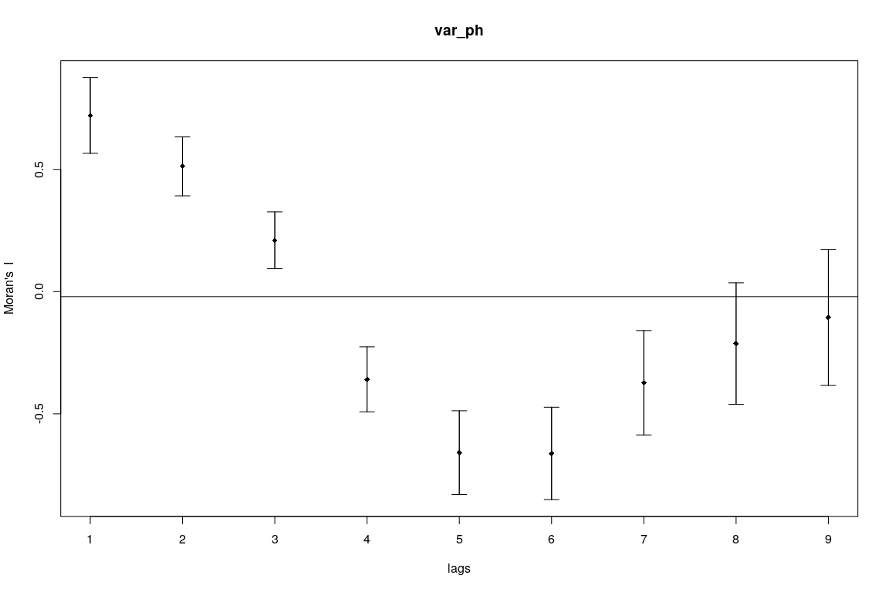
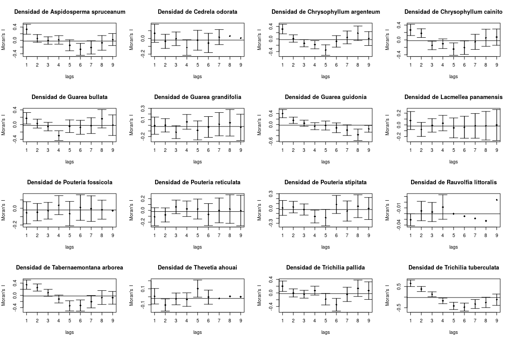

Análisis espacial de datos ecológicos <br> Parte 1: Autocorrelación
================
JR
5 de diciembre, 2020

``` r
knitr::opts_chunk$set(fig.width=12, fig.height=8)
```

## Preámbulo

### Cargar paquetes

``` r
library(ape)
library(spdep)
```

    ## Loading required package: sp

    ## Loading required package: spData

    ## To access larger datasets in this package, install the spDataLarge
    ## package with: `install.packages('spDataLarge',
    ## repos='https://nowosad.github.io/drat/', type='source')`

    ## Loading required package: sf

    ## Linking to GEOS 3.6.2, GDAL 2.2.3, PROJ 4.9.3

    ## Registered S3 method overwritten by 'spdep':
    ##   method   from
    ##   plot.mst ape

``` r
library(ade4)
```

    ## 
    ## Attaching package: 'ade4'

    ## The following object is masked from 'package:spdep':
    ## 
    ##     mstree

``` r
library(adegraphics)
```

    ## Registered S3 methods overwritten by 'adegraphics':
    ##   method         from
    ##   biplot.dudi    ade4
    ##   kplot.foucart  ade4
    ##   kplot.mcoa     ade4
    ##   kplot.mfa      ade4
    ##   kplot.pta      ade4
    ##   kplot.sepan    ade4
    ##   kplot.statis   ade4
    ##   scatter.coa    ade4
    ##   scatter.dudi   ade4
    ##   scatter.nipals ade4
    ##   scatter.pco    ade4
    ##   score.acm      ade4
    ##   score.mix      ade4
    ##   score.pca      ade4
    ##   screeplot.dudi ade4

    ## 
    ## Attaching package: 'adegraphics'

    ## The following objects are masked from 'package:ade4':
    ## 
    ##     kplotsepan.coa, s.arrow, s.class, s.corcircle, s.distri,
    ##     s.image, s.label, s.logo, s.match, s.traject, s.value,
    ##     table.value, triangle.class

    ## The following object is masked from 'package:ape':
    ## 
    ##     zoom

``` r
library(adespatial)
```

    ## Registered S3 methods overwritten by 'adespatial':
    ##   method             from       
    ##   plot.multispati    adegraphics
    ##   print.multispati   ade4       
    ##   summary.multispati ade4

    ## 
    ## Attaching package: 'adespatial'

    ## The following object is masked from 'package:ade4':
    ## 
    ##     multispati

``` r
library(vegan)
```

    ## Loading required package: permute

    ## Loading required package: lattice

    ## This is vegan 2.5-6

``` r
library(tidyverse)
```

    ## ── Attaching packages ───────────────────────────── tidyverse 1.2.1 ──

    ## ✓ ggplot2 3.3.2     ✓ purrr   0.3.4
    ## ✓ tibble  3.0.3     ✓ dplyr   0.8.3
    ## ✓ tidyr   1.0.0     ✓ stringr 1.4.0
    ## ✓ readr   1.3.1     ✓ forcats 0.4.0

    ## ── Conflicts ──────────────────────────────── tidyverse_conflicts() ──
    ## x dplyr::filter() masks stats::filter()
    ## x dplyr::lag()    masks stats::lag()

``` r
library(sf)
source('biodata/funciones.R')
```

### Cargar datos

``` r
load('biodata/Apocynaceae-Meliaceae-Sapotaceae.Rdata')
load('biodata/matriz_ambiental.Rdata')
mi_fam <- mc_apcyn_melic_saptc
bci_env_grid %>% tibble
```

    ## # A tibble: 50 x 39
    ##       id categoria_de_ed… geologia habitat quebrada heterogeneidad_… UTM.EW
    ##    <dbl> <fct>            <fct>    <fct>   <fct>               <dbl>  <dbl>
    ##  1     1 c3               Tb       OldSlo… Yes                0.627  6.26e5
    ##  2     2 c3               Tb       OldLow  Yes                0.394  6.26e5
    ##  3     3 c3               Tb       OldLow  No                 0      6.26e5
    ##  4     4 c3               Tb       OldLow  No                 0      6.26e5
    ##  5     5 c3               Tb       OldSlo… No                 0.461  6.26e5
    ##  6     6 c3               Tb       OldLow  No                 0.0768 6.26e5
    ##  7     7 c3               Tb       OldLow  Yes                0.381  6.26e5
    ##  8     8 c3               Tb       OldLow  Yes                0.211  6.26e5
    ##  9     9 c3               Tb       OldLow  No                 0      6.26e5
    ## 10    10 c3               Tb       OldLow  No                 0      6.26e5
    ## # … with 40 more rows, and 32 more variables: UTM.NS <dbl>,
    ## #   geomorf_llanura_pct <dbl>, geomorf_pico_pct <dbl>,
    ## #   geomorf_interfluvio_pct <dbl>, geomorf_hombrera_pct <dbl>,
    ## #   `geomorf_espolón/gajo_pct` <dbl>, geomorf_vertiente_pct <dbl>,
    ## #   geomorf_vaguada_pct <dbl>, geomorf_piedemonte_pct <dbl>,
    ## #   geomorf_valle_pct <dbl>, geomorf_sima_pct <dbl>, Al <dbl>, B <dbl>,
    ## #   Ca <dbl>, Cu <dbl>, Fe <dbl>, K <dbl>, Mg <dbl>, Mn <dbl>, P <dbl>,
    ## #   Zn <dbl>, N <dbl>, N.min. <dbl>, pH <dbl>, elevacion_media <dbl>,
    ## #   pendiente_media <dbl>, orientacion_media <dbl>,
    ## #   curvatura_perfil_media <dbl>, curvatura_tangencial_media <dbl>,
    ## #   geometry <POLYGON [m]>, abundancia_global <dbl>, riqueza_global <int>

``` r
bci_env_grid_sp <- bci_env_grid %>% as_Spatial
centroides <- bci_env_grid %>% st_centroid
```

    ## Warning in st_centroid.sf(.): st_centroid assumes attributes are constant
    ## over geometries of x

``` r
bci_xy <- centroides %>% st_coordinates %>% as.data.frame
vecindad <- bci_env_grid_sp %>% poly2nb
```

## Autocorrelación variable ambiental

``` r
mi_fam_hel <- decostand (mi_fam, "hellinger")
plot(bci_env_grid_sp)
plot(vecindad, coords = bci_xy, add=T, col = 'red')
```

<!-- -->

``` r
var_ph <- bci_env_grid %>% st_drop_geometry %>% pull(pH)
ph_correl <- sp.correlogram(vecindad,
                            var_ph,
                            order = 9,
                            method = "I",
                            zero.policy = TRUE)
print(ph_correl, p.adj.method = 'holm')
```

    ## Spatial correlogram for var_ph 
    ## method: Moran's I
    ##          estimate expectation   variance standard deviate Pr(I) two sided
    ## 1 (50)  0.7206808  -0.0204082  0.0060009           9.5667       < 2.2e-16
    ## 2 (50)  0.5123785  -0.0204082  0.0036285           8.8448       < 2.2e-16
    ## 3 (50)  0.2099793  -0.0204082  0.0033715           3.9678       0.0002902
    ## 4 (50) -0.3586281  -0.0204082  0.0044141          -5.0907       1.784e-06
    ## 5 (50) -0.6585951  -0.0204082  0.0073237          -7.4573       6.182e-13
    ## 6 (40) -0.6618167  -0.0256410  0.0089300          -6.7321       1.003e-10
    ## 7 (30) -0.3727208  -0.0344828  0.0113908          -3.1692       0.0045864
    ## 8 (20) -0.2124804  -0.0526316  0.0154419          -1.2864       0.3966415
    ## 9 (10) -0.1056156  -0.1111111  0.0193348           0.0395       0.9684743
    ##           
    ## 1 (50) ***
    ## 2 (50) ***
    ## 3 (50) ***
    ## 4 (50) ***
    ## 5 (50) ***
    ## 6 (40) ***
    ## 7 (30) ** 
    ## 8 (20)    
    ## 9 (10)    
    ## ---
    ## Signif. codes:  0 '***' 0.001 '**' 0.01 '*' 0.05 '.' 0.1 ' ' 1

``` r
plot(ph_correl)
```

<!-- -->

## Autocorrelación densidad de individuos por especies

``` r
mi_fam %>% colSums %>% sort
```

    ##    Rauvolfia littoralis      Pouteria fossicola         Cedrela odorata 
    ##                       1                       3                      12 
    ##      Pouteria stipitata      Guarea grandifolia         Thevetia ahouai 
    ##                      60                      65                      84 
    ##    Lacmellea panamensis   Chrysophyllum cainito       Trichilia pallida 
    ##                     102                     171                     472 
    ## Aspidosperma spruceanum Chrysophyllum argenteum          Guarea bullata 
    ##                     473                     711                     725 
    ##     Pouteria reticulata Tabernaemontana arborea         Guarea guidonia 
    ##                    1084                    1732                    1889 
    ##   Trichilia tuberculata 
    ##                   10842

``` r
auto_spp <- calcular_autocorrelacion_especies(
  mc = mi_fam,
  area_sitio = 100,
  orden = 9)
```

    ## Warning in moran.test(var, listw, randomisation = randomisation, zero.policy = zero.policy): Kurtosis overflow,
    ## distribution of variable does not meet test assumptions

    ## Warning in moran.test(var, listw, randomisation = randomisation, zero.policy = zero.policy): Negative variance,
    ## distribution of variable does not meet test assumptions

    ## Warning in sqrt(VI): NaNs produced

    ## Warning in moran.test(var, listw, randomisation = randomisation,
    ## zero.policy = zero.policy): Out-of-range p-value: reconsider test arguments

    ## Warning in moran.test(var, listw, randomisation = randomisation, zero.policy = zero.policy): Kurtosis overflow,
    ## distribution of variable does not meet test assumptions

    ## Warning in moran.test(var, listw, randomisation = randomisation, zero.policy = zero.policy): Negative variance,
    ## distribution of variable does not meet test assumptions

    ## Warning in sqrt(VI): NaNs produced

    ## Warning in moran.test(var, listw, randomisation = randomisation,
    ## zero.policy = zero.policy): Out-of-range p-value: reconsider test arguments

    ## Warning in moran.test(var, listw, randomisation = randomisation, zero.policy = zero.policy): Kurtosis overflow,
    ## distribution of variable does not meet test assumptions

    ## Warning in moran.test(var, listw, randomisation = randomisation, zero.policy = zero.policy): Negative variance,
    ## distribution of variable does not meet test assumptions

    ## Warning in sqrt(VI): NaNs produced

    ## Warning in moran.test(var, listw, randomisation = randomisation,
    ## zero.policy = zero.policy): Out-of-range p-value: reconsider test arguments

    ## Warning in moran.test(var, listw, randomisation = randomisation, zero.policy = zero.policy): Kurtosis overflow,
    ## distribution of variable does not meet test assumptions

    ## Warning in moran.test(var, listw, randomisation = randomisation, zero.policy = zero.policy): Negative variance,
    ## distribution of variable does not meet test assumptions

    ## Warning in sqrt(VI): NaNs produced

    ## Warning in moran.test(var, listw, randomisation = randomisation,
    ## zero.policy = zero.policy): Out-of-range p-value: reconsider test arguments

    ## Warning in moran.test(var, listw, randomisation = randomisation, zero.policy = zero.policy): Kurtosis overflow,
    ## distribution of variable does not meet test assumptions

    ## Warning in moran.test(var, listw, randomisation = randomisation, zero.policy = zero.policy): Negative variance,
    ## distribution of variable does not meet test assumptions

    ## Warning in sqrt(VI): NaNs produced

    ## Warning in moran.test(var, listw, randomisation = randomisation,
    ## zero.policy = zero.policy): Out-of-range p-value: reconsider test arguments

    ## Warning in moran.test(var, listw, randomisation = randomisation, zero.policy = zero.policy): Kurtosis overflow,
    ## distribution of variable does not meet test assumptions

    ## Warning in moran.test(var, listw, randomisation = randomisation, zero.policy = zero.policy): Negative variance,
    ## distribution of variable does not meet test assumptions

    ## Warning in sqrt(VI): NaNs produced

    ## Warning in moran.test(var, listw, randomisation = randomisation,
    ## zero.policy = zero.policy): Out-of-range p-value: reconsider test arguments

    ## Warning in moran.test(var, listw, randomisation = randomisation, zero.policy = zero.policy): Kurtosis overflow,
    ## distribution of variable does not meet test assumptions

    ## Warning in moran.test(var, listw, randomisation = randomisation, zero.policy = zero.policy): Negative variance,
    ## distribution of variable does not meet test assumptions

    ## Warning in sqrt(VI): NaNs produced

    ## Warning in moran.test(var, listw, randomisation = randomisation,
    ## zero.policy = zero.policy): Out-of-range p-value: reconsider test arguments

    ## Warning in moran.test(var, listw, randomisation = randomisation, zero.policy = zero.policy): Negative variance,
    ## distribution of variable does not meet test assumptions

    ## Warning in sqrt(VI): NaNs produced

    ## Warning in moran.test(var, listw, randomisation = randomisation,
    ## zero.policy = zero.policy): Out-of-range p-value: reconsider test arguments

    ## Warning in moran.test(var, listw, randomisation = randomisation, zero.policy = zero.policy): Kurtosis overflow,
    ## distribution of variable does not meet test assumptions

    ## Warning in moran.test(var, listw, randomisation = randomisation, zero.policy = zero.policy): Negative variance,
    ## distribution of variable does not meet test assumptions

    ## Warning in sqrt(VI): NaNs produced

    ## Warning in moran.test(var, listw, randomisation = randomisation,
    ## zero.policy = zero.policy): Out-of-range p-value: reconsider test arguments

    ## Warning in moran.test(var, listw, randomisation = randomisation, zero.policy = zero.policy): Kurtosis overflow,
    ## distribution of variable does not meet test assumptions

    ## Warning in moran.test(var, listw, randomisation = randomisation, zero.policy = zero.policy): Negative variance,
    ## distribution of variable does not meet test assumptions

    ## Warning in sqrt(VI): NaNs produced

    ## Warning in moran.test(var, listw, randomisation = randomisation,
    ## zero.policy = zero.policy): Out-of-range p-value: reconsider test arguments

``` r
print(auto_spp, p.adj.method = 'holm')
```

    ## $`Aspidosperma spruceanum`
    ## Spatial correlogram for Densidad de Aspidosperma spruceanum 
    ## method: Moran's I
    ##          estimate expectation   variance standard deviate Pr(I) two sided
    ## 1 (50)  0.3334223  -0.0204082  0.0055462           4.7511        1.82e-05
    ## 2 (50)  0.0594391  -0.0204082  0.0033578           1.3780         0.75855
    ## 3 (50) -0.0043122  -0.0204082  0.0031201           0.2882         1.00000
    ## 4 (50)  0.0142432  -0.0204082  0.0040868           0.5420         1.00000
    ## 5 (50) -0.1461256  -0.0204082  0.0067662          -1.5284         0.75855
    ## 6 (40) -0.2676105  -0.0256410  0.0080614          -2.6950         0.05632
    ## 7 (30) -0.2106536  -0.0344828  0.0098574          -1.7744         0.53197
    ## 8 (20) -0.0744869  -0.0526316  0.0120688          -0.1989         1.00000
    ## 9 (10)  0.0259804  -0.1111111  0.0082173           1.5123         0.75855
    ##           
    ## 1 (50) ***
    ## 2 (50)    
    ## 3 (50)    
    ## 4 (50)    
    ## 5 (50)    
    ## 6 (40) .  
    ## 7 (30)    
    ## 8 (20)    
    ## 9 (10)    
    ## ---
    ## Signif. codes:  0 '***' 0.001 '**' 0.01 '*' 0.05 '.' 0.1 ' ' 1
    ## 
    ## $`Cedrela odorata`
    ## Spatial correlogram for Densidad de Cedrela odorata 
    ## method: Moran's I

    ## Warning in sqrt(res[, 3]): NaNs produced

    ##          estimate expectation   variance standard deviate Pr(I) two sided
    ## 1 (50)  0.0657197  -0.0204082  0.0033133           1.4963          0.8075
    ## 2 (50) -0.0368976  -0.0204082  0.0020281          -0.3661          1.0000
    ## 3 (50) -0.0040223  -0.0204082  0.0018858           0.3773          1.0000
    ## 4 (50) -0.1155091  -0.0204082  0.0024794          -1.9099          0.3930
    ## 5 (50) -0.0227273  -0.0204082  0.0040283          -0.0365          1.0000
    ## 6 (40) -0.0575758  -0.0256410  0.0037964          -0.5183          1.0000
    ## 7 (30)  0.0174242  -0.0344828  0.0023276           1.0759          1.0000
    ## 8 (20)  0.0318182  -0.0526316 -0.0044945               NA              NA
    ## 9 (10)  0.0045455  -0.1111111 -0.0463737               NA              NA
    ## 
    ## $`Chrysophyllum argenteum`
    ## Spatial correlogram for Densidad de Chrysophyllum argenteum 
    ## method: Moran's I
    ##          estimate expectation   variance standard deviate Pr(I) two sided
    ## 1 (50)  0.3153844  -0.0204082  0.0057108           4.4435       7.967e-05
    ## 2 (50)  0.0150272  -0.0204082  0.0034558           0.6028       1.0000000
    ## 3 (50) -0.1373820  -0.0204082  0.0032111          -2.0642       0.2339723
    ## 4 (50) -0.1829262  -0.0204082  0.0042053          -2.5061       0.0854455
    ## 5 (50) -0.3533115  -0.0204082  0.0069681          -3.9881       0.0005329
    ## 6 (40) -0.0767710  -0.0256410  0.0083759          -0.5587       1.0000000
    ## 7 (30)  0.0492133  -0.0344828  0.0104126           0.8202       1.0000000
    ## 8 (20)  0.1811453  -0.0526316  0.0132902           2.0279       0.2339723
    ## 9 (10)  0.0125240  -0.1111111  0.0122429           1.1174       1.0000000
    ##           
    ## 1 (50) ***
    ## 2 (50)    
    ## 3 (50)    
    ## 4 (50) .  
    ## 5 (50) ***
    ## 6 (40)    
    ## 7 (30)    
    ## 8 (20)    
    ## 9 (10)    
    ## ---
    ## Signif. codes:  0 '***' 0.001 '**' 0.01 '*' 0.05 '.' 0.1 ' ' 1
    ## 
    ## $`Chrysophyllum cainito`
    ## Spatial correlogram for Densidad de Chrysophyllum cainito 
    ## method: Moran's I
    ##          estimate expectation   variance standard deviate Pr(I) two sided
    ## 1 (50)  0.2690276  -0.0204082  0.0057016           3.8331        0.001139
    ## 2 (50)  0.1816888  -0.0204082  0.0034503           3.4406        0.004644
    ## 3 (50) -0.1493012  -0.0204082  0.0032060          -2.2764        0.136939
    ## 4 (50) -0.1024693  -0.0204082  0.0041987          -1.2664        0.616080
    ## 5 (50) -0.2475606  -0.0204082  0.0069568          -2.7234        0.045228
    ## 6 (40) -0.2084440  -0.0256410  0.0083583          -1.9995        0.227766
    ## 7 (30) -0.0526155  -0.0344828  0.0103816          -0.1780        0.858751
    ## 8 (20)  0.0578990  -0.0526316  0.0132218           0.9613        0.672850
    ## 9 (10)  0.0750250  -0.1111111  0.0120175           1.6979        0.358071
    ##          
    ## 1 (50) **
    ## 2 (50) **
    ## 3 (50)   
    ## 4 (50)   
    ## 5 (50) * 
    ## 6 (40)   
    ## 7 (30)   
    ## 8 (20)   
    ## 9 (10)   
    ## ---
    ## Signif. codes:  0 '***' 0.001 '**' 0.01 '*' 0.05 '.' 0.1 ' ' 1
    ## 
    ## $`Guarea bullata`
    ## Spatial correlogram for Densidad de Guarea bullata 
    ## method: Moran's I
    ##          estimate expectation   variance standard deviate Pr(I) two sided
    ## 1 (50)  0.1725370  -0.0204082  0.0060042           2.4900       0.1021850
    ## 2 (50)  0.0277658  -0.0204082  0.0036305           0.7995       1.0000000
    ## 3 (50) -0.0525828  -0.0204082  0.0033733          -0.5540       1.0000000
    ## 4 (50) -0.2988702  -0.0204082  0.0044165          -4.1901       0.0002509
    ## 5 (50) -0.0433693  -0.0204082  0.0073278          -0.2682       1.0000000
    ## 6 (40) -0.0721985  -0.0256410  0.0089364          -0.4925       1.0000000
    ## 7 (30) -0.0267235  -0.0344828  0.0114021           0.0727       1.0000000
    ## 8 (20)  0.1601404  -0.0526316  0.0154666           1.7109       0.6097327
    ## 9 (10) -0.0147907  -0.1111111  0.0194161           0.6913       1.0000000
    ##           
    ## 1 (50)    
    ## 2 (50)    
    ## 3 (50)    
    ## 4 (50) ***
    ## 5 (50)    
    ## 6 (40)    
    ## 7 (30)    
    ## 8 (20)    
    ## 9 (10)    
    ## ---
    ## Signif. codes:  0 '***' 0.001 '**' 0.01 '*' 0.05 '.' 0.1 ' ' 1
    ## 
    ## $`Guarea grandifolia`
    ## Spatial correlogram for Densidad de Guarea grandifolia 
    ## method: Moran's I
    ##           estimate expectation    variance standard deviate
    ## 1 (50) -6.5873e-03 -2.0408e-02  5.7651e-03           0.1820
    ## 2 (50) -7.8678e-05 -2.0408e-02  3.4881e-03           0.3442
    ## 3 (50) -1.2070e-01 -2.0408e-02  3.2411e-03          -1.7616
    ## 4 (50)  6.1100e-02 -2.0408e-02  4.2444e-03           1.2511
    ## 5 (50) -8.9947e-02 -2.0408e-02  7.0346e-03          -0.8291
    ## 6 (40) -2.9630e-02 -2.5641e-02  8.4796e-03          -0.0433
    ## 7 (30)  2.0106e-02 -3.4483e-02  1.0596e-02           0.5303
    ## 8 (20)  4.4444e-02 -5.2632e-02  1.3693e-02           0.8296
    ## 9 (10) -3.7037e-02 -1.1111e-01  1.3570e-02           0.6359
    ##        Pr(I) two sided
    ## 1 (50)          1.0000
    ## 2 (50)          1.0000
    ## 3 (50)          0.7032
    ## 4 (50)          1.0000
    ## 5 (50)          1.0000
    ## 6 (40)          1.0000
    ## 7 (30)          1.0000
    ## 8 (20)          1.0000
    ## 9 (10)          1.0000
    ## 
    ## $`Guarea guidonia`
    ## Spatial correlogram for Densidad de Guarea guidonia 
    ## method: Moran's I
    ##          estimate expectation   variance standard deviate Pr(I) two sided
    ## 1 (50)  0.3963420  -0.0204082  0.0053629           5.6908       1.138e-07
    ## 2 (50)  0.1549554  -0.0204082  0.0032486           3.0767         0.01674
    ## 3 (50)  0.0505133  -0.0204082  0.0030188           1.2908         0.98386
    ## 4 (50) -0.0564271  -0.0204082  0.0039549          -0.5727         1.00000
    ## 5 (50) -0.0325385  -0.0204082  0.0065415          -0.1500         1.00000
    ## 6 (40) -0.1139056  -0.0256410  0.0077114          -1.0051         1.00000
    ## 7 (30) -0.2004171  -0.0344828  0.0092394          -1.7263         0.50577
    ## 8 (20) -0.3679444  -0.0526316  0.0107094          -3.0469         0.01674
    ## 9 (10) -0.1508409  -0.1111111  0.0037371          -0.6499         1.00000
    ##           
    ## 1 (50) ***
    ## 2 (50) *  
    ## 3 (50)    
    ## 4 (50)    
    ## 5 (50)    
    ## 6 (40)    
    ## 7 (30)    
    ## 8 (20) *  
    ## 9 (10)    
    ## ---
    ## Signif. codes:  0 '***' 0.001 '**' 0.01 '*' 0.05 '.' 0.1 ' ' 1
    ## 
    ## $`Lacmellea panamensis`
    ## Spatial correlogram for Densidad de Lacmellea panamensis 
    ## method: Moran's I
    ##          estimate expectation   variance standard deviate Pr(I) two sided
    ## 1 (50)  0.0741265  -0.0204082  0.0059297           1.2277               1
    ## 2 (50) -0.0777475  -0.0204082  0.0035861          -0.9575               1
    ## 3 (50) -0.0091337  -0.0204082  0.0033321           0.1953               1
    ## 4 (50)  0.0303279  -0.0204082  0.0043629           0.7681               1
    ## 5 (50) -0.0515604  -0.0204082  0.0072364          -0.3662               1
    ## 6 (40) -0.0408412  -0.0256410  0.0087940          -0.1621               1
    ## 7 (30) -0.0165536  -0.0344828  0.0111507           0.1698               1
    ## 8 (20) -0.0146540  -0.0526316  0.0149136           0.3110               1
    ## 9 (10) -0.0032564  -0.1111111  0.0175935           0.8131               1
    ## 
    ## $`Pouteria fossicola`
    ## Spatial correlogram for Densidad de Pouteria fossicola 
    ## method: Moran's I

    ## Warning in sqrt(res[, 3]): NaNs produced

    ##          estimate expectation   variance standard deviate Pr(I) two sided
    ## 1 (50) -0.0537234  -0.0204082  0.0043506          -0.5051               1
    ## 2 (50) -0.0460993  -0.0204082  0.0026458          -0.4995               1
    ## 3 (50) -0.0296054  -0.0204082  0.0024592          -0.1855               1
    ## 4 (50)  0.0369614  -0.0204082  0.0032261           1.0101               1
    ## 5 (50) -0.0638298  -0.0204082  0.0053002          -0.5964               1
    ## 6 (40)  0.0085106  -0.0256410  0.0057777           0.4493               1
    ## 7 (30) -0.0042553  -0.0344828  0.0058255           0.3960               1
    ## 8 (20) -0.0170213  -0.0526316  0.0031999           0.6295               1
    ## 9 (10) -0.0297872  -0.1111111 -0.0210139               NA              NA
    ## 
    ## $`Pouteria reticulata`
    ## Spatial correlogram for Densidad de Pouteria reticulata 
    ## method: Moran's I
    ##           estimate expectation    variance standard deviate
    ## 1 (50) -0.10888462 -0.02040816  0.00590382          -1.1515
    ## 2 (50) -0.07742723 -0.02040816  0.00357072          -0.9542
    ## 3 (50)  0.05937824 -0.02040816  0.00331782           1.3852
    ## 4 (50)  0.02739230 -0.02040816  0.00434426           0.7252
    ## 5 (50)  0.02291582 -0.02040816  0.00720470           0.5104
    ## 6 (40) -0.07119587 -0.02564103  0.00874456          -0.4872
    ## 7 (30) -0.00054634 -0.03448276  0.01106343           0.3226
    ## 8 (20)  0.02229866 -0.05263158  0.01472169           0.6176
    ## 9 (10) -0.00210441 -0.11111111  0.01696110           0.8370
    ##        Pr(I) two sided
    ## 1 (50)               1
    ## 2 (50)               1
    ## 3 (50)               1
    ## 4 (50)               1
    ## 5 (50)               1
    ## 6 (40)               1
    ## 7 (30)               1
    ## 8 (20)               1
    ## 9 (10)               1
    ## 
    ## $`Pouteria stipitata`
    ## Spatial correlogram for Densidad de Pouteria stipitata 
    ## method: Moran's I
    ##           estimate expectation    variance standard deviate
    ## 1 (50)  1.2173e-02 -2.0408e-02  5.7252e-03           0.4306
    ## 2 (50)  2.8935e-02 -2.0408e-02  3.4643e-03           0.8383
    ## 3 (50) -2.0216e-02 -2.0408e-02  3.2191e-03           0.0034
    ## 4 (50) -1.6227e-01 -2.0408e-02  4.2157e-03          -2.1850
    ## 5 (50) -1.8431e-01 -2.0408e-02  6.9857e-03          -1.9611
    ## 6 (40)  8.2353e-02 -2.5641e-02  8.4033e-03           1.1781
    ## 7 (30) -5.0980e-02 -3.4483e-02  1.0461e-02          -0.1613
    ## 8 (20)  4.7059e-02 -5.2632e-02  1.3397e-02           0.8613
    ## 9 (10)  1.3021e-18 -1.1111e-01  1.2593e-02           0.9901
    ##        Pr(I) two sided
    ## 1 (50)           1.000
    ## 2 (50)           1.000
    ## 3 (50)           1.000
    ## 4 (50)           0.260
    ## 5 (50)           0.399
    ## 6 (40)           1.000
    ## 7 (30)           1.000
    ## 8 (20)           1.000
    ## 9 (10)           1.000
    ## 
    ## $`Rauvolfia littoralis`
    ## Spatial correlogram for Densidad de Rauvolfia littoralis 
    ## method: Moran's I

    ## Warning in sqrt(res[, 3]): NaNs produced

    ##           estimate expectation    variance standard deviate
    ## 1 (50) -3.0782e-02 -2.0408e-02  2.7954e-05          -1.9622
    ## 2 (50) -1.5426e-02 -2.0408e-02  7.1776e-05           0.5881
    ## 3 (50) -1.7206e-02 -2.0408e-02  6.9697e-05           0.3836
    ## 4 (50) -8.5234e-03 -2.0408e-02  1.1427e-04           1.1118
    ## 5 (50) -2.0408e-02 -2.0408e-02  2.1142e-18           0.0000
    ## 6 (40) -2.4490e-02 -2.5641e-02 -2.4789e-03               NA
    ## 7 (30) -2.8571e-02 -3.4483e-02 -8.7514e-03               NA
    ## 8 (20) -3.2653e-02 -5.2632e-02 -2.8865e-02               NA
    ## 9 (10)  4.0816e-03 -1.1111e-01 -1.2670e-01               NA
    ##        Pr(I) two sided
    ## 1 (50)          0.2487
    ## 2 (50)          1.0000
    ## 3 (50)          1.0000
    ## 4 (50)          1.0000
    ## 5 (50)          1.0000
    ## 6 (40)              NA
    ## 7 (30)              NA
    ## 8 (20)              NA
    ## 9 (10)              NA
    ## 
    ## $`Tabernaemontana arborea`
    ## Spatial correlogram for Densidad de Tabernaemontana arborea 
    ## method: Moran's I
    ##          estimate expectation   variance standard deviate Pr(I) two sided
    ## 1 (50)  0.3497820  -0.0204082  0.0056535           4.9234       7.655e-06
    ## 2 (50)  0.2557092  -0.0204082  0.0034217           4.7203       1.884e-05
    ## 3 (50)  0.0849109  -0.0204082  0.0031795           1.8678       0.3089509
    ## 4 (50) -0.1190721  -0.0204082  0.0041641          -1.5290       0.3788160
    ## 5 (50) -0.3424714  -0.0204082  0.0068978          -3.8778       0.0007378
    ## 6 (40) -0.3316032  -0.0256410  0.0082665          -3.3652       0.0045898
    ## 7 (30) -0.2071161  -0.0344828  0.0102194          -1.7077       0.3507697
    ## 8 (20) -0.0704604  -0.0526316  0.0128652          -0.1572       1.0000000
    ## 9 (10) -0.0795337  -0.1111111  0.0108422           0.3033       1.0000000
    ##           
    ## 1 (50) ***
    ## 2 (50) ***
    ## 3 (50)    
    ## 4 (50)    
    ## 5 (50) ***
    ## 6 (40) ** 
    ## 7 (30)    
    ## 8 (20)    
    ## 9 (10)    
    ## ---
    ## Signif. codes:  0 '***' 0.001 '**' 0.01 '*' 0.05 '.' 0.1 ' ' 1
    ## 
    ## $`Thevetia ahouai`
    ## Spatial correlogram for Densidad de Thevetia ahouai 
    ## method: Moran's I

    ## Warning in sqrt(res[, 3]): NaNs produced

    ##           estimate expectation    variance standard deviate
    ## 1 (50)  0.00686344 -0.02040816  0.00233838           0.5640
    ## 2 (50) -0.10170021 -0.02040816  0.00144758          -2.1366
    ## 3 (50) -0.02643127 -0.02040816  0.00134688          -0.1641
    ## 4 (50) -0.03481167 -0.02040816  0.00177753          -0.3416
    ## 5 (50)  0.10235739 -0.02040816  0.00283293           2.3065
    ## 6 (40) -0.00449238 -0.02564103  0.00193422           0.4809
    ## 7 (30) -0.02188369 -0.03448276 -0.00096006               NA
    ## 8 (20)  0.00464806 -0.05263158 -0.01172628               NA
    ## 9 (10) -0.00023351 -0.11111111 -0.07020924               NA
    ##        Pr(I) two sided
    ## 1 (50)          1.0000
    ## 2 (50)          0.1631
    ## 3 (50)          1.0000
    ## 4 (50)          1.0000
    ## 5 (50)          0.1265
    ## 6 (40)          1.0000
    ## 7 (30)              NA
    ## 8 (20)              NA
    ## 9 (10)              NA
    ## 
    ## $`Trichilia pallida`
    ## Spatial correlogram for Densidad de Trichilia pallida 
    ## method: Moran's I
    ##           estimate expectation    variance standard deviate
    ## 1 (50)  0.19900583 -0.02040816  0.00590133           2.8562
    ## 2 (50)  0.00060994 -0.02040816  0.00356924           0.3518
    ## 3 (50) -0.03856771 -0.02040816  0.00331644          -0.3153
    ## 4 (50)  0.06806903 -0.02040816  0.00434246           1.3427
    ## 5 (50) -0.18557603 -0.02040816  0.00720164          -1.9463
    ## 6 (40) -0.34850746 -0.02564103  0.00873980          -3.4536
    ## 7 (30) -0.04283465 -0.03448276  0.01105503          -0.0794
    ## 8 (20)  0.13801306 -0.05263158  0.01470321           1.5722
    ## 9 (10)  0.06772388 -0.11111111  0.01690020           1.3756
    ##        Pr(I) two sided   
    ## 1 (50)        0.034299 * 
    ## 2 (50)        1.000000   
    ## 3 (50)        1.000000   
    ## 4 (50)        0.844657   
    ## 5 (50)        0.361331   
    ## 6 (40)        0.004978 **
    ## 7 (30)        1.000000   
    ## 8 (20)        0.695371   
    ## 9 (10)        0.844657   
    ## ---
    ## Signif. codes:  0 '***' 0.001 '**' 0.01 '*' 0.05 '.' 0.1 ' ' 1
    ## 
    ## $`Trichilia tuberculata`
    ## Spatial correlogram for Densidad de Trichilia tuberculata 
    ## method: Moran's I
    ##          estimate expectation   variance standard deviate Pr(I) two sided
    ## 1 (50)  0.6504899  -0.0204082  0.0059390           8.7056       < 2.2e-16
    ## 2 (50)  0.3815519  -0.0204082  0.0035917           6.7071       1.588e-10
    ## 3 (50)  0.1340190  -0.0204082  0.0033373           2.6732         0.03033
    ## 4 (50) -0.1771041  -0.0204082  0.0043696          -2.3705         0.05329
    ## 5 (50) -0.4162258  -0.0204082  0.0072479          -4.6493       1.998e-05
    ## 6 (40) -0.4706130  -0.0256410  0.0088118          -4.7402       1.494e-05
    ## 7 (30) -0.3246746  -0.0344828  0.0111821          -2.7442         0.03033
    ## 8 (20) -0.2494263  -0.0526316  0.0149828          -1.6077         0.21578
    ## 9 (10) -0.1222464  -0.1111111  0.0178216          -0.0834         0.93352
    ##           
    ## 1 (50) ***
    ## 2 (50) ***
    ## 3 (50) *  
    ## 4 (50) .  
    ## 5 (50) ***
    ## 6 (40) ***
    ## 7 (30) *  
    ## 8 (20)    
    ## 9 (10)    
    ## ---
    ## Signif. codes:  0 '***' 0.001 '**' 0.01 '*' 0.05 '.' 0.1 ' ' 1

``` r
dim_panel <- rev(n2mfrow(ncol(mi_fam)))
par(mfrow = dim_panel)
invisible(lapply(auto_spp, function(x) plot(x, main = x$var)))
```

    ## Warning in arrows(lags, x$res[, 1] + sd2, lags, x$res[, 1] - sd2, length =
    ## 0.1, : zero-length arrow is of indeterminate angle and so skipped

    ## Warning in arrows(lags, x$res[, 1] + sd2, lags, x$res[, 1] - sd2, length =
    ## 0.1, : zero-length arrow is of indeterminate angle and so skipped

    ## Warning in arrows(lags, x$res[, 1] - sd2, lags, x$res[, 1] + sd2, length =
    ## 0.1, : zero-length arrow is of indeterminate angle and so skipped
    
    ## Warning in arrows(lags, x$res[, 1] - sd2, lags, x$res[, 1] + sd2, length =
    ## 0.1, : zero-length arrow is of indeterminate angle and so skipped

    ## Warning in arrows(lags, x$res[, 1] + sd2, lags, x$res[, 1] - sd2, length =
    ## 0.1, : zero-length arrow is of indeterminate angle and so skipped

    ## Warning in arrows(lags, x$res[, 1] - sd2, lags, x$res[, 1] + sd2, length =
    ## 0.1, : zero-length arrow is of indeterminate angle and so skipped

    ## Warning in arrows(lags, x$res[, 1] + sd2, lags, x$res[, 1] - sd2, length =
    ## 0.1, : zero-length arrow is of indeterminate angle and so skipped
    
    ## Warning in arrows(lags, x$res[, 1] + sd2, lags, x$res[, 1] - sd2, length =
    ## 0.1, : zero-length arrow is of indeterminate angle and so skipped
    
    ## Warning in arrows(lags, x$res[, 1] + sd2, lags, x$res[, 1] - sd2, length =
    ## 0.1, : zero-length arrow is of indeterminate angle and so skipped
    
    ## Warning in arrows(lags, x$res[, 1] + sd2, lags, x$res[, 1] - sd2, length =
    ## 0.1, : zero-length arrow is of indeterminate angle and so skipped
    
    ## Warning in arrows(lags, x$res[, 1] + sd2, lags, x$res[, 1] - sd2, length =
    ## 0.1, : zero-length arrow is of indeterminate angle and so skipped

    ## Warning in arrows(lags, x$res[, 1] - sd2, lags, x$res[, 1] + sd2, length =
    ## 0.1, : zero-length arrow is of indeterminate angle and so skipped
    
    ## Warning in arrows(lags, x$res[, 1] - sd2, lags, x$res[, 1] + sd2, length =
    ## 0.1, : zero-length arrow is of indeterminate angle and so skipped
    
    ## Warning in arrows(lags, x$res[, 1] - sd2, lags, x$res[, 1] + sd2, length =
    ## 0.1, : zero-length arrow is of indeterminate angle and so skipped
    
    ## Warning in arrows(lags, x$res[, 1] - sd2, lags, x$res[, 1] + sd2, length =
    ## 0.1, : zero-length arrow is of indeterminate angle and so skipped
    
    ## Warning in arrows(lags, x$res[, 1] - sd2, lags, x$res[, 1] + sd2, length =
    ## 0.1, : zero-length arrow is of indeterminate angle and so skipped

    ## Warning in arrows(lags, x$res[, 1] + sd2, lags, x$res[, 1] - sd2, length =
    ## 0.1, : zero-length arrow is of indeterminate angle and so skipped
    
    ## Warning in arrows(lags, x$res[, 1] + sd2, lags, x$res[, 1] - sd2, length =
    ## 0.1, : zero-length arrow is of indeterminate angle and so skipped
    
    ## Warning in arrows(lags, x$res[, 1] + sd2, lags, x$res[, 1] - sd2, length =
    ## 0.1, : zero-length arrow is of indeterminate angle and so skipped

    ## Warning in arrows(lags, x$res[, 1] - sd2, lags, x$res[, 1] + sd2, length =
    ## 0.1, : zero-length arrow is of indeterminate angle and so skipped
    
    ## Warning in arrows(lags, x$res[, 1] - sd2, lags, x$res[, 1] + sd2, length =
    ## 0.1, : zero-length arrow is of indeterminate angle and so skipped
    
    ## Warning in arrows(lags, x$res[, 1] - sd2, lags, x$res[, 1] + sd2, length =
    ## 0.1, : zero-length arrow is of indeterminate angle and so skipped

<!-- -->

Correlograma Mantel

``` r
mi_fam_sin_tendencia <- resid(
  lm(as.matrix(mi_fam_hel) ~ .,
     data = bci_xy))
mi_fam_sin_tendencia_d <- dist(mi_fam_sin_tendencia)
(mi_fam_correlograma <- mantel.correlog(
  mi_fam_sin_tendencia_d,
  XY = bci_xy,
  nperm = 999))
```

    ## 
    ## Mantel Correlogram Analysis
    ## 
    ## Call:
    ##  
    ## mantel.correlog(D.eco = mi_fam_sin_tendencia_d, XY = bci_xy,      nperm = 999) 
    ## 
    ##         class.index     n.dist Mantel.cor Pr(Mantel) Pr(corrected)   
    ## D.cl.1   136.870241 144.000000   0.064513      0.003         0.003 **
    ## D.cl.2   210.610723 376.000000   0.038638      0.076         0.076 . 
    ## D.cl.3   284.351204 390.000000  -0.052374      0.019         0.038 * 
    ## D.cl.4   358.091686 148.000000  -0.042984      0.027         0.057 . 
    ## D.cl.5   431.832168 372.000000  -0.059022      0.026         0.078 . 
    ## D.cl.6   505.572649 266.000000  -0.052373      0.002         0.012 * 
    ## D.cl.7   579.313131 168.000000         NA         NA            NA   
    ## D.cl.8   653.053613 100.000000         NA         NA            NA   
    ## D.cl.9   726.794094 154.000000         NA         NA            NA   
    ## D.cl.10  800.534576  88.000000         NA         NA            NA   
    ## D.cl.11  874.275058  50.000000         NA         NA            NA   
    ## D.cl.12  948.015539  24.000000         NA         NA            NA   
    ## ---
    ## Signif. codes:  0 '***' 0.001 '**' 0.01 '*' 0.05 '.' 0.1 ' ' 1

``` r
summary(mi_fam_correlograma)
```

    ##            Length Class  Mode     
    ## mantel.res 60     -none- numeric  
    ## n.class     1     -none- numeric  
    ## break.pts  13     -none- numeric  
    ## mult        1     -none- character
    ## n.tests     1     -none- numeric  
    ## call        4     -none- call

``` r
plot(mi_fam_correlograma)
```

<!-- -->
