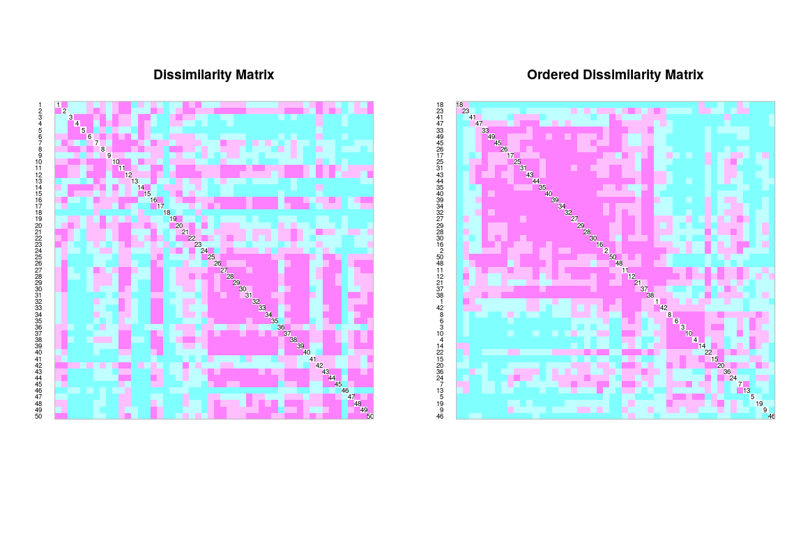

Medición de asociación
================
JR
3 de noviembre, 2020

``` r
knitr::opts_chunk$set(fig.width=12, fig.height=8)
```

## Preámbulo

### Cargar paquetes

``` r
library(ez)
```

    ## Registered S3 methods overwritten by 'lme4':
    ##   method                          from
    ##   cooks.distance.influence.merMod car 
    ##   influence.merMod                car 
    ##   dfbeta.influence.merMod         car 
    ##   dfbetas.influence.merMod        car

``` r
library(psych)
library(vegan)
```

    ## Loading required package: permute

    ## Loading required package: lattice

    ## This is vegan 2.5-6

``` r
library(adespatial)
```

    ## Registered S3 methods overwritten by 'adegraphics':
    ##   method         from
    ##   biplot.dudi    ade4
    ##   kplot.foucart  ade4
    ##   kplot.mcoa     ade4
    ##   kplot.mfa      ade4
    ##   kplot.pta      ade4
    ##   kplot.sepan    ade4
    ##   kplot.statis   ade4
    ##   scatter.coa    ade4
    ##   scatter.dudi   ade4
    ##   scatter.nipals ade4
    ##   scatter.pco    ade4
    ##   score.acm      ade4
    ##   score.mix      ade4
    ##   score.pca      ade4
    ##   screeplot.dudi ade4

    ## Registered S3 method overwritten by 'spdep':
    ##   method   from
    ##   plot.mst ape

    ## Registered S3 methods overwritten by 'adespatial':
    ##   method             from       
    ##   plot.multispati    adegraphics
    ##   print.multispati   ade4       
    ##   summary.multispati ade4

``` r
library(broom)
library(tidyverse)
```

    ## ── Attaching packages ─────────────────────────────────────── tidyverse 1.2.1 ──

    ## ✓ ggplot2 3.3.2     ✓ purrr   0.3.4
    ## ✓ tibble  3.0.3     ✓ dplyr   0.8.3
    ## ✓ tidyr   1.0.0     ✓ stringr 1.4.0
    ## ✓ readr   1.3.1     ✓ forcats 0.4.0

    ## ── Conflicts ────────────────────────────────────────── tidyverse_conflicts() ──
    ## x ggplot2::%+%()   masks psych::%+%()
    ## x ggplot2::alpha() masks psych::alpha()
    ## x dplyr::filter()  masks stats::filter()
    ## x dplyr::lag()     masks stats::lag()

``` r
library(sf)
```

    ## Linking to GEOS 3.6.2, GDAL 2.2.3, PROJ 4.9.3

``` r
source('biodata/funciones.R')
```

### Cargar datos

``` r
load('biodata/matriz_ambiental.Rdata')
load('biodata/Apocynaceae-Meliaceae-Sapotaceae.Rdata')
```

## Principales categorías de medidas de asociación: modos Q y R

En modo Q mides asociación entre pares de objetos, como por ejemplo, dos
sitios de muestreo. Por lo tanto, en este caso, mides la asociación por
medio de **la disimilaridad y la similaridad** entre pares de objetos,
usando métricas como la **distancia euclídea o la similaridad de
Jaccard**.

En cambio, en modo R, mides asociación entre pares de descriptores, como
por ejemplo, dos variables, o dos especies (como variables). En este
caso mides la asociación por medio de **la dependencia entre
variables**, usando por ejemplo la **covarianza o el índice de
correlación**.

## Modo Q: matrices de disimilaridad entre objetos

### Modo Q para datos cuantitativos de especies (abundancia)

**Las matrices de disimilaridad son matrices de distancia**. La
disimilaridad (D) también la puedes obtener a partir de la similaridad
(S), aplicando la fórmula D = 1 - S, y viceversa, S = 1 - D.

#### La paradoja de Orlóci

``` r
(mc_orloci <- tibble(
  sp1 = c(0, 1, 0),
  sp2 = c(1, 0, 4),
  sp3 = c(1, 0, 8),
  sitio = paste0('sit', 1:3)) %>% 
    column_to_rownames('sitio'))
```

    ##      sp1 sp2 sp3
    ## sit1   0   1   1
    ## sit2   1   0   0
    ## sit3   0   4   8

Las matrices de distancia normalmente se muestran de la siguiente
manera:

``` r
(dist.ldc(mc_orloci, "euclidean", silent = T))
```

    ##          sit1     sit2
    ## sit2 1.732051         
    ## sit3 7.615773 9.000000

Sin embargo, para facilitar la lectura de las distancias, en esta
explicación ordeneré las matrices de distancia en columnas, usando la
función de ayuda `organizar_matriz_distancia`. La primera que generaré
es la de distancias euclideas a partir de datos brutos:

``` r
(d_euc <- dist.ldc(mc_orloci, "euclidean", silent = T) %>%
  organizar_matriz_distancia(func_dist = 'Euclidean'))
```

    ## # A tibble: 1 x 4
    ##   `Funcion de distancia` `D(sit1, sit2)` `D(sit1, sit3)` `D(sit2, sit3)`
    ##   <chr>                            <dbl>           <dbl>           <dbl>
    ## 1 Euclidean                         1.73            7.62               9

Siendo los sitios 1 y 2 tan diferentes en cuanto a las especies que los
componen (no comparten especies de hecho), ¿por qué están tan próximos?
Asimismo, los sitios 1 y 3 comparten especies, entonces, ¿por qué están
tan distantes (=disímiles)? La explicación se atribuye a los ceros y a
los valores de abundancia extremos. El hecho de que un par de sitios
registren varias ausencias (o pseudo-ausencias), hace que “aparezcan”
muy próximos (similares) en el espacio euclídeo. Esta paradoja sugiere
que es necesario evitar la distancia euclídea a partir de datos brutos
como métrica para comparar sitios.

Existen distintas maneras de solucionar este problema, normalmente
recurriendo a métodos de estandarización de los datos brutos de la
matriz de comunidad, y luego calculando distancia euclídea. Es decir, se
obtiene una matriz transformada y a partir de ella se obtienen
distancias. Los más comunes son el método de cuerdas (*chord*),
*ji*-cuadrado y *Hellinger*. La función `dist.ldc` del paquete
`adespatial` provee una solución en un único paso para cada caso.

  - *Chord*:

<!-- end list -->

``` r
d_cho <- dist.ldc(mc_orloci, "chord", silent = T) %>%
  organizar_matriz_distancia(func_dist = 'Chord')
```

  - *Ji*-cuadrado:

<!-- end list -->

``` r
d_chi <- dist.ldc(mc_orloci, "chisquare", silent = T) %>%
  organizar_matriz_distancia(func_dist = 'chi-square distance')
```

  - *Hellinger* (valores primero divididos por abundancia total \> sqrt)

<!-- end list -->

``` r
d_hel <- dist.ldc(mc_orloci, "hellinger", silent = T) %>%
  organizar_matriz_distancia(func_dist = 'Hellinger')
```

  - Uniendo y comparando

<!-- end list -->

``` r
(d_todas <- bind_rows(d_euc, d_cho, d_chi, d_hel))
```

    ## # A tibble: 4 x 4
    ##   `Funcion de distancia` `D(sit1, sit2)` `D(sit1, sit3)` `D(sit2, sit3)`
    ##   <chr>                            <dbl>           <dbl>           <dbl>
    ## 1 Euclidean                         1.73           7.62             9   
    ## 2 Chord                             1.41           0.320            1.41
    ## 3 chi-square distance               4.02           0.360            4.01
    ## 4 Hellinger                         1.41           0.170            1.41

``` r
mc_orloci
```

    ##      sp1 sp2 sp3
    ## sit1   0   1   1
    ## sit2   1   0   0
    ## sit3   0   4   8

Ahora observa cómo se calcula *chord* en dos pasos:

  - Primero construye matriz de comunidad estandarizada, obtenida a
    partir del cuadrado de cada valor y luego dividido (estandarizando)
    por la suma de los cuadrados de toda la fila o sitio (vector
    unitario). El resultado final, es decir, la matriz con valores
    transformados, se obtiene a partir de la raíz cuadrada de cada
    valor.

<!-- end list -->

``` r
(mc_orloci_norm <- sqrt(mc_orloci^2/rowSums(mc_orloci^2)))
```

    ##      sp1       sp2       sp3
    ## sit1   0 0.7071068 0.7071068
    ## sit2   1 0.0000000 0.0000000
    ## sit3   0 0.4472136 0.8944272

La matriz de comunidad se dice que está “normalizada”. Lo anterior se
puede hacer más fácilmente con `decostand` de `vegan`:

``` r
(mc_orloci_norm <- decostand(mc_orloci, "normalize"))
```

    ##      sp1       sp2       sp3
    ## sit1   0 0.7071068 0.7071068
    ## sit2   1 0.0000000 0.0000000
    ## sit3   0 0.4472136 0.8944272

  - Luego, se obtiene la distancia euclidea:

<!-- end list -->

``` r
(d_cho_2_pasos <- dist(mc_orloci_norm, method = 'euclidean')) %>% 
  organizar_matriz_distancia(func_dist = 'Chord en dos pasos')
```

    ## # A tibble: 1 x 4
    ##   `Funcion de distancia` `D(sit1, sit2)` `D(sit1, sit3)` `D(sit2, sit3)`
    ##   <chr>                            <dbl>           <dbl>           <dbl>
    ## 1 Chord en dos pasos                1.41           0.320            1.41

``` r
d_cho #Compara
```

    ## # A tibble: 1 x 4
    ##   `Funcion de distancia` `D(sit1, sit2)` `D(sit1, sit3)` `D(sit2, sit3)`
    ##   <chr>                            <dbl>           <dbl>           <dbl>
    ## 1 Chord                             1.41           0.320            1.41

Aplicado a BCI y mi familia (en forma de matriz de distncia), utilizando
la transformación *Hellinger*:

``` r
mi_fam_d_hel <- dist.ldc(mc_apcyn_melic_saptc, "hellinger", silent = T)
```

Para interpretar esta matriz, es necesario representarla esta matriz
gráficamente:

``` r
coldiss(mi_fam_d_hel, diag = T)
```

    ## Loading required package: gclus

    ## Loading required package: cluster

    ## Registered S3 method overwritten by 'gclus':
    ##   method         from 
    ##   reorder.hclust vegan

<!-- -->

Guardo el gráfico. Puedes usar el botón `Export` de la pestaña `Plots`

La calidad de gráficos exigida en revistas, suele requerir usar
funciones específicas para guardar gráficos. Por ejemplo

``` r
png(
  filename = 'matriz_disimilaridad_hellinger.png',
  width = 2400, height = 1200, pointsize = 32
)
coldiss(mi_fam_d_hel, diag = T)
dev.off()
```

    ## png 
    ##   2

MUY IMPORTANTE. La última función, `dev.off()`, es necesaria para cerrar
el dispositivo. Si no la ejecutas, no se generarán gráficos en el
dispositivo estándar (pestaña `Plots`)

## Modo Q para datos binarios

``` r
mi_fam_d_pa <- vegdist(mc_apcyn_melic_saptc, method = 'jac', binary = T)
```

`binary=T` realiza primero `decostand(mc_apcyn_melic_saptc, method =
'pa')` En esta matriz, valor pequeño significa que los sitios comparados
son muy
parecidos.

``` r
coldiss(mi_fam_d_pa, diag = T)
```

<!-- -->

``` r
# ...
```

### Asociación entre especies

``` r
mc_apcyn_melic_saptc_t <- t(mc_apcyn_melic_saptc)
mc_apcyn_melic_saptc_t_chi <- decostand(mc_apcyn_melic_saptc_t, "chi.square")
mc_apcyn_melic_saptc_t_chi_euc <- dist(mc_apcyn_melic_saptc_t_chi)
coldiss(mc_apcyn_melic_saptc_t_chi_euc, diag = TRUE)
```

<!-- -->

### Riqueza capturada según estimadores

``` r
specpool(mc_apcyn_melic_saptc)
```

    ##     Species chao   chao.se jack1 jack1.se jack2     boot   boot.se  n
    ## All      16   16 0.4744405 16.98     0.98 17.94 16.40955 0.5222938 50

``` r
specpool(mc_apcyn_melic_saptc)[[1]]/specpool(mc_apcyn_melic_saptc)*100
```

    ##     Species chao  chao.se   jack1 jack1.se    jack2     boot boot.se  n
    ## All     100  100 3372.394 94.2285 1632.653 89.18618 97.50419 3063.41 32

``` r
#SCBD (species contribution to beta diversity) y LCBD (local contribution...)
mc_apcyn_melic_saptc_beta <- beta.div(mc_apcyn_melic_saptc, method = "hellinger", nperm = 9999)
mc_apcyn_melic_saptc_beta$SCBD[mc_apcyn_melic_saptc_beta$SCBD >= mean(mc_apcyn_melic_saptc_beta$SCBD)]
```

    ## Aspidosperma spruceanum Chrysophyllum argenteum Tabernaemontana arborea 
    ##              0.10336750              0.08390112              0.18324198 
    ##         Thevetia ahouai       Trichilia pallida   Trichilia tuberculata 
    ##              0.06550421              0.07780499              0.16802462

``` r
row.names(mc_apcyn_melic_saptc[which(mc_apcyn_melic_saptc_beta$p.LCBD <= 0.05),])
```

    ## [1] "5"  "18"

``` r
#
```
