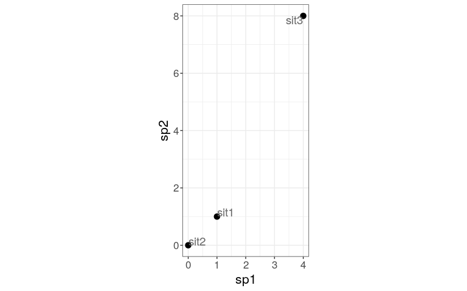
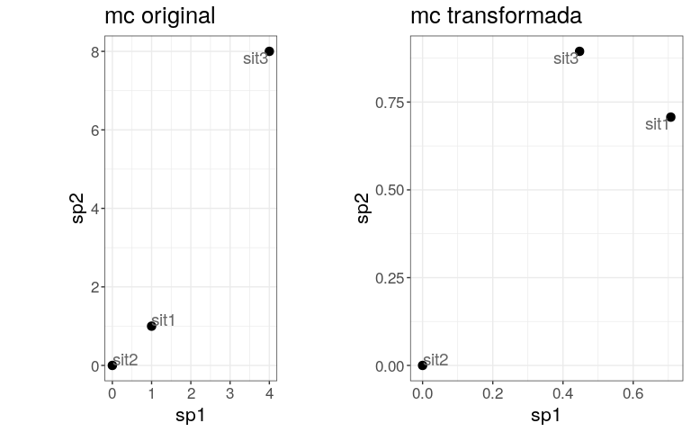

Medición de asociación. Introducción a los modos de análisis Q y R. Modo
Q aplicado a la paradoja de Orlóci
================
JR
3 de noviembre, 2020

``` r
knitr::opts_chunk$set(fig.width=12, fig.height=8)
```

## Preámbulo

### Cargar paquetes

``` r
library(vegan)
```

    ## Loading required package: permute

    ## Loading required package: lattice

    ## This is vegan 2.5-6

``` r
library(adespatial)
```

    ## Registered S3 methods overwritten by 'adegraphics':
    ##   method         from
    ##   biplot.dudi    ade4
    ##   kplot.foucart  ade4
    ##   kplot.mcoa     ade4
    ##   kplot.mfa      ade4
    ##   kplot.pta      ade4
    ##   kplot.sepan    ade4
    ##   kplot.statis   ade4
    ##   scatter.coa    ade4
    ##   scatter.dudi   ade4
    ##   scatter.nipals ade4
    ##   scatter.pco    ade4
    ##   score.acm      ade4
    ##   score.mix      ade4
    ##   score.pca      ade4
    ##   screeplot.dudi ade4

    ## Registered S3 method overwritten by 'spdep':
    ##   method   from
    ##   plot.mst ape

    ## Registered S3 methods overwritten by 'adespatial':
    ##   method             from       
    ##   plot.multispati    adegraphics
    ##   print.multispati   ade4       
    ##   summary.multispati ade4

``` r
library(tidyverse)
```

    ## ── Attaching packages ──────────────────────────────── tidyverse 1.2.1 ──

    ## ✓ ggplot2 3.3.2     ✓ purrr   0.3.4
    ## ✓ tibble  3.0.3     ✓ dplyr   0.8.3
    ## ✓ tidyr   1.0.0     ✓ stringr 1.4.0
    ## ✓ readr   1.3.1     ✓ forcats 0.4.0

    ## ── Conflicts ─────────────────────────────────── tidyverse_conflicts() ──
    ## x dplyr::filter() masks stats::filter()
    ## x dplyr::lag()    masks stats::lag()

``` r
source('biodata/funciones.R')
```

## Modos Q y R

En modo Q mides asociación entre pares de objetos, como por ejemplo,
entre dos sitios de muestreo. En este modo, mides la asociación por
medio de **la disimilaridad y la similaridad** entre pares de objetos,
usando métricas como la **distancia euclídea o la similaridad de
Jaccard**.

En modo R mides asociación entre pares de descriptores, como por
ejemplo, entre sdos variables, o dos especies. En este caso mides la
asociación por medio de **la dependencia entre variables**, usando por
ejemplo la **covarianza o el índice de
correlación**.

## Modo Q: matrices de disimilaridad entre objetos

### Modo Q para datos cuantitativos de especies (abundancia). La paradoja de Orlóci

La paradoja de Orlóci (1978) plantea que la distancia euclidea es más
pequeña entre dos sitios que no comparten especies que entre sitios que
sí las comparten.

Esta paradoja se explica por la presencia de “ceros” (especies ausentes)
en la matriz de comunidad, los cuales contribuyen a aumentar la
similaridad de forma ficticia. Esto se comprueba de manera directa en la
matriz de disimilaridad (=distancia). **La matriz de disimilaridad es
simplemente una matriz de distancia**. La disimilaridad (D) también la
puedes obtener a partir de la similaridad (S), aplicando la fórmula D =
1 - S, y viceversa, S = 1 - D.

Te muestro la paradoja con un ejemplo y, posteriormente, te explico cómo
solucionar el problema de los ceros. Sea una matriz de comunidad
`mc_orloci` de 2 especies y tres sitios…

``` r
(mc_orloci <- tibble(
  sp1 = c(1, 0, 4),
  sp2 = c(1, 0, 8),
  sitio = paste0('sit', 1:3)) %>% 
    column_to_rownames('sitio'))
```

    ##      sp1 sp2
    ## sit1   1   1
    ## sit2   0   0
    ## sit3   4   8

…donde ambas especies están ausentes en `sit2`, en `sit1` presentes con
poca abundancia y en `sit3` con valores relativamente extremos.

En modo Q, calcularé la “distancia” o “disimilaridad” entre sitios según
las especies que los caracterizan. En el lenguaje R, es común usar la
función `dist` para calcular la matriz de distancias, pero en ecología
se usa también `dist.ldc` del paquete `adespatial`. Las matrices de
distancia normalmente se muestran de la siguiente manera (por defecto,
sólo el triángulo inferior):

``` r
(dist.ldc(mc_orloci, "euclidean", silent = T))
```

    ##          sit1     sit2
    ## sit2 1.414214         
    ## sit3 7.615773 8.944272

Te muestro un gráfico de dispersión de los sitios según la abundancia de
especies (los ejes representan la abundancia de cada especie). Puedes
comprobar que la distancia entre `sit1` y `sit2` es pequeña, mientras
que entre `sit1` y `sit3` es
grande.

``` r
plot(mc_orloci, xlim = c(0, 5), ylim = c(0, 10), cex = 2, cex.axis = 2, cex.lab = 2, pch = 19)
text(mc_orloci$sp1+0.2, mc_orloci$sp2+0.2, rownames(mc_orloci), cex = 2)
```

<!-- -->

Para facilitar la lectura de las distancias, en esta explicación
ordeneré las matrices de distancia en columnas, usando la función de
ayuda `organizar_matriz_distancia`. La primera que generaré es la de
distancias euclideas a partir de datos brutos:

``` r
(d_euc <- dist.ldc(mc_orloci, "euclidean", silent = T) %>%
  organizar_matriz_distancia(func_dist = 'Euclidean'))
```

    ## # A tibble: 1 x 4
    ##   `Funcion de distancia` `D(sit1, sit2)` `D(sit1, sit3)` `D(sit2, sit3)`
    ##   <chr>                            <dbl>           <dbl>           <dbl>
    ## 1 Euclidean                         1.41            7.62            8.94

Siendo los sitios 1 y 2 tan diferentes en cuanto a las especies que los
componen (de hecho, no comparten especies), ¿por qué están tan próximos?
Asimismo, los sitios 1 y 3 comparten especies, entonces, ¿por qué están
tan distantes (=disímiles)? La explicación se atribuye a los ceros y a
los valores de abundancia extremos. El hecho de que un par de sitios
registren varias ausencias (o pseudo-ausencias), hace que “aparezcan”
muy próximos (similares) en el espacio euclídeo. Esta paradoja sugiere
que es necesario evitar la distancia euclídea a partir de datos brutos
como métrica para comparar sitios.

Existen distintas maneras de solucionar el problema planteado en la
paradoja, normalmente recurriendo a métodos de estandarización de las
abundancia brutas, y luego calculando distancia euclídea. Es decir, se
obtiene una matriz de comunidad transformada y, a partir de ella, se
obtienen distancias. Los métodos de transformación más comunes son el de
cuerdas (*chord*), *ji*-cuadrado y *Hellinger*. La función `dist.ldc`
del paquete `adespatial` provee una solución en un único paso para cada
caso (transformar + calcular distancias).

  - *Chord*:

<!-- end list -->

``` r
d_cho <- dist.ldc(mc_orloci, "chord", silent = T) %>%
  organizar_matriz_distancia(func_dist = 'Chord')
```

  - *Ji*-cuadrado:

<!-- end list -->

``` r
d_chi <- dist.ldc(mc_orloci, "chisquare", silent = T) %>%
  organizar_matriz_distancia(func_dist = 'chi-square distance')
```

  - *Hellinger* (valores primero divididos por abundancia total \> sqrt)

<!-- end list -->

``` r
d_hel <- dist.ldc(mc_orloci, "hellinger", silent = T) %>%
  organizar_matriz_distancia(func_dist = 'Hellinger')
```

  - Uniendo y comparando

<!-- end list -->

``` r
(d_todas <- bind_rows(d_euc, d_cho, d_chi, d_hel))
```

    ## # A tibble: 4 x 4
    ##   `Funcion de distancia` `D(sit1, sit2)` `D(sit1, sit3)` `D(sit2, sit3)`
    ##   <chr>                            <dbl>           <dbl>           <dbl>
    ## 1 Euclidean                         1.41           7.62             8.94
    ## 2 Chord                             1.00           0.320            1.00
    ## 3 chi-square distance               1.04           0.348            1.00
    ## 4 Hellinger                         1              0.170            1

Verás que el par `sit1|sit3` tiene corta distancia, es decir, son muy
parecidos (0.17 en *Hellinger*, e igualmente, corta distancia relativa
en *ji*-cuadrado y en *chord*). Esto se debe a la transformación, basada
en estandarización. Es lógico que este par sea muy similar, puesto que
comparten las únicas dos especies de la comunidad. Por lo tanto, las
tres transformaciones empleadas corrigen el problema planteado en la
paradoja de Orlóci.

Nota igualmente que, tanto los pares `sit1`|`sit2` y `sit2|sit3` están
distantes (distancia 1), lo cual también es deseable. Por tal razón,
snos interesa explorar las matrices de comunidad original y la
transformada. La función `dist.ldc` realiza dos pasos: primero genera
una matriz de comunidad transformada y luego calcula la distancia. Para
replicar el proceso que realiza `dist.ldc`, es necesario generar primero
la matriz transformada y luego pasar directamente a calcular distancia.
Repasa primero la matriz de comunidad original:

``` r
mc_orloci
```

    ##      sp1 sp2
    ## sit1   1   1
    ## sit2   0   0
    ## sit3   4   8

A continuación, generaré la matriz transformada según el método *chord*.
Esta matriz se calcula obteniendo primero el cuadrado de cada valor de
abundancia y luego dividiéndolo (estandarizando) por la suma de los
cuadrados de toda la fila o sitio (vector unitario). El resultado final,
es decir, la matriz con valores transformados, se obtiene a partir de la
raíz cuadrada de cada valor.

``` r
mc_orloci_norm <- sqrt(mc_orloci^2/rowSums(mc_orloci^2)) %>%
  replace(is.na(.), 0)
mc_orloci_norm
```

    ##            sp1       sp2
    ## sit1 0.7071068 0.7071068
    ## sit2 0.0000000 0.0000000
    ## sit3 0.4472136 0.8944272

La matriz de comunidad se dice que está “normalizada”. Lo anterior se
puede hacer más fácilmente con `decostand` de `vegan` (resultado
idéntico):

``` r
(mc_orloci_norm <- decostand(mc_orloci, "normalize"))
```

    ##            sp1       sp2
    ## sit1 0.7071068 0.7071068
    ## sit2 0.0000000 0.0000000
    ## sit3 0.4472136 0.8944272

Al graficar los sitios sobre un espacio bidimensional, cada eje
representando una especie, se obtienen resultados diferentes a los que
se obtuvieron con la matriz
original:

``` r
plot(mc_orloci_norm, xlim = c(0, 1), ylim = c(0, 1), cex = 2, cex.axis = 2, cex.lab = 2, pch = 19)
text(mc_orloci_norm$sp1+0.05, mc_orloci_norm$sp2+0.05, rownames(mc_orloci), cex = 2)
```

<!-- -->

  - Por último, para completar el proceso realizado por `dist.ldc`,
    debes calcular la distancia euclidea a partir de esta matriz. Verás
    que obtienes el mismo resultado que con la función `dist.ldc`:

<!-- end list -->

``` r
(d_cho_2_pasos <- dist(mc_orloci_norm, method = 'euclidean')) %>% 
  organizar_matriz_distancia(func_dist = 'Chord en dos pasos')
```

    ## # A tibble: 1 x 4
    ##   `Funcion de distancia` `D(sit1, sit2)` `D(sit1, sit3)` `D(sit2, sit3)`
    ##   <chr>                            <dbl>           <dbl>           <dbl>
    ## 1 Chord en dos pasos                1.00           0.320            1.00

Compara la anterior con la generada por `dist.ldc`:

``` r
d_cho
```

    ## # A tibble: 1 x 4
    ##   `Funcion de distancia` `D(sit1, sit2)` `D(sit1, sit3)` `D(sit2, sit3)`
    ##   <chr>                            <dbl>           <dbl>           <dbl>
    ## 1 Chord                             1.00           0.320            1.00
