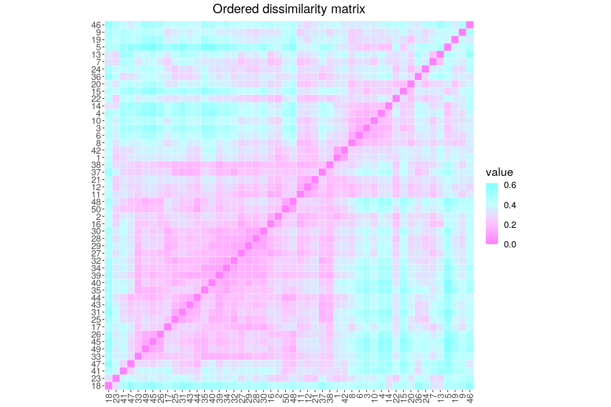
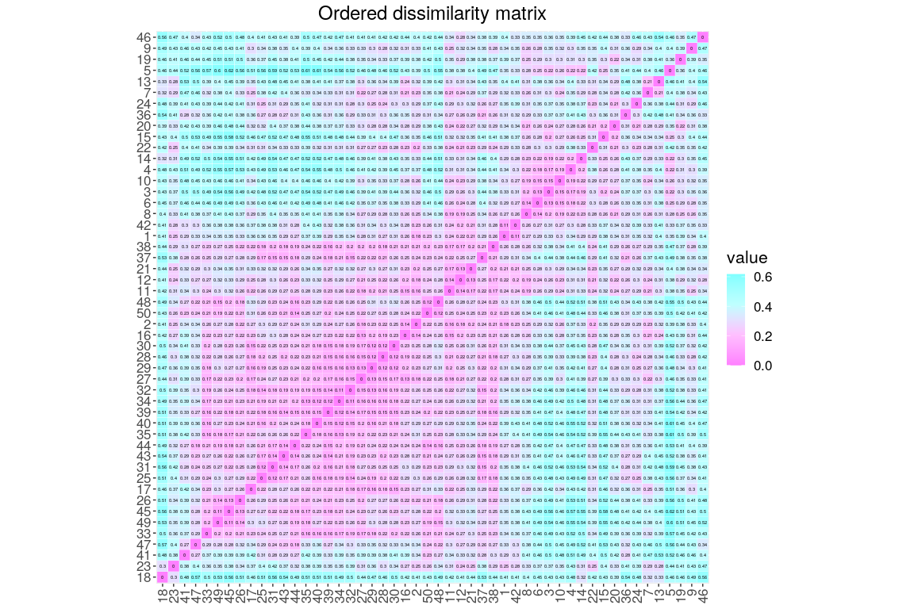
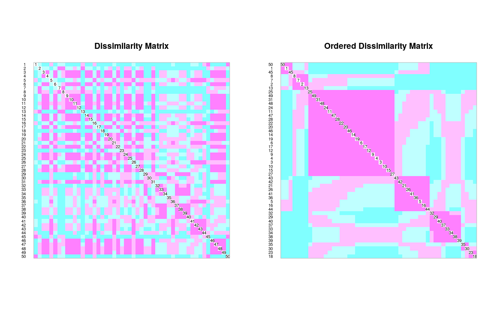

Medición de asociación. Modo Q aplicado a mi familia asignada
================
JR
9 de noviembre, 2020

``` r
knitr::opts_chunk$set(fig.width=12, fig.height=8)
```

## Preámbulo

### Cargar paquetes

``` r
library(vegan)
```

    ## Loading required package: permute

    ## Loading required package: lattice

    ## This is vegan 2.5-6

``` r
library(adespatial)
```

    ## Registered S3 methods overwritten by 'adegraphics':
    ##   method         from
    ##   biplot.dudi    ade4
    ##   kplot.foucart  ade4
    ##   kplot.mcoa     ade4
    ##   kplot.mfa      ade4
    ##   kplot.pta      ade4
    ##   kplot.sepan    ade4
    ##   kplot.statis   ade4
    ##   scatter.coa    ade4
    ##   scatter.dudi   ade4
    ##   scatter.nipals ade4
    ##   scatter.pco    ade4
    ##   score.acm      ade4
    ##   score.mix      ade4
    ##   score.pca      ade4
    ##   screeplot.dudi ade4

    ## Registered S3 method overwritten by 'spdep':
    ##   method   from
    ##   plot.mst ape

    ## Registered S3 methods overwritten by 'adespatial':
    ##   method             from       
    ##   plot.multispati    adegraphics
    ##   print.multispati   ade4       
    ##   summary.multispati ade4

``` r
library(broom)
library(tidyverse)
```

    ## ── Attaching packages ───────────────────────────────────── tidyverse 1.2.1 ──

    ## ✓ ggplot2 3.3.2     ✓ purrr   0.3.4
    ## ✓ tibble  3.0.3     ✓ dplyr   0.8.3
    ## ✓ tidyr   1.0.0     ✓ stringr 1.4.0
    ## ✓ readr   1.3.1     ✓ forcats 0.4.0

    ## ── Conflicts ──────────────────────────────────────── tidyverse_conflicts() ──
    ## x dplyr::filter() masks stats::filter()
    ## x dplyr::lag()    masks stats::lag()

``` r
library(sf)
```

    ## Linking to GEOS 3.6.2, GDAL 2.2.3, PROJ 4.9.3

``` r
library(cluster)
library(gclus)
```

    ## Registered S3 method overwritten by 'gclus':
    ##   method         from 
    ##   reorder.hclust vegan

``` r
source('biodata/funciones.R')
```

### Cargar datos

``` r
load('biodata/matriz_ambiental.Rdata')
load('biodata/Apocynaceae-Meliaceae-Sapotaceae.Rdata')
```

## Modo Q: matrices de disimilaridad entre objetos

### Modo Q para datos cuantitativos de especies (abundancia). Datos de mi familia asignada

Aplicado a mi familia asignada de BCI, en la forma de matriz de
distancia euclídea, utilizando la transformación *Hellinger*:

``` r
mi_fam_d_hel <- dist.ldc(mc_apcyn_melic_saptc, "hellinger", silent = T)
mi_fam_d_hel %>% tidy # Para evitar desbordar la consola
```

    ## # A tibble: 1,225 x 3
    ##    item1 item2 distance
    ##    <int> <int>    <dbl>
    ##  1     2     1    0.179
    ##  2     3     1    0.329
    ##  3     4     1    0.342
    ##  4     5     1    0.350
    ##  5     6     1    0.295
    ##  6     7     1    0.323
    ##  7     8     1    0.275
    ##  8     9     1    0.342
    ##  9    10     1    0.298
    ## 10    11     1    0.238
    ## # … with 1,215 more rows

Para interpretar esta matriz, es necesario representarla gráficamente.
En la representación elegida a continuación, color fucsia (magenta,
rosa) significa “corta distancia=muy similares”, y cian (celeste)
significa “gran distancia=poco
similares”:

``` r
coldiss(mi_fam_d_hel, diag = T)
```

<!-- -->

Mejorable el gráfico, quizá este es más explícito:

``` r
coldissgg(mi_fam_d_hel, ordered = T, nc = 4, fsz = 0)
```

    ## Loading required package: reshape2

    ## 
    ## Attaching package: 'reshape2'

    ## The following object is masked from 'package:tidyr':
    ## 
    ##     smiths

    ## Loading required package: RColorBrewer

<!-- -->

Con valores de distancia sobreimpresos (se empastan un
poco)

``` r
coldissgg(mi_fam_d_hel, ordered = T, nc = 4, fsz = 1.5)
```

<!-- -->

Puedes guardar el gráfico usando el botón `Export` de la pestaña `Plots`

Una forma alterna de guardar el gráfico es mediante funciones de R. La
calidad de gráficos exigida en revistas, suele requerir usar dichas
funciones específicas, porque permiten más control. A continuación uso
una de ellas, la función `png`, con la cual "abro un dispositivo
gráfico. Luego, imprimo el gráfico que deseo guardar y finalmente
cierro el dispositivo mediante `dev.off` Por ejemplo:

``` r
png(
  filename = 'matriz_disimilaridad_hellinger.png',
  width = 2400, height = 1200, pointsize = 32
)
coldiss(mi_fam_d_hel, diag = T)
dev.off()
```

    ## png 
    ##   2

MUY IMPORTANTE. La última función, `dev.off()`, es necesaria para cerrar
el dispositivo. Si no la ejecutas, no se generarán gráficos en el
dispositivo estándar (e.g. pestaña `Plots`)

### Modo Q para datos binarios (presencia/ausencia)

Habitualmente, sólo dispones de datos de presencia/ausencia. En tales
casos, existe un conjunto de herramientas basadas en métricas de
disimilaridad o de similaridad, con las que podrás analizar patrones de
asociación. En la bibliografía, encontrarás muchos ejemplos de las
métricas (de disimilaridad o similaridad) de Jaccard o de Sorensen
(esta última equivalente a “Bray-Curtis”).

Un error común consiste en referirse a los índices de Jaccard y de
Sorensen “a secas”, sin especificar si se trata de disimilaridad
(distancia) o de similaridad. Toda métrica de disimilaridad tiene un
complemento a 1 que la convierte en métrica de similaridad, y viceversa;
por lo tanto, se trata de mediciones claramente opuestas. Cuando el/la
autor/a no declara qué está midiendo, la interpretación podría resultar
ambigua e incluso contradictoria. Por esta razón, es necesario
especificar si se trata de un índice de disimilaridad o de similaridad.

Si alguna vez te enfrentas a textos donde no se especifica qué tipo de
métrica se usa, te sugiero preguntarte ¿qué mide este índice? Si
comparas varios sitios por pares, y notas que a mayor valor del índice
en cuestión observas mayor similitud o parecido entre los sitios
(e.g. mayor proporción de especies compartidas), entonces se trata de
un índice de similaridad. Si por el contrario, a mayor valor se
evidencia mayor disimilitud o diferencia entre pares de sitios
(e.g. mayor proporción de especies NO compartidas), entonces se trata
de un índice de distancia o disimilaridad.

Recalco: **es imprescindible declarar qué tipo de métrica estás
usando**. Ejemplos de redacción:

  - Correcto: “índice de **disimilaridad** de Jaccard”, “índice de
    **similaridad** de Sorensen”, o simplemente “**similaridad** de
    Jaccard”, “**distancia** de Jaccard”.

  - Incorrecto: “índice de Jaccard”, “índice de Sorensen”.

A continuación, muestro cómo calcular la **distancia de Jaccard**
(**D<sub>J</sub>**) en un único paso usando la función `vegdist`.

``` r
mi_fam_jac <- vegdist(mc_apcyn_melic_saptc, method = 'jac', binary = T)
mi_fam_jac %>% tidy # Mostrando sólo las primeras 10 combinaciones en modo data.frame
```

    ## # A tibble: 1,225 x 3
    ##    item1 item2 distance
    ##    <int> <int>    <dbl>
    ##  1     2     1   0.0833
    ##  2     3     1   0.154 
    ##  3     4     1   0.154 
    ##  4     5     1   0.267 
    ##  5     6     1   0.231 
    ##  6     7     1   0.231 
    ##  7     8     1   0.231 
    ##  8     9     1   0.231 
    ##  9    10     1   0.231 
    ## 10    11     1   0.154 
    ## # … with 1,215 more rows

El argumento `binary=T` en `vegdist` “ordena” que se realice primero
`decostand(mc_apcyn_melic_saptc, method = 'pa')`, lo cual convierte la
matriz de comunidad en una de presencia/ausencia, con la que
posteriormente se calculará la matriz de distancia.

En esta matriz de disimilaridad, al igual que en la anterior, un valor
pequeño (rosa) significa que los sitios comparados son muy parecidos.
Por ejemplo, en el gráfico no ordenado (izquierda), verás que, por
ejemplo, los sitios 1 y 2, y los sitios 3 y 4 son muy similares; en el
gráfico ordenado por valor de distancia (derecha), notarás por ejemplo
que 35 y 19 son muy
similares.

``` r
coldiss(mi_fam_jac, diag = T)
```

<!-- -->

La distancia de Jaccard (**D<sub>J</sub>**) se puede expresar como “la
proporción de especies no compartidas”. En este caso, para la
comparación entre los sitios 1 y 2, dicho valor es de 8.33%, que
equivale a decir “hay sólo un 8.33% de exclusividad” (por lo tanto, hay
mucha similaridad). Si se tratara de la similaridad de Jaccard
(**S<sub>J</sub>**) obtendríamos el complemento a 1, que equivale de
hecho a “la proporción de especies compartidas”, es decir, 91.67%.

Como la distancia de Jaccard (**D<sub>J</sub>**) es el complemento a 1
de la similaridad de Jaccard (**S<sub>J</sub>**), es decir,
**D<sub>J</sub>=1-S<sub>J</sub>**, y dado que arriba calculamos la
distancia, para obtener la similaridad, sólo hay que restarle el valor
de distancia a 1 (**S<sub>J</sub>=1-D<sub>J</sub>**).

``` r
(1 - mi_fam_jac) %>% tidy %>% rename(similaridad=distance) #Similaridad
```

    ## # A tibble: 1,225 x 3
    ##    item1 item2 similaridad
    ##    <int> <int>       <dbl>
    ##  1     2     1       0.917
    ##  2     3     1       0.846
    ##  3     4     1       0.846
    ##  4     5     1       0.733
    ##  5     6     1       0.769
    ##  6     7     1       0.769
    ##  7     8     1       0.769
    ##  8     9     1       0.769
    ##  9    10     1       0.769
    ## 10    11     1       0.846
    ## # … with 1,215 more rows

Dado que este resultado muestra la similaridad, podemos leerlo como “el
sitio 1 y el 2 comparten un 91.67% de sus especies”.

La fórmula de la similaridad de Jaccard es **S<sub>J</sub>=a/(a+b+c)**,
donde **a** es el número de especies compartidas (presentes en ambos
sitios comparados), **b** el número de especies exclusivas del sitio 2,
y **c** el número de especies exclusivas del sitio 1.

Para obtener las variables **a**, **b** y **c**, usaré La función
`betadiver` del paquete `vegan`:

``` r
mi_fam_abc <- betadiver(mc_apcyn_melic_saptc) 
mi_fam_abc %>%
  map(tidy) %>%
  map(slice, 1) %>%
  map_df(I, .id = 'tipo') %>% 
  dplyr::select(tipo, n_especies=distance)
```

    ## # A tibble: 3 x 2
    ##   tipo  n_especies
    ##   <chr>      <dbl>
    ## 1 a             11
    ## 2 b              0
    ## 3 c              1

Puedes notar que ambos sitios comparten 11 especies (**a**), que el
sitio 2 no tiene especies exclusivas (**b**) y que el sitio 1 tiene 1
especie exclusiva (**c**). Es decir, de 12 especies en total en ambos
sitios, hay 11 compartidas, por lo tanto:

``` r
round(11/12*100,2) #Porcentaje de especies compartidas = similaridad
```

    ## [1] 91.67

Con `betadiver` también puedes calcular índices de similaridad. Por
ejemplo, el Jaccard se calcula así:

``` r
betadiver(mc_apcyn_melic_saptc, method = 'j') %>% tidy
```

    ## # A tibble: 1,225 x 3
    ##    item1 item2 distance
    ##    <int> <int>    <dbl>
    ##  1     2     1    0.917
    ##  2     3     1    0.846
    ##  3     4     1    0.846
    ##  4     5     1    0.733
    ##  5     6     1    0.769
    ##  6     7     1    0.769
    ##  7     8     1    0.769
    ##  8     9     1    0.769
    ##  9    10     1    0.769
    ## 10    11     1    0.846
    ## # … with 1,215 more rows

No obstante, usaremos esta función en los análisis de diversidad beta
más adelante.

Además de la distancia de Jaccard, otra distancia muy utilizada es la de
Sorensen o Bray-Curtis. Se calcula fácilmente con la función `vegdist`:

``` r
mi_fam_sor <- vegdist(mc_apcyn_melic_saptc, method = 'bray', binary = T)
mi_fam_sor %>% tidy
```

    ## # A tibble: 1,225 x 3
    ##    item1 item2 distance
    ##    <int> <int>    <dbl>
    ##  1     2     1   0.0435
    ##  2     3     1   0.0833
    ##  3     4     1   0.0833
    ##  4     5     1   0.154 
    ##  5     6     1   0.130 
    ##  6     7     1   0.130 
    ##  7     8     1   0.130 
    ##  8     9     1   0.130 
    ##  9    10     1   0.130 
    ## 10    11     1   0.0833
    ## # … with 1,215 more rows

``` r
coldiss(mi_fam_sor, diag = T)
```

<!-- -->

### Modo Q para datos cuantitativos, NO de abundancia de especies (variables ambientales)

En este ejemplo, usaré sólo variables de suelo, todas cuantitativas,
puedes combinar con otras variables que hayas detectado como relevantes
en el análisis de correlación. Nota que convertiré cada variable en
puntuaciones *z* mediante la función `scale`. Dado que cada variable
tiene su propia escala de medición, si se compararan sin transformación,
se obtendrían resultados inconsistentes.

``` r
env_suelo_punt_z <- bci_env_grid %>%
  st_drop_geometry() %>% 
  dplyr::select(matches('^[A-T,Z]|^pH$', ignore.case = F)) %>% 
  scale()
env_suelo_punt_z_d <- dist(env_suelo_punt_z)
env_suelo_punt_z_d %>% tidy
```

    ## # A tibble: 1,225 x 3
    ##    item1 item2 distance
    ##    <int> <int>    <dbl>
    ##  1     2     1     1.17
    ##  2     3     1     2.26
    ##  3     4     1     2.09
    ##  4     5     1     2.02
    ##  5     6     1     2.45
    ##  6     7     1     2.51
    ##  7     8     1     2.85
    ##  8     9     1     2.38
    ##  9    10     1     2.70
    ## 10    11     1     3.86
    ## # … with 1,215 more rows

``` r
coldiss(env_suelo_punt_z_d, diag = T)
```

<!-- -->

### Modo Q para datos cualitativos y cuantitativos (mixtos), NO de abundancia de especies (variables ambientales)

En este ejemplo, usaré las siguientes variables mixtas (funciona
igualmente para datos cualitativos solamente):

  - `hetereogeneidad_ambiental`. Índice cuantitativo calculado como la
    diversidad de Simpson a partir de frecuencias de tipos de
    micro-hábitats.

  - `habitat`. Tipo de hábitat. Asume los siguientes valores posibles:
    *OldHigh*, *OldLow* y *OldSlope* (bosque viejo en relieve alto, en
    vertientes y relieve bajo, respectivamente), *Swamp* (bosque en área
    encharcable) *Young* (bosque joven).

  - `quebrada`. Informa sobre si hay o no quebrada. Los valores posibles
    son *Yes* o *No*.

<!-- end list -->

``` r
env_mix <- bci_env_grid %>%
  st_drop_geometry() %>%
  dplyr::select(heterogeneidad_ambiental, habitat, quebrada)
env_mix_d <- daisy(x = env_mix, metric = 'gower')
env_mix_d %>% as.dist %>% tidy
```

    ## # A tibble: 1,225 x 3
    ##    item1 item2 distance
    ##    <int> <int>    <dbl>
    ##  1     2     1    0.441
    ##  2     3     1    0.954
    ##  3     4     1    0.954
    ##  4     5     1    0.410
    ##  5     6     1    0.919
    ##  6     7     1    0.446
    ##  7     8     1    0.524
    ##  8     9     1    0.954
    ##  9    10     1    0.954
    ## 10    11     1    0.769
    ## # … with 1,215 more rows

``` r
env_mix_d %>% coldiss(diag = T)
```

<!-- -->
