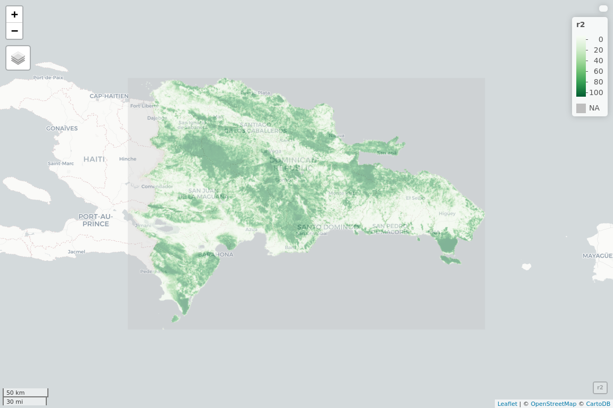
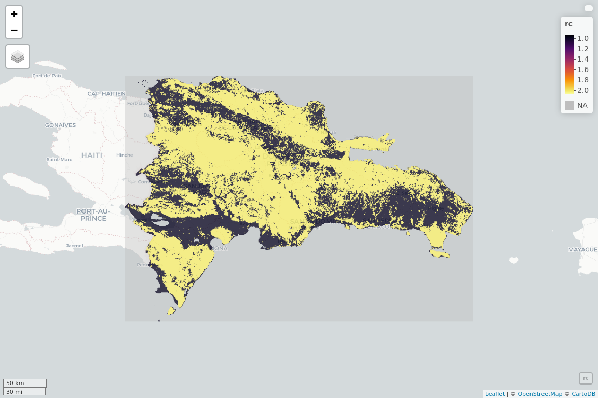
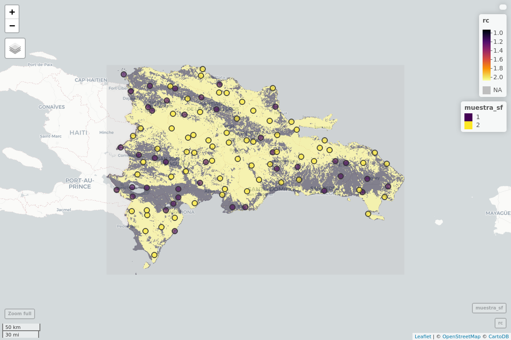

Muestreo
================
JR
3 de noviembre, 2020

``` r
knitr::opts_chunk$set(fig.width=12, fig.height=8)
```

## Cargar paquetes

``` r
library(raster)
```

    ## Loading required package: sp

``` r
library(mapview)
library(RColorBrewer)
library(sf)
```

    ## Linking to GEOS 3.6.2, GDAL 2.2.3, PROJ 4.9.3

## Lectura de datos fuente, generación de ráster simplicado

Tree cover, from here:
<http://earthenginepartners.appspot.com/google.com/science-2013-global-forest>

``` r
# r <- raster('treecover2000_crop.tif')
# r2 <- raster::aggregate(r, 20)
# r2
# writeRaster(r2, 'treecover2000_remuestreado.tif')
```

## Lectura de datos procesados (ráster simplificado)

``` r
r2 <- raster(x = 'treecover2000_remuestreado.tif')
```

## Mapa (exploratorio)

``` r
verdes <- colorRampPalette(brewer.pal(8, "Greens"))
mapview(r2, col.regions = verdes, alpha = 0.5)
```

<!-- -->

## Reclasificación del ráster (dos clases, 0-25%=clase 1, 26-100%=clase 2)

``` r
m <- c(-1, 25, 1,  25, 100, 2)
rclmat <- matrix(m, ncol=3, byrow=TRUE)
rc <- reclassify(r2, rclmat)
rc
```

    ## class      : RasterLayer 
    ## dimensions : 501, 718, 359718  (nrow, ncol, ncell)
    ## resolution : 542.4573, 542.4761  (x, y)
    ## extent     : 182239.3, 571723.6, 1933439, 2205219  (xmin, xmax, ymin, ymax)
    ## crs        : +proj=utm +zone=19 +datum=WGS84 +units=m +no_defs +ellps=WGS84 +towgs84=0,0,0 
    ## source     : memory
    ## names      : treecover2000_remuestreado 
    ## values     : 1, 2  (min, max)

## Desplegar en mapview

``` r
mapview(rc, method = 'ngb')
```

<!-- -->

## Conversión a polígonos

``` r
# poligonos <- rasterToPolygons(rc)
```

Guardar polígonos

``` r
# saveRDS(poligonos, 'poligonos_raster_cobertura.RDS')
poligonos <- readRDS('poligonos_raster_cobertura.RDS')
```

## Tomar muestra estratificada

``` r
set.seed(10)
(muestra <- spsample(poligonos, n = 100, type = 'stratified'))
```

    ## class       : SpatialPoints 
    ## features    : 105 
    ## extent      : 195447.8, 550256.4, 1959104, 2199653  (xmin, xmax, ymin, ymax)
    ## crs         : +proj=utm +zone=19 +datum=WGS84 +units=m +no_defs +ellps=WGS84 +towgs84=0,0,0

``` r
# saveRDS(muestra, 'muestra.RDS')
```

Asignarle atributos a cada punto de muestra

``` r
muestra_con_atr <- over(muestra, poligonos)
muestra$clase_de_cobertura <- muestra_con_atr
```

Convertir a sf (necesario para representar con mapview)

``` r
muestra_sf <- st_as_sf(muestra)
```

Representar

``` r
mapview(rc, method = 'ngb', alpha = 0.5) + mapview(muestra_sf)
```

<!-- -->

Guardar muestra\_sf

``` r
saveRDS(muestra_sf, 'muestra_sf.RDS')
```
