Técnicas de ordenación. <br> Parte 1: Ordenación no restringida. <br>
PCA, CA y PCoA
================
JR
21 de noviembre, 2020

``` r
knitr::opts_chunk$set(fig.width=12, fig.height=8)
```

## Preámbulo

### Cargar paquetes

``` r
library(vegan)
```

    ## Loading required package: permute

    ## Loading required package: lattice

    ## This is vegan 2.5-6

``` r
library(tidyverse)
```

    ## ── Attaching packages ───────────────────────────── tidyverse 1.2.1 ──

    ## ✓ ggplot2 3.3.2     ✓ purrr   0.3.4
    ## ✓ tibble  3.0.3     ✓ dplyr   0.8.3
    ## ✓ tidyr   1.0.0     ✓ stringr 1.4.0
    ## ✓ readr   1.3.1     ✓ forcats 0.4.0

    ## ── Conflicts ──────────────────────────────── tidyverse_conflicts() ──
    ## x dplyr::filter() masks stats::filter()
    ## x dplyr::lag()    masks stats::lag()

``` r
library(sf)
```

    ## Linking to GEOS 3.6.2, GDAL 2.2.3, PROJ 4.9.3

``` r
library(mapview)
source('biodata/funciones.R')
```

### Cargar datos

``` r
load('biodata/Apocynaceae-Meliaceae-Sapotaceae.Rdata')
load('biodata/matriz_ambiental.Rdata')
mi_fam <- mc_apcyn_melic_saptc
(colnames(mi_fam) <- make.cepnames(colnames(mi_fam)))
```

    ##  [1] "Aspispru" "Cedrodor" "Chryarge" "Chrycain" "Guarbull" "Guargran"
    ##  [7] "Guarguid" "Lacmpana" "Poutfoss" "Poutreti" "Poutstip" "Rauvlitt"
    ## [13] "Tabearbo" "Thevahou" "Tricpall" "Trictube"

``` r
(df_equivalencias <- data.frame(
  nombre_original = colnames(mc_apcyn_melic_saptc),
  colnames(mi_fam)))
```

    ##            nombre_original colnames.mi_fam.
    ## 1  Aspidosperma spruceanum         Aspispru
    ## 2          Cedrela odorata         Cedrodor
    ## 3  Chrysophyllum argenteum         Chryarge
    ## 4    Chrysophyllum cainito         Chrycain
    ## 5           Guarea bullata         Guarbull
    ## 6       Guarea grandifolia         Guargran
    ## 7          Guarea guidonia         Guarguid
    ## 8     Lacmellea panamensis         Lacmpana
    ## 9       Pouteria fossicola         Poutfoss
    ## 10     Pouteria reticulata         Poutreti
    ## 11      Pouteria stipitata         Poutstip
    ## 12    Rauvolfia littoralis         Rauvlitt
    ## 13 Tabernaemontana arborea         Tabearbo
    ## 14         Thevetia ahouai         Thevahou
    ## 15       Trichilia pallida         Tricpall
    ## 16   Trichilia tuberculata         Trictube

``` r
bci_env_grid %>% tibble
```

    ## # A tibble: 50 x 39
    ##       id categoria_de_ed… geologia habitat quebrada heterogeneidad_… UTM.EW
    ##    <dbl> <fct>            <fct>    <fct>   <fct>               <dbl>  <dbl>
    ##  1     1 c3               Tb       OldSlo… Yes                0.627  6.26e5
    ##  2     2 c3               Tb       OldLow  Yes                0.394  6.26e5
    ##  3     3 c3               Tb       OldLow  No                 0      6.26e5
    ##  4     4 c3               Tb       OldLow  No                 0      6.26e5
    ##  5     5 c3               Tb       OldSlo… No                 0.461  6.26e5
    ##  6     6 c3               Tb       OldLow  No                 0.0768 6.26e5
    ##  7     7 c3               Tb       OldLow  Yes                0.381  6.26e5
    ##  8     8 c3               Tb       OldLow  Yes                0.211  6.26e5
    ##  9     9 c3               Tb       OldLow  No                 0      6.26e5
    ## 10    10 c3               Tb       OldLow  No                 0      6.26e5
    ## # … with 40 more rows, and 32 more variables: UTM.NS <dbl>,
    ## #   geomorf_llanura_pct <dbl>, geomorf_pico_pct <dbl>,
    ## #   geomorf_interfluvio_pct <dbl>, geomorf_hombrera_pct <dbl>,
    ## #   `geomorf_espolón/gajo_pct` <dbl>, geomorf_vertiente_pct <dbl>,
    ## #   geomorf_vaguada_pct <dbl>, geomorf_piedemonte_pct <dbl>,
    ## #   geomorf_valle_pct <dbl>, geomorf_sima_pct <dbl>, Al <dbl>, B <dbl>,
    ## #   Ca <dbl>, Cu <dbl>, Fe <dbl>, K <dbl>, Mg <dbl>, Mn <dbl>, P <dbl>,
    ## #   Zn <dbl>, N <dbl>, N.min. <dbl>, pH <dbl>, elevacion_media <dbl>,
    ## #   pendiente_media <dbl>, orientacion_media <dbl>,
    ## #   curvatura_perfil_media <dbl>, curvatura_tangencial_media <dbl>,
    ## #   geometry <POLYGON [m]>, abundancia_global <dbl>, riqueza_global <int>

``` r
grupos_upgma_k2 <- readRDS('grupos_upgma_k2.RDS')
table(grupos_upgma_k2)
```

    ## grupos_upgma_k2
    ##  1  2 
    ## 43  7

``` r
grupos_ward_k3 <- readRDS('grupos_ward_k3.RDS')
table(grupos_ward_k3)
```

    ## grupos_ward_k3
    ##  1  2  3 
    ## 20  5 25

## Ordenación

La ordenación se basa en los mismos principios que la medición de
asociación (similaridad) y el agrupamiento: un objeto se caracteriza por
sus propiedades en un espacio n-dimensional, donde cada dimensión es una
variable, un descriptor. Un simple diagrama de dispersion nos serviría
para representar el caso especial de objetos descritos por sólo dos
variables, pero no es lo común. Sin embargo, no podremos encontrar
patrones consistentes analizando nuestros datos por pares de variables
(e.g. paneles de correlación).

A diferencia del análisis de agrupamiento, o como complemento de éste,
el análisis de ordenación abarca un conjunto de técnicas que procuran
reducir la dimensionalidad de los datos. Se intenta representar, en ejes
ortogonales (comúnmente dos), la complejidad de todo un conjunto. Todas
las técnicas de ordenación representan las principales tendencias de
variación de los datos en un espacio de dimensiones reducidas, ordenando
de manera convencional los ejes con grado descendente de varianza
explicada en cada eje sucesivo (e.g. en n dimensiones, el eje 1 explica
la mayor varianza, el eje n explica la mínima).

El análisis de ordenación puede ser no restringido (o simple) y
restringido (o ‘canónico’). En el primer caso, las tendencias detectadas
en el conjunto de datos de interés, no están restringidas por otro
conjunto, por ejemplo, si buscamos tendencias en una matriz de
comunidad, y sólo en ella. En el segundo caso, las tendencias detectadas
en un conjunto de datos se asocian a otro conjunto, por ejemplo, si
buscamos tendencias en una matriz de comunidad pero restringiéndolas a
una matriz ambiental. En este script me concentraré en la ordenación no
restringida o simple.

Las principales técnicas de ordenación no restringida son análisis de
componentes principales o PCA (siglas de *principal components
analysis*), análisis de correspondencia o CA (*correspondence
analysis*), análisis de correspondencia múltiple o MCA (*multiple
correspondence analysis*), análisis de coordenadas principales o PCoA
(*principal coordinates analysis*) y escalamiento multidimensional no
métrico o NMDS (*non-metric multidimensional scaling*). Salvo el NMDS,
todas estas técnicas se basan en la extracción de los vectores propios
(*eigenvectors*) de una matriz de asociación. Explicaré PCA, CA y PCoA a
continuación.

### Análisis de componentes principales (PCA)

Es el método tradicional basado en vectores propios que comúnmente se
aplica a datos cuantitativos no procesados, que preserva la distancia
euclídea; también se aplica a datos de especies, previa transformación
de los datos. Por esta razón, es más común aplicarlo a variables
ambientales (matriz ambiental), pero también se aplica a datos
transformados de composición (matriz de comunidad). Un requisito
fundamental para garantizar la eficiencia de este método, es que las
variables deben tener algún grado de correlación entre sí, un supuesto a
veces imposible de lograr con datos no procesados de matrices de
comunidad, pero que sí es bastante común en matrices ambientales.
Primero explicaré su uso con un subconjunto de variables ambientales
(suelo), para luego aplicarlo a una matriz de comunidad.

#### PCA aplicado a datos ambientales

Para aplicar PCA a datos ambientales, es necesario que todas las
variables sean numéricas y “comparables” en cuanto a escalas de
medición. Esto se consigue “escalándolas” (convirtiéndolas en
puntuaciones z). A partir de la matriz escalada, se generará una matriz
de correlaciones.

Dado que se requiere que las variables de entrada sean exclusivamente
numéricas, el primer paso que realizaré será obtener un conjunto de
columnas numéricas y, de éstas, seleccionaré sólo las de suelo.

¡IMPORTANTE\! Haré esta demostración sólo con las variables de suelo,
**pero puedes (y debes) ordenar los sitios en función de otras
variables, por ejemplo, las geomorfológicas combinadas con la de hábitat
y la de heterogeneidad ambiental**. Por tal razón, haz también el PCA
para las demás variables de la matriz ambiental.

A partir de los datos de suelo, la función `rda`, de `vegan` realizará
los siguientes pasos: escalar las variables originales, calcular matriz
de correlaciones y obtener vectores propios para el PCA.

``` r
env_suelo <- bci_env_grid %>%
  st_drop_geometry %>%
  dplyr::select(matches('^[A-T,Z]|^pH$', ignore.case = F))
env_suelo %>% tibble
```

    ## # A tibble: 50 x 13
    ##       Al     B    Ca    Cu    Fe     K    Mg    Mn     P    Zn     N
    ##    <dbl> <dbl> <dbl> <dbl> <dbl> <dbl> <dbl> <dbl> <dbl> <dbl> <dbl>
    ##  1  901. 0.794 1680.  6.20  135. 142.   279.  267.  1.95  2.97  18.5
    ##  2  954. 0.670 1503.  6.03  142. 137.   280.  320.  2.25  2.53  21.6
    ##  3 1114. 0.595 1182.  6.80  157.  98.7  230.  445.  1.95  2.25  20.2
    ##  4 1024. 0.568 1558.  6.63  153.  98.4  229.  408.  2.63  2.44  20.8
    ##  5 1002. 0.399 1242.  6.44  149.  94.1  203.  251.  1.86  2.14  16.9
    ##  6 1091. 0.731 1442.  6.50  174. 132.   277.  477.  1.62  2.63  20.3
    ##  7 1184. 0.340 1111.  5.55  138. 117.   242.  301.  2.13  2.16  20.1
    ##  8 1256. 0.322 1029.  6.28  147. 104.   185.  204.  3.11  2.07  21.5
    ##  9 1122. 0.464 1230.  7.18  153. 110.   207.  415.  1.99  2.33  21.4
    ## 10 1172. 0.314 1127.  6.89  133. 105.   172.  330.  1.69  2.05  18.3
    ## # … with 40 more rows, and 2 more variables: N.min. <dbl>, pH <dbl>

``` r
env_suelo_pca <- rda(env_suelo, scale = TRUE)
env_suelo_pca
```

    ## Call: rda(X = env_suelo, scale = TRUE)
    ## 
    ##               Inertia Rank
    ## Total              13     
    ## Unconstrained      13   13
    ## Inertia is correlations 
    ## 
    ## Eigenvalues for unconstrained axes:
    ##   PC1   PC2   PC3   PC4   PC5   PC6   PC7   PC8   PC9  PC10  PC11  PC12 
    ## 7.871 1.698 1.378 0.899 0.334 0.298 0.149 0.114 0.101 0.075 0.038 0.029 
    ##  PC13 
    ## 0.017

``` r
summary(env_suelo_pca)
```

    ## 
    ## Call:
    ## rda(X = env_suelo, scale = TRUE) 
    ## 
    ## Partitioning of correlations:
    ##               Inertia Proportion
    ## Total              13          1
    ## Unconstrained      13          1
    ## 
    ## Eigenvalues, and their contribution to the correlations 
    ## 
    ## Importance of components:
    ##                          PC1    PC2    PC3     PC4     PC5     PC6    PC7
    ## Eigenvalue            7.8705 1.6985 1.3777 0.89872 0.33400 0.29828 0.1495
    ## Proportion Explained  0.6054 0.1307 0.1060 0.06913 0.02569 0.02294 0.0115
    ## Cumulative Proportion 0.6054 0.7361 0.8421 0.91119 0.93688 0.95982 0.9713
    ##                            PC8      PC9     PC10     PC11     PC12
    ## Eigenvalue            0.113523 0.100540 0.075125 0.038299 0.028503
    ## Proportion Explained  0.008733 0.007734 0.005779 0.002946 0.002193
    ## Cumulative Proportion 0.980052 0.987786 0.993565 0.996511 0.998703
    ##                           PC13
    ## Eigenvalue            0.016858
    ## Proportion Explained  0.001297
    ## Cumulative Proportion 1.000000
    ## 
    ## Scaling 2 for species and site scores
    ## * Species are scaled proportional to eigenvalues
    ## * Sites are unscaled: weighted dispersion equal on all dimensions
    ## * General scaling constant of scores:  5.023829 
    ## 
    ## 
    ## Species scores
    ## 
    ##            PC1       PC2      PC3      PC4      PC5      PC6
    ## Al      0.7651 -0.303596  1.07416 -0.04457  0.07698 -0.04464
    ## B      -1.2880  0.285829  0.12078 -0.10042 -0.25949 -0.08173
    ## Ca     -1.3475 -0.154936 -0.05566  0.09869 -0.21974  0.10661
    ## Cu     -1.1654 -0.297329  0.28359 -0.50726  0.13822  0.18506
    ## Fe     -1.1094 -0.492148  0.40677  0.19816  0.32966  0.18518
    ## K      -1.3645  0.008666  0.04784  0.03985  0.01269  0.07345
    ## Mg     -1.2703 -0.170100 -0.07264  0.25627 -0.35788  0.20705
    ## Mn     -0.9548 -0.317673  0.44289 -0.74565 -0.12314 -0.31689
    ## P       0.2877  0.748145  0.98749  0.47477 -0.23540 -0.03654
    ## Zn     -1.3040  0.004603 -0.02793  0.32706  0.01696 -0.03240
    ## N      -0.5124  1.155952  0.14154 -0.29652  0.26625  0.33702
    ## N.min. -1.1324 -0.163100  0.03454  0.59856  0.34289 -0.30849
    ## pH     -0.9569  0.846451 -0.23774 -0.15686  0.10741 -0.36153
    ## 
    ## 
    ## Site scores (weighted sums of species scores)
    ## 
    ##         PC1      PC2       PC3      PC4       PC5       PC6
    ## 1   0.50347 -0.39861 -0.798154 -0.32512 -1.705624  1.097611
    ## 2   0.47396 -0.28681 -0.518234 -0.23993 -0.940674  0.556514
    ## 3   0.62571 -0.61177 -0.017990 -1.17056 -0.689271  0.325703
    ## 4   0.48722 -0.36275 -0.122325 -0.53899 -0.492944 -0.192532
    ## 5   0.70142 -0.57473 -0.607379 -0.09754  0.095730  0.096622
    ## 6   0.32387 -0.57941 -0.127142 -0.96126 -0.468442 -0.308392
    ## 7   0.70592 -0.29567 -0.231908 -0.18306 -0.001098 -0.372107
    ## 8   0.89397 -0.16407  0.193673 -0.10215  0.098856  0.724943
    ## 9   0.57971 -0.40666 -0.071601 -1.10761 -0.086292 -0.006721
    ## 10  0.72551 -0.49205 -0.281459 -0.67883  0.394079 -0.616348
    ## 11 -0.21317 -0.50177  0.077290 -0.97703 -1.759653 -1.347073
    ## 12  0.72031 -0.71165  0.452589 -0.03515 -0.284845 -0.876996
    ## 13  1.02666 -0.35257  0.902772  1.42743  0.056272  0.769304
    ## 14  0.71660 -0.80220  0.308626 -0.07447  0.179499  0.319996
    ## 15  0.38786 -1.25976  0.502979 -1.12783  0.489936 -0.004906
    ## 16  0.06081 -0.65839 -0.217405 -0.15093 -0.009161 -0.418417
    ## 17  0.63013 -0.10688  0.461756  0.69800 -0.855514 -0.800082
    ## 18  0.96721 -0.48010  0.768611  1.68547  0.280984  0.804510
    ## 19  0.65612 -0.39287  0.642368  0.81392  0.334820 -0.130497
    ## 20  0.46141 -0.62193 -0.007429 -0.28657  0.574129 -0.059174
    ## 21 -0.33476  0.07816 -0.494215 -0.82582  0.082001  0.466656
    ## 22  0.37375  0.39755  0.354272  0.65129  0.466086 -0.169757
    ## 23  0.68109 -0.03137  0.521714  1.37446  0.819763  1.100024
    ## 24  0.12448  0.29626  0.059695 -0.01573  0.236925  0.723204
    ## 25  0.08692  0.66652 -0.374643 -0.06148 -0.269650  1.201049
    ## 26 -0.06428  0.72854 -1.263340 -0.34008  0.931914 -0.269882
    ## 27  0.35229  0.90701 -0.793591  0.27022  0.822847 -0.974726
    ## 28  0.69848  1.15175 -1.855664  0.48677  0.412453 -0.297122
    ## 29  0.19286  1.08572  0.087991  0.11127  0.042980  0.495350
    ## 30  0.34849  0.97558 -0.862374  0.01778  0.495742  0.840577
    ## 31 -0.27158  0.72562 -0.688703 -0.30711  0.513849 -0.289476
    ## 32 -0.23882  1.06756  0.284612  0.39185 -0.583222 -1.160850
    ## 33  0.45683  1.33454 -1.222664  0.21290  0.043306 -0.906784
    ## 34 -0.06262  1.32157  0.707260 -0.38230 -0.554752  0.096821
    ## 35 -0.12287  0.56386  0.842747 -0.37166  0.215049 -0.170818
    ## 36 -0.77718  0.81121 -0.017228 -0.75987  0.240578  0.996530
    ## 37 -0.36979  0.78099  0.600582 -0.68959  0.433235  0.023059
    ## 38 -0.46379  1.17932  1.466360 -0.34391 -0.858632  0.095262
    ## 39 -0.52517  0.80160  1.526464  0.17949 -1.074136 -1.051545
    ## 40 -0.21649  0.62426  1.199057  0.71392 -0.023249 -0.665797
    ## 41 -1.67247  0.07797  0.320315 -0.42982 -0.542412  1.926398
    ## 42 -0.79902 -0.40933  0.170367 -0.68347  0.962695  0.340097
    ## 43 -0.86973 -0.46973  0.977941 -0.73908  1.841802  0.388190
    ## 44 -0.87106 -0.51244  0.510545  0.11302  1.520391 -0.888169
    ## 45 -1.21483 -0.12869  0.318452  0.59274 -0.206188 -0.656346
    ## 46 -1.15473 -0.77489 -0.740832  1.60533 -1.220076  0.792066
    ## 47 -0.53188 -1.10833 -0.737304  1.09916 -0.007989 -1.090101
    ## 48 -1.25160 -1.07535 -0.391085  0.26679  0.818315 -0.567806
    ## 49 -1.60947 -0.72664 -0.790057  0.20147 -0.148172  0.030082
    ## 50 -1.32772 -0.27816 -1.026309  1.09364 -0.622240  0.081856

Para agilizar la producción de scripts analíticos de referencia,
trasladaré las explicaciones de cada resultado a los vídeos regulares
que alojo en el repositorio de la asignatura. En ellos explicaré cómo
interpretar éste y otros resultados.

En el vídeo asociado, explico el significado de:

  - Inercia, *Inertia*
  - Valores propios, autovalores, *Eigenvalues*
  - Escalamiento, *Scaling*
  - Puntuaciones de “especies”, *Species scores*
  - Puntuaciones de “sitios”, *Site
scores*

<!-- end list -->

``` r
screeplot(env_suelo_pca, bstick = TRUE)
```

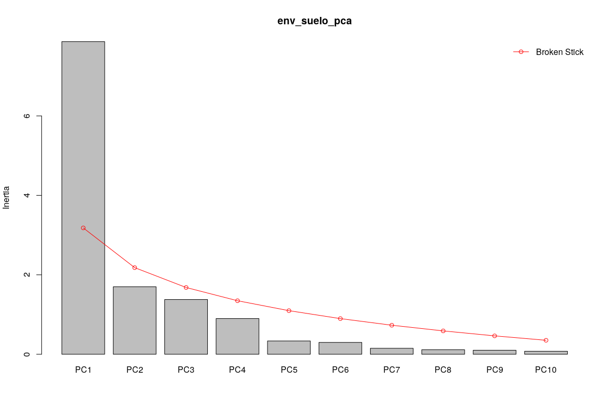<!-- -->

Usando función `cleanplot.pca`

``` r
par(mfrow = c(1, 2))
cleanplot.pca(env_suelo_pca, scaling = 1, mar.percent = 0.08, cex.char1 = 1.5)
cleanplot.pca(env_suelo_pca, scaling = 2, mar.percent = 0.04, cex.char1 = 1.5)
```

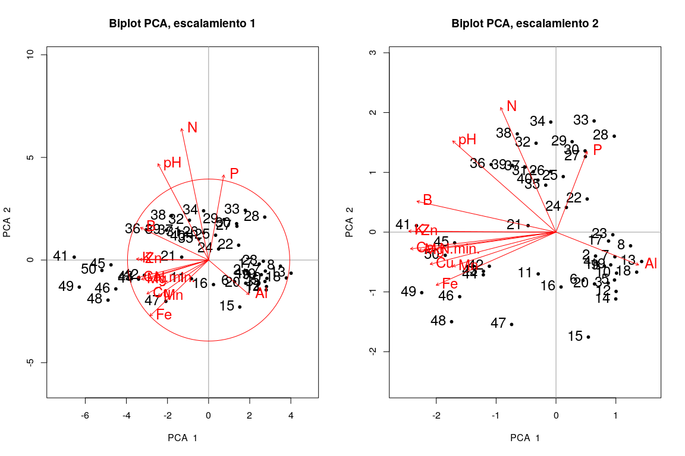<!-- -->

``` r
par(mfrow = c(1, 1))
```

Comparar distribución de los sitios en biplots con distribución real en
el mapa:

### Generar mapa de cuadros sin simbología

``` r
mapa_cuadros <- mapView(
  bci_env_grid,
  col.regions = 'grey80',
  alpha.regions = 0.3,
  map.types = 'OpenTopoMap',
  legend = F, zoom = 14,
  zcol = 'id') %>% addStaticLabels() %>%
  leaflet::setView(
    lng = -79.85136,
    lat = 9.15097,
    zoom = 15)
mapa_cuadros
```

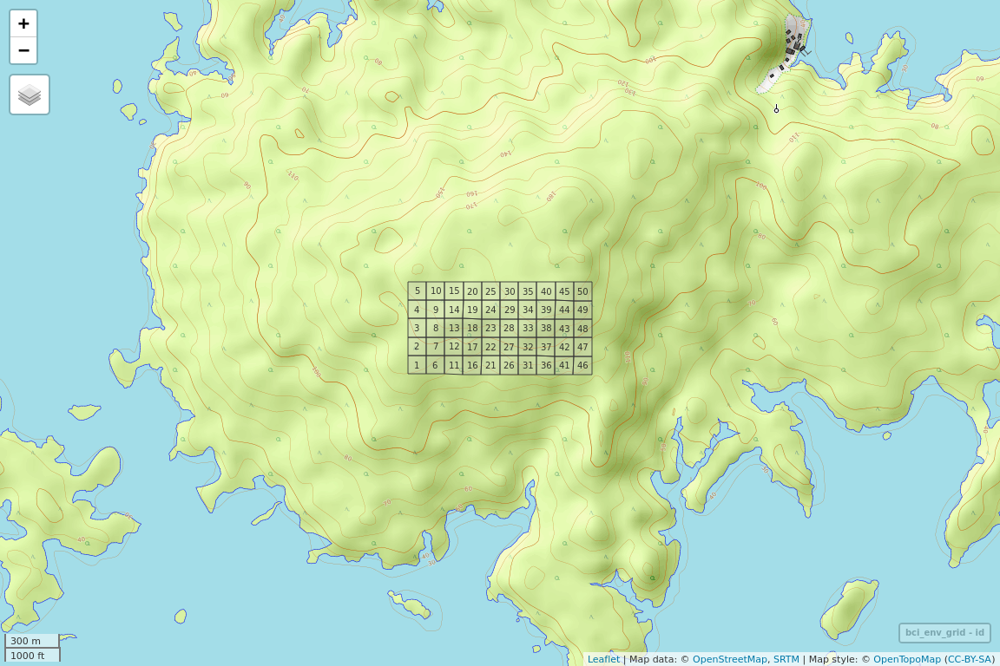<!-- -->

Comparar con resultados de un análisis de agrupamiento del mismo
conjunto de datos. Primero agrupo mis sitios basado en la misma matriz
ambiental fuente del PCA (`env_suelo`), escalándola.

``` r
(env_agrupamiento <- hclust(dist(scale(env_suelo)), 'ward.D'))
```

    ## 
    ## Call:
    ## hclust(d = dist(scale(env_suelo)), method = "ward.D")
    ## 
    ## Cluster method   : ward.D 
    ## Distance         : euclidean 
    ## Number of objects: 50

``` r
(env_grupos <- cutree(env_agrupamiento, k = 3))
```

    ##  1  2  3  4  5  6  7  8  9 10 11 12 13 14 15 16 17 18 19 20 21 22 23 24 25 
    ##  1  1  1  1  1  1  1  1  1  1  2  1  1  1  1  2  1  1  1  1  2  1  1  2  2 
    ## 26 27 28 29 30 31 32 33 34 35 36 37 38 39 40 41 42 43 44 45 46 47 48 49 50 
    ##  2  2  2  2  2  2  2  2  2  2  2  2  2  2  2  3  3  3  3  3  3  3  3  3  3

``` r
(mi_cluster <- factor(env_grupos))
```

    ##  1  2  3  4  5  6  7  8  9 10 11 12 13 14 15 16 17 18 19 20 21 22 23 24 25 
    ##  1  1  1  1  1  1  1  1  1  1  2  1  1  1  1  2  1  1  1  1  2  1  1  2  2 
    ## 26 27 28 29 30 31 32 33 34 35 36 37 38 39 40 41 42 43 44 45 46 47 48 49 50 
    ##  2  2  2  2  2  2  2  2  2  2  2  2  2  2  2  3  3  3  3  3  3  3  3  3  3 
    ## Levels: 1 2 3

``` r
(mi_cluster_l <- levels(mi_cluster))
```

    ## [1] "1" "2" "3"

``` r
(mi_cluster_l_seq <- 1:length(mi_cluster_l))
```

    ## [1] 1 2 3

Observa que estoy generando un agrupamiento basado en los datos de
suelo. No estoy comparando un agrupamiento externo o anterior (e.g. como
los creados en los scripts "aa\_analisis\_de\_agrupamiento\*"). Sin
embargo, dicha comparación es deseable y posible.

Luego calculo las puntuaciones de los sitios para usarlas luego como
coordenadas de los puntos que añadires al gráfico:

``` r
(puntuaciones <- scores(env_suelo_pca, display = 'wa', scaling = 1))
```

    ##            PC1         PC2
    ## 1   0.39174510 -0.14407979
    ## 2   0.36878719 -0.10367009
    ## 3   0.48685902 -0.22112748
    ## 4   0.37909774 -0.13111921
    ## 5   0.54576828 -0.20773969
    ## 6   0.25199854 -0.20942963
    ## 7   0.54926902 -0.10687106
    ## 8   0.69558882 -0.05930492
    ## 9   0.45106847 -0.14698808
    ## 10  0.56450991 -0.17785248
    ## 11 -0.16586882 -0.18136857
    ## 12  0.56046370 -0.25723110
    ## 13  0.79883126 -0.12743768
    ## 14  0.55758047 -0.28995916
    ## 15  0.30178903 -0.45534568
    ## 16  0.04731375 -0.23797984
    ## 17  0.49029611 -0.03863153
    ## 18  0.75257803 -0.17353606
    ## 19  0.51051696 -0.14200354
    ## 20  0.35902048 -0.22479886
    ## 21 -0.26047083  0.02825202
    ## 22  0.29081497  0.14369533
    ## 23  0.52994887 -0.01133905
    ## 24  0.09685586  0.10708545
    ## 25  0.06763353  0.24091762
    ## 26 -0.05001680  0.26333581
    ## 27  0.27411641  0.32784310
    ## 28  0.54347823  0.41630466
    ## 29  0.15006273  0.39243810
    ## 30  0.27115559  0.35262894
    ## 31 -0.21131378  0.26227860
    ## 32 -0.18582397  0.38587422
    ## 33  0.35545742  0.48237789
    ## 34 -0.04872498  0.47768948
    ## 35 -0.09560728  0.20380867
    ## 36 -0.60471858  0.29321598
    ## 37 -0.28773331  0.28229391
    ## 38 -0.36087173  0.42627111
    ## 39 -0.40862742  0.28974135
    ## 40 -0.16844745  0.22564349
    ## 41 -1.30133161  0.02818187
    ## 42 -0.62171296 -0.14795567
    ## 43 -0.67672756 -0.16978708
    ## 44 -0.67776192 -0.18522268
    ## 45 -0.94524751 -0.04651670
    ## 46 -0.89848343 -0.28008841
    ## 47 -0.41385309 -0.40061278
    ## 48 -0.97385861 -0.38869065
    ## 49 -1.25231536 -0.26264706
    ## 50 -1.03308844 -0.10054309
    ## attr(,"const")
    ## [1] 5.023829

Luego creo el gráfico base, coloco los puntos sobre el gráfico usando
las puntuaciones, les coloco rótulos y, finalmente, coloco leyenda:

``` r
grafico_base <- plot(
  env_suelo_pca,
  display = "wa",
  scaling = 1,
  type = "n",
  main = "PCA y grupos"
)
abline(v = 0, lty = "dotted")
abline(h = 0, lty = "dotted")
for (i in mi_cluster_l_seq) {
  points(puntuaciones[mi_cluster == i, ],
         pch = (14 + i),
         cex = 2,
         col = i + 1)
}
text(puntuaciones, row.names(env_suelo), cex = 1, pos = 3)
legend(
  "topright", # Otras alternativas: "bottomleft", "bottomright" y "topleft"
  paste("Grupo", c(mi_cluster_l_seq)),
  pch = 14 + c(mi_cluster_l_seq),
  col = 1 + c(mi_cluster_l_seq),
  pt.cex = 2
)
```

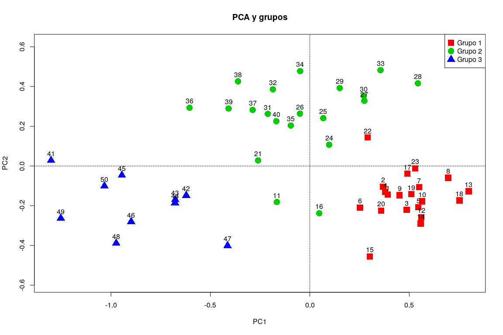<!-- -->

Es razonable que el análisis cluster y el biplot muestren patrones
consistentes, puesto que se basan en la misma matriz ambiental.

Si hago lo mismo, pero usando mi análisis de agrupamiento anterior
(*scripts* "aa\_analisis\_de\_agrupamiento\_\*"), no obtengo resultados
consistentes, al menos en mi caso.

``` r
# (mi_cluster_anterior <- grupos_upgma_k2)
(mi_cluster_anterior <- grupos_ward_k3)
```

    ##  1  2  3  4  5  6  7  8  9 10 11 12 13 14 15 16 17 18 19 20 21 22 23 24 25 
    ##  1  1  2  2  2  1  1  1  1  1  1  1  1  2  2  1  3  1  1  1  1  1  1  1  3 
    ## 26 27 28 29 30 31 32 33 34 35 36 37 38 39 40 41 42 43 44 45 46 47 48 49 50 
    ##  3  3  3  3  3  3  3  3  3  3  3  3  3  3  3  3  1  3  3  3  1  3  3  3  3 
    ## Levels: 1 2 3

``` r
(mi_cluster_anterior_l <- levels(mi_cluster_anterior))
```

    ## [1] "1" "2" "3"

``` r
(mi_cluster_anterior_l_seq <- 1:length(mi_cluster_anterior_l))
```

    ## [1] 1 2 3

``` r
grafico_base <- plot(
  env_suelo_pca,
  display = "wa",
  scaling = 1,
  type = "n",
  main = "PCA y grupos"
)
abline(v = 0, lty = "dotted")
abline(h = 0, lty = "dotted")
for (i in mi_cluster_anterior_l_seq) {
  points(puntuaciones[mi_cluster_anterior == i, ],
         pch = (14 + i),
         cex = 2,
         col = i + 1)
}
text(puntuaciones, row.names(env_suelo), cex = 1, pos = 3)
legend(
  "topright", # Otras alternativas: "bottomleft", "bottomright" y "topleft"
  paste("Grupo", c(mi_cluster_anterior_l_seq)),
  pch = 14 + c(mi_cluster_anterior_l_seq),
  col = 1 + c(mi_cluster_anterior_l_seq),
  pt.cex = 2
)
```

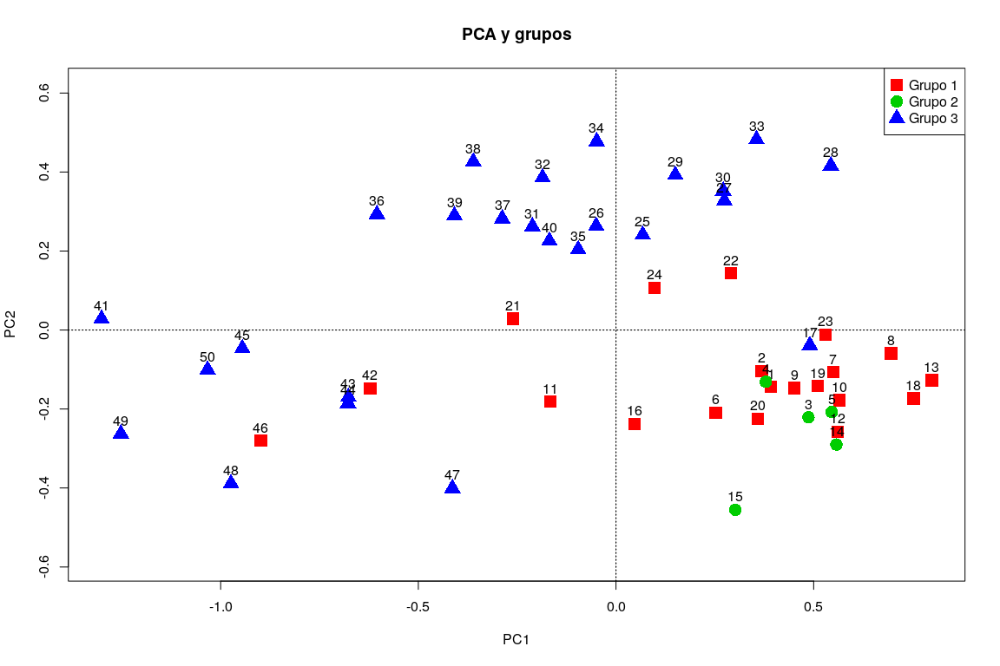<!-- -->

Esto podría significar que las tendencias/patrones de mi matriz de
comunidad (cuadros de 1 Ha de BCI según composición), no se asocian/no
son consistentes con variables de suelo según el PCA. Es probable que,
usando una combinación diferente de variables ambientales, se puedan
extraer patrones. No recomiendo identificar variables ambientales de
forma meramente heurística, porque sería equivalente a pescar;
recomiendo construir una matriz ambiental de variables seleccionadas a
partir de patrones de dependencia identificados en scripts anteriores.
Concretamente, en el script
[aa\_analisis\_de\_agrupamiento\_3\_variables\_ambientales\_segun\_grupos.R](aa_analisis_de_agrupamiento_3_variables_ambientales_segun_grupos.R)
identifiqué posibles variables asociadas según los distintos
agrupamientos realizados. Si fuese tu caso, te recomiendo construir una
matriz ambiental con dichas variables y probar la consistencia de los
métodos de ordenación y agrupamiento.

#### PCA aplicado a datos de comunidad transformados

``` r
mi_fam_hel <- decostand(mi_fam, method = 'hellinger')
mi_fam_hel %>% tibble
```

    ## # A tibble: 50 x 16
    ##    Aspispru Cedrodor Chryarge Chrycain Guarbull Guargran Guarguid Lacmpana
    ##       <dbl>    <dbl>    <dbl>    <dbl>    <dbl>    <dbl>    <dbl>    <dbl>
    ##  1   0.0985   0         0.261   0.0805    0.279   0.114     0.346   0.0805
    ##  2   0.0799   0         0.187   0.0565    0.253   0.0799    0.325   0     
    ##  3   0.0964   0         0.297   0.0682    0.264   0.0964    0.305   0.118 
    ##  4   0.113    0         0.400   0.0919    0.283   0.0650    0.298   0.113 
    ##  5   0.103    0.0729    0.334   0         0.357   0.0729    0.334   0.126 
    ##  6   0.125    0         0.305   0         0.249   0.0720    0.279   0.125 
    ##  7   0        0         0.189   0.109     0.178   0         0.259   0.0889
    ##  8   0.136    0         0.255   0         0.216   0.0682    0.334   0.136 
    ##  9   0.167    0         0.373   0         0.167   0.0745    0.167   0.0745
    ## 10   0.0684   0         0.282   0.0684    0.298   0         0.282   0.0684
    ## # … with 40 more rows, and 8 more variables: Poutfoss <dbl>,
    ## #   Poutreti <dbl>, Poutstip <dbl>, Rauvlitt <dbl>, Tabearbo <dbl>,
    ## #   Thevahou <dbl>, Tricpall <dbl>, Trictube <dbl>

``` r
mi_fam_hel_pca <- rda(mi_fam_hel)
summary(mi_fam_hel_pca)
```

    ## 
    ## Call:
    ## rda(X = mi_fam_hel) 
    ## 
    ## Partitioning of variance:
    ##               Inertia Proportion
    ## Total         0.05866          1
    ## Unconstrained 0.05866          1
    ## 
    ## Eigenvalues, and their contribution to the variance 
    ## 
    ## Importance of components:
    ##                           PC1      PC2      PC3      PC4     PC5      PC6
    ## Eigenvalue            0.02547 0.008351 0.006844 0.004132 0.00300 0.002455
    ## Proportion Explained  0.43412 0.142359 0.116656 0.070430 0.05114 0.041854
    ## Cumulative Proportion 0.43412 0.576480 0.693136 0.763566 0.81470 0.856557
    ##                            PC7      PC8      PC9     PC10      PC11
    ## Eigenvalue            0.001789 0.001718 0.001519 0.001231 0.0008119
    ## Proportion Explained  0.030490 0.029286 0.025899 0.020979 0.0138402
    ## Cumulative Proportion 0.887047 0.916334 0.942232 0.963211 0.9770516
    ##                            PC12      PC13     PC14      PC15      PC16
    ## Eigenvalue            0.0005656 0.0004094 0.000231 0.0001158 2.448e-05
    ## Proportion Explained  0.0096412 0.0069783 0.003937 0.0019747 4.172e-04
    ## Cumulative Proportion 0.9866928 0.9936711 0.997608 0.9995828 1.000e+00
    ## 
    ## Scaling 2 for species and site scores
    ## * Species are scaled proportional to eigenvalues
    ## * Sites are unscaled: weighted dispersion equal on all dimensions
    ## * General scaling constant of scores:  1.302092 
    ## 
    ## 
    ## Species scores
    ## 
    ##                PC1       PC2       PC3        PC4       PC5        PC6
    ## Aspispru  0.066661 -0.299566 -0.200339  0.1932410 -0.004908  0.0378160
    ## Cedrodor -0.018464 -0.019828 -0.018244  0.0330612 -0.036673 -0.0413088
    ## Chryarge -0.264502 -0.159716  0.023054 -0.1206238 -0.096081  0.0687722
    ## Chrycain  0.018032  0.057537 -0.025390  0.0808847  0.084998 -0.0141395
    ## Guarbull -0.150185 -0.133598 -0.051686 -0.1180763 -0.047385 -0.0226362
    ## Guargran -0.073860 -0.094830  0.018571  0.0312915 -0.055883 -0.0508268
    ## Guarguid -0.016044 -0.075771  0.251881  0.0509757  0.014930 -0.1074472
    ## Lacmpana -0.144322 -0.028235  0.004082 -0.0111210  0.108142  0.0730551
    ## Poutfoss -0.020937 -0.008812 -0.004873  0.0074526 -0.025078 -0.0060916
    ## Poutreti -0.224939 -0.040137 -0.019970  0.0118555  0.138387 -0.1158421
    ## Poutstip -0.108177 -0.018206 -0.049248 -0.0965211  0.159500  0.0910091
    ## Rauvlitt  0.003958 -0.002314  0.002842  0.0001942  0.001380  0.0008822
    ## Tabearbo -0.512311  0.152160 -0.037911  0.0353464 -0.062726  0.0063536
    ## Thevahou -0.077524  0.036813  0.226611  0.1485552 -0.012894  0.1425345
    ## Tricpall -0.113204  0.237443 -0.182265  0.0759138 -0.040910 -0.0122138
    ## Trictube  0.517510  0.078211 -0.028226 -0.0603754 -0.024361  0.0259057
    ## 
    ## 
    ## Site scores (weighted sums of species scores)
    ## 
    ##          PC1       PC2       PC3        PC4      PC5       PC6
    ## 1  -0.059226 -0.088997  0.290472 -0.0369392 -0.29793  0.182339
    ## 2  -0.007157  0.062539  0.118270 -0.0711301 -0.21229 -0.196501
    ## 3  -0.343094 -0.036679 -0.015428 -0.1403426  0.03523 -0.191032
    ## 4  -0.342645 -0.098722 -0.066868 -0.2786900 -0.07392  0.152130
    ## 5  -0.401926 -0.110571  0.092648 -0.1086252 -0.26082  0.071068
    ## 6  -0.264893 -0.099963 -0.028658 -0.2547406 -0.02182  0.075744
    ## 7  -0.101183  0.345389  0.015852 -0.0965082  0.21446 -0.037606
    ## 8  -0.180180 -0.022126 -0.034928 -0.1326924  0.04984  0.044345
    ## 9  -0.098986  0.005932 -0.276100 -0.2069665 -0.39318  0.469782
    ## 10 -0.239758  0.022823 -0.029008 -0.3191021  0.06248 -0.075716
    ## 11 -0.027928  0.003314 -0.005951 -0.1423820 -0.00530 -0.125247
    ## 12 -0.053597 -0.065051  0.075910 -0.0546876  0.18483 -0.166586
    ## 13 -0.119872  0.495362  0.035115  0.0881618  0.07236 -0.224813
    ## 14 -0.339585  0.121385  0.101936  0.0633020 -0.05193  0.277807
    ## 15 -0.321364  0.008920 -0.109622  0.2094413 -0.08857 -0.449258
    ## 16  0.023773  0.195088  0.020685 -0.1353483 -0.12781 -0.176005
    ## 17  0.085171  0.141668 -0.221369 -0.1453966  0.26934  0.241430
    ## 18 -0.195867  0.401582  0.376302  0.5389179  0.25987  0.428627
    ## 19 -0.205487 -0.150311 -0.256422  0.1982404  0.36010  0.176326
    ## 20 -0.183855  0.022501 -0.210405  0.2931318  0.09109 -0.155521
    ## 21 -0.042960 -0.083557  0.173625 -0.0399849 -0.04857 -0.269529
    ## 22 -0.073623  0.091639 -0.083516  0.1955275 -0.14570 -0.365014
    ## 23 -0.057861  0.218684  0.364455  0.2342625 -0.01044 -0.021346
    ## 24 -0.053659 -0.028112 -0.375255  0.3394639 -0.30490  0.007977
    ## 25  0.166097 -0.101993 -0.241436  0.2509330  0.04180  0.088242
    ## 26  0.202561  0.122689  0.137559 -0.2255474 -0.09232 -0.175350
    ## 27  0.076451  0.149530 -0.073266 -0.1092975  0.05896 -0.070170
    ## 28  0.064704  0.064873 -0.178136 -0.0115700 -0.09181  0.134551
    ## 29  0.085064  0.086422 -0.252373  0.0009076  0.06312  0.073602
    ## 30  0.120542  0.090450 -0.195033 -0.1169067  0.06952  0.232129
    ## 31  0.234601 -0.195834 -0.106487  0.1312245 -0.10140  0.001592
    ## 32  0.151874  0.011860 -0.211720  0.0529635  0.03874  0.025720
    ## 33  0.202088  0.095256  0.018498 -0.0649734  0.22761 -0.154505
    ## 34  0.194488  0.149468 -0.142420  0.0415631 -0.02170  0.026411
    ## 35  0.247222  0.213716 -0.014591 -0.1588098  0.07837  0.136023
    ## 36 -0.018711 -0.388136 -0.099056  0.1790952 -0.14676 -0.238279
    ## 37  0.118820 -0.200553 -0.104055  0.1113808 -0.15214 -0.176655
    ## 38  0.075040 -0.024717 -0.019851  0.0334104 -0.07139  0.021652
    ## 39  0.184888 -0.017187 -0.075529 -0.0563444 -0.04700  0.083141
    ## 40  0.230159  0.126365 -0.208008  0.1574540  0.10190 -0.043484
    ## 41  0.095549 -0.375594  0.319709  0.4311688 -0.05839  0.176973
    ## 42 -0.095781 -0.172325  0.323307 -0.1269763 -0.08267  0.225881
    ## 43  0.160309 -0.187992 -0.067396  0.0267885 -0.16934  0.141016
    ## 44  0.175521 -0.102593  0.126037  0.0086108  0.06120  0.039119
    ## 45  0.285302  0.058875  0.092848 -0.2204476 -0.06788  0.045357
    ## 46 -0.106402 -0.450633  0.012330 -0.1373476  0.74429 -0.097267
    ## 47  0.164375 -0.349772  0.197894 -0.1163940  0.21188  0.070995
    ## 48  0.200681 -0.048442  0.317302 -0.0410115 -0.03834 -0.140539
    ## 49  0.250804  0.135658  0.205905 -0.1747197 -0.07769 -0.116181
    ## 50  0.139515 -0.042127  0.286231  0.1379330 -0.03499  0.016626

``` r
screeplot(
  mi_fam_hel_pca,
  bstick = TRUE,
  npcs = length(mi_fam_hel_pca$CA$eig)
)
```

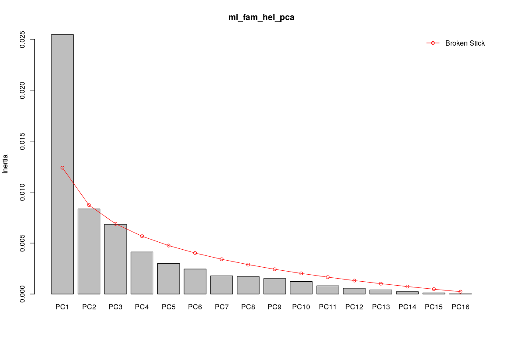<!-- -->

``` r
mi_fam_hel_pca_sc1 <- scores(mi_fam_hel_pca,
                      display = "species", scaling = 1)
mi_fam_hel_pca_sc2 <- scores(mi_fam_hel_pca,
                      display = "species", scaling = 2)
par(mfrow = c(1, 2))
cleanplot.pca(mi_fam_hel_pca, scaling = 1, mar.percent = 0.06, cex.char1 = 0.7)
cleanplot.pca(mi_fam_hel_pca, scaling = 2, mar.percent = 0.06, cex.char1 = 0.7)
```

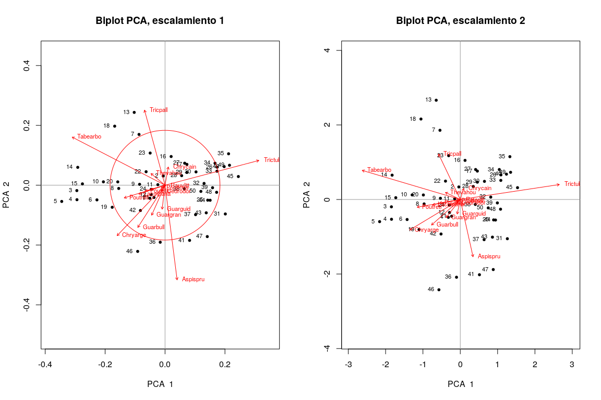<!-- -->

``` r
par(mfrow = c(1, 1))
```

Si intentáramos realizar el PCA a datos de comunidad no transformados,
no recogeríamos apropiadamente las tendencias y patrones, debido a la
presencia de doble-ceros y valores extremos.

Las especies que contribuyen mucho a los ejes 1 y 2 del PCA (aquellas
cuyos vectores sobresalen el círculo de contribución uniforme), podrían
coincidir con aquellas que podríamos considerar como especies
indicadoras o que muestran preferencias por determinados hábitats.

Evaluaré el ajuste del PCA de datos de comunidad a datos ambientales,
mediante la función `envfit`

``` r
biplot(
  mi_fam_hel_pca,
  main = "PCA, escalamiento 2, ajuste a variables ambientales")
(mi_fam_hel_pca_envfit <- envfit(mi_fam_hel_pca, env_suelo, scaling = 2))
```

    ## 
    ## ***VECTORS
    ## 
    ##             PC1      PC2     r2 Pr(>r)    
    ## Al     -0.81128  0.58466 0.3031  0.001 ***
    ## B       0.86077 -0.50900 0.6025  0.001 ***
    ## Ca      0.65508 -0.75556 0.5406  0.001 ***
    ## Cu      0.49245 -0.87034 0.3258  0.001 ***
    ## Fe      0.73288 -0.68036 0.1713  0.013 *  
    ## K       0.78293 -0.62211 0.5754  0.001 ***
    ## Mg      0.65459 -0.75598 0.4447  0.001 ***
    ## Mn      0.36991 -0.92907 0.2694  0.003 ** 
    ## P       0.42924  0.90319 0.1753  0.017 *  
    ## Zn      0.78392 -0.62087 0.5866  0.001 ***
    ## N       0.93046 -0.36638 0.3305  0.001 ***
    ## N.min.  0.88037 -0.47429 0.4024  0.001 ***
    ## pH      0.94949 -0.31378 0.6551  0.001 ***
    ## ---
    ## Signif. codes:  0 '***' 0.001 '**' 0.01 '*' 0.05 '.' 0.1 ' ' 1
    ## Permutation: free
    ## Number of permutations: 999

``` r
plot(mi_fam_hel_pca_envfit, p.max = 0.05 , col = 3)
```

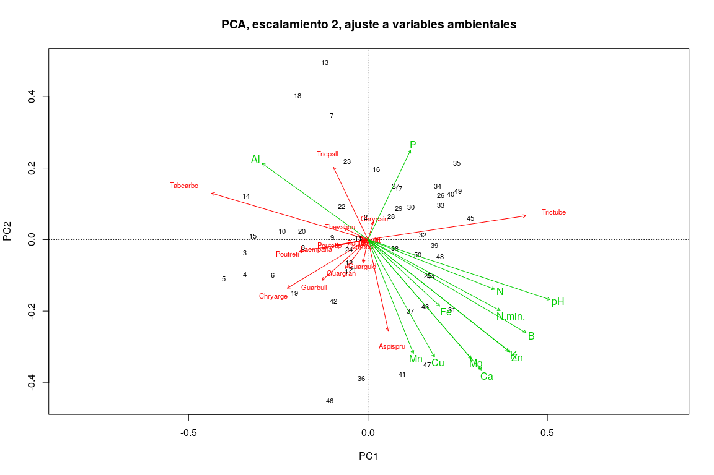<!-- -->

Comento los resultados en el vídeo asociado. También probaré ajuste con
todas las numéricas de la matriz ambiental, excluyendo por supuesto la
columna `id`:

``` r
env_num <- bci_env_grid %>%
  select_if(is.numeric) %>%
  select(-id) %>%
  st_drop_geometry
(mi_fam_hel_pca_envfit_num <- envfit(mi_fam_hel_pca, env_num, scaling = 2))
```

    ## 
    ## ***VECTORS
    ## 
    ##                                 PC1      PC2     r2 Pr(>r)    
    ## heterogeneidad_ambiental    0.86198  0.50694 0.1362  0.036 *  
    ## UTM.EW                      0.91300 -0.40797 0.6577  0.001 ***
    ## UTM.NS                     -0.11834  0.99297 0.0687  0.185    
    ## geomorf_llanura_pct         0.61758  0.78651 0.0167  0.677    
    ## geomorf_pico_pct           -0.44921  0.89343 0.0789  0.159    
    ## geomorf_interfluvio_pct    -0.87619 -0.48197 0.0037  0.913    
    ## geomorf_hombrera_pct       -0.13181  0.99128 0.0728  0.164    
    ## geomorf_espolón/gajo_pct   -0.59521 -0.80357 0.0553  0.266    
    ## geomorf_vertiente_pct      -0.19817 -0.98017 0.0077  0.831    
    ## geomorf_vaguada_pct        -0.63948 -0.76881 0.0933  0.110    
    ## geomorf_piedemonte_pct      0.86414  0.50325 0.0384  0.405    
    ## geomorf_valle_pct          -0.99402  0.10922 0.0588  0.264    
    ## geomorf_sima_pct           -0.99821  0.05982 0.0059  0.861    
    ## Al                         -0.81128  0.58466 0.3031  0.001 ***
    ## B                           0.86077 -0.50900 0.6025  0.001 ***
    ## Ca                          0.65508 -0.75556 0.5406  0.001 ***
    ## Cu                          0.49245 -0.87034 0.3258  0.001 ***
    ## Fe                          0.73288 -0.68036 0.1713  0.013 *  
    ## K                           0.78293 -0.62211 0.5754  0.001 ***
    ## Mg                          0.65459 -0.75598 0.4447  0.001 ***
    ## Mn                          0.36991 -0.92907 0.2694  0.001 ***
    ## P                           0.42924  0.90319 0.1753  0.017 *  
    ## Zn                          0.78392 -0.62087 0.5866  0.001 ***
    ## N                           0.93046 -0.36638 0.3305  0.001 ***
    ## N.min.                      0.88037 -0.47429 0.4024  0.001 ***
    ## pH                          0.94949 -0.31378 0.6551  0.001 ***
    ## elevacion_media             0.36513  0.93096 0.0949  0.118    
    ## pendiente_media            -0.98456  0.17506 0.0052  0.884    
    ## orientacion_media           0.73513 -0.67792 0.0546  0.269    
    ## curvatura_perfil_media     -0.99920 -0.03994 0.0032  0.930    
    ## curvatura_tangencial_media  0.90401  0.42752 0.0379  0.408    
    ## abundancia_global          -0.93002 -0.36752 0.0460  0.312    
    ## riqueza_global             -0.99599 -0.08942 0.1506  0.022 *  
    ## ---
    ## Signif. codes:  0 '***' 0.001 '**' 0.01 '*' 0.05 '.' 0.1 ' ' 1
    ## Permutation: free
    ## Number of permutations: 999

``` r
biplot(
  mi_fam_hel_pca,
  main = "PCA, escalamiento 2, ajuste a variables ambientales")
plot(mi_fam_hel_pca_envfit_num, p.max = 0.05 , col = 3)
```

<!-- -->

``` r
biplot(
  mi_fam_hel_pca,
  main = "PCA, escalamiento 2, ajuste a variables ambientales")
plot(mi_fam_hel_pca_envfit_num, p.max = 0.1 , col = 3)
```

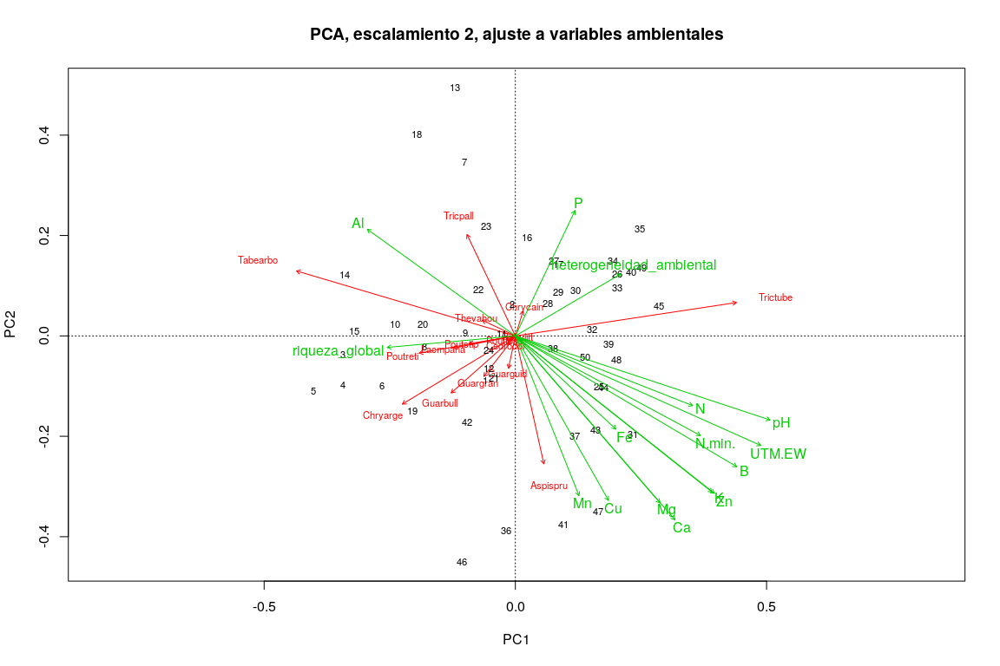<!-- -->

Comento los resultados en el vídeo asociado.

¿Cuándo o a qué datos aplicar PCA?

  - PCA no es especialmente sensible a datos muy desviados de la
    normalidad.
  - Como toda técnica, PCA tiene limitaciones.
  - Las variables deben ser dimensionalmente homogéneas (unidades
    comparables o adimensionales).
  - No usar en matriz transpuestas (no hace sentido la covarianza entre
    objetos).
  - Es posible usar PCA con dato de presencia/ausencia, en cuyo caso, la
    matriz de comunidad debe transformarse a Hellinger, cuerdas o
    log-chord.
  - Las relaciones entre variables se miden por ángulos, no por
    proximidad de las puntas de los vectores.

### Análisis de correspondencia (CA)

``` r
mi_fam_ca <- cca(mi_fam)
summary(mi_fam_ca)
```

    ## 
    ## Call:
    ## cca(X = mi_fam) 
    ## 
    ## Partitioning of scaled Chi-square:
    ##               Inertia Proportion
    ## Total          0.2535          1
    ## Unconstrained  0.2535          1
    ## 
    ## Eigenvalues, and their contribution to the scaled Chi-square 
    ## 
    ## Importance of components:
    ##                          CA1     CA2     CA3     CA4     CA5      CA6
    ## Eigenvalue            0.1004 0.04521 0.02775 0.02304 0.01214 0.009976
    ## Proportion Explained  0.3961 0.17832 0.10946 0.09089 0.04789 0.039351
    ## Cumulative Proportion 0.3961 0.57441 0.68386 0.77475 0.82264 0.861995
    ##                            CA7      CA8      CA9     CA10     CA11
    ## Eigenvalue            0.007694 0.006926 0.005361 0.003923 0.003367
    ## Proportion Explained  0.030348 0.027317 0.021146 0.015472 0.013279
    ## Cumulative Proportion 0.892343 0.919660 0.940806 0.956278 0.969558
    ##                           CA12     CA13     CA14      CA15
    ## Eigenvalue            0.002834 0.002382 0.001619 0.0008828
    ## Proportion Explained  0.011180 0.009396 0.006385 0.0034821
    ## Cumulative Proportion 0.980738 0.990133 0.996518 1.0000000
    ## 
    ## Scaling 2 for species and site scores
    ## * Species are scaled proportional to eigenvalues
    ## * Sites are unscaled: weighted dispersion equal on all dimensions
    ## 
    ## 
    ## Species scores
    ## 
    ##               CA1      CA2      CA3       CA4      CA5      CA6
    ## Aspispru  0.09007  0.25658 -0.83132 -0.423274  0.05109  0.02692
    ## Cedrodor -0.41891  0.56580 -0.91046 -0.321075  0.97024  0.40369
    ## Chryarge -0.46976  0.25265 -0.15201  0.309690 -0.15789  0.18856
    ## Chrycain -0.07102 -0.04291  0.15422 -0.288212  0.03358 -0.04870
    ## Guarbull -0.23518  0.26731 -0.06201  0.158020 -0.11510  0.08788
    ## Guargran -0.44601  0.16550 -0.40757  0.202047  0.32872  0.07560
    ## Guarguid -0.02203 -0.13042 -0.06933  0.230619  0.19462 -0.10003
    ## Lacmpana -0.65265  0.07020 -0.01917  0.018654 -0.35240 -0.29783
    ## Poutfoss -1.17386  0.79358 -0.51119  0.183439  0.69560  1.62768
    ## Poutreti -0.34750  0.09690 -0.04712 -0.055077  0.01680 -0.22940
    ## Poutstip -0.63344  0.41116 -0.04579  0.036308 -0.98699 -0.85978
    ## Rauvlitt  0.71255 -0.13035 -0.36516  0.696180  0.23215 -0.14089
    ## Tabearbo -0.64024  0.05097  0.15222 -0.067106  0.06425  0.06406
    ## Thevahou -1.32939 -2.74057 -0.56888 -0.171912 -0.39366  0.17812
    ## Tricpall -0.29843  0.05132  0.31605 -0.503451  0.09800  0.02034
    ## Trictube  0.22092 -0.02583  0.03513 -0.009916 -0.02626  0.01544
    ## 
    ## 
    ## Site scores (weighted averages of species scores)
    ## 
    ##         CA1        CA2      CA3      CA4       CA5       CA6
    ## 1  -0.66363 -0.6455104 -0.37647  1.55469 -0.482062  1.699646
    ## 2  -0.22526  0.1224452  0.52620  0.65852  0.391342  0.260690
    ## 3  -2.11621  1.1893532  0.45239  0.81290  0.156929 -0.441210
    ## 4  -2.14545  1.6227877  0.04138  1.68772 -2.180869  1.133678
    ## 5  -2.46823  1.0526156 -0.29108  1.49646 -0.162475  2.429089
    ## 6  -1.71150  1.1421610  0.25138  0.96875 -1.085798  0.044644
    ## 7  -0.74881  0.1793170  1.39771 -0.93686 -0.081996 -1.276492
    ## 8  -1.15670  0.7459687  0.33301  0.45775 -0.631054 -1.121495
    ## 9  -0.83481  1.0988762  0.14493  0.05370 -1.889297  3.015651
    ## 10 -1.52274  1.1200496  0.62926  0.91572 -0.971987 -0.241396
    ## 11 -0.28150  0.4555456  0.27747  0.55002 -0.074242 -0.351711
    ## 12 -0.43282  0.3452197  0.06915  0.74344  0.375516 -1.227717
    ## 13 -0.98227  0.0342477  2.20262 -1.42503  2.272486 -0.546279
    ## 14 -2.30295 -0.1048888  0.79330  0.12411 -0.514700  0.891375
    ## 15 -1.92880  1.0255809  0.41524 -0.65982  2.239579 -0.597507
    ## 16 -0.03216  0.1310808  1.09560  0.09682  0.511994  0.200026
    ## 17  0.23304  0.3912802  0.71683 -0.85440 -2.439037 -1.760207
    ## 18 -2.38376 -5.3641978 -0.26648 -1.53106 -1.358186 -0.135786
    ## 19 -1.37988  1.2539819 -1.38535 -1.28942 -1.418164 -2.435920
    ## 20 -1.22095  0.7563376 -0.01397 -1.54095  1.401807 -0.720619
    ## 21 -0.45177  0.3434067 -0.15222  1.40954  1.272829  0.237927
    ## 22 -0.76051  0.4445860  0.45883 -0.62991  1.858791  0.261009
    ## 23 -0.74650 -1.1398075  0.78342  0.38158  1.608288  0.011282
    ## 24 -0.60159  0.9847033 -1.09028 -2.35569  0.976434  2.216010
    ## 25  0.68035  0.3798727 -1.51569 -1.68854  0.047834  0.123226
    ## 26  0.85377 -0.2324977  0.76586  0.57677 -0.007476 -0.137667
    ## 27  0.24650  0.1749948  0.89963 -0.25384 -0.156054 -0.131912
    ## 28  0.17584  0.3701203  0.39770 -0.65724 -0.368758  1.063583
    ## 29  0.27383  0.3920733  0.51852 -1.19441 -0.745511  0.120937
    ## 30  0.46305  0.2833209  0.64301 -0.59429 -1.552270  0.330578
    ## 31  0.95128  0.2484558 -1.48563 -0.67879 -0.135914  0.421332
    ## 32  0.57575  0.3109553 -0.12941 -1.09372 -0.221793  0.166159
    ## 33  0.80338 -0.1425826  0.61185  0.01376 -0.086089 -1.044759
    ## 34  0.77553  0.0007607  0.72253 -0.94881 -0.241747  0.538701
    ## 35  1.05263 -0.2334292  1.08354 -0.30077 -0.769524  0.277430
    ## 36 -0.25854  1.0500492 -2.98848 -0.38441  1.637046  0.130077
    ## 37  0.38419  0.5246486 -1.32886 -0.20379  0.382828  0.451640
    ## 38  0.22343  0.1734157 -0.05516  0.03788 -0.003917  0.228788
    ## 39  0.77597  0.1164159  0.13758 -0.11028 -0.807601  0.636568
    ## 40  0.90716  0.0015079  0.38053 -1.39804 -0.318145 -0.091275
    ## 41 -0.11121 -1.8529333 -3.29034  0.31293  0.417077  0.009729
    ## 42 -0.81305 -0.3495407 -0.62572  2.11929 -0.988400  1.021258
    ## 43  0.62370  0.3654904 -1.15571 -0.03427 -0.325324  1.199369
    ## 44  0.71255 -0.1303517 -0.36516  0.69618  0.232150 -0.140888
    ## 45  1.21484 -0.2730446  0.59840  0.56113 -0.556103  0.497093
    ## 46 -0.96286  1.2958099 -1.78086  0.58520 -2.869214 -5.852435
    ## 47  0.53627  0.1601990 -1.28590  1.43112 -0.450390 -1.510547
    ## 48  0.79116 -0.5402926 -0.03091  1.53569  1.052396 -0.787872
    ## 49  1.05114 -0.4802625  0.68498  1.01994  0.686971 -0.179331
    ## 50  0.47151 -0.8610119 -0.28916  0.99973  0.853491 -0.477812

``` r
summary(mi_fam_ca, scaling = 1)
```

    ## 
    ## Call:
    ## cca(X = mi_fam) 
    ## 
    ## Partitioning of scaled Chi-square:
    ##               Inertia Proportion
    ## Total          0.2535          1
    ## Unconstrained  0.2535          1
    ## 
    ## Eigenvalues, and their contribution to the scaled Chi-square 
    ## 
    ## Importance of components:
    ##                          CA1     CA2     CA3     CA4     CA5      CA6
    ## Eigenvalue            0.1004 0.04521 0.02775 0.02304 0.01214 0.009976
    ## Proportion Explained  0.3961 0.17832 0.10946 0.09089 0.04789 0.039351
    ## Cumulative Proportion 0.3961 0.57441 0.68386 0.77475 0.82264 0.861995
    ##                            CA7      CA8      CA9     CA10     CA11
    ## Eigenvalue            0.007694 0.006926 0.005361 0.003923 0.003367
    ## Proportion Explained  0.030348 0.027317 0.021146 0.015472 0.013279
    ## Cumulative Proportion 0.892343 0.919660 0.940806 0.956278 0.969558
    ##                           CA12     CA13     CA14      CA15
    ## Eigenvalue            0.002834 0.002382 0.001619 0.0008828
    ## Proportion Explained  0.011180 0.009396 0.006385 0.0034821
    ## Cumulative Proportion 0.980738 0.990133 0.996518 1.0000000
    ## 
    ## Scaling 1 for species and site scores
    ## * Sites are scaled proportional to eigenvalues
    ## * Species are unscaled: weighted dispersion equal on all dimensions
    ## 
    ## 
    ## Species scores
    ## 
    ##               CA1      CA2     CA3      CA4     CA5     CA6
    ## Aspispru  0.28422   1.2067 -4.9904 -2.78845  0.4636  0.2695
    ## Cedrodor -1.32194   2.6611 -5.4655 -2.11518  8.8051  4.0417
    ## Chryarge -1.48243   1.1883 -0.9125  2.04018 -1.4329  1.8878
    ## Chrycain -0.22411  -0.2018  0.9258 -1.89869  0.3048 -0.4876
    ## Guarbull -0.74216   1.2572 -0.3723  1.04101 -1.0446  0.8799
    ## Guargran -1.40746   0.7784 -2.4466  1.33105  2.9832  0.7569
    ## Guarguid -0.06952  -0.6134 -0.4162  1.51927  1.7662 -1.0015
    ## Lacmpana -2.05956   0.3302 -0.1151  0.12289 -3.1980 -2.9818
    ## Poutfoss -3.70435   3.7323 -3.0687  1.20846  6.3126 16.2960
    ## Poutreti -1.09661   0.4557 -0.2829 -0.36284  0.1524 -2.2968
    ## Poutstip -1.99895   1.9338 -0.2749  0.23919 -8.9571 -8.6080
    ## Rauvlitt  2.24859  -0.6131 -2.1921  4.58630  2.1068 -1.4105
    ## Tabearbo -2.02039   0.2397  0.9138 -0.44208  0.5831  0.6413
    ## Thevahou -4.19516 -12.8894 -3.4149 -1.13252 -3.5725  1.7833
    ## Tricpall -0.94176   0.2414  1.8972 -3.31664  0.8894  0.2036
    ## Trictube  0.69715  -0.1215  0.2109 -0.06532 -0.2383  0.1546
    ## 
    ## 
    ## Site scores (weighted averages of species scores)
    ## 
    ##         CA1        CA2       CA3       CA4        CA5        CA6
    ## 1  -0.21030 -0.1372495 -0.062714  0.235994 -0.0531190  0.1697633
    ## 2  -0.07138  0.0260345  0.087656  0.099961  0.0431225  0.0260382
    ## 3  -0.67060  0.2528823  0.075360  0.123395  0.0172922 -0.0440688
    ## 4  -0.67987  0.3450399  0.006894  0.256189 -0.2403128  0.1132336
    ## 5  -0.78215  0.2238089 -0.048490  0.227156 -0.0179034  0.2426213
    ## 6  -0.54235  0.2428482  0.041877  0.147052 -0.1196455  0.0044591
    ## 7  -0.23729  0.0381267  0.232837 -0.142212 -0.0090353 -0.1274980
    ## 8  -0.36655  0.1586091  0.055474  0.069485 -0.0695367 -0.1120167
    ## 9  -0.26454  0.2336449  0.024143  0.008151 -0.2081842  0.3012081
    ## 10 -0.48254  0.2381468  0.104824  0.139002 -0.1071045 -0.0241110
    ## 11 -0.08920  0.0968589  0.046223  0.083491 -0.0081808 -0.0351294
    ## 12 -0.13715  0.0734012  0.011520  0.112851  0.0413786 -0.1226263
    ## 13 -0.31127  0.0072818  0.366922 -0.216314  0.2504083 -0.0545632
    ## 14 -0.72978 -0.0223016  0.132152  0.018839 -0.0567154  0.0890320
    ## 15 -0.61121  0.2180607  0.069172 -0.100158  0.2467822 -0.0596800
    ## 16 -0.01019  0.0278706  0.182510  0.014697  0.0564173  0.0199789
    ## 17  0.07385  0.0831946  0.119413 -0.129695 -0.2687607 -0.1758123
    ## 18 -0.75538 -1.1405448 -0.044391 -0.232409 -0.1496602 -0.0135625
    ## 19 -0.43727  0.2666238 -0.230778 -0.195729 -0.1562693 -0.2433036
    ## 20 -0.38690  0.1608138 -0.002327 -0.233909  0.1544669 -0.0719766
    ## 21 -0.14316  0.0730157 -0.025357  0.213963  0.1402547  0.0237646
    ## 22 -0.24100  0.0945286  0.076434 -0.095618  0.2048226  0.0260700
    ## 23 -0.23656 -0.2423478  0.130506  0.057923  0.1772194  0.0011269
    ## 24 -0.19064  0.2093693 -0.181624 -0.357583  0.1075946  0.2213386
    ## 25  0.21560  0.0807692 -0.252490 -0.256312  0.0052709  0.0123080
    ## 26  0.27055 -0.0494341  0.127580  0.087552 -0.0008238 -0.0137504
    ## 27  0.07811  0.0372077  0.149865 -0.038531 -0.0171958 -0.0131756
    ## 28  0.05572  0.0786956  0.066250 -0.099766 -0.0406339  0.1062324
    ## 29  0.08677  0.0833633  0.086377 -0.181306 -0.0821488  0.0120793
    ## 30  0.14673  0.0602402  0.107116 -0.090210 -0.1710466  0.0330187
    ## 31  0.30145  0.0528271 -0.247484 -0.103037 -0.0149766  0.0420833
    ## 32  0.18245  0.0661158 -0.021557 -0.166021 -0.0244396  0.0165962
    ## 33  0.25458 -0.0303162  0.101924  0.002088 -0.0094863 -0.1043522
    ## 34  0.24575  0.0001617  0.120362 -0.144025 -0.0266385  0.0538063
    ## 35  0.33357 -0.0496321  0.180501 -0.045655 -0.0847948  0.0277102
    ## 36 -0.08193  0.2232632 -0.497835 -0.058352  0.1803882  0.0129923
    ## 37  0.12174  0.1115517 -0.221368 -0.030935  0.0421843  0.0451106
    ## 38  0.07080  0.0368719 -0.009188  0.005750 -0.0004316  0.0228517
    ## 39  0.24590  0.0247525  0.022918 -0.016740 -0.0889906  0.0635814
    ## 40  0.28747  0.0003206  0.063390 -0.212216 -0.0350568 -0.0091167
    ## 41 -0.03524 -0.3939738 -0.548119  0.047501  0.0459583  0.0009717
    ## 42 -0.25765 -0.0743199 -0.104236  0.321699 -0.1089131  0.1020049
    ## 43  0.19764  0.0777112 -0.192524 -0.005201 -0.0358479  0.1197949
    ## 44  0.22580 -0.0277156 -0.060831  0.105677  0.0255809 -0.0140721
    ## 45  0.38497 -0.0580552  0.099684  0.085177 -0.0612777  0.0496504
    ## 46 -0.30512  0.2755173 -0.296664  0.088830 -0.3161624 -0.5845506
    ## 47  0.16994  0.0340618 -0.214211  0.217237 -0.0496291 -0.1508759
    ## 48  0.25071 -0.1148779 -0.005149  0.233110  0.1159649 -0.0786939
    ## 49  0.33309 -0.1021142  0.114107  0.154822  0.0756983 -0.0179119
    ## 50  0.14942 -0.1830698 -0.048170  0.151754  0.0940473 -0.0477246

Screeplot

``` r
screeplot(mi_fam_ca, bstick = TRUE, npcs = length(mi_fam_ca$CA$eig))
```

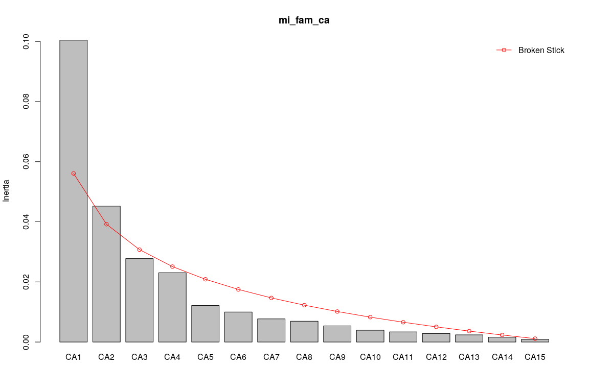<!-- -->

Biplots

``` r
par(mfrow = c(1, 2))
plot(mi_fam_ca,
     scaling = 1,
     main = "Análisis de correspondencia, escalamiento 1"
)
plot(mi_fam_ca,
     scaling = 2, # Por defecto scaling=2, lo escribo sólo para fines didáticos
     main = "Análisis de correspondencia, escalamiento 2")
```

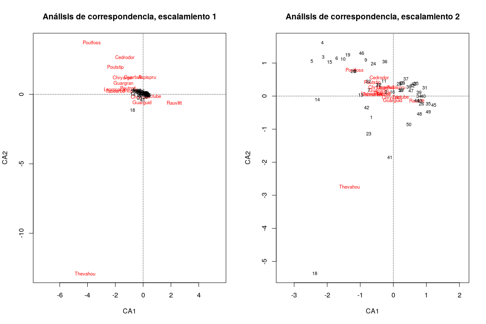<!-- -->

``` r
par(mfrow = c(1, 1))
```

Excluyendo especie *Thevetia ahouai*, abreviada como *Thevahou*.

``` r
mi_fam_ca <- cca(mi_fam[, -grep('Thevahou', colnames(mi_fam))])
summary(mi_fam_ca)
```

    ## 
    ## Call:
    ## cca(X = mi_fam[, -grep("Thevahou", colnames(mi_fam))]) 
    ## 
    ## Partitioning of scaled Chi-square:
    ##               Inertia Proportion
    ## Total          0.2098          1
    ## Unconstrained  0.2098          1
    ## 
    ## Eigenvalues, and their contribution to the scaled Chi-square 
    ## 
    ## Importance of components:
    ##                          CA1     CA2     CA3     CA4     CA5      CA6
    ## Eigenvalue            0.0963 0.02933 0.02332 0.01474 0.01032 0.008071
    ## Proportion Explained  0.4591 0.13984 0.11116 0.07027 0.04920 0.038477
    ## Cumulative Proportion 0.4591 0.59895 0.71011 0.78038 0.82958 0.868061
    ##                            CA7      CA8     CA9     CA10     CA11     CA12
    ## Eigenvalue            0.007084 0.005403 0.00393 0.003375 0.002846 0.002405
    ## Proportion Explained  0.033769 0.025755 0.01873 0.016091 0.013566 0.011465
    ## Cumulative Proportion 0.901831 0.927586 0.94632 0.962411 0.975977 0.987442
    ##                           CA13      CA14
    ## Eigenvalue            0.001747 0.0008869
    ## Proportion Explained  0.008330 0.0042281
    ## Cumulative Proportion 0.995772 1.0000000
    ## 
    ## Scaling 2 for species and site scores
    ## * Species are scaled proportional to eigenvalues
    ## * Sites are unscaled: weighted dispersion equal on all dimensions
    ## 
    ## 
    ## Species scores
    ## 
    ##                CA1       CA2      CA3      CA4       CA5      CA6
    ## Aspispru  0.067681  0.880022 -0.37115 -0.16458  0.009641 -0.12711
    ## Cedrodor -0.491218  1.022363 -0.27850 -0.55686  0.823115  0.81363
    ## Chryarge -0.503627  0.213804  0.29443  0.23770  0.136577  0.03491
    ## Chrycain -0.070971 -0.158621 -0.28865 -0.07875 -0.050908 -0.15531
    ## Guarbull -0.277083  0.150096  0.13251  0.24312  0.087982  0.09818
    ## Guargran -0.459929  0.408398  0.23684 -0.26061  0.194670  0.16365
    ## Guarguid -0.004962 -0.006689  0.25651 -0.24360 -0.047598  0.02007
    ## Lacmpana -0.656983  0.021604  0.01584  0.17858 -0.414839 -0.16494
    ## Poutfoss -1.283668  0.723136  0.16135  0.03418  1.849674  0.32113
    ## Poutreti -0.361836  0.062246 -0.05470 -0.04490 -0.191662  0.19324
    ## Poutstip -0.692484  0.185253 -0.01634  0.70423 -1.133163 -0.29901
    ## Rauvlitt  0.719321  0.262023  0.73139 -0.30022 -0.118513 -0.51058
    ## Tabearbo -0.649130 -0.152030 -0.07232 -0.06131  0.064460 -0.14394
    ## Tricpall -0.314326 -0.270883 -0.52506 -0.03703  0.074872  0.25900
    ## Trictube  0.217748 -0.033960 -0.01352  0.03154  0.007036 -0.01067
    ## 
    ## 
    ## Site scores (weighted averages of species scores)
    ## 
    ##         CA1       CA2       CA3      CA4      CA5       CA6
    ## 1  -0.50955  0.115302  1.643311  0.58427  1.42239 -0.295024
    ## 2  -0.25910 -0.467482  0.593717  0.12338  0.53424  0.679437
    ## 3  -2.31459 -0.115736  0.674247  0.34729 -0.21730  0.290487
    ## 4  -2.37268  0.515504  1.446011  2.63359  0.39098 -0.383262
    ## 5  -2.59387  0.620629  1.385107  1.39670  2.56301  1.507277
    ## 6  -1.89181  0.104163  0.813860  1.24205 -0.34107 -1.286138
    ## 7  -0.80409 -1.220333 -1.055270  0.21045 -1.01608  1.662907
    ## 8  -1.29127 -0.119079  0.362643  0.47139 -1.29057 -0.680332
    ## 9  -0.98213  0.359151 -0.139743  2.44743  2.14654 -0.374897
    ## 10 -1.69895 -0.209156  0.711971  1.48918 -0.32816  0.387230
    ## 11 -0.36726 -0.112393  0.463346  0.41913 -0.17459  1.599732
    ## 12 -0.51419 -0.041410  0.721166 -0.40571 -1.00377 -0.065086
    ## 13 -1.07353 -2.140293 -1.494328 -1.80182  0.23507  0.356208
    ## 14 -2.29200 -0.847768  0.099999  0.37275  0.48877 -1.778599
    ## 15 -2.10943 -0.139948 -0.711755 -1.31533  0.50422  2.678067
    ## 16 -0.09272 -0.980017 -0.003698  0.01453  0.48105  0.741618
    ## 17  0.16591 -0.401629 -1.006601  1.84219 -2.41843 -0.542725
    ## 18 -1.40546 -1.737795 -0.981124 -1.79965 -1.31020 -0.452650
    ## 19 -1.54477  1.695861 -1.259204  0.27605 -3.00861 -3.079792
    ## 20 -1.35534  0.208126 -1.522668 -1.29004 -0.22657  0.007662
    ## 21 -0.53236  0.129218  1.407751 -0.76854  0.69442  0.435340
    ## 22 -0.86222 -0.348752 -0.642253 -1.26210  0.91126 -0.542415
    ## 23 -0.59630 -1.310607  0.526749 -1.98686  0.23095 -2.430678
    ## 24 -0.72477  1.419561 -2.308800 -0.52563  2.29159 -0.979240
    ## 25  0.64483  1.605915 -1.577425 -0.44636 -0.02555 -0.808166
    ## 26  0.84983 -0.785571  0.510948  0.20311 -0.06476  0.162698
    ## 27  0.19326 -0.722312 -0.364740  0.54036  0.01404  0.941591
    ## 28  0.11034 -0.161435 -0.745736  0.73298  0.91580 -0.569109
    ## 29  0.20941 -0.219514 -1.300989  0.98068  0.03703  0.779132
    ## 30  0.41149 -0.373864 -0.725294  1.53744 -0.19070 -1.236279
    ## 31  0.93312  1.519992 -0.587450 -0.12361  0.22720 -0.663014
    ## 32  0.53110  0.332162 -1.131042  0.43590  0.23527  1.265663
    ## 33  0.79294 -0.589186 -0.038299  0.13176 -0.84781  1.098125
    ## 34  0.75354 -0.570800 -1.025588  0.50634  0.51272  0.440744
    ## 35  1.05376 -0.995778 -0.405571  0.86731  0.05190  0.216344
    ## 36 -0.36348  3.099959 -0.210302 -1.26863  0.83788  1.616352
    ## 37  0.32613  1.447273 -0.156320 -0.11538  0.65262  0.948599
    ## 38  0.17702  0.094116  0.028662 -0.04372  0.10931 -0.763933
    ## 39  0.74985 -0.004806 -0.175337  0.91280  0.35127 -0.324073
    ## 40  0.89210 -0.241873 -1.437408  0.32105 -0.11893  0.421490
    ## 41  0.34372  2.441955  0.838880 -1.94705 -0.22061  0.053223
    ## 42 -0.70956  0.428529  2.187834  0.93389  0.60557  0.027443
    ## 43  0.58400  1.241465  0.001975  0.32523  0.88466 -1.262392
    ## 44  0.71932  0.262023  0.731394 -0.30022 -0.11851 -0.510581
    ## 45  1.22672 -0.598702  0.490356  0.69432  0.28466 -0.579410
    ## 46 -1.11569  2.093811  0.551286  1.48779 -6.16946  1.865846
    ## 47  0.50877  1.166250  1.503348 -0.17805 -1.71656 -0.743400
    ## 48  0.84031 -0.273162  1.603301 -1.06173 -0.39585  0.758041
    ## 49  1.07160 -0.856587  1.005813 -0.52121  0.04546 -0.097046
    ## 50  0.60718 -0.126073  1.141937 -1.17445 -0.28227 -0.163492

``` r
summary(mi_fam_ca, scaling = 1)
```

    ## 
    ## Call:
    ## cca(X = mi_fam[, -grep("Thevahou", colnames(mi_fam))]) 
    ## 
    ## Partitioning of scaled Chi-square:
    ##               Inertia Proportion
    ## Total          0.2098          1
    ## Unconstrained  0.2098          1
    ## 
    ## Eigenvalues, and their contribution to the scaled Chi-square 
    ## 
    ## Importance of components:
    ##                          CA1     CA2     CA3     CA4     CA5      CA6
    ## Eigenvalue            0.0963 0.02933 0.02332 0.01474 0.01032 0.008071
    ## Proportion Explained  0.4591 0.13984 0.11116 0.07027 0.04920 0.038477
    ## Cumulative Proportion 0.4591 0.59895 0.71011 0.78038 0.82958 0.868061
    ##                            CA7      CA8     CA9     CA10     CA11     CA12
    ## Eigenvalue            0.007084 0.005403 0.00393 0.003375 0.002846 0.002405
    ## Proportion Explained  0.033769 0.025755 0.01873 0.016091 0.013566 0.011465
    ## Cumulative Proportion 0.901831 0.927586 0.94632 0.962411 0.975977 0.987442
    ##                           CA13      CA14
    ## Eigenvalue            0.001747 0.0008869
    ## Proportion Explained  0.008330 0.0042281
    ## Cumulative Proportion 0.995772 1.0000000
    ## 
    ## Scaling 1 for species and site scores
    ## * Sites are scaled proportional to eigenvalues
    ## * Species are unscaled: weighted dispersion equal on all dimensions
    ## 
    ## 
    ## Species scores
    ## 
    ##               CA1      CA2      CA3     CA4       CA5     CA6
    ## Aspispru  0.21809  5.13823 -2.43055 -1.3556   0.09489 -1.4148
    ## Cedrodor -1.58289  5.96933 -1.82382 -4.5866   8.10211  9.0565
    ## Chryarge -1.62288  1.24835  1.92812  1.9578   1.34436  0.3886
    ## Chrycain -0.22870 -0.92615 -1.89028 -0.6487  -0.50110 -1.7288
    ## Guarbull -0.89287  0.87638  0.86776  2.0025   0.86602  1.0928
    ## Guargran -1.48207  2.38454  1.55096 -2.1466   1.91618  1.8216
    ## Guarguid -0.01599 -0.03905  1.67980 -2.0065  -0.46852  0.2233
    ## Lacmpana -2.11705  0.12614  0.10373  1.4709  -4.08336 -1.8360
    ## Poutfoss -4.13647  4.22221  1.05664  0.2815  18.20677  3.5745
    ## Poutreti -1.16597  0.36344 -0.35823 -0.3699  -1.88657  2.1510
    ## Poutstip -2.23145  1.08165 -0.10698  5.8005 -11.15399 -3.3283
    ## Rauvlitt  2.31793  1.52989  4.78964 -2.4728  -1.16655 -5.6833
    ## Tabearbo -2.09174 -0.88767 -0.47359 -0.5050   0.63450 -1.6022
    ## Tricpall -1.01288 -1.58162 -3.43844 -0.3050   0.73699  2.8829
    ## Trictube  0.70167 -0.19828 -0.08853  0.2597   0.06926 -0.1188
    ## 
    ## 
    ## Site scores (weighted averages of species scores)
    ## 
    ##         CA1        CA2        CA3       CA4       CA5        CA6
    ## 1  -0.15813  0.0197477  0.2509389  0.070936  0.144504 -0.0265047
    ## 2  -0.08041 -0.0800654  0.0906624  0.014979  0.054275  0.0610400
    ## 3  -0.71829 -0.0198221  0.1029596  0.042164 -0.022076  0.0260971
    ## 4  -0.73631  0.0882900  0.2208105  0.319741  0.039721 -0.0344319
    ## 5  -0.80496  0.1062948  0.2115103  0.169572  0.260383  0.1354124
    ## 6  -0.58708  0.0178399  0.1242789  0.150796 -0.034650 -0.1155455
    ## 7  -0.24953 -0.2090057 -0.1611430  0.025551 -0.103226  0.1493941
    ## 8  -0.40072 -0.0203946  0.0553767  0.057231 -0.131112 -0.0611204
    ## 9  -0.30478  0.0615116 -0.0213393  0.297140  0.218072 -0.0336804
    ## 10 -0.52723 -0.0358221  0.1087202  0.180800 -0.033339  0.0347884
    ## 11 -0.11397 -0.0192495  0.0707544  0.050887 -0.017738  0.1437184
    ## 12 -0.15957 -0.0070923  0.1101243 -0.049257 -0.101975 -0.0058473
    ## 13 -0.33315 -0.3665668 -0.2281887 -0.218757  0.023881  0.0320014
    ## 14 -0.71127 -0.1451967  0.0152702  0.045256  0.049656 -0.1597877
    ## 15 -0.65462 -0.0239688 -0.1086872 -0.159693  0.051225  0.2405951
    ## 16 -0.02877 -0.1678470 -0.0005647  0.001764  0.048871  0.0666263
    ## 17  0.05149 -0.0687868 -0.1537112  0.223659 -0.245694 -0.0487580
    ## 18 -0.43616 -0.2976311 -0.1498207 -0.218494 -0.133106 -0.0406657
    ## 19 -0.47939  0.2904490 -0.1922845  0.033514 -0.305652 -0.2766858
    ## 20 -0.42060  0.0356457 -0.2325162 -0.156622 -0.023018  0.0006884
    ## 21 -0.16521  0.0221311  0.2149680 -0.093308  0.070548  0.0391106
    ## 22 -0.26757 -0.0597305 -0.0980740 -0.153230  0.092577 -0.0487301
    ## 23 -0.18505 -0.2244669  0.0804362 -0.241223  0.023463 -0.2183699
    ## 24 -0.22492  0.2431274 -0.3525611 -0.063816  0.232809 -0.0879740
    ## 25  0.20011  0.2750442 -0.2408777 -0.054192 -0.002596 -0.0726049
    ## 26  0.26373 -0.1345442  0.0780234  0.024659 -0.006580  0.0146167
    ## 27  0.05997 -0.1237100 -0.0556970  0.065605  0.001426  0.0845917
    ## 28  0.03424 -0.0276489 -0.1138763  0.088990  0.093038 -0.0511283
    ## 29  0.06499 -0.0375961 -0.1986652  0.119063  0.003762  0.0699965
    ## 30  0.12770 -0.0640315 -0.1107548  0.186659 -0.019374 -0.1110662
    ## 31  0.28957  0.2603282 -0.0897055 -0.015008  0.023082 -0.0595646
    ## 32  0.16482  0.0568892 -0.1727137  0.052923  0.023901  0.1137061
    ## 33  0.24607 -0.1009095 -0.0058484  0.015997 -0.086131  0.0986546
    ## 34  0.23385 -0.0977605 -0.1566105  0.061474  0.052089  0.0395961
    ## 35  0.32701 -0.1705464 -0.0619319  0.105300  0.005272  0.0194361
    ## 36 -0.11280  0.5309281 -0.0321137 -0.154023  0.085123  0.1452116
    ## 37  0.10121  0.2478736 -0.0238706 -0.014008  0.066302  0.0852213
    ## 38  0.05494  0.0161192  0.0043768 -0.005308  0.011106 -0.0686310
    ## 39  0.23270 -0.0008232 -0.0267744  0.110822  0.035686 -0.0291145
    ## 40  0.27684 -0.0414255 -0.2194967  0.038979 -0.012083  0.0378663
    ## 41  0.10667  0.4182323  0.1280996 -0.236389 -0.022413  0.0047815
    ## 42 -0.22020  0.0733939  0.3340892  0.113383  0.061522  0.0024655
    ## 43  0.18123  0.2126250  0.0003015  0.039486  0.089875 -0.1134121
    ## 44  0.22323  0.0448765  0.1116861 -0.036449 -0.012040 -0.0458701
    ## 45  0.38069 -0.1025394  0.0748790  0.084297  0.028919 -0.0520536
    ## 46 -0.34623  0.3586059  0.0841831  0.180631 -0.626771  0.1676259
    ## 47  0.15789  0.1997430  0.2295660 -0.021617 -0.174390 -0.0667864
    ## 48  0.26077 -0.0467844  0.2448292 -0.128903 -0.040215  0.0681018
    ## 49  0.33255 -0.1467071  0.1535908 -0.063280  0.004619 -0.0087185
    ## 50  0.18843 -0.0215925  0.1743774 -0.142588 -0.028677 -0.0146880

``` r
screeplot(mi_fam_ca, bstick = TRUE, npcs = length(mi_fam_ca$CA$eig))
```

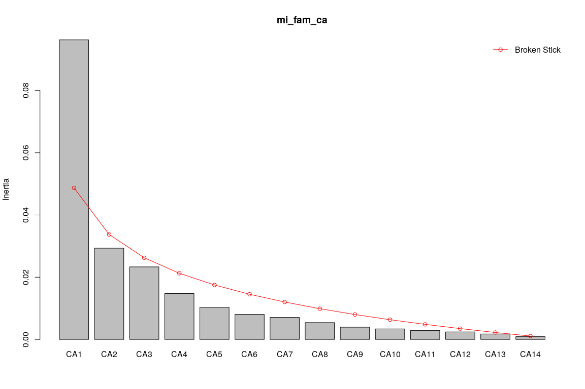<!-- -->

``` r
par(mfrow = c(1, 2))
plot(mi_fam_ca,
     scaling = 1,
     main = "CA, escalamiento 1, sin Thevetia ahouai"
)
plot(mi_fam_ca,
     scaling = 2,
     main = "CA, escalamiento 2, sin Thevetia ahouai")
```

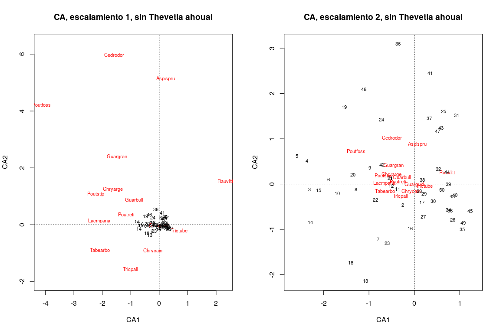<!-- -->

``` r
par(mfrow = c(1, 1))
```

Análisis de coordenadas principales (PCoA)

Las técnicas de ordenación anteriores preservan la distancia euclídea
entre los objetos. Si necesitaras ordenar objetos usando una métrica
diferente, por ejemplo, la de Gower para datos mixtos, entonces PCA y CA
serían inútiles y, en su lugar, podrías usar PCoA. Paso el resto de la
explicación al vídeo asociado.

La función que realiza el PCoA en `{vegan}` es `cmdscale` (de *Classical
(Metric) Multidimensional Scaling*), y se le suministra una matriz de
distancias.

``` r
mi_fam_d_bray <- vegdist(mi_fam, method = 'bray') # En realidad, 'bray' es la opción por defecto
mi_fam_d_bray_pcoa <- cmdscale(
  mi_fam_d_bray,
  k = (nrow(mi_fam) - 1),
  add = T,
  eig = TRUE)
round(mi_fam_d_bray_pcoa$eig, 2)
```

    ##  [1] 3.45 0.90 0.55 0.39 0.35 0.32 0.24 0.20 0.19 0.16 0.15 0.13 0.12 0.10
    ## [15] 0.09 0.09 0.09 0.08 0.08 0.07 0.07 0.07 0.07 0.06 0.06 0.05 0.05 0.05
    ## [29] 0.05 0.04 0.04 0.04 0.04 0.04 0.04 0.04 0.03 0.03 0.03 0.03 0.03 0.03
    ## [43] 0.02 0.02 0.02 0.02 0.02 0.01 0.00 0.00

``` r
round(sum(mi_fam_d_bray_pcoa$eig[mi_fam_d_bray_pcoa$eig<0]),2)
```

    ## [1] 0

``` r
round(sum(mi_fam_d_bray_pcoa$eig[mi_fam_d_bray_pcoa$eig>=0]),2)
```

    ## [1] 8.87

``` r
ordiplot(scores(mi_fam_d_bray_pcoa, choices = c(1, 2)),
         type = "t",
         main = "PCoA con promedios ponderados de especies")
```

    ## species scores not available

``` r
abline(h = 0, lty = 3)
abline(v = 0, lty = 3)
mi_fam_d_bray_pcoa_wa <- wascores(mi_fam_d_bray_pcoa$points[, 1:2], mi_fam)
text(
  mi_fam_d_bray_pcoa_wa,
  rownames(mi_fam_d_bray_pcoa_wa),
  cex = 0.7, col = "red")
(mi_fam_d_bray_pcoa_env <- envfit(mi_fam_d_bray_pcoa, env_num))
```

    ## 
    ## ***VECTORS
    ## 
    ##                                Dim1     Dim2     r2 Pr(>r)    
    ## heterogeneidad_ambiental    0.58373  0.81195 0.1978  0.004 ** 
    ## UTM.EW                      0.95627  0.29248 0.4791  0.001 ***
    ## UTM.NS                      0.18427 -0.98288 0.3400  0.002 ** 
    ## geomorf_llanura_pct         0.35884 -0.93340 0.0439  0.349    
    ## geomorf_pico_pct           -0.97236  0.23348 0.0239  0.666    
    ## geomorf_interfluvio_pct    -0.51410  0.85773 0.0970  0.079 .  
    ## geomorf_hombrera_pct       -0.12318  0.99238 0.0069  0.833    
    ## geomorf_espolón/gajo_pct   -0.52667  0.85007 0.1421  0.024 *  
    ## geomorf_vertiente_pct       0.00003  1.00000 0.0056  0.878    
    ## geomorf_vaguada_pct        -0.62778  0.77839 0.1435  0.033 *  
    ## geomorf_piedemonte_pct      0.95163 -0.30726 0.0472  0.306    
    ## geomorf_valle_pct          -0.98551  0.16961 0.1598  0.010 ** 
    ## geomorf_sima_pct           -0.88548 -0.46468 0.0333  0.470    
    ## Al                         -0.94187 -0.33598 0.1730  0.013 *  
    ## B                           0.96742  0.25317 0.3816  0.001 ***
    ## Ca                          0.99726 -0.07392 0.1723  0.010 ** 
    ## Cu                          0.87163 -0.49016 0.1172  0.062 .  
    ## Fe                          0.87856 -0.47764 0.1534  0.019 *  
    ## K                           0.98752  0.15748 0.3106  0.001 ***
    ## Mg                          0.99857  0.05354 0.1180  0.042 *  
    ## Mn                          0.62755 -0.77858 0.0392  0.383    
    ## P                           0.64624  0.76313 0.0571  0.261    
    ## Zn                          0.99610  0.08828 0.2799  0.001 ***
    ## N                           0.69428  0.71971 0.2753  0.002 ** 
    ## N.min.                      0.99939  0.03500 0.2799  0.001 ***
    ## pH                          0.99474  0.10248 0.4651  0.001 ***
    ## elevacion_media             0.33226 -0.94319 0.3092  0.002 ** 
    ## pendiente_media            -0.22538  0.97427 0.0425  0.339    
    ## orientacion_media           0.48992  0.87176 0.0209  0.606    
    ## curvatura_perfil_media     -0.88516 -0.46528 0.0043  0.917    
    ## curvatura_tangencial_media  0.79566 -0.60575 0.0593  0.237    
    ## abundancia_global          -0.00374 -0.99999 0.1308  0.039 *  
    ## riqueza_global             -0.93889 -0.34421 0.0608  0.235    
    ## ---
    ## Signif. codes:  0 '***' 0.001 '**' 0.01 '*' 0.05 '.' 0.1 ' ' 1
    ## Permutation: free
    ## Number of permutations: 999

``` r
plot(mi_fam_d_bray_pcoa_env, p.max = 0.05, col = 3)
```

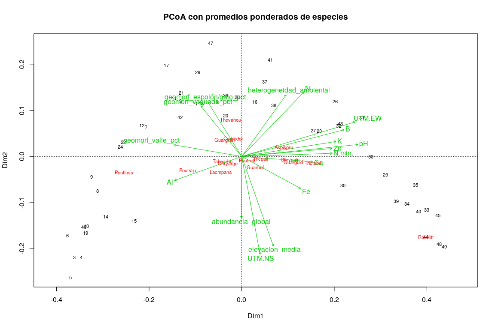<!-- -->
