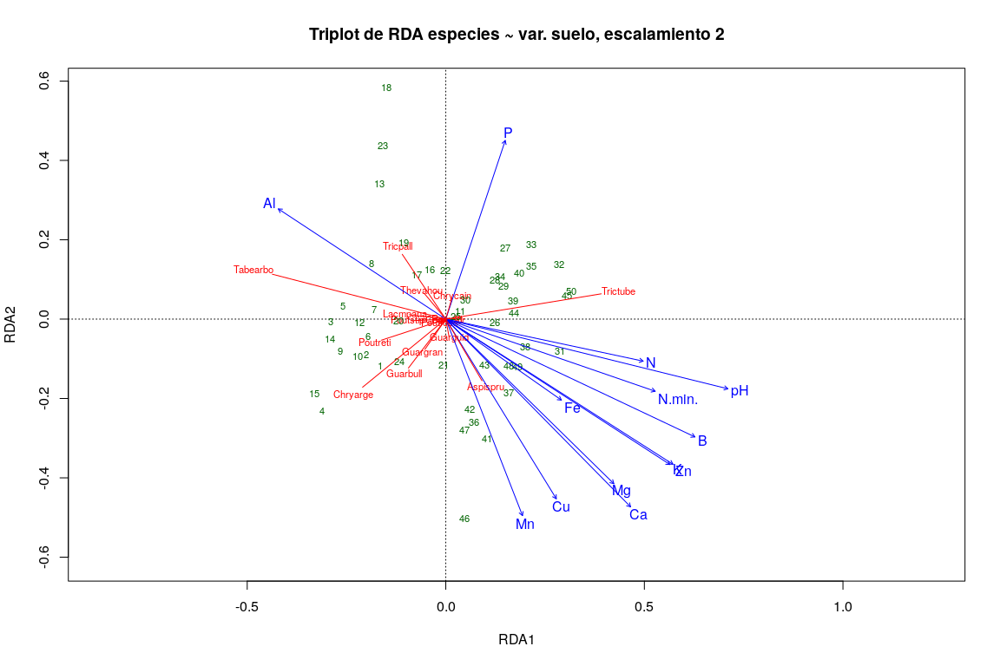
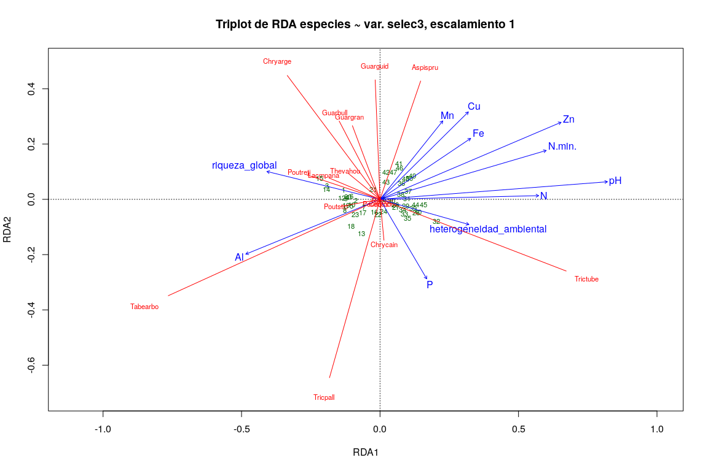
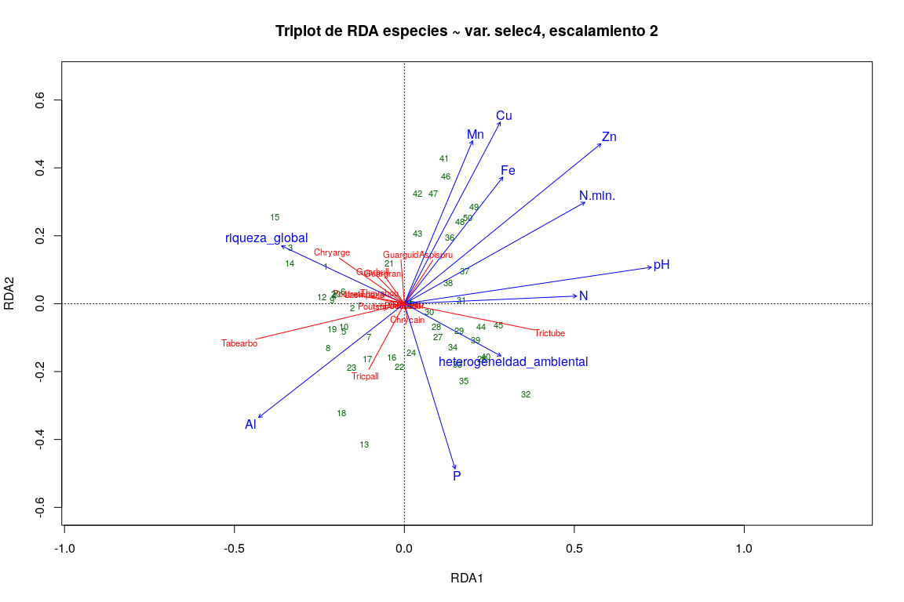
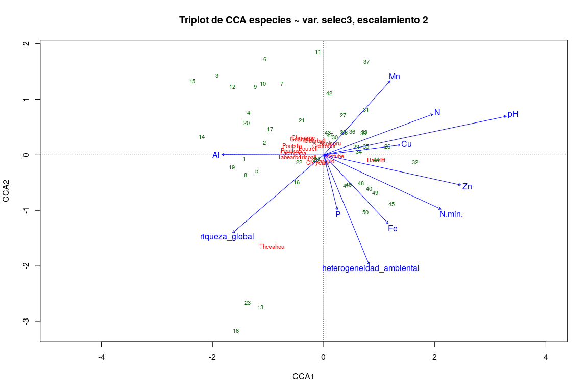
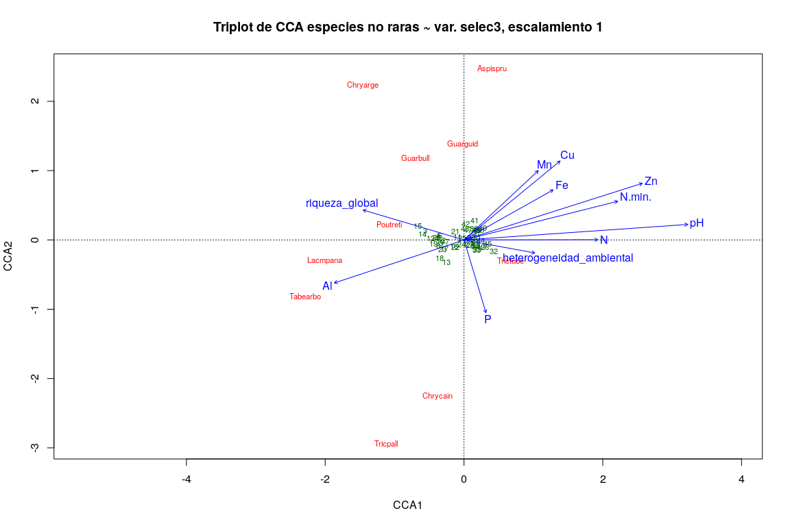
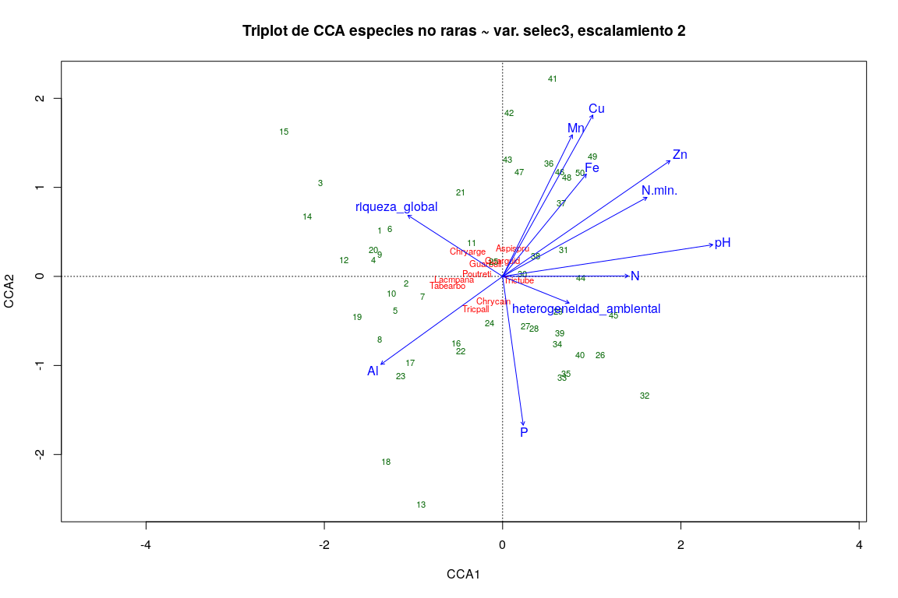

Técnicas de ordenación. <br> Parte 2: Ordenación restringida o
‘canónica’. <br> RDA, CCA
================
JR
21 de noviembre, 2020

``` r
knitr::opts_chunk$set(fig.width=12, fig.height=8)
```

## Preámbulo

### Cargar paquetes

``` r
library(vegan)
```

    ## Loading required package: permute

    ## Loading required package: lattice

    ## This is vegan 2.5-6

``` r
library(tidyverse)
```

    ## ── Attaching packages ───────────────────────────── tidyverse 1.2.1 ──

    ## ✓ ggplot2 3.3.2     ✓ purrr   0.3.4
    ## ✓ tibble  3.0.3     ✓ dplyr   0.8.3
    ## ✓ tidyr   1.0.0     ✓ stringr 1.4.0
    ## ✓ readr   1.3.1     ✓ forcats 0.4.0

    ## ── Conflicts ──────────────────────────────── tidyverse_conflicts() ──
    ## x dplyr::filter() masks stats::filter()
    ## x dplyr::lag()    masks stats::lag()

``` r
library(sf)
```

    ## Linking to GEOS 3.6.2, GDAL 2.2.3, PROJ 4.9.3

``` r
source('biodata/funciones.R')
```

### Cargar datos

``` r
load('biodata/Apocynaceae-Meliaceae-Sapotaceae.Rdata')
load('biodata/matriz_ambiental.Rdata')
mi_fam <- mc_apcyn_melic_saptc
(colnames(mi_fam) <- make.cepnames(colnames(mi_fam)))
```

    ##  [1] "Aspispru" "Cedrodor" "Chryarge" "Chrycain" "Guarbull" "Guargran"
    ##  [7] "Guarguid" "Lacmpana" "Poutfoss" "Poutreti" "Poutstip" "Rauvlitt"
    ## [13] "Tabearbo" "Thevahou" "Tricpall" "Trictube"

``` r
(df_equivalencias <- data.frame(
  nombre_original = colnames(mc_apcyn_melic_saptc),
  colnames(mi_fam)))
```

    ##            nombre_original colnames.mi_fam.
    ## 1  Aspidosperma spruceanum         Aspispru
    ## 2          Cedrela odorata         Cedrodor
    ## 3  Chrysophyllum argenteum         Chryarge
    ## 4    Chrysophyllum cainito         Chrycain
    ## 5           Guarea bullata         Guarbull
    ## 6       Guarea grandifolia         Guargran
    ## 7          Guarea guidonia         Guarguid
    ## 8     Lacmellea panamensis         Lacmpana
    ## 9       Pouteria fossicola         Poutfoss
    ## 10     Pouteria reticulata         Poutreti
    ## 11      Pouteria stipitata         Poutstip
    ## 12    Rauvolfia littoralis         Rauvlitt
    ## 13 Tabernaemontana arborea         Tabearbo
    ## 14         Thevetia ahouai         Thevahou
    ## 15       Trichilia pallida         Tricpall
    ## 16   Trichilia tuberculata         Trictube

``` r
bci_env_grid %>% tibble
```

    ## # A tibble: 50 x 39
    ##       id categoria_de_ed… geologia habitat quebrada heterogeneidad_… UTM.EW
    ##    <dbl> <fct>            <fct>    <fct>   <fct>               <dbl>  <dbl>
    ##  1     1 c3               Tb       OldSlo… Yes                0.627  6.26e5
    ##  2     2 c3               Tb       OldLow  Yes                0.394  6.26e5
    ##  3     3 c3               Tb       OldLow  No                 0      6.26e5
    ##  4     4 c3               Tb       OldLow  No                 0      6.26e5
    ##  5     5 c3               Tb       OldSlo… No                 0.461  6.26e5
    ##  6     6 c3               Tb       OldLow  No                 0.0768 6.26e5
    ##  7     7 c3               Tb       OldLow  Yes                0.381  6.26e5
    ##  8     8 c3               Tb       OldLow  Yes                0.211  6.26e5
    ##  9     9 c3               Tb       OldLow  No                 0      6.26e5
    ## 10    10 c3               Tb       OldLow  No                 0      6.26e5
    ## # … with 40 more rows, and 32 more variables: UTM.NS <dbl>,
    ## #   geomorf_llanura_pct <dbl>, geomorf_pico_pct <dbl>,
    ## #   geomorf_interfluvio_pct <dbl>, geomorf_hombrera_pct <dbl>,
    ## #   `geomorf_espolón/gajo_pct` <dbl>, geomorf_vertiente_pct <dbl>,
    ## #   geomorf_vaguada_pct <dbl>, geomorf_piedemonte_pct <dbl>,
    ## #   geomorf_valle_pct <dbl>, geomorf_sima_pct <dbl>, Al <dbl>, B <dbl>,
    ## #   Ca <dbl>, Cu <dbl>, Fe <dbl>, K <dbl>, Mg <dbl>, Mn <dbl>, P <dbl>,
    ## #   Zn <dbl>, N <dbl>, N.min. <dbl>, pH <dbl>, elevacion_media <dbl>,
    ## #   pendiente_media <dbl>, orientacion_media <dbl>,
    ## #   curvatura_perfil_media <dbl>, curvatura_tangencial_media <dbl>,
    ## #   geometry <POLYGON [m]>, abundancia_global <dbl>, riqueza_global <int>

## Ordenación restringida

Con este conjunto de técnicas de ordenación, las tendencias detectadas
en un conjunto de datos se asocian a otro conjunto, por ejemplo, al
buscar tendencias en una matriz de comunidad restringiéndolas a una
matriz ambiental.

Las principales técnicas de ordenación restringida son análisis de
redundancia o RDA (siglas de *Redundancy Analysis*), análisis de
redundancia basado en distancia o db-RDA (*distance-based redundancy
analysis*), análisis de correspondencia canónica o CCA (*canonical
correspondence analysis*), análisis discriminante lineal o LDA (*lineal
discriminant analysis*), curvas de respuesta principales o PRC
(*principal response curves*), análisis de correspondencia conjunto o
CoCA (*co-correspondence analysis*), análisis de correlación canónica o
CCorA (*canonical correlation analysis*), análisis de inercia conjunto o
CoIA (*co-inertia analysis*) y análisis factorial múltiple o MFA
(*multiple factor analysis*). En este script me concentraré en RDA y
CCA.

### Análisis de redundancia (RDA)

En el análisis de ordenación simple o no restringida, la matriz de datos
(de comunidad o ambiental) expresa libremente las relaciones entre
objetos, sin restricciones de ningún tipo. Se trata, por lo tanto, de un
enfoque exploratorio. **La ordenación canónica, por su parte, explora de
manera explícita las relaciones entre dos matrices: una matriz de
respuesta y una matriz explicativa**.

RDA combina la regresión y el análisis de componentes principales. El
RDA es una regresión lineal múltiple aplicada a múltiples variables de
respuesta (multivariado), seguido de un PCA de la matriz de valores
ajustados. En detalle, el procedimiento se resume así:

  - Cada variable de respuesta (e.g. matriz de comunidad) es ajustada
    (por regresión) a la matriz explicativa, de donde se obtienen
    valores ajustados con sus residuos. Con estos valores se construye
    una matriz de valores ajustados.

  - Se prueba significancia estadística de la relación entre las
    variables de respuesta y explicativas (e.g. matriz de ambiental); ya
    sabes, de nuevo, el valor de *p*, o dicho correctamente, la
    probabilidad de que el efecto observado sea por azar, por lo que, si
    el valor de *p* es muy pequeño, entonces consideramos que hay efecto
    (o lo que es lo mismo, las variables independientes explican más de
    lo que hacen datos generados al azar).

  - Si la prueba resulta significativa, se realiza un PCA de la matriz
    de valores ajustados. Esto produce un vector de valores propios
    “canónicos” (*canonical eigenvalues*) y una matriz de vectores
    propios “canónicos” (*canonical eigenvectors*).

  - Luego se usa la matriz de vectores propios canónicos para calcular
    dos tipos de puntuaciones de sitios para la ordenación:
    
      - Usando la matriz de valores ajustados para obtener una
        ordenación en el espacio de las variables explicativas, lo cual
        produce puntuaciones de sitios ajustadas (*Site constraints
        (linear combinations of constraining variables)* en terminología
        `{vegan}`).
    
      - Usando la matriz de valores centrados de las variables de
        respuesta para obtener una ordenación en el espacio de los
        valores originales de las variables de respuesta (*Site scores
        (weighted averages of species scores)* en terminología
        `{vegan}`).

Mostraré a continuación ejemplos aplicados a mi familia asignada. Para
agilizar, trasladaré las explicaciones más detalladas de cada resultado
a los vídeos regulares que alojo en el repositorio de la asignatura,
donde encontrarás las claves sobre cómo interpretar éste y otros
resultados.

Nota (de nuevo): recuerda que los datos de BCI están autocorrelacionados
espacialmente, por lo que los patrones que encuentres estarán siempre
afectados por el incumplimiento del supuesto de independencia; no
obstante, el ejercicio es bastante didáctico.

#### Ejemplo usando las matriz ambiental de variables suelo:

``` r
mi_fam_hel <- decostand(mi_fam, method = 'hellinger')
mi_fam_hel %>% tibble
```

    ## # A tibble: 50 x 16
    ##    Aspispru Cedrodor Chryarge Chrycain Guarbull Guargran Guarguid Lacmpana
    ##       <dbl>    <dbl>    <dbl>    <dbl>    <dbl>    <dbl>    <dbl>    <dbl>
    ##  1   0.0985   0         0.261   0.0805    0.279   0.114     0.346   0.0805
    ##  2   0.0799   0         0.187   0.0565    0.253   0.0799    0.325   0     
    ##  3   0.0964   0         0.297   0.0682    0.264   0.0964    0.305   0.118 
    ##  4   0.113    0         0.400   0.0919    0.283   0.0650    0.298   0.113 
    ##  5   0.103    0.0729    0.334   0         0.357   0.0729    0.334   0.126 
    ##  6   0.125    0         0.305   0         0.249   0.0720    0.279   0.125 
    ##  7   0        0         0.189   0.109     0.178   0         0.259   0.0889
    ##  8   0.136    0         0.255   0         0.216   0.0682    0.334   0.136 
    ##  9   0.167    0         0.373   0         0.167   0.0745    0.167   0.0745
    ## 10   0.0684   0         0.282   0.0684    0.298   0         0.282   0.0684
    ## # … with 40 more rows, and 8 more variables: Poutfoss <dbl>,
    ## #   Poutreti <dbl>, Poutstip <dbl>, Rauvlitt <dbl>, Tabearbo <dbl>,
    ## #   Thevahou <dbl>, Tricpall <dbl>, Trictube <dbl>

``` r
env_suelo <- bci_env_grid %>%
  st_drop_geometry %>%
  dplyr::select(matches('^[A-T,Z]|^pH$', ignore.case = F))
env_suelo %>% tibble
```

    ## # A tibble: 50 x 13
    ##       Al     B    Ca    Cu    Fe     K    Mg    Mn     P    Zn     N
    ##    <dbl> <dbl> <dbl> <dbl> <dbl> <dbl> <dbl> <dbl> <dbl> <dbl> <dbl>
    ##  1  901. 0.794 1680.  6.20  135. 142.   279.  267.  1.95  2.97  18.5
    ##  2  954. 0.670 1503.  6.03  142. 137.   280.  320.  2.25  2.53  21.6
    ##  3 1114. 0.595 1182.  6.80  157.  98.7  230.  445.  1.95  2.25  20.2
    ##  4 1024. 0.568 1558.  6.63  153.  98.4  229.  408.  2.63  2.44  20.8
    ##  5 1002. 0.399 1242.  6.44  149.  94.1  203.  251.  1.86  2.14  16.9
    ##  6 1091. 0.731 1442.  6.50  174. 132.   277.  477.  1.62  2.63  20.3
    ##  7 1184. 0.340 1111.  5.55  138. 117.   242.  301.  2.13  2.16  20.1
    ##  8 1256. 0.322 1029.  6.28  147. 104.   185.  204.  3.11  2.07  21.5
    ##  9 1122. 0.464 1230.  7.18  153. 110.   207.  415.  1.99  2.33  21.4
    ## 10 1172. 0.314 1127.  6.89  133. 105.   172.  330.  1.69  2.05  18.3
    ## # … with 40 more rows, and 2 more variables: N.min. <dbl>, pH <dbl>

``` r
mi_fam_hel_rda_suelo <- rda(mi_fam_hel ~ ., env_suelo)
summary(mi_fam_hel_rda_suelo)
```

    ## 
    ## Call:
    ## rda(formula = mi_fam_hel ~ Al + B + Ca + Cu + Fe + K + Mg + Mn +      P + Zn + N + N.min. + pH, data = env_suelo) 
    ## 
    ## Partitioning of variance:
    ##               Inertia Proportion
    ## Total         0.05866     1.0000
    ## Constrained   0.03581     0.6105
    ## Unconstrained 0.02285     0.3895
    ## 
    ## Eigenvalues, and their contribution to the variance 
    ## 
    ## Importance of components:
    ##                          RDA1     RDA2    RDA3     RDA4     RDA5      RDA6
    ## Eigenvalue            0.01987 0.005554 0.00409 0.002304 0.001806 0.0006974
    ## Proportion Explained  0.33872 0.094667 0.06972 0.039277 0.030784 0.0118880
    ## Cumulative Proportion 0.33872 0.433382 0.50310 0.542380 0.573165 0.5850528
    ##                            RDA7      RDA8      RDA9     RDA10     RDA11
    ## Eigenvalue            0.0005967 0.0003659 0.0002598 0.0001586 6.068e-05
    ## Proportion Explained  0.0101714 0.0062371 0.0044278 0.0027031 1.034e-03
    ## Cumulative Proportion 0.5952242 0.6014612 0.6058890 0.6085921 6.096e-01
    ##                           RDA12     RDA13      PC1      PC2     PC3
    ## Eigenvalue            4.617e-05 5.070e-06 0.006602 0.003433 0.00284
    ## Proportion Explained  7.871e-04 8.643e-05 0.112533 0.058517 0.04842
    ## Cumulative Proportion 6.104e-01 6.105e-01 0.723033 0.781550 0.82997
    ##                            PC4      PC5      PC6      PC7      PC8
    ## Eigenvalue            0.002126 0.001762 0.001477 0.001157 0.001065
    ## Proportion Explained  0.036249 0.030027 0.025174 0.019724 0.018162
    ## Cumulative Proportion 0.866217 0.896244 0.921418 0.941142 0.959304
    ##                             PC9      PC10      PC11      PC12      PC13
    ## Eigenvalue            0.0007511 0.0005525 0.0003679 0.0002951 0.0002302
    ## Proportion Explained  0.0128034 0.0094175 0.0062710 0.0050296 0.0039236
    ## Cumulative Proportion 0.9721071 0.9815247 0.9877956 0.9928252 0.9967488
    ##                            PC14      PC15      PC16
    ## Eigenvalue            0.0001138 6.013e-05 1.684e-05
    ## Proportion Explained  0.0019391 1.025e-03 2.871e-04
    ## Cumulative Proportion 0.9986879 9.997e-01 1.000e+00
    ## 
    ## Accumulated constrained eigenvalues
    ## Importance of components:
    ##                          RDA1     RDA2    RDA3     RDA4     RDA5      RDA6
    ## Eigenvalue            0.01987 0.005554 0.00409 0.002304 0.001806 0.0006974
    ## Proportion Explained  0.55482 0.155065 0.11420 0.064336 0.050425 0.0194726
    ## Cumulative Proportion 0.55482 0.709881 0.82408 0.888420 0.938845 0.9583174
    ##                            RDA7      RDA8      RDA9     RDA10     RDA11
    ## Eigenvalue            0.0005967 0.0003659 0.0002598 0.0001586 6.068e-05
    ## Proportion Explained  0.0166607 0.0102163 0.0072527 0.0044277 1.694e-03
    ## Cumulative Proportion 0.9749782 0.9851945 0.9924472 0.9968749 9.986e-01
    ##                           RDA12     RDA13
    ## Eigenvalue            4.617e-05 5.070e-06
    ## Proportion Explained  1.289e-03 1.416e-04
    ## Cumulative Proportion 9.999e-01 1.000e+00
    ## 
    ## Scaling 2 for species and site scores
    ## * Species are scaled proportional to eigenvalues
    ## * Sites are unscaled: weighted dispersion equal on all dimensions
    ## * General scaling constant of scores:  1.302092 
    ## 
    ## 
    ## Species scores
    ## 
    ##               RDA1       RDA2      RDA3       RDA4      RDA5      RDA6
    ## Aspispru  0.101307 -0.1726573 -0.100867 -0.1908317  0.002390 -0.019903
    ## Cedrodor -0.001239 -0.0010004 -0.018387 -0.0222853 -0.026168 -0.017226
    ## Chryarge -0.232784 -0.1906834  0.006098  0.0858216 -0.050949 -0.040050
    ## Chrycain  0.017066  0.0581909 -0.033730 -0.0713367  0.071031  0.028876
    ## Guarbull -0.104549 -0.1369344 -0.065238  0.0542870 -0.016650 -0.003923
    ## Guargran -0.058592 -0.0849643  0.005619 -0.0346533 -0.040922  0.015860
    ## Guarguid  0.008800 -0.0477254  0.227509 -0.0198959 -0.013018  0.022788
    ## Lacmpana -0.101847  0.0123398  0.007655  0.0039412  0.069801 -0.041127
    ## Poutfoss -0.015998 -0.0069050 -0.003773 -0.0059588 -0.018840  0.010460
    ## Poutreti -0.179989 -0.0589583 -0.050724 -0.0035032  0.074969  0.020041
    ## Poutstip -0.095264 -0.0043658 -0.027539  0.0526704  0.158255 -0.014745
    ## Rauvlitt  0.003845  0.0003254  0.001057  0.0006782 -0.002431  0.008645
    ## Tabearbo -0.485080  0.1256699 -0.029439 -0.0435205 -0.041106  0.061673
    ## Thevahou -0.060694  0.0725669  0.175169 -0.0722800  0.019228 -0.063759
    ## Tricpall -0.121817  0.1814427 -0.111078 -0.0104246 -0.058750 -0.074630
    ## Trictube  0.434909  0.0708629 -0.056380  0.0511449 -0.018196  0.017478
    ## 
    ## 
    ## Site scores (weighted sums of species scores)
    ## 
    ##         RDA1       RDA2      RDA3     RDA4     RDA5     RDA6
    ## 1  -0.062775 -0.1229915  0.339171  0.05276 -0.24804 -0.04975
    ## 2  -0.013594  0.0300180  0.099536  0.14041 -0.27728  0.34240
    ## 3  -0.386030 -0.1377267 -0.045356  0.10126  0.04156  0.31487
    ## 4  -0.385884 -0.2315568 -0.078742  0.26407  0.03866 -0.26863
    ## 5  -0.443374 -0.2136411  0.139767  0.10956 -0.22311 -0.57417
    ## 6  -0.298766 -0.1901788 -0.057148  0.20997  0.05253  0.23424
    ## 7  -0.130714  0.3596106 -0.052775  0.29697  0.19348 -0.08150
    ## 8  -0.203289 -0.0555815 -0.011628  0.13907  0.06372 -0.11299
    ## 9  -0.125693 -0.0618333 -0.347155  0.24293 -0.37666 -0.68621
    ## 10 -0.274253 -0.0758207 -0.097507  0.35385  0.13668  0.30638
    ## 11 -0.033979 -0.0551363 -0.032683  0.22861 -0.04944 -0.08422
    ## 12 -0.056437 -0.0923511  0.076311  0.01873  0.21126  0.47552
    ## 13 -0.162686  0.5659298  0.077659  0.11023 -0.08275  0.23312
    ## 14 -0.388587  0.1177560  0.145167 -0.06337  0.03910 -0.25695
    ## 15 -0.355736 -0.0400817 -0.081419 -0.27856 -0.25794 -0.14100
    ## 16  0.012833  0.1816680  0.003509  0.27540 -0.19935  0.18077
    ## 17  0.085720  0.1849911 -0.311403  0.19051  0.38311 -0.12962
    ## 18 -0.234223  0.5674723  0.533302 -0.39853  0.32467 -0.65812
    ## 19 -0.216305 -0.1014175 -0.218743 -0.48141  0.51738 -0.10158
    ## 20 -0.206731  0.0420886 -0.201155 -0.44361  0.04495  0.05916
    ## 21 -0.045975 -0.1414666  0.189734  0.03916 -0.11399  0.56281
    ## 22 -0.090586  0.1081837 -0.130858 -0.30895 -0.23293  0.84260
    ## 23 -0.074727  0.3128443  0.456832 -0.20174 -0.02168  0.61613
    ## 24 -0.063290 -0.0042261 -0.415182 -0.55909 -0.38082  0.02140
    ## 25  0.192286 -0.0408202 -0.250696 -0.39646  0.02768 -0.16940
    ## 26  0.217858  0.1256833  0.114549  0.39751 -0.18490  0.45356
    ## 27  0.080472  0.1736227 -0.116597  0.19860  0.01905 -0.03497
    ## 28  0.068236  0.1022319 -0.236425 -0.02852 -0.06690 -0.06944
    ## 29  0.093075  0.1237676 -0.335889 -0.01305  0.06373 -0.27953
    ## 30  0.128293  0.1370070 -0.295512  0.08277  0.17679  0.12974
    ## 31  0.272254 -0.1832203 -0.111689 -0.23971 -0.13259  0.01716
    ## 32  0.173325  0.0437113 -0.257442 -0.04779  0.01078 -0.47371
    ## 33  0.228079  0.1383547 -0.005606  0.17069  0.18961 -0.04710
    ## 34  0.212429  0.2069049 -0.201448  0.01863 -0.08719 -0.21953
    ## 35  0.266147  0.2637522 -0.056981  0.35067  0.05416 -0.26764
    ## 36  0.003995 -0.4352821 -0.073420 -0.38232 -0.22313 -0.17445
    ## 37  0.146277 -0.2303422 -0.111167 -0.20212 -0.20839 -0.16615
    ## 38  0.082303 -0.0100117 -0.022449 -0.04974 -0.14222  0.15047
    ## 39  0.208814  0.0007579 -0.127760  0.05901 -0.06404 -0.05005
    ## 40  0.255211  0.2129901 -0.280920 -0.16610  0.02639 -0.04484
    ## 41  0.133332 -0.3535780  0.486541 -0.56214 -0.01573 -0.52455
    ## 42 -0.098385 -0.2372877  0.384297  0.14788  0.05258 -0.15200
    ## 43  0.188436 -0.1819158 -0.058949 -0.14333 -0.15548  0.03159
    ## 44  0.204436 -0.0840885  0.166050 -0.01844  0.10374  0.12420
    ## 45  0.314269  0.0863981  0.077519  0.32718 -0.05092  0.32464
    ## 46 -0.087477 -0.5517884 -0.019514 -0.04690  1.00620  0.13577
    ## 47  0.203307 -0.3843565  0.289754  0.04843  0.36128  0.13266
    ## 48  0.230507 -0.0495761  0.410978  0.19249 -0.12575 -0.05883
    ## 49  0.273533  0.1693976  0.258698  0.36045 -0.14383  0.25654
    ## 50  0.164069  0.0111357  0.394847 -0.09591 -0.07400 -0.06879
    ## 
    ## 
    ## Site constraints (linear combinations of constraining variables)
    ## 
    ##          RDA1      RDA2     RDA3      RDA4      RDA5      RDA6
    ## 1  -0.1653762 -0.118853  0.14487  0.041131 -0.148817 -0.067659
    ## 2  -0.1996917 -0.090682 -0.01085 -0.092497 -0.055198  0.127582
    ## 3  -0.2898492 -0.006510  0.10019  0.280205 -0.049074 -0.097911
    ## 4  -0.3115114 -0.232700 -0.09406  0.103185 -0.174332  0.054029
    ## 5  -0.2585398  0.032845  0.10014  0.144773 -0.092658 -0.187023
    ## 6  -0.1954225 -0.043778 -0.08527  0.294957 -0.005085  0.250372
    ## 7  -0.1802064  0.022951 -0.25544  0.111791  0.191933  0.047733
    ## 8  -0.1871106  0.140222 -0.01176  0.046755 -0.013470 -0.311873
    ## 9  -0.2654161 -0.081108 -0.05093  0.256214 -0.146663 -0.114226
    ## 10 -0.2219451 -0.094939 -0.19348  0.194996 -0.041122 -0.235775
    ## 11  0.0356070  0.019347 -0.02441  0.417896 -0.006434  0.019539
    ## 12 -0.2167886 -0.007939 -0.10947  0.143160  0.181820  0.172885
    ## 13 -0.1683765  0.342033  0.13670 -0.194815  0.111550  0.047631
    ## 14 -0.2914365 -0.051279  0.05451 -0.114308  0.049760 -0.015359
    ## 15 -0.3315331 -0.189041  0.09526 -0.090112 -0.185775 -0.077913
    ## 16 -0.0406818  0.123955  0.16766  0.035125 -0.205051  0.127133
    ## 17 -0.0728145  0.111030 -0.24807  0.010144  0.335441  0.007989
    ## 18 -0.1491117  0.584373  0.37676 -0.152735  0.192457 -0.115617
    ## 19 -0.1060590  0.192179 -0.09696 -0.356888  0.227561 -0.002431
    ## 20 -0.1186510 -0.003845 -0.01026 -0.173936 -0.080079  0.157826
    ## 21 -0.0057646 -0.115230  0.02383 -0.122935 -0.367314  0.232461
    ## 22 -0.0007459  0.121567 -0.24616 -0.176428  0.074220  0.210963
    ## 23 -0.1586972  0.437169  0.29061 -0.231504 -0.030860  0.154525
    ## 24 -0.1172663 -0.107151 -0.22376 -0.197424 -0.049011  0.259435
    ## 25  0.0255941  0.005497 -0.11036 -0.271421 -0.077824 -0.109103
    ## 26  0.1238901 -0.009747 -0.01560  0.112291 -0.165211  0.242007
    ## 27  0.1498386  0.179484 -0.15195  0.181991  0.026842  0.091720
    ## 28  0.1232784  0.098382 -0.11682  0.091943  0.083913  0.042305
    ## 29  0.1450069  0.083635 -0.14693 -0.223347  0.102392 -0.106085
    ## 30  0.0487343  0.047487 -0.12282 -0.117281  0.092891  0.049620
    ## 31  0.2868736 -0.079981 -0.16779 -0.043189 -0.153816 -0.016257
    ## 32  0.2841262  0.137956 -0.19669  0.159479 -0.072756 -0.301224
    ## 33  0.2155167  0.187938 -0.12178  0.337039 -0.076333  0.065746
    ## 34  0.1370630  0.106662 -0.10827  0.200438 -0.121805 -0.375802
    ## 35  0.2145663  0.134352 -0.13928  0.049625  0.068054 -0.366923
    ## 36  0.0717105 -0.259757 -0.03341 -0.307285 -0.277929 -0.025732
    ## 37  0.1574189 -0.185042 -0.30703 -0.178666  0.054045 -0.025875
    ## 38  0.1994110 -0.069511 -0.11246 -0.185634 -0.226725  0.081918
    ## 39  0.1683653  0.046315 -0.20225 -0.078288  0.014639 -0.062744
    ## 40  0.1855896  0.116721 -0.06352 -0.099934  0.097986 -0.151223
    ## 41  0.1029575 -0.300706  0.27513 -0.393892 -0.089722 -0.437538
    ## 42  0.0593584 -0.227415  0.08015  0.002826  0.084557 -0.196749
    ## 43  0.0964817 -0.116599  0.15192 -0.031542 -0.153718  0.148966
    ## 44  0.1705051  0.014431  0.04688  0.030073 -0.107812  0.383324
    ## 45  0.3046324  0.057998  0.17726  0.136901 -0.017950  0.298452
    ## 46  0.0464833 -0.502901  0.11889 -0.050067  0.702993  0.187982
    ## 47  0.0475438 -0.279189  0.20695  0.149132  0.529338 -0.081752
    ## 48  0.1575372 -0.118781  0.40709  0.131130 -0.073900  0.012441
    ## 49  0.1798192 -0.121247  0.43179  0.099058 -0.028161 -0.198597
    ## 50  0.3150869  0.069396  0.39125  0.121870  0.072212  0.206804
    ## 
    ## 
    ## Biplot scores for constraining variables
    ## 
    ##           RDA1    RDA2    RDA3     RDA4     RDA5      RDA6
    ## Al     -0.5215  0.3435 -0.3061 -0.18974  0.13826 -0.156858
    ## B       0.7757 -0.3672  0.2430 -0.04257 -0.14451 -0.062200
    ## Ca      0.5754 -0.5851  0.4459 -0.07341  0.05211  0.035493
    ## Cu      0.3441 -0.5599  0.4146 -0.11036 -0.32233 -0.221008
    ## Fe      0.3599 -0.2524  0.6363 -0.17552 -0.01168  0.181294
    ## K       0.6977 -0.4531  0.3950 -0.14786 -0.06883  0.023499
    ## Mg      0.5233 -0.5129  0.4547 -0.10815  0.21931  0.007119
    ## Mn      0.2389 -0.6124  0.1213  0.14269 -0.25360  0.014429
    ## P       0.1851  0.5567 -0.3274 -0.34347  0.03706 -0.177756
    ## Zn      0.7073 -0.4524  0.4285 -0.04604  0.22506 -0.034465
    ## N       0.6144 -0.1310 -0.3653 -0.37771 -0.31033 -0.123313
    ## N.min.  0.6520 -0.2249  0.4210 -0.14574  0.27393  0.168770
    ## pH      0.8784 -0.2172 -0.1656  0.17903 -0.20602 -0.024406

¿Qué partes del resumen debes mirar?

  - La varianza, particionada, de la cual se muestra tanto la inercia
    (absoluta) como la proporción, y está repartida entre restringida
    (*constrained*=0.61) y no restringida (*unconstrained*=0.39). La
    parte restringida es equivalente al R<sup>2</sup> no ajustado del
    análisis de regresión. Sin embargo, al igual que ocurre en la
    regresión, este valor está fuertemente sesgado (inflado de varianza
    por correlación aleatoria o multicolinealidad); además, en el
    ejemplo, también está afectado por la no independencia de las
    observaciones. Por esta razón, es prudente calcular el R<sup>2</sup>
    ajustado o “insesgado” (ver abajo).

  - Los valores propios (*eigenvalues*) y su contribución a la varianza.
    Existen *eigenvalues* de los ejes “canónicos”, que se refieren a la
    varianza restringida, rotulados como “RDAx” (en mi caso, 13=número
    de variables explicativas o predictoras), y *eigenvalues* de la
    varianza no restringida, o residuos (varianza no explicada por el
    modelo), rotulados como “PCAx” (en mi caso, 16=número especies). La
    proporción de varianza restringida explicada del encabezado coincide
    con la proporción acumulada en RDA13 (=0.61), y la proporción de
    varianza total (=1) coincide con proporción acumulada en PCA16. La
    no restringida (=0.39), resulta de la acumulación de los residuos,
    es decir, de los PCAx.

  - Las puntuaciones de sitios (*site scores*) y de especies (*species
    scores*) tienen el mismo significado que en el PCA.

  - Las puntuaciones restringidas de sitio (en `{vegan}` se usa la
    etiqueta *Site constraints (linear combinations of constraining
    variables)*), y son las coordenadas de los sitios en el espacio de
    las variables explicativas.

  - Finalmente, el resumen presenta las puntuaciones para el *biplot*,
    que más adelante usaré en un diagrama algo enriquecido.

Tal como comenté arriba, es importante calcular un R<sup>2</sup>
insesgado, siendo este más útil cuando el número de variables (en el
RDA, “variables” se refiere a las ambientales) es menor que la mitad del
número de sitios. Sea *m* el número de variables, y *n* el número de
sitios; en mi caso, *m=13*, *n=50-\>n/2=25*, así que *m\<n/2*.

``` r
RsquareAdj(mi_fam_hel_rda_suelo)$adj.r.squared
```

    ## [1] 0.4698472

Normalmente, el R<sup>2</sup> insesgado es mucho más bajo que el
sesgado, porque se relativiza en función de la razón de grados de
libertad. Mientras más alejado de cero se encuentre el valor de
R<sup>2</sup>, mayor cantidad de varianza explicada insesgada contiene
el modelo.

Otro diagnóstico importante es la determinación de los factores de
inflación de la varianza (*variance inflation factors*, VIF), el cual
explora posible multicolinealidad en el
    modelo.

``` r
vif.cca(mi_fam_hel_rda_suelo)
```

    ##        Al         B        Ca        Cu        Fe         K        Mg 
    ##  6.179004 14.491840 44.696375  9.970855  5.766886 26.567498 21.238291 
    ##        Mn         P        Zn         N    N.min.        pH 
    ##  5.403569  4.159870 13.879708  3.197403  6.275682  6.342105

Variables con valores por encima de 10 deben ser examinadas y, desde una
posición conservadora, deben excluirse, comenzando por las de mayor VIF
y excluyendo una, a lo sumo dos, a la vez. Por ejemplo, en este caso,
las variables `Ca`, `K`, `Mg` y `Zn` deberían excluirse. No se deben
excluir todas a la vez, puesto que al quitar una variable, los VIF se
reajustan; es decir, una variable con efecto de colinealidad podría no
tenerlo ante la exclusión de una o varias alternas. Exploraré el
potencial de los VIF en el siguiente ejemplo, donde realizó un RDA con
más variables, además de las de suelo.

Finalmente, la representación del modelo se realiza en un *triplot*, que
es un gráfico enriquecido, puesto que contiene tres elementos: sitios,
variables de respuesta (especies) y variables explicativas (variables
ambientales). Para los sitios se usan las puntuaciones restringidas de
sitio.

Escalamiento 1:

``` r
plot(mi_fam_hel_rda_suelo,
     scaling = 1,
     display = c("sp", "lc", "cn"),
     main = "Triplot de RDA especies ~ var. suelo, escalamiento 1"
)
mi_fam_hel_rda_suelo_sc1 <-
  scores(mi_fam_hel_rda_suelo,
         choices = 1:2,
         scaling = 1,
         display = "sp"
  )
arrows(0, 0,
       mi_fam_hel_rda_suelo_sc1[, 1] * 0.9,
       mi_fam_hel_rda_suelo_sc1[, 2] * 0.9,
       length = 0,
       lty = 1,
       col = "red"
)
```

<!-- -->

Paso la interpretación de este gráfico y la del siguiente al vídeo
correspondiente.

Escalamiento 2

``` r
plot(mi_fam_hel_rda_suelo,
     scaling = 2,
     display = c("sp", "lc", "cn"),
     main = "Triplot de RDA especies ~ var. suelo, escalamiento 2"
)
mi_fam_hel_rda_suelo_sc2 <-
  scores(mi_fam_hel_rda_suelo,
         scaling = 2,
         choices = 1:2,
         display = "sp"
  )
arrows(0, 0,
       mi_fam_hel_rda_suelo_sc2[, 1] * 0.9,
       mi_fam_hel_rda_suelo_sc2[, 2] * 0.9,
       length = 0,
       lty = 1,
       col = "red"
)
```

<!-- -->

#### Ejemplo usando las matriz ambiental con variables seleccionadas

El RDA anterior mostró que las variables de suelo son útiles para
predecir la matriz de comunidad. No obstante, se evidenciaron dos cosas:
1) Hay mucha colinealidad entre ellas; 2) No se probó mejoras del modelo
añadiendo otras variables, además de las de suelo. Si selecciono las
variables que obtuve como significativas en la ordenación no
restringida, me quedaría con una tabla tal que esta:

``` r
env_selec <- bci_env_grid %>%
  select(
    heterogeneidad_ambiental,
    riqueza_global,
    Al, B, Ca, Cu, Fe, K, Mg, Mn, P, Zn, N, N.min., pH) %>% 
  st_drop_geometry
mi_fam_hel_rda_selec <- rda(mi_fam_hel ~ ., env_selec)
```

``` r
vif.cca(mi_fam_hel_rda_selec)
```

    ## heterogeneidad_ambiental           riqueza_global                       Al 
    ##                 2.132603                 2.566228                 6.208143 
    ##                        B                       Ca                       Cu 
    ##                17.006022                45.421129                10.291574 
    ##                       Fe                        K                       Mg 
    ##                 6.010731                29.406934                22.413885 
    ##                       Mn                        P                       Zn 
    ##                 8.801069                 4.177185                14.374572 
    ##                        N                   N.min.                       pH 
    ##                 3.217640                 6.329986                 6.985638

Tal como comenté arriba, variables con valores VIF por encima de 10,
deben ser examinadas. `Ca` y `K` tienen los valores más altos. Como su
interacción es fuerte, sacar sólo una no resolverá el problema de
multicolinealidad, y es preferible sacarlas del modelo a ambas; otras
variables ya podrán explicar la varianza debida a ellas. Si yo
considerara que `Ca` o `K` tuviese un sentido geoquímico especial, o
sospechara que alguna especie está asociada a ellas, entonces la
conservaría.

``` r
env_selec2 <- bci_env_grid %>%
  select(
    heterogeneidad_ambiental,
    riqueza_global,
    Al, B, Cu, Fe, Mg, Mn, P, Zn, N, N.min., pH) %>% 
  st_drop_geometry
mi_fam_hel_rda_selec2 <- rda(mi_fam_hel ~ ., env_selec2)
vif.cca(mi_fam_hel_rda_selec2)
```

    ## heterogeneidad_ambiental           riqueza_global                       Al 
    ##                 2.066019                 2.395747                 5.615456 
    ##                        B                       Cu                       Fe 
    ##                15.659197                 7.992989                 5.668667 
    ##                       Mg                       Mn                        P 
    ##                10.239942                 8.660104                 4.169703 
    ##                       Zn                        N                   N.min. 
    ##                13.198206                 3.147621                 5.850929 
    ##                       pH 
    ##                 5.835614

Correspondería excluir `B`. Si es importante en términos geoquímicos, no
la excluiría, pero parece estar fuertemente correlacionada con `Zn`, la
cual sí que me interesa conservar. Por otra parte, `Fe` y `Mg`
interactúan fuertemente, por lo que es preferible excluir `Mg` (con VIF
más alto).

``` r
env_selec3 <- bci_env_grid %>%
  select(
    heterogeneidad_ambiental,
    riqueza_global,
    Al, Cu, Fe, Mn, P, Zn, N, N.min., pH) %>% 
  st_drop_geometry
mi_fam_hel_rda_selec3 <- rda(mi_fam_hel ~ ., env_selec3)
vif.cca(mi_fam_hel_rda_selec3)
```

    ## heterogeneidad_ambiental           riqueza_global                       Al 
    ##                 1.702289                 2.186295                 4.232151 
    ##                       Cu                       Fe                       Mn 
    ##                 7.575512                 5.634796                 6.317285 
    ##                        P                       Zn                        N 
    ##                 2.915620                 7.396572                 3.070409 
    ##                   N.min.                       pH 
    ##                 5.532047                 5.087608

Las variables `Fe` y `Zn` ahora presentan valores VIF aceptables.
Conservar la variable zinc es importante desde un punto de vista
ecológico, puesto que el zinc participa en la síntesis de proteínas de
las plantas.

En fin, es todo un arte la selección interactiva de variables; si este
enfoque te parece complejo o arbitrario, hay alternativas
semiautomáticas. Tal como comenté anteriormente, es posible localizar
modelos de manera algorítmica usando la función `step` (y otros métodos
de la misma función), ahorrando algunos pasos, pero su desarrollo supera
el alcance de esta guía. Considero válido (y oportuno) desde el punto de
vista didáctico, buscar variables de manera interactiva, puesto que la
selección debe estar controlada por el criterio ecológico y humano, más
que por el meramente numérico.

``` r
summary(mi_fam_hel_rda_selec3)
```

    ## 
    ## Call:
    ## rda(formula = mi_fam_hel ~ heterogeneidad_ambiental + riqueza_global +      Al + Cu + Fe + Mn + P + Zn + N + N.min. + pH, data = env_selec3) 
    ## 
    ## Partitioning of variance:
    ##               Inertia Proportion
    ## Total         0.05866      1.000
    ## Constrained   0.03408      0.581
    ## Unconstrained 0.02458      0.419
    ## 
    ## Eigenvalues, and their contribution to the variance 
    ## 
    ## Importance of components:
    ##                          RDA1     RDA2     RDA3     RDA4     RDA5
    ## Eigenvalue            0.01917 0.005252 0.003552 0.002677 0.001722
    ## Proportion Explained  0.32671 0.089523 0.060556 0.045634 0.029355
    ## Cumulative Proportion 0.32671 0.416232 0.476788 0.522422 0.551777
    ##                            RDA6      RDA7      RDA8      RDA9     RDA10
    ## Eigenvalue            0.0006517 0.0004681 0.0003244 0.0001364 0.0001062
    ## Proportion Explained  0.0111095 0.0079793 0.0055298 0.0023243 0.0018103
    ## Cumulative Proportion 0.5628866 0.5708659 0.5763958 0.5787201 0.5805303
    ##                           RDA11      PC1      PC2      PC3      PC4
    ## Eigenvalue            2.847e-05 0.007202 0.003993 0.002727 0.002253
    ## Proportion Explained  4.854e-04 0.122765 0.068059 0.046478 0.038404
    ## Cumulative Proportion 5.810e-01 0.703781 0.771840 0.818317 0.856722
    ##                            PC5      PC6      PC7      PC8       PC9
    ## Eigenvalue            0.001792 0.001437 0.001267 0.001105 0.0009741
    ## Proportion Explained  0.030542 0.024488 0.021592 0.018838 0.0166050
    ## Cumulative Proportion 0.887263 0.911751 0.933343 0.952181 0.9687861
    ##                            PC10      PC11      PC12      PC13      PC14
    ## Eigenvalue            0.0005492 0.0004405 0.0003252 0.0002687 0.0001484
    ## Proportion Explained  0.0093614 0.0075089 0.0055432 0.0045811 0.0025299
    ## Cumulative Proportion 0.9781475 0.9856563 0.9911996 0.9957806 0.9983105
    ##                            PC15      PC16
    ## Eigenvalue            8.198e-05 1.714e-05
    ## Proportion Explained  1.397e-03 2.921e-04
    ## Cumulative Proportion 9.997e-01 1.000e+00
    ## 
    ## Accumulated constrained eigenvalues
    ## Importance of components:
    ##                          RDA1     RDA2     RDA3     RDA4     RDA5
    ## Eigenvalue            0.01917 0.005252 0.003552 0.002677 0.001722
    ## Proportion Explained  0.56231 0.154080 0.104224 0.078542 0.050524
    ## Cumulative Proportion 0.56231 0.716387 0.820611 0.899153 0.949677
    ##                            RDA6      RDA7      RDA8      RDA9     RDA10
    ## Eigenvalue            0.0006517 0.0004681 0.0003244 0.0001364 0.0001062
    ## Proportion Explained  0.0191209 0.0137334 0.0095175 0.0040005 0.0031157
    ## Cumulative Proportion 0.9687976 0.9825310 0.9920485 0.9960490 0.9991646
    ##                           RDA11
    ## Eigenvalue            2.847e-05
    ## Proportion Explained  8.354e-04
    ## Cumulative Proportion 1.000e+00
    ## 
    ## Scaling 2 for species and site scores
    ## * Species are scaled proportional to eigenvalues
    ## * Sites are unscaled: weighted dispersion equal on all dimensions
    ## * General scaling constant of scores:  1.302092 
    ## 
    ## 
    ## Species scores
    ## 
    ##               RDA1      RDA2      RDA3       RDA4      RDA5      RDA6
    ## Aspispru  0.093162  0.142366 -0.080779  0.2126885  0.001278 -0.029978
    ## Cedrodor  0.006003 -0.004947 -0.004576  0.0429671  0.023641 -0.002121
    ## Chryarge -0.212743  0.148991 -0.086488 -0.0910059  0.057321 -0.032238
    ## Chrycain  0.009025 -0.049263  0.015229  0.0873879 -0.082788  0.015145
    ## Guarbull -0.093659  0.094152 -0.120223 -0.0249927  0.018776  0.001689
    ## Guargran -0.063345  0.088610 -0.015271  0.0392338  0.057644  0.051219
    ## Guarguid -0.011133  0.143676  0.172966 -0.0398123 -0.004085 -0.025004
    ## Lacmpana -0.116976  0.025693 -0.012376  0.0290990 -0.075164  0.004989
    ## Poutfoss -0.008393 -0.005137  0.006740 -0.0009862  0.021303  0.005464
    ## Poutreti -0.167588  0.029411 -0.056384 -0.0030621 -0.056061  0.008383
    ## Poutstip -0.091026 -0.008490 -0.041435 -0.0536189 -0.147274 -0.026866
    ## Rauvlitt  0.005065 -0.001520  0.002931 -0.0015119  0.001049  0.001625
    ## Tabearbo -0.485630 -0.115915  0.025920  0.0481740  0.026878  0.057543
    ## Thevahou -0.072703  0.031155  0.187583  0.0524359  0.011586 -0.024775
    ## Tricpall -0.115875 -0.214549 -0.041190  0.0330648  0.057455 -0.086373
    ## Trictube  0.426910 -0.086254 -0.033872 -0.0268744  0.016814  0.034317
    ## 
    ## 
    ## Site scores (weighted sums of species scores)
    ## 
    ##         RDA1      RDA2     RDA3     RDA4       RDA5     RDA6
    ## 1  -0.067591  0.237854  0.23839 -0.10312  0.3079143  0.38041
    ## 2  -0.012308 -0.015999  0.09306 -0.17090  0.3120085  0.36105
    ## 3  -0.390599  0.105612 -0.16306 -0.10910 -0.0291063  0.29960
    ## 4  -0.387340  0.166680 -0.28242 -0.22639 -0.0351551 -0.35711
    ## 5  -0.447705  0.236031 -0.03944 -0.13094  0.2973500 -0.43732
    ## 6  -0.300986  0.148911 -0.21535 -0.18458 -0.0310339  0.38816
    ## 7  -0.130551 -0.377758  0.06454 -0.25099 -0.1803021 -0.04890
    ## 8  -0.207181  0.045640 -0.09765 -0.13355 -0.0668384 -0.13233
    ## 9  -0.118889 -0.091680 -0.42255 -0.09896  0.4419842 -0.32339
    ## 10 -0.272694  0.006903 -0.21226 -0.31253 -0.1429796  0.14623
    ## 11 -0.030898  0.016286 -0.10749 -0.21580  0.0796327 -0.12545
    ## 12 -0.059209  0.117487  0.02086 -0.05992 -0.2387982  0.37056
    ## 13 -0.169186 -0.533300  0.32383 -0.17927 -0.0308196 -0.26721
    ## 14 -0.399342 -0.047187  0.16728  0.02793 -0.0135247 -0.07263
    ## 15 -0.361945  0.016159 -0.08123  0.23289  0.2364719 -0.50323
    ## 16  0.015412 -0.205981  0.04742 -0.27044  0.1693348 -0.06381
    ## 17  0.091614 -0.286191 -0.22832 -0.06556 -0.3737449 -0.06573
    ## 18 -0.250876 -0.317458  0.84787  0.17925 -0.2406493 -0.48582
    ## 19 -0.225527  0.082324 -0.20095  0.50162 -0.5900654 -0.37460
    ## 20 -0.213027 -0.080592 -0.10264  0.41354 -0.0631887 -0.20877
    ## 21 -0.048331  0.188975  0.10639 -0.11793  0.1052666  0.59355
    ## 22 -0.092865 -0.137626  0.00845  0.28571  0.2190387  0.82491
    ## 23 -0.087566 -0.114702  0.63057  0.05690 -0.0330933  0.76769
    ## 24 -0.061511 -0.121696 -0.27394  0.58754  0.3896144 -0.14921
    ## 25  0.195550 -0.021060 -0.16239  0.41817 -0.0189002 -0.24125
    ## 26  0.224572 -0.120490  0.12714 -0.40639  0.1687598  0.41083
    ## 27  0.083338 -0.212599 -0.06215 -0.12183 -0.0584701 -0.13278
    ## 28  0.070351 -0.164809 -0.16593  0.15358  0.0325262  0.12991
    ## 29  0.096695 -0.216910 -0.25715  0.15842 -0.0583141 -0.11112
    ## 30  0.131764 -0.215581 -0.21831  0.07768 -0.1896730  0.47117
    ## 31  0.278991  0.139786 -0.11715  0.22936  0.1563268 -0.03637
    ## 32  0.180473 -0.128575 -0.20123  0.13935 -0.0125863 -0.56623
    ## 33  0.230638 -0.129062  0.03736 -0.11872 -0.1999672  0.03706
    ## 34  0.218168 -0.264826 -0.07482  0.08611  0.0451413 -0.17069
    ## 35  0.272543 -0.288603  0.02453 -0.25344 -0.0951623 -0.16108
    ## 36  0.005933  0.407913 -0.21326  0.35544  0.2789178 -0.12707
    ## 37  0.152604  0.177703 -0.16253  0.20283  0.2225168 -0.37307
    ## 38  0.082607  0.006105 -0.01048  0.05131  0.1282399  0.28066
    ## 39  0.213363 -0.038113 -0.12125  0.03664  0.0461672  0.18116
    ## 40  0.259980 -0.278369 -0.10565  0.26037 -0.0313775  0.08390
    ## 41  0.127976  0.539723  0.40280  0.33739  0.1530213 -0.34426
    ## 42 -0.102634  0.355397  0.20168 -0.21742  0.0009462  0.11428
    ## 43  0.191874  0.161031 -0.10322  0.16474  0.1140684 -0.01609
    ## 44  0.206232  0.137021  0.14052 -0.03401 -0.1359138 -0.05585
    ## 45  0.321436 -0.082021  0.08966 -0.30055  0.0117429  0.32057
    ## 46 -0.086811  0.540928 -0.29194  0.02509 -0.9431601  0.09648
    ## 47  0.204575  0.461486  0.08939 -0.15359 -0.3773158 -0.06837
    ## 48  0.232124  0.164070  0.34412 -0.31574  0.1284029 -0.19614
    ## 49  0.277211 -0.108014  0.28593 -0.41055  0.0723585 -0.01037
    ## 50  0.159550  0.139177  0.40297 -0.01964  0.0723879 -0.03191
    ## 
    ## 
    ## Site constraints (linear combinations of constraining variables)
    ## 
    ##        RDA1       RDA2      RDA3     RDA4      RDA5      RDA6
    ## 1  -0.23049  0.1094894  0.123493 -0.12943  0.187066 -0.005186
    ## 2  -0.15387 -0.0127946  0.006296 -0.11879  0.125807  0.025524
    ## 3  -0.33506  0.1640174 -0.126453 -0.13185  0.118611  0.189741
    ## 4  -0.20636  0.0213979 -0.058065 -0.11060  0.105218  0.077515
    ## 5  -0.17834 -0.0821543  0.113900 -0.14286  0.119144 -0.177968
    ## 6  -0.18027  0.0351044 -0.175639 -0.22353  0.090770  0.318371
    ## 7  -0.10406 -0.0992172 -0.200859 -0.01654 -0.071113 -0.064756
    ## 8  -0.22420 -0.1304278  0.009847 -0.05407 -0.030960 -0.256660
    ## 9  -0.21424  0.0105291 -0.166486 -0.23466  0.129048 -0.048297
    ## 10 -0.17937 -0.0679841 -0.232884 -0.19029 -0.030846 -0.368462
    ## 11  0.01158  0.0029546 -0.163519 -0.32610  0.224630  0.077093
    ## 12 -0.24282  0.0183817 -0.150818  0.00638 -0.212305  0.184373
    ## 13 -0.11829 -0.4148779  0.356131 -0.08303 -0.156411 -0.129917
    ## 14 -0.33747  0.1181016  0.028159  0.19354 -0.086787  0.037007
    ## 15 -0.38073  0.2554897 -0.065389  0.11279  0.109372 -0.155897
    ## 16 -0.03735 -0.1582073  0.166088 -0.28447  0.218227 -0.085838
    ## 17 -0.10850 -0.1635140 -0.144913  0.01697 -0.310952 -0.040459
    ## 18 -0.18456 -0.3233854  0.503122  0.08247 -0.146791 -0.028557
    ## 19 -0.21297 -0.0763356  0.006722  0.31346 -0.270764 -0.197083
    ## 20 -0.20132  0.0280583 -0.040312  0.06590 -0.006486 -0.070792
    ## 21 -0.04435  0.1190669  0.035603  0.04809  0.328416  0.178600
    ## 22 -0.01374 -0.1853901 -0.006951  0.24745 -0.129164  0.136978
    ## 23 -0.15513 -0.1885997  0.503941  0.31369 -0.010219  0.272205
    ## 24  0.02099 -0.1451587  0.014806  0.08707  0.116494  0.171776
    ## 25  0.01311 -0.0006371  0.022231  0.25314  0.163853 -0.120048
    ## 26  0.22746 -0.1634972 -0.083578 -0.29136  0.157270  0.238989
    ## 27  0.09767 -0.0994576 -0.188776  0.02237 -0.167970  0.183703
    ## 28  0.09497 -0.0681431 -0.169460  0.03510 -0.155093  0.169630
    ## 29  0.16173 -0.0788160 -0.123685  0.25980  0.008708 -0.049083
    ## 30  0.07251 -0.0237519 -0.081286  0.26725  0.047885  0.277557
    ## 31  0.16851  0.0102994 -0.129503  0.13449  0.078752 -0.054168
    ## 32  0.35685 -0.2670844 -0.039993 -0.02194  0.090259 -0.378986
    ## 33  0.15539 -0.1796233 -0.174337 -0.18083 -0.083673  0.266375
    ## 34  0.14275 -0.1285458 -0.130110 -0.06420  0.075183 -0.032230
    ## 35  0.17489 -0.2283545 -0.156060 -0.09056  0.023134 -0.282530
    ## 36  0.13406  0.1946304 -0.001430  0.30591  0.330237  0.091468
    ## 37  0.17712  0.0953367 -0.324019  0.28787  0.002449 -0.051073
    ## 38  0.12893  0.0604546 -0.116853  0.19445  0.056373  0.168347
    ## 39  0.20864 -0.1084930 -0.131432  0.07235 -0.029439 -0.110204
    ## 40  0.23989 -0.1561360  0.046210  0.21230 -0.074041 -0.148224
    ## 41  0.11792  0.4270647  0.215260  0.26118  0.269176 -0.263955
    ## 42  0.03840  0.3252514 -0.125284  0.05868 -0.075880 -0.157882
    ## 43  0.03769  0.2062195  0.010647  0.02342 -0.006632  0.106337
    ## 44  0.22458 -0.0674010  0.129953 -0.06704  0.046511  0.072036
    ## 45  0.27536 -0.0636155  0.224033 -0.26921 -0.011104  0.248118
    ## 46  0.12270  0.3760465  0.079636 -0.21076 -0.648818  0.163872
    ## 47  0.08502  0.3236579 -0.013709 -0.12234 -0.533884 -0.178619
    ## 48  0.16346  0.2414296  0.243163 -0.25993 -0.038060 -0.244817
    ## 49  0.20582  0.2856119  0.293085 -0.22814  0.116276 -0.244739
    ## 50  0.18553  0.2530094  0.389476 -0.02362 -0.051477  0.290816
    ## 
    ## 
    ## Biplot scores for constraining variables
    ## 
    ##                             RDA1     RDA2     RDA3       RDA4      RDA5
    ## heterogeneidad_ambiental  0.3515 -0.19074  0.56618  0.1360998  0.196993
    ## riqueza_global           -0.4475  0.21093  0.54901  0.3836215 -0.085694
    ## Al                       -0.5309 -0.41492 -0.12801  0.2385313 -0.172277
    ## Cu                        0.3494  0.66218  0.16253 -0.0440410  0.369377
    ## Fe                        0.3585  0.46153  0.54758 -0.0612129  0.008246
    ## Mn                        0.2482  0.59400 -0.19827 -0.1832944  0.284086
    ## P                         0.1847 -0.60206  0.04859  0.4470405 -0.091720
    ## Zn                        0.7162  0.58349  0.24745 -0.0716858 -0.209536
    ## N                         0.6276  0.02782 -0.28283  0.5077767  0.319780
    ## N.min.                    0.6575  0.37005  0.37429  0.0002729 -0.306555
    ## pH                        0.8997  0.13312 -0.22208 -0.0539712  0.194220
    ##                               RDA6
    ## heterogeneidad_ambiental -0.126232
    ## riqueza_global            0.035162
    ## Al                       -0.285130
    ## Cu                       -0.315479
    ## Fe                        0.006259
    ## Mn                       -0.072402
    ## P                        -0.055634
    ## Zn                       -0.073073
    ## N                         0.150528
    ## N.min.                   -0.100331
    ## pH                        0.086628

``` r
RsquareAdj(mi_fam_hel_rda_selec3)$adj.r.squared
```

    ## [1] 0.4597308

Triplot

Escalamiento 1:

``` r
plot(mi_fam_hel_rda_selec3,
     scaling = 1,
     display = c("sp", "lc", "cn"),
     main = "Triplot de RDA especies ~ var. selec3, escalamiento 1"
)
mi_fam_hel_rda_selec3_sc1 <-
  scores(mi_fam_hel_rda_selec3,
         choices = 1:2,
         scaling = 1,
         display = "sp"
  )
arrows(0, 0,
       mi_fam_hel_rda_selec3_sc1[, 1] * 0.9,
       mi_fam_hel_rda_selec3_sc1[, 2] * 0.9,
       length = 0,
       lty = 1,
       col = "red"
)
```

<!-- -->

Escalamiento 2

``` r
plot(mi_fam_hel_rda_selec3,
     scaling = 2,
     display = c("sp", "lc", "cn"),
     main = "Triplot de RDA especies ~ var. selec3, escalamiento 2"
)
mi_fam_hel_rda_selec3_sc2 <-
  scores(mi_fam_hel_rda_selec3,
         scaling = 2,
         choices = 1:2,
         display = "sp"
  )
arrows(0, 0,
       mi_fam_hel_rda_selec3_sc2[, 1] * 0.9,
       mi_fam_hel_rda_selec3_sc2[, 2] * 0.9,
       length = 0,
       lty = 1,
       col = "red"
)
```

<!-- -->

### Análisis de correspondencia canónica (CCA)

#### Ejemplo usando las matriz ambiental con variables seleccionadas:

``` r
mi_fam_cca_selec3 <- cca(mi_fam ~ ., env_selec3)
summary(mi_fam_cca_selec3)
```

    ## 
    ## Call:
    ## cca(formula = mi_fam ~ heterogeneidad_ambiental + riqueza_global +      Al + Cu + Fe + Mn + P + Zn + N + N.min. + pH, data = env_selec3) 
    ## 
    ## Partitioning of scaled Chi-square:
    ##               Inertia Proportion
    ## Total          0.2535     1.0000
    ## Constrained    0.1407     0.5549
    ## Unconstrained  0.1128     0.4451
    ## 
    ## Eigenvalues, and their contribution to the scaled Chi-square 
    ## 
    ## Importance of components:
    ##                          CCA1    CCA2    CCA3    CCA4     CCA5    CCA6
    ## Eigenvalue            0.07771 0.02279 0.01544 0.01347 0.004742 0.00280
    ## Proportion Explained  0.30650 0.08990 0.06091 0.05314 0.018705 0.01104
    ## Cumulative Proportion 0.30650 0.39640 0.45731 0.51045 0.529157 0.54020
    ##                           CCA7     CCA8      CCA9     CCA10     CCA11
    ## Eigenvalue            0.001771 0.001394 0.0003092 0.0002279 3.059e-05
    ## Proportion Explained  0.006984 0.005497 0.0012194 0.0008991 1.207e-04
    ## Cumulative Proportion 0.547185 0.552683 0.5539020 0.5548011 5.549e-01
    ##                           CA1     CA2     CA3     CA4      CA5      CA6
    ## Eigenvalue            0.02995 0.02301 0.01366 0.01120 0.007427 0.005802
    ## Proportion Explained  0.11815 0.09076 0.05387 0.04417 0.029297 0.022886
    ## Cumulative Proportion 0.67307 0.76383 0.81770 0.86187 0.891165 0.914051
    ##                            CA7      CA8      CA9     CA10     CA11
    ## Eigenvalue            0.004959 0.003773 0.003405 0.002746 0.002146
    ## Proportion Explained  0.019562 0.014884 0.013430 0.010833 0.008465
    ## Cumulative Proportion 0.933613 0.948497 0.961927 0.972760 0.981225
    ##                           CA12     CA13      CA14      CA15
    ## Eigenvalue            0.001810 0.001401 0.0009544 0.0005947
    ## Proportion Explained  0.007139 0.005526 0.0037646 0.0023457
    ## Cumulative Proportion 0.988364 0.993890 0.9976543 1.0000000
    ## 
    ## Accumulated constrained eigenvalues
    ## Importance of components:
    ##                          CCA1    CCA2    CCA3    CCA4     CCA5   CCA6
    ## Eigenvalue            0.07771 0.02279 0.01544 0.01347 0.004742 0.0028
    ## Proportion Explained  0.55233 0.16200 0.10977 0.09576 0.033707 0.0199
    ## Cumulative Proportion 0.55233 0.71433 0.82410 0.91986 0.953571 0.9735
    ##                           CCA7     CCA8      CCA9     CCA10     CCA11
    ## Eigenvalue            0.001771 0.001394 0.0003092 0.0002279 3.059e-05
    ## Proportion Explained  0.012586 0.009906 0.0021975 0.0016202 2.174e-04
    ## Cumulative Proportion 0.986059 0.995965 0.9981623 0.9997826 1.000e+00
    ## 
    ## Scaling 2 for species and site scores
    ## * Species are scaled proportional to eigenvalues
    ## * Sites are unscaled: weighted dispersion equal on all dimensions
    ## 
    ## 
    ## Species scores
    ## 
    ##              CCA1     CCA2     CCA3      CCA4     CCA5      CCA6
    ## Aspispru  0.11624  0.19725 -0.22863  0.606676 -0.06494 -0.019299
    ## Cedrodor  0.00694  0.16048 -0.19286  0.981555  0.45065  0.134993
    ## Chryarge -0.36577  0.30511 -0.17704 -0.120555  0.05607 -0.128556
    ## Chrycain -0.10661 -0.14551  0.25450  0.223938 -0.11847  0.129772
    ## Guarbull -0.16388  0.25796 -0.05634 -0.031367 -0.01093  0.011578
    ## Guargran -0.39134  0.27152 -0.36353  0.230541  0.22209  0.056883
    ## Guarguid -0.01354 -0.12280 -0.24273 -0.107937 -0.01868  0.007874
    ## Lacmpana -0.54419  0.02821  0.06183  0.035887 -0.30907  0.050590
    ## Poutfoss -0.57155  0.08162 -0.09459  0.085269  1.22070  0.340001
    ## Poutreti -0.27760  0.11731  0.01893 -0.009352 -0.06735 -0.009707
    ## Poutstip -0.56755  0.15804  0.19885 -0.286142 -0.89169  0.030546
    ## Rauvlitt  0.94818 -0.08961 -0.05017 -0.259828  0.71786  1.384658
    ## Tabearbo -0.61556 -0.03885  0.07556  0.016968  0.05801  0.075053
    ## Thevahou -0.92862 -1.64418 -0.30367  0.329305 -0.05282 -0.243510
    ## Tricpall -0.29391 -0.04412  0.38198  0.060312  0.02791 -0.198542
    ## Trictube  0.19066 -0.01600  0.03613 -0.009365  0.00728  0.003233
    ## 
    ## 
    ## Site scores (weighted averages of species scores)
    ## 
    ##        CCA1      CCA2     CCA3     CCA4     CCA5     CCA6
    ## 1  -0.69070 -0.430034 -1.64476 -0.69501  1.56754 -0.32790
    ## 2  -0.26765  0.248882 -0.08268 -0.98906  1.33257  1.11082
    ## 3  -2.43463  1.708826 -0.26369 -1.01211  0.52688  1.73759
    ## 4  -2.42303  2.582177 -0.77314 -1.73128 -0.75943 -2.85589
    ## 5  -2.70081  1.658301 -1.28320 -0.80236  2.46778 -0.72923
    ## 6  -1.97339  1.654990 -0.29770 -1.00352 -0.29389  1.93044
    ## 7  -0.89733  0.066005  2.04747 -0.71751 -0.39483 -0.85837
    ## 8  -1.34797  0.876668 -0.03431 -0.91104 -1.80541  0.50623
    ## 9  -0.96040  1.862763  0.64754 -0.27542  2.26089 -5.30079
    ## 10 -1.74360  1.673327  0.15881 -1.47830 -0.35967  1.30309
    ## 11 -0.31373  0.838267 -0.05378 -1.05615  0.32939 -1.96760
    ## 12 -0.50334  0.466558 -0.58588 -0.75458 -0.78658  2.00194
    ## 13 -1.26496 -0.859580  2.33546 -0.78825  1.29456 -0.79694
    ## 14 -2.65434 -0.328755  0.32409 -0.46278  0.46557  0.69920
    ## 15 -2.21670  1.129968  0.32414  0.22476  1.02532 -1.66766
    ## 16 -0.08454 -0.009316  0.81860 -1.17395  0.97846 -0.65973
    ## 17  0.22368  0.368633  1.97561 -0.43107 -3.65038  0.18579
    ## 18 -2.54659 -7.089022 -0.26606  1.49148 -1.35620 -6.15213
    ## 19 -1.59258  1.284840 -0.16960  2.44769 -6.32403  3.25490
    ## 20 -1.45536  0.652464  0.76545  1.52205 -0.14469  0.19394
    ## 21 -0.49705  0.569926 -1.36780 -0.96122  1.98484  1.67065
    ## 22 -0.93626  0.261866  0.61773  0.85689  2.37941  4.51286
    ## 23 -0.90335 -2.052156 -0.31658 -0.40450  1.12742  4.51354
    ## 24 -0.70466  1.039443  0.74288  3.44466  2.30149 -0.11882
    ## 25  0.77797  0.534905 -0.01119  2.86959 -0.65816 -0.68713
    ## 26  0.94738 -0.313882  0.36418 -1.32569  0.82180  1.31476
    ## 27  0.25221  0.131489  1.14694 -0.69635  0.04739 -0.19939
    ## 28  0.17095  0.341641  1.15077  0.58514  0.67045  0.93247
    ## 29  0.28535  0.468125  1.73665  0.56927 -0.42503 -0.98803
    ## 30  0.48147  0.283343  1.58860  0.14951 -0.79416  2.07640
    ## 31  1.10833  0.547370 -0.67153  1.94065 -0.12425 -0.36598
    ## 32  0.66500  0.432220  0.98512  0.94169 -0.15802 -2.15892
    ## 33  0.90197 -0.224438  0.69903 -0.74170 -0.78284  0.12975
    ## 34  0.85264 -0.143733  1.67197  0.28209  0.49684 -0.67000
    ## 35  1.16199 -0.400590  1.56630 -0.82974  0.20508 -0.91002
    ## 36 -0.16553  1.750885 -2.46540  3.40026  0.45682 -0.04739
    ## 37  0.49420  0.950879 -0.94436  1.42074  0.07397 -1.30103
    ## 38  0.23325  0.258651 -0.03369  0.04722  0.65266  0.55530
    ## 39  0.87737  0.260541  0.58873  0.09060  0.19397  0.37784
    ## 40  1.00069 -0.089026  1.70149  0.87542 -0.02865 -0.25859
    ## 41  0.05177 -1.818219 -3.89737  2.60385 -0.82993 -3.78261
    ## 42 -0.83343  0.085622 -2.17018 -1.26394  0.14551 -1.57242
    ## 43  0.72948  0.669565 -0.86162  1.26788  0.24485  0.27783
    ## 44  0.82813 -0.123263 -0.83538 -0.30153 -0.12067  1.50791
    ## 45  1.36122 -0.358477  0.37461 -1.04833  0.61747  1.32786
    ## 46 -0.97802  2.304347 -1.24492  0.08797 -9.24506  0.15452
    ## 47  0.65588  0.377574 -2.24849 -0.56616 -3.11928 -0.40924
    ## 48  0.92244 -0.657203 -1.54239 -1.67133  0.16509 -0.51900
    ## 49  1.16972 -0.802646 -0.34676 -1.67385  0.56525  0.77987
    ## 50  0.56336 -1.159360 -1.45845 -0.70612 -0.10327  0.30140
    ## 
    ## 
    ## Site constraints (linear combinations of constraining variables)
    ## 
    ##        CCA1     CCA2     CCA3     CCA4     CCA5     CCA6
    ## 1  -1.42366 -0.07451 -0.63724 -0.75841  0.90558 -1.83999
    ## 2  -1.06820  0.21777  0.09026 -0.62589  0.69328 -0.74020
    ## 3  -1.92406  1.42491 -0.60069 -1.03210  0.76580 -0.25962
    ## 4  -1.34847  0.76092 -0.02432 -0.84864  0.78999  0.22017
    ## 5  -1.19995 -0.29524  0.22269 -0.67312  0.78514 -0.89168
    ## 6  -1.05891  1.72184  0.03950 -1.47297  1.02044  0.94787
    ## 7  -0.74985  1.28106  0.84251 -0.16545 -0.37859  0.01052
    ## 8  -1.40419 -0.36418  0.72660 -0.15260 -0.20387 -1.53096
    ## 9  -1.23274  1.22796  0.21907 -1.16053  0.85896 -0.86161
    ## 10 -1.09025  1.27844  0.81291 -0.80738 -0.34235 -1.14715
    ## 11 -0.10269  1.86220  0.23255 -1.82543  1.72667 -0.39240
    ## 12 -1.64786  1.22631  0.31517 -0.71820 -1.02351  1.10980
    ## 13 -1.13456 -2.74288  1.70815 -0.48704 -0.34841 -1.36446
    ## 14 -2.19820  0.32252 -0.60097  0.48523 -0.70759  0.48224
    ## 15 -2.35661  1.32930 -1.25839  0.30792  0.23528 -0.23238
    ## 16 -0.48630 -0.49071  0.42281 -1.29456  1.73446 -0.30539
    ## 17 -0.96584  0.46139  1.30696 -0.42414 -1.66116  0.55123
    ## 18 -1.57780 -3.16761  0.91916  0.07860 -0.28814 -0.22543
    ## 19 -1.65555 -0.22395  0.46106  1.17815 -1.81115  0.78336
    ## 20 -1.38809  0.56947 -0.11112  0.21141 -0.20058  0.27849
    ## 21 -0.39747  0.61767 -0.97796  0.32592  1.93618  1.01451
    ## 22 -0.43882 -0.13299  0.82509  0.97537 -0.46034  1.94269
    ## 23 -1.36724 -2.66328 -0.03106  1.09915  0.55043  1.59373
    ## 24 -0.11721 -0.07757  0.47150  0.60301  0.94077  0.89717
    ## 25 -0.14079 -0.09175 -0.19531  1.62967  0.50168 -0.63771
    ## 26  1.14840  0.14744  0.86776 -0.95615  1.08262  0.62273
    ## 27  0.34795  0.71162  0.87558 -0.07521 -0.94368  1.71900
    ## 28  0.35098  0.40534  0.79172  0.17539 -1.31402  0.77481
    ## 29  0.58718  0.14262  0.59960  1.69311 -0.52643 -0.82776
    ## 30  0.20479  0.31112  0.09033  1.54931 -0.04718  1.01379
    ## 31  0.76213  0.81424  0.02695  1.03864  0.04206  0.35878
    ## 32  1.64406 -0.13636  1.44956  0.30859  0.50790 -1.63132
    ## 33  0.73609  0.41022  1.32740 -0.99446 -0.26066  0.97911
    ## 34  0.63553  0.06276  0.91383 -0.06474  0.48405 -1.09104
    ## 35  0.76321  0.14733  1.39879  0.21016  0.04316 -1.51082
    ## 36  0.51161  0.42062 -1.30185  1.96039  1.33309  0.35571
    ## 37  0.76892  1.67372 -0.02043  1.80855 -0.71299 -0.26774
    ## 38  0.37525  0.39511 -0.06636  0.84220  0.14123 -0.23055
    ## 39  0.71620  0.38553  0.86261  0.23907 -0.14511 -0.24540
    ## 40  0.81980 -0.61572  0.79065  1.12475 -0.57034 -0.57029
    ## 41  0.40865 -0.55801 -2.59264  1.82936  0.43511 -1.46533
    ## 42  0.10538  1.10214 -1.32167  0.51121 -1.28858 -0.60196
    ## 43  0.07345  0.40073 -1.13087  0.23354 -0.17957  0.58187
    ## 44  0.94818 -0.08961 -0.05017 -0.25983  0.71786  1.38466
    ## 45  1.22613 -0.89139  0.01094 -1.51046  0.56659  1.22841
    ## 46  0.45002 -0.53802 -1.16180 -1.64081 -4.61371 -0.21821
    ## 47  0.11468  0.35206 -0.86601 -1.11639 -4.11770 -0.70373
    ## 48  0.66862 -0.51387 -1.36366 -1.26476 -0.57739 -0.79087
    ## 49  0.93240 -0.68178 -1.77519 -0.94091  0.21245 -0.84991
    ## 50  0.75653 -1.03040 -1.77806 -0.63381 -0.26244  1.61670
    ## 
    ## 
    ## Biplot scores for constraining variables
    ## 
    ##                              CCA1      CCA2     CCA3      CCA4      CCA5
    ## heterogeneidad_ambiental  0.23378 -0.563834 -0.10989  0.196715  0.172957
    ## riqueza_global           -0.46756 -0.400951 -0.45859  0.232649 -0.081730
    ## Al                       -0.52339  0.001658  0.45365  0.241907 -0.063827
    ## Cu                        0.39198  0.050537 -0.73276 -0.028416  0.167802
    ## Fe                        0.33206 -0.353068 -0.62489 -0.165086  0.046012
    ## Mn                        0.34262  0.381007 -0.50826 -0.172907  0.154719
    ## P                         0.07016 -0.282238  0.60554  0.398388  0.007537
    ## Zn                        0.70464 -0.154930 -0.58632 -0.138996 -0.244507
    ## N                         0.56089  0.208596  0.08946  0.650355  0.151321
    ## N.min.                    0.60326 -0.279250 -0.47638 -0.160407 -0.248253
    ## pH                        0.93929  0.198094 -0.06975  0.001474  0.095847
    ##                              CCA6
    ## heterogeneidad_ambiental -0.12038
    ## riqueza_global            0.19200
    ## Al                       -0.17613
    ## Cu                       -0.27465
    ## Fe                        0.09759
    ## Mn                       -0.12744
    ## P                        -0.09546
    ## Zn                       -0.08075
    ## N                         0.03493
    ## N.min.                    0.15751
    ## pH                        0.07466

``` r
RsquareAdj(mi_fam_cca_selec3)
```

    ## $r.squared
    ## [1] 0.5549217
    ## 
    ## $adj.r.squared
    ## [1] 0.4271799

Escalamiento 1

``` r
plot(mi_fam_cca_selec3,
     scaling = 1,
     display = c("sp", "lc", "cn"),
     main = "Triplot de CCA especies ~ var. selec3, escalamiento 1"
)
```

<!-- -->

Escalamiento 2

``` r
plot(mi_fam_cca_selec3,
     scaling = 2,
     display = c("sp", "lc", "cn"),
     main = "Triplot de CCA especies ~ var. selec3, escalamiento 2"
)
```

<!-- -->

Excluyendo especies con abundancia menor a 100
    individuos

``` r
colSums(mi_fam) %>% sort
```

    ## Rauvlitt Poutfoss Cedrodor Poutstip Guargran Thevahou Lacmpana Chrycain 
    ##        1        3       12       60       65       84      102      171 
    ## Tricpall Aspispru Chryarge Guarbull Poutreti Tabearbo Guarguid Trictube 
    ##      472      473      711      725     1084     1732     1889    10842

``` r
mi_fam_no_raras <- mi_fam %>% select_if(colSums(.) > 100)
intersect(colnames(mi_fam), colnames(mi_fam_no_raras))
```

    ##  [1] "Aspispru" "Chryarge" "Chrycain" "Guarbull" "Guarguid" "Lacmpana"
    ##  [7] "Poutreti" "Tabearbo" "Tricpall" "Trictube"

``` r
setdiff(colnames(mi_fam), colnames(mi_fam_no_raras))
```

    ## [1] "Cedrodor" "Guargran" "Poutfoss" "Poutstip" "Rauvlitt" "Thevahou"

``` r
mi_fam_no_raras_cca_selec3 <- cca(mi_fam_no_raras ~ ., env_selec3)
summary(mi_fam_no_raras_cca_selec3)
```

    ## 
    ## Call:
    ## cca(formula = mi_fam_no_raras ~ heterogeneidad_ambiental + riqueza_global +      Al + Cu + Fe + Mn + P + Zn + N + N.min. + pH, data = env_selec3) 
    ## 
    ## Partitioning of scaled Chi-square:
    ##               Inertia Proportion
    ## Total         0.18671     1.0000
    ## Constrained   0.11645     0.6237
    ## Unconstrained 0.07027     0.3763
    ## 
    ## Eigenvalues, and their contribution to the scaled Chi-square 
    ## 
    ## Importance of components:
    ##                         CCA1    CCA2    CCA3     CCA4     CCA5     CCA6
    ## Eigenvalue            0.0739 0.01560 0.01368 0.008361 0.002312 0.001450
    ## Proportion Explained  0.3958 0.08356 0.07325 0.044782 0.012382 0.007764
    ## Cumulative Proportion 0.3958 0.47937 0.55262 0.597402 0.609785 0.617548
    ##                            CCA7      CCA8      CCA9     CA1     CA2
    ## Eigenvalue            0.0008275 0.0002282 8.641e-05 0.02296 0.01382
    ## Proportion Explained  0.0044317 0.0012220 4.628e-04 0.12298 0.07403
    ## Cumulative Proportion 0.6219802 0.6232022 6.237e-01 0.74665 0.82068
    ##                           CA3      CA4      CA5     CA6      CA7      CA8
    ## Eigenvalue            0.01067 0.007231 0.005023 0.00403 0.002675 0.001965
    ## Proportion Explained  0.05717 0.038731 0.026900 0.02159 0.014328 0.010525
    ## Cumulative Proportion 0.87785 0.916581 0.943481 0.96507 0.979395 0.989921
    ##                            CA9
    ## Eigenvalue            0.001882
    ## Proportion Explained  0.010079
    ## Cumulative Proportion 1.000000
    ## 
    ## Accumulated constrained eigenvalues
    ## Importance of components:
    ##                         CCA1   CCA2    CCA3     CCA4     CCA5    CCA6
    ## Eigenvalue            0.0739 0.0156 0.01368 0.008361 0.002312 0.00145
    ## Proportion Explained  0.6347 0.1340 0.11745 0.071804 0.019854 0.01245
    ## Cumulative Proportion 0.6347 0.7686 0.88609 0.957890 0.977744 0.99019
    ##                            CCA7      CCA8      CCA9
    ## Eigenvalue            0.0008275 0.0002282 8.641e-05
    ## Proportion Explained  0.0071059 0.0019594 7.421e-04
    ## Cumulative Proportion 0.9972985 0.9992579 1.000e+00
    ## 
    ## Scaling 2 for species and site scores
    ## * Species are scaled proportional to eigenvalues
    ## * Sites are unscaled: weighted dispersion equal on all dimensions
    ## 
    ## 
    ## Species scores
    ## 
    ##               CCA1     CCA2      CCA3     CCA4      CCA5      CCA6
    ## Aspispru  0.108508  0.30821  0.566891 -0.22997 -0.045294 -0.012947
    ## Chryarge -0.395913  0.27923 -0.007700  0.24570 -0.041713 -0.041690
    ## Chrycain -0.102630 -0.28211  0.182042 -0.19578  0.134558  0.056182
    ## Guarbull -0.191279  0.14843  0.070665  0.16553  0.037977  0.010649
    ## Guarguid -0.005689  0.17248 -0.204264 -0.13608 -0.042796  0.024424
    ## Lacmpana -0.544516 -0.03719  0.059461 -0.04103  0.199121  0.311496
    ## Poutreti -0.292808  0.02784  0.044656  0.06695  0.024108  0.078275
    ## Tabearbo -0.620917 -0.10123 -0.017657 -0.08930  0.030976 -0.052401
    ## Tricpall -0.304577 -0.36765  0.108889  0.05674 -0.230977  0.055244
    ## Trictube  0.183479 -0.03754 -0.003178  0.01514  0.008329 -0.007345
    ## 
    ## 
    ## Site scores (weighted averages of species scores)
    ## 
    ##       CCA1     CCA2    CCA3     CCA4     CCA5    CCA6
    ## 1  -0.5434  1.28157 -1.0381  1.18132  1.85364 -2.4841
    ## 2  -0.3193  0.02281 -0.8566  0.81876  1.00665 -1.1494
    ## 3  -2.6432  0.75442 -0.3281  1.31769  2.53944  0.6589
    ## 4  -2.6020  2.01683 -0.1254  3.54758 -0.66923 -3.1346
    ## 5  -2.8320  1.94059 -0.3374  2.76658  0.17571 -0.2008
    ## 6  -2.1312  0.95564 -0.1566  1.40716  3.36298 -2.0589
    ## 7  -0.9836 -1.82192 -0.1324  1.04379 -0.47776  3.4850
    ## 8  -1.4219  0.37742 -0.4258  0.22623  0.21746  1.2793
    ## 9  -1.0938  0.27975  1.0537  3.49004 -3.42059 -6.3375
    ## 10 -1.9162  0.68658 -0.3146  2.24440  2.57303 -1.2489
    ## 11 -0.3806  0.29769 -0.5118  1.66489 -1.42993  1.0232
    ## 12 -0.5795  0.64286 -0.6744 -0.23816  2.24691  1.7367
    ## 13 -1.3934 -2.77118 -1.1270 -1.79088 -5.71132  0.3272
    ## 14 -2.6844 -0.38510 -0.4884  0.06462  1.45340 -1.9586
    ## 15 -2.4385 -0.07021  0.2859 -0.06680 -4.45471  4.2597
    ## 16 -0.1537 -0.88255 -0.9803  0.50473 -2.10828 -0.8467
    ## 17  0.3122 -1.44229  0.5836  0.98149  0.66869 -0.3538
    ## 18 -1.7393 -2.01405 -1.1245 -2.12913 -1.24898  2.8070
    ## 19 -1.6281  1.04425  2.9287 -2.77558  2.23336  3.9774
    ## 20 -1.5707 -0.66378  1.4811 -1.63797 -2.45521  1.3487
    ## 21 -0.5116  0.99044 -1.2618  0.09101  1.41577  0.6894
    ## 22 -1.0137 -1.11779  0.1521 -1.34514  2.45168 -2.6578
    ## 23 -0.8135 -0.82129 -1.9217 -2.93296  3.32315 -1.8867
    ## 24 -0.8020 -0.26050  3.5452 -1.52909 -2.92676 -3.5158
    ## 25  0.7443  0.39652  2.8733 -1.44883 -1.47822 -0.9422
    ## 26  0.9013 -0.50948 -1.2396  0.54054  1.47685 -1.2169
    ## 27  0.1788 -0.97691 -0.2646  0.80642 -0.53847  1.1556
    ## 28  0.1156 -0.98988  0.7147  0.31641  0.85882 -1.7503
    ## 29  0.2415 -1.38412  1.1952  0.91503 -0.81642  1.6083
    ## 30  0.4959 -1.35124  0.7100  0.66246  2.99357 -1.7966
    ## 31  1.0788  0.98082  1.9639 -0.69407 -0.23649 -1.7000
    ## 32  0.6119 -0.60431  1.2813  0.62886 -2.33782  1.0750
    ## 33  0.9250 -0.88815 -0.6410  0.37296  0.23657  3.4306
    ## 34  0.7974 -1.58105  0.4826  0.49692 -0.48772  0.3090
    ## 35  1.1421 -1.58700 -0.4910  0.96908 -0.19034  0.1956
    ## 36 -0.2328  2.86488  2.6286 -0.87949 -0.82175  1.5138
    ## 37  0.4274  1.35056  1.4701  0.09747 -1.39397  0.2709
    ## 38  0.1596  0.09277  0.1022 -0.08804  0.91745 -1.0832
    ## 39  0.8283 -0.38670  0.4448  0.76167  1.70834 -0.3059
    ## 40  0.9632 -1.57167  1.1419  0.12566 -0.05993  1.0074
    ## 41  0.5195  3.20735  1.1051 -2.06737 -2.11898  1.0275
    ## 42 -0.7422  2.22088 -1.2078  1.76557  1.53001 -0.6224
    ## 43  0.6612  1.23228  1.3886 -0.36000  0.55767 -2.8508
    ## 44  0.7931  0.77905 -0.4150 -0.51398  0.78029 -0.3950
    ## 45  1.3525 -0.49266 -0.9425  0.53453  1.68317 -2.5580
    ## 46 -0.9264  2.63121  1.6348  1.45340  4.48443 12.5678
    ## 47  0.7561  2.37987 -0.6148 -0.81398 -0.89927  0.2264
    ## 48  0.9344  1.08058 -2.1506 -0.45521 -1.32747  1.0394
    ## 49  1.1621 -0.11658 -2.0279 -0.49704 -0.64457 -1.0718
    ## 50  0.6588  0.86158 -1.4965 -1.26125 -0.24811  0.9895
    ## 
    ## 
    ## Site constraints (linear combinations of constraining variables)
    ## 
    ##        CCA1     CCA2     CCA3     CCA4     CCA5     CCA6
    ## 1  -1.37688  0.51434 -0.79541  1.04371 -0.77825 -0.17779
    ## 2  -1.08646 -0.08302 -0.48458  0.82621 -0.51880 -0.18808
    ## 3  -2.04621  1.04659 -0.40324  1.74220  0.88591 -0.70194
    ## 4  -1.44763  0.18549 -0.55443  0.84637  0.15406 -0.33507
    ## 5  -1.20608 -0.38863 -0.74863  0.21334 -1.46767 -0.33361
    ## 6  -1.26839  0.53480 -0.55091  1.99223  1.53387 -1.37849
    ## 7  -0.90312 -0.22531  0.67130  1.04673 -0.08247  0.09646
    ## 8  -1.38017 -0.70955 -0.02661  0.31112 -1.10160  0.17491
    ## 9  -1.37664  0.24743 -0.40101  1.84562 -0.32795 -0.74551
    ## 10 -1.25043 -0.19396  0.10032  1.37531 -1.54501  0.49251
    ## 11 -0.35096  0.37968 -0.75567  2.68192 -0.14117 -1.13493
    ## 12 -1.77791  0.18094 -0.01007  0.84343  1.50980  0.87806
    ## 13 -0.91808 -2.56394 -1.16316 -0.86073 -0.97452  0.47601
    ## 14 -2.19662  0.67086  0.36715 -0.61269  0.42584  0.64166
    ## 15 -2.45945  1.62911  0.46319  0.06883 -0.72321 -0.03914
    ## 16 -0.52422 -0.75255 -1.43679  0.33267 -1.41407 -1.21428
    ## 17 -1.04148 -0.96739  0.16323  0.35366  0.56553  1.72146
    ## 18 -1.31185 -2.08103 -1.18608 -2.17286 -0.49128  0.41189
    ## 19 -1.63420 -0.45804  0.94653 -1.65952 -0.28886  1.76265
    ## 20 -1.44578  0.29471  0.32765 -0.18117 -0.37128  0.15132
    ## 21 -0.47418  0.94286  0.07372 -0.19939  0.24959 -1.87417
    ## 22 -0.47118 -0.84044  0.83312 -1.20711  1.10148 -0.03380
    ## 23 -1.14043 -1.11707 -0.46126 -2.94002  1.00751 -0.77782
    ## 24 -0.14590 -0.52570  0.48895 -0.34385  0.53967 -1.43224
    ## 25 -0.10441  0.16185  1.29414 -0.73115 -0.87173 -0.45320
    ## 26  1.09441 -0.88241 -0.67314  0.98429  0.32319 -1.18827
    ## 27  0.25648 -0.56337  0.37537  0.15624  1.42613  0.71611
    ## 28  0.34824 -0.58898  0.49732  0.23105  0.85418  1.41541
    ## 29  0.62235 -0.39540  1.77133 -0.10759 -0.31886  0.51039
    ## 30  0.21702  0.02580  1.46531 -0.51195  1.12878 -0.51212
    ## 31  0.68706  0.30000  1.23713 -0.13268 -0.29160 -0.27191
    ## 32  1.59230 -1.33441  0.58641  0.55354 -2.01405  0.27714
    ## 33  0.66518 -1.14035 -0.42929  1.13039  1.38579  0.42604
    ## 34  0.61319 -0.76508  0.26511  1.06025  0.13192 -0.25751
    ## 35  0.71217 -1.09058  0.72814  0.85046 -1.27926 -0.32832
    ## 36  0.51803  1.27030  1.43070 -0.91646 -0.01301 -1.31669
    ## 37  0.65946  0.82157  2.46215  0.51125  0.29519  0.18806
    ## 38  0.37210  0.23007  0.92010  0.42825  1.23473  0.21151
    ## 39  0.64250 -0.64045  0.54748  0.41846 -0.07135  0.83286
    ## 40  0.86908 -0.88029  0.94650 -0.64900 -0.54561  0.84992
    ## 41  0.56347  2.22447  0.77829 -1.59218 -1.40680 -0.21192
    ## 42  0.07029  1.83345  0.86548  0.24403  0.03566  0.59371
    ## 43  0.05169  1.30749  0.26093 -0.16347  1.21127 -1.03580
    ## 44  0.87439 -0.01963 -0.33067 -0.47132  0.36817 -1.46080
    ## 45  1.23968 -0.43453 -1.73729 -0.01625  1.19891 -0.82925
    ## 46  0.63984  1.16785 -1.40589  0.35544  2.30161  3.97545
    ## 47  0.18289  1.17091 -0.64305  0.36569  0.17953  4.24237
    ## 48  0.72216  1.11156 -1.51461 -0.16962 -1.06973  0.71107
    ## 49  1.00822  1.35073 -1.50110 -0.48857 -1.43644  0.21185
    ## 50  0.86814  1.16602 -1.45096 -1.27169  1.55398  0.14495
    ## 
    ## 
    ## Biplot scores for constraining variables
    ## 
    ##                              CCA1      CCA2     CCA3      CCA4      CCA5
    ## heterogeneidad_ambiental  0.28994 -0.116280 -0.10885 -0.494123 -0.353964
    ## riqueza_global           -0.41332  0.267039 -0.10073 -0.654393  0.040760
    ## Al                       -0.53084 -0.384109  0.32847  0.004693 -0.110757
    ## Cu                        0.39371  0.704708 -0.14749 -0.098935 -0.338361
    ## Fe                        0.36513  0.446795 -0.42582 -0.393375 -0.006557
    ## Mn                        0.30412  0.618398 -0.07736  0.256413 -0.081610
    ## P                         0.09001 -0.649521  0.35834 -0.141021  0.052141
    ## Zn                        0.73039  0.505489 -0.27178 -0.172809 -0.014983
    ## N                         0.54844  0.001876  0.67953 -0.022989  0.169949
    ## N.min.                    0.62973  0.345234 -0.34832 -0.368747 -0.034321
    ## pH                        0.91685  0.138383  0.08840  0.185789  0.098926
    ##                              CCA6
    ## heterogeneidad_ambiental -0.15306
    ## riqueza_global            0.01561
    ## Al                        0.01477
    ## Cu                       -0.19011
    ## Fe                       -0.18507
    ## Mn                       -0.17424
    ## P                         0.08896
    ## Zn                        0.20041
    ## N                        -0.23340
    ## N.min.                    0.17460
    ## pH                       -0.12448

``` r
RsquareAdj(mi_fam_no_raras_cca_selec3)
```

    ## $r.squared
    ## [1] 0.623665
    ## 
    ## $adj.r.squared
    ## [1] 0.516884

Escalamiento 1

``` r
plot(mi_fam_no_raras_cca_selec3,
     scaling = 1,
     display = c("sp", "lc", "cn"),
     main = "Triplot de CCA especies no raras ~ var. selec3, escalamiento 1"
)
```

<!-- -->

Escalamiento 2

``` r
plot(mi_fam_no_raras_cca_selec3,
     scaling = 2,
     display = c("sp", "lc", "cn"),
     main = "Triplot de CCA especies no raras ~ var. selec3, escalamiento 2"
)
```

<!-- -->
